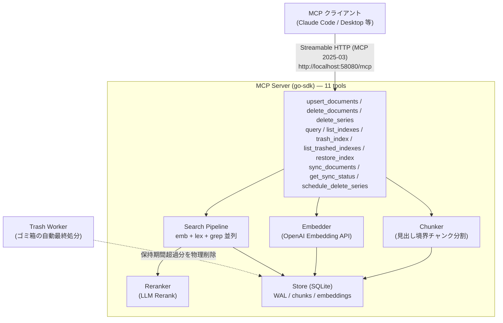
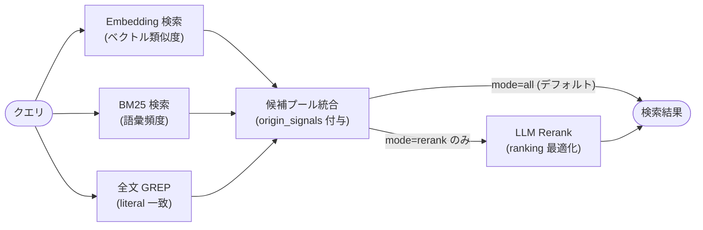

# doc-db MCP Server

[](LICENSE)

Markdown ドキュメントを **Embedding + BM25 + 全文 GREP** の 3 signal で横断検索し、
必要に応じて **LLM Rerank** で並べ替える汎用 MCP サーバー（Streamable HTTP transport）。

基盤コンポーネント・MCP ツール群・3 signal 検索パイプライン・LLM Rerank・
Homebrew 自家 tap 配布まで実装済み（現バージョンは `VERSION` / `CHANGELOG.md` が
canonical）。

## 何の問題を解決するのか

AI アシスタント（Claude Code 等）は、プロジェクトの仕様書・設計書・ルールドキュメントを
「その都度読んで」作業する。ファイル数が増えると:

- どのドキュメントが関連するか判断できない
- すべて読み込むとコンテキスト上限を超える
- キーワードが一致しないと関連文書が見つからない

**doc-db** は MCP ツールとしてこれを解決する。事前にインデックスした Markdown を、
自然言語クエリ・ID 文字列・自由語のいずれからでも取り出せるようにする。

## 設計思想（PHIL-01 二層アーキ）

doc-db は「関連文書の**候補**を漏れなく返す」ことに責任を持ち、
「本当に必要な文書か」の最終判定は **上位 AI agent 側**に委ねる二層構成を取る。

- **Layer 1（本サーバー）**: Embedding + BM25 + GREP を並列実行し **over-recall**
  な候補プールを返す。取りこぼしを最重要視する。
- **Layer 2（AI agent）**: 返された chunk の `origin_signals` / `heading_path` /
  本文を見て、本文まで読むべき文書を選定する。

LLM Rerank は **ranking 最適化のためのオプション**であり、recall を広げる手段では
ない（PHIL-02）。

詳細: [`docs/AI_INTEGRATION_GUIDE.md`](docs/AI_INTEGRATION_GUIDE.md)

## 主な特徴

| 特徴                    | 説明                                                                                                    |
| ----------------------- | ------------------------------------------------------------------------------------------------------- |
| **3 signal 並列検索**   | Embedding / BM25 / 全文 GREP を並列実行し `origin_signals` を各 chunk に付与                            |
| **ID パターン対応**     | `FNC-001` / `DES-028` のような規格 ID は BM25 substring + GREP で確実にマッチ                           |
| **LLM Rerank（任意）**  | 3 signal で集めた候補を gpt-4o-mini 等で再ランク（`mode=rerank`）                                       |
| **local_path 経路**     | 大容量 Markdown は本文送信なしでサーバー側から絶対パスで読み込み可（v0.1.8+）                           |
| **重複 Embedding 排除** | 同一内容は hash で検出し Embedding を共有。branch/series を低コストで多重管理                           |
| **series 削除**         | branch 単位で `delete_series` により record から除去（v0.1.9+）                                         |
| **desired-state 同期**  | `sync_documents` で削除ファイルにも追従（欠落 path を即時切り離し。v0.2.0+）                            |
| **シングルバイナリ**    | pure-Go SQLite。Homebrew tap で 1 コマンド導入                                                          |
| **ゴミ箱経由の削除**    | KEY 削除は即時物理削除せずゴミ箱投入。保持期間（デフォルト 3 日）経過後に自動最終処分。期間内は復活可能 |
| **SSRF 防御**           | URL 登録はプライベート IP をデフォルトで拒否                                                            |

## アーキテクチャ

MCP クライアントから見た全体構成:



`query` 内部の 3 signal 検索パイプライン（PHIL-01 の詳細）:



### レイヤー構成

| パッケージ          | 責務                                                   |
| ------------------- | ------------------------------------------------------ |
| `cmd/docdb`         | エントリポイント・設定読み込み・配線                   |
| `internal/mcp`      | MCP ツールハンドラ（11 種）                            |
| `internal/search`   | 3 signal 検索パイプライン（emb / lex / grep / rerank） |
| `internal/reranker` | OpenAI Chat Completions ベース LLM Rerank              |
| `internal/chunker`  | Markdown → 見出し境界チャンク分割                      |
| `internal/embedder` | OpenAI Embedding API（部分失敗対応）                   |
| `internal/fetcher`  | URL → コンテンツ取得（SSRF 防御付き）                  |
| `internal/trash`    | ゴミ箱（KEY・orphan record）自動最終処分ワーカー       |
| `internal/store`    | SQLite 読み書き・WAL・アトミック AppendAndCleanSeries  |
| `internal/config`   | YAML 設定ローダー（`~/.doc-db/doc-db.yaml`）           |

上位レイヤーのみが下位を参照する。循環依存なし。

## インストール

### Homebrew（推奨）

```bash
brew tap blueeventhorizon/doc-db https://github.com/BlueEventHorizon/doc-db-mcp-server
brew install blueeventhorizon/doc-db/doc-db
doc-db --version
```

### ソースからビルド

```bash
git clone https://github.com/BlueEventHorizon/doc-db-mcp-server.git
cd doc-db-mcp-server
make build            # ldflags 経由で VERSION を注入
./doc-db --version    # VERSION ファイルの値が表示される
```

## セットアップ

### 1. 設定ファイル配置

doc-db は **`~/.doc-db/doc-db.yaml`**（固定パス）から起動時に設定を読む。
ファイルが無い場合は fail-fast で終了する（CFG-01）。

```bash
mkdir -p ~/.doc-db
cp doc-db.yaml.example ~/.doc-db/doc-db.yaml
# 必要に応じて編集
```

設定例（`doc-db.yaml.example` と同内容）:

```yaml
server:
  port: 58080
  db_path: "~/.doc-db/docdb.sqlite" # `~/` は $HOME に展開される（v0.1.10+）
embedding:
  model: "text-embedding-3-large" # 変更時は DB 再構築が必要
  dim: 3072 # -3-large=3072 / -3-small=1536
  timeout_seconds: 60
rerank:
  model: "gpt-4o-mini"
  factor: 3
  timeout_seconds: 30
chunker:
  max_chunk_size: 1500
bm25:
  k1: 1.5
  b: 0.75
fetcher:
  timeout_seconds: 30
  allow_private: false
trash:
  retention_days: 3 # ゴミ箱投入から自動最終処分までの保持日数
  interval_seconds: 3600 # internal/trash.Worker のチェック間隔
log:
  path: "~/.doc-db/doc-db.log" # 省略可（省略時デフォルト値と同じ）。"stdout"/"stderr" も指定可
  level: "info" # debug/info/warn/error
```

全項目必須・未知キー禁止・値域外で fail-fast（CFG-03）。**例外**: `log` セクションは省略可
（省略時は `path: ~/.doc-db/doc-db.log` / `level: info` が適用される。v0.1.12+）。

### 2. API キー設定と起動

```bash
export OPENAI_API_DOCDB_KEY=sk-...   # または OPENAI_API_KEY
doc-db
```

**ログはサーバー自身が `log.path` を開いて書き込む**（v0.1.12+）。従来のような
`doc-db > /tmp/doc-db.log 2>&1 &` というシェルリダイレクトは不要:

```bash
doc-db &                  # ログは ~/.doc-db/doc-db.log (デフォルト) に書き込まれる
make show-log             # ログを tail -f で追跡
make show-config          # 解決済みの config/log/db パスを確認
doc-db --show-config      # 同上（make を経由しない直接呼び出し）
```

起動直後は標準出力にも設定サマリ（config / log / db のパスと待受ポート）が 1 度だけ表示される。

### 3. MCP クライアントへの登録

Streamable HTTP transport のため **URL 形式**で登録する（subprocess `command` は使わない）。

**Claude Code（user scope）**:

```bash
claude mcp add --transport http -s user doc-db http://localhost:58080/mcp
```

**Claude Desktop** (`~/Library/Application Support/Claude/claude_desktop_config.json`):

```json
{
  "mcpServers": {
    "doc-db": {
      "url": "http://localhost:58080/mcp"
    }
  }
}
```

## MCP ツール一覧

| ツール                   | 説明                                                                                                                                                 |
| ------------------------ | ---------------------------------------------------------------------------------------------------------------------------------------------------- |
| `upsert_documents`       | ドキュメントを登録・更新。`content` / `url` / `local_path` の 3 経路（排他）                                                                         |
| `delete_documents`       | 指定 series の特定 path ドキュメントを削除                                                                                                           |
| `delete_series`          | KEY 内の全 record から指定 series を一括除去（v0.1.9+、branch cleanup 用）                                                                           |
| `query`                  | 3 signal 検索（Embedding + BM25 + GREP）＋任意 Rerank                                                                                                |
| `list_indexes`           | 登録済み KEY 一覧を取得（chunk 数を含む。ゴミ箱状態の KEY は除外）                                                                                   |
| `trash_index`            | KEY をゴミ箱投入（即時物理削除はしない。保持期間経過後に自動最終処分。`delete_index` を置換）                                                        |
| `list_trashed_indexes`   | 現在ゴミ箱に入っている KEY 一覧と自動最終処分までの残り時間を取得                                                                                    |
| `restore_index`          | ゴミ箱内の KEY を自動最終処分前に利用可能な状態へ戻す                                                                                                |
| `sync_documents`         | desired-state 同期（v0.2.0+）。documents を完全な現在状態とみなし、一覧に無い既存 path を series から即時切り離す。job_id を即時返却する非同期ジョブ |
| `get_sync_status`        | sync ジョブの進捗・完了・エラーを job_id でポーリング（v0.2.0+）                                                                                     |
| `schedule_delete_series` | series 全体の削除予約（v0.2.0+）。即時削除せず次回起動時に物理削除。再 sync で取り消し可能                                                           |

### `query` の mode

| mode     | 説明                                                                          |
| -------- | ----------------------------------------------------------------------------- |
| `all`    | **デフォルト（v0.1.5+）**。3 signal を並列実行し、`origin_signals` 付きで返す |
| `rerank` | 3 signal で候補収集後、LLM で再ランク                                         |
| `emb`    | Embedding 類似度のみ                                                          |
| `lex`    | BM25 substring match のみ                                                     |
| `grep`   | 全文 GREP（NFKC + lowercase substring）のみ                                   |
| `hybrid` | legacy 互換: Embedding + BM25 の RRF 融合（GREP なし）                        |

各 hit は `origin_signals: ["emb","lex","grep"]` を含み、どの signal で拾われたかを
上位 agent が判定できる（QRY-OUT-03）。

### `upsert_documents` の 3 経路

| 経路         | 用途                                                                              |
| ------------ | --------------------------------------------------------------------------------- |
| `content`    | 文字列を直接送る。小さいドキュメントや動的生成向け                                |
| `url`        | HTTP(S) から取得（SSRF 防御付き）                                                 |
| `local_path` | サーバーが絶対パスから直接読む（大容量 Markdown 向け・payload 大幅削減。v0.1.8+） |

`local_path` は絶対パスのみ、`..` 要素を含むパスを reject、シンボリックリンク解決後の
実パスも再検証、10MB 上限、regular file 限定。

### series による多バージョン管理

`key` はインデックスの名前空間、`series` は同一 KEY 内の複数バージョン識別子。

```
key: "myrepo"
  series: "main"      → main ブランチのスナップショット
  series: "feature-x" → feature ブランチのスナップショット
```

#### ハッシュベース dedup (DIF-02) — Embedding は series 間で共有される

同一 `key + path` に対して、**内容が完全一致 (SHA-256 ハッシュ一致) するファイルは
Embedding を再計算しない**。既存 record の `series_keys` に新しい series 名だけを
追記して終わる (OpenAI API 呼び出しゼロ、課金ゼロ)。

具体的な挙動:

| シナリオ                                  | 挙動                                                            |
| ----------------------------------------- | --------------------------------------------------------------- |
| **branch 切替 → 同一内容を再 upsert**     | 既存 record に `series_keys += [新 branch]` するだけ。skip 扱い |
| **branch 切替 → 内容変更 (SHA-256 変化)** | 新 record を作成し、旧 record からは当該 series を除去 (DIF-03) |
| **branch 削除 (`delete_series`)**         | `series_keys` から除去。当該 record の series が空なら物理削除  |
| **series が全て残る record**              | そのまま保持 (他 branch から参照されているため)                 |

コスト効果: 600 ファイル × 10 branch を管理しても、branch 間の差分がわずかなら
実 Embedding 呼び出しは差分ファイル分のみ。API 課金は「全ファイル × 全 branch」に
ならない。

#### テスト保証

この挙動は以下のテストで常時検証されている (`go test ./...` で自動実行):

- `internal/store/store_test.go::TestAppendAndCleanSeries_DIF02` — Store 層の
  「同ハッシュ既存時は series 追記のみ、旧 record は series が空になれば物理削除」
- `internal/mcp/mcp_test.go::TestUpsert_DIF02_SameHashSkips` — MCP handler 層の
  「別 series に同一内容 upsert → Skipped=1、series_keys に両 branch 紐付き」
- `internal/mcp/upsert_integration_test.go::TestUpsertIntegration_DIF02_DoesNotCallEmbedder`
  — Embedder spy で「同一ハッシュ経路で Embedding API が呼ばれない」ことを保証

branch cleanup は `delete_series` (v0.1.9+) または SKILL `/delete-db-series <name>` で。

#### desired-state 同期 (v0.2.0+)

`upsert_documents` は追加専用のため、クライアント側で削除されたファイルには追従できない。
`sync_documents` に **完全な現在のファイル一覧** を渡すと、一覧に無い既存 path が series
から即時に切り離され、当該 series 指定の検索から直ちに消える。切り離しで orphan になった
record は物理削除予約として記録され、次回サーバー起動時に一括物理削除される（それまでは
同一内容の再 sync で Embedding 再計算なしに復元できる = 自己修復）。branch 削除の検知時は
`schedule_delete_series` で series 全体を予約できる（即時削除しない・再 sync で取り消し可能）。

## AI エージェントからの利用（同梱 SKILL 参考実装）

doc-db は「クライアント側が自分の文書一覧を管理し、サーバーへ同期・検索する」設計のため、
実際の運用にはクライアント実装が必要になる。本リポジトリの
[`.claude/skills/`](.claude/skills/README.md) に **Claude Code 用の SKILL 6 種を
参考実装として同梱**している:

| SKILL                      | 役割                                                                     |
| -------------------------- | ------------------------------------------------------------------------ |
| `/update-db-specs`         | 仕様文書一式を desired-state 同期（追加・更新・**削除に追従**。v0.2.0+） |
| `/update-db-rules`         | ルール文書一式を同上                                                     |
| `/query-db-specs`          | 仕様文書を 3 signal 検索                                                 |
| `/query-db-rules`          | ルール文書を 3 signal 検索                                               |
| `/delete-db-series <name>` | 指定 series（Git branch 等）を一括除去（branch cleanup）                 |
| `/manage-db-indexes`       | KEY メタデータ提示・ゴミ箱投入・一覧確認・復活を対話的に行う             |

特徴:

- **Python 3.9+ stdlib のみ**で MCP Streamable HTTP を直接叩く（Claude Code への
  MCP 登録も外部パッケージも不要）
- 対象文書は各プロジェクトのルートに置く **`.doc_structure.yaml`**（specs / rules の
  ディレクトリ定義）から解決する。KEY・series は「プロジェクト名 + git branch」で自動決定
- 5 ディレクトリを rsync すれば**他プロジェクトでもそのまま動く**

セットアップ・`.doc_structure.yaml` の書式・独自クライアントの作り方は
[`.claude/skills/README.md`](.claude/skills/README.md) と
[`docs/AI_INTEGRATION_GUIDE.md`](docs/AI_INTEGRATION_GUIDE.md) を参照。

## ドキュメント

| 文書                                                               | 内容                                                                                                           |
| ------------------------------------------------------------------ | -------------------------------------------------------------------------------------------------------------- |
| **[`docs/AI_INTEGRATION_GUIDE.md`](docs/AI_INTEGRATION_GUIDE.md)** | **AI skill / agent 向け統合ガイド（PHIL-01 二層アーキ・mode 使い分け・origin_signals 解釈・典型フロー・FAQ）** |
| [`.claude/skills/README.md`](.claude/skills/README.md)             | 同梱 SKILL 参考実装のガイド（配布方法・`.doc_structure.yaml` の書式）                                          |
| `docs/specs/base/requirements/APP-001`                             | 基本機能要件定義書                                                                                             |
| `docs/specs/base/design/DES-001`                                   | 基本設計書（アーキテクチャ・データモデル・3 signal 検索・YAML 設定）                                           |
| `docs/specs/install/requirements/APP-002`                          | インストール要件定義書（Homebrew 自家 tap）                                                                    |
| `docs/specs/install/design/DES-002`                                | インストール設計書（Formula・整合性検証・caveats）                                                             |
| [`CHANGELOG.md`](CHANGELOG.md)                                     | バージョン履歴（keep-a-changelog 形式）                                                                        |
| `VERSION`                                                          | canonical バージョン文字列（plain text）                                                                       |

## 開発

```bash
make build                 # バイナリビルド
go test ./...              # 全パッケージテスト
go test -race ./...        # レース検出テスト
make verify-version        # VERSION / CHANGELOG / .version-config.yaml / Formula tag 整合性
make verify-tag            # Formula revision == git tag commit SHA 検証
make show-config           # 解決済み設定 (log/db パス等) を表示
make show-log              # 設定済みログファイルを tail -f で追跡
```

## ライセンス

MIT
