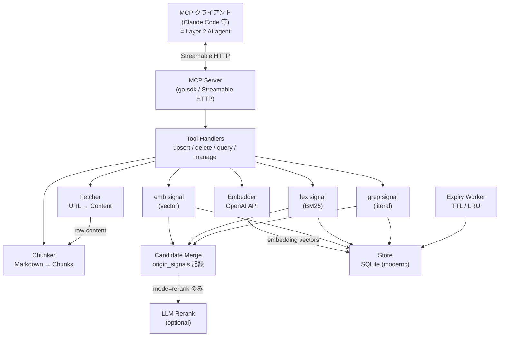
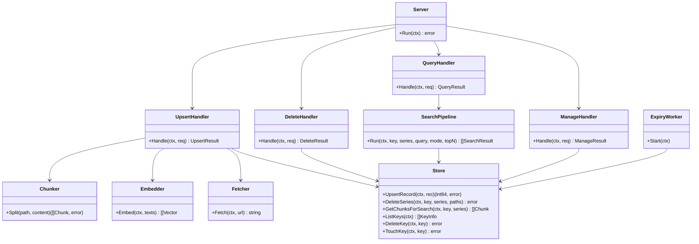
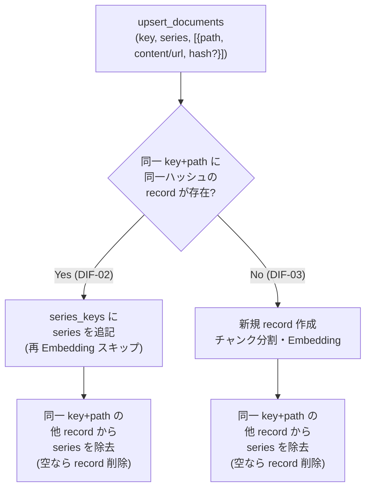
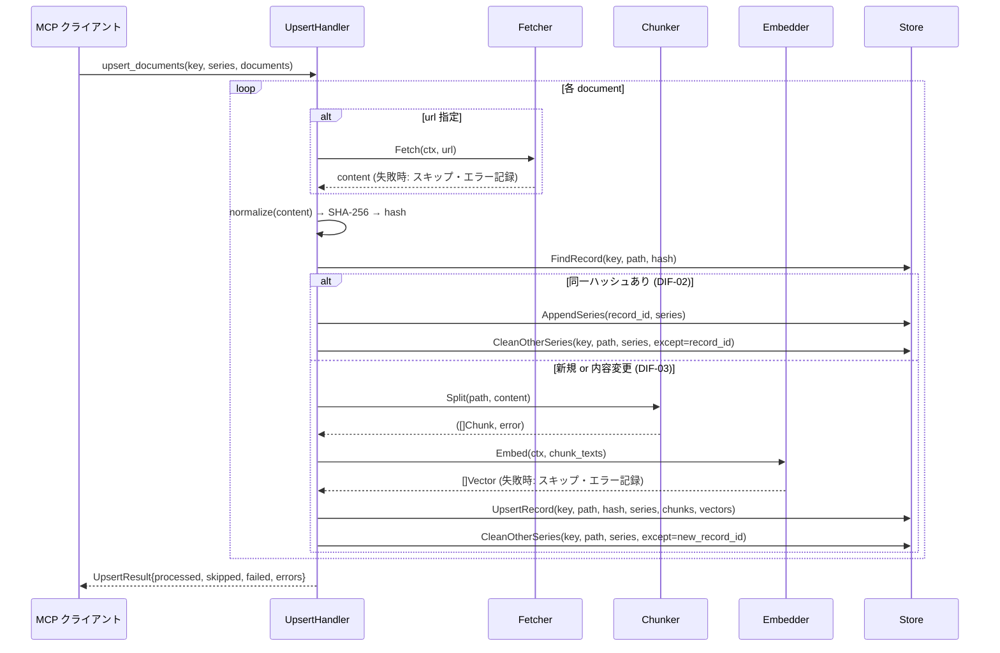
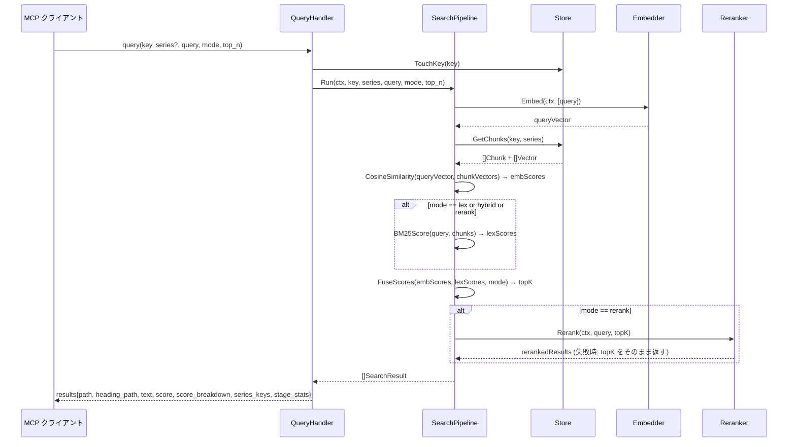

# DES-001 doc-db MCP Server 設計書

## メタデータ

| 項目     | 値                                        |
| -------- | ----------------------------------------- |
| 設計ID   | DES-001                                   |
| 関連要件 | APP-001                                   |
| 作成日   | 2026-06-20                                |

## 1. 概要

Markdown テキストのハイブリッド検索（ベクトル + BM25 + LLM Rerank）を提供する汎用 MCP サーバー。Go で実装し、純粋 Go 製 SQLite（`modernc.org/sqlite`）を採用することで CGO 不要・シングルバイナリ配布を実現する。MCP go-sdk の Streamable HTTP transport を使用し、OpenAI API は標準ライブラリの `net/http` で直接呼び出す。

**Streamable HTTP 採用理由**: MCP go-sdk の標準 transport であり、SSE と比較して双方向ストリーミングに適している。SSE transport は go-sdk のサポートが限定的（サーバー送信専用）であり、ツール呼び出しの応答返却が煩雑になる。Streamable HTTP は MCP 2025-03 仕様で推奨される transport であり、将来互換性の観点からも採用する（PRE-02/NFR-03）。

## 2. アーキテクチャ概要

### 2.1 二層検索アーキテクチャ (PHIL-01 / PHIL-02)

本サーバーは APP-001 PHIL-01 で定義される**二層検索アーキテクチャ**を実装する:

- **Layer 1 (本サーバー)**: Embedding + BM25 + 全文 GREP の 3 signal を並列実行し、
  各 signal の上位候補を合算した「取りこぼし無き候補プール」を返す。
  signal は互いに異なる種類の miss を補完する関係であり、いずれも代替できない。
- **Layer 2 (呼び出し側 AI agent)**: 返ってきた候補プールの本文を読んで関連性を
  判断する。本サーバーは関与しない。

LLM Rerank は本来 Layer 1 内部の ranking 最適化オプションであり、recall を広げる
手段ではない。Rerank 未使用時も 3 signal の併用結果が返る (PHIL-02)。



### レイヤー構成と依存方向

```
cmd/          → internal/mcp
internal/mcp  → internal/store, internal/search, internal/chunker, internal/embedder, internal/fetcher
internal/search → internal/store
internal/expiry → internal/store
internal/store  → (外部依存なし)
```

上位レイヤーのみが下位を参照する。循環依存は禁止。

## 3. モジュール設計

### 3.1 パッケージ一覧

| パッケージ | 責務 | 主な依存 |
| --- | --- | --- |
| `cmd/docdb` | エントリポイント・設定読み込み・サーバー起動 | `internal/mcp`, `internal/store`, `internal/expiry` |
| `internal/mcp` | MCP ツールハンドラ（upsert/delete/query/manage） | `internal/store`, `internal/search`, `internal/chunker`, `internal/embedder`, `internal/fetcher` |
| `internal/store` | SQLite の読み書き・トランザクション管理 | `modernc.org/sqlite` |
| `internal/chunker` | Markdown を見出し境界でチャンク分割 | （外部依存なし） |
| `internal/embedder` | OpenAI Embedding API 呼び出し | `net/http` |
| `internal/fetcher` | HTTP/HTTPS URL からコンテンツ取得 | `net/http` |
| `internal/search` | 3 signal 並列検索（emb / BM25 lex / 全文 GREP）・候補 merge・LLM Rerank（オプション）| `internal/store` |
| `internal/reranker` | OpenAI Chat Completions による LLM Rerank（PHIL-02: オプション） | `internal/search`（interface 実装） |
| `internal/expiry` | TTL/LRU ポリシーによる自動廃棄ワーカー | `internal/store` |

### 3.2 主要な型関係



**型定義**:

- `KeyInfo`: `ListKeys` の戻り値要素。`key string`・`series []string`・`doc_count int`・`last_updated_at string`・`last_accessed_at string`・`expiry_policy *ExpiryPolicy` を含む。MNG-01「KEY・series 一覧・ドキュメント数・最終更新日時・最終アクセス日時・廃棄ポリシー設定を取得できること」に対応する。

## 4. データモデル

### 4.1 SQLite スキーマ

```sql
-- インデックスキー管理
CREATE TABLE keys (
    key             TEXT PRIMARY KEY,
    doc_count       INTEGER NOT NULL DEFAULT 0,
    last_accessed_at TEXT NOT NULL,  -- RFC3339
    last_updated_at  TEXT NOT NULL,
    expiry_policy   TEXT             -- JSON: {"ttl_days": N, "max_chunks": N}
);

-- embedding record（key + path ごとにコンテンツ1バージョン）
CREATE TABLE records (
    id              INTEGER PRIMARY KEY AUTOINCREMENT,
    key             TEXT NOT NULL,
    path            TEXT NOT NULL,
    content_hash    TEXT NOT NULL,   -- SHA-256 hex
    created_at      TEXT NOT NULL,
    updated_at      TEXT NOT NULL,
    UNIQUE(key, path, content_hash)
);

-- series_keys（record と series の多対多）
CREATE TABLE series_keys (
    record_id INTEGER NOT NULL REFERENCES records(id) ON DELETE CASCADE,
    series    TEXT NOT NULL,
    PRIMARY KEY (record_id, series)
);

-- チャンク（見出し境界で分割されたテキスト）
CREATE TABLE chunks (
    id           INTEGER PRIMARY KEY AUTOINCREMENT,
    record_id    INTEGER NOT NULL REFERENCES records(id) ON DELETE CASCADE,
    chunk_index  INTEGER NOT NULL,
    heading_path TEXT NOT NULL,  -- "# A > ## B > ### C"
    text         TEXT NOT NULL
);

-- 埋め込みベクトル（BLOB: float32 配列をリトルエンディアンでシリアライズ）
-- dim カラム: 行ごとにベクトル次元数を記録する。起動時に SELECT DISTINCT dim FROM embeddings を実行し、
-- 結果が embedding.dim と異なる場合は「モデル変更後の DB 再構築が必要」として fail-fast する。
CREATE TABLE embeddings (
    chunk_id  INTEGER PRIMARY KEY REFERENCES chunks(id) ON DELETE CASCADE,
    vector    BLOB NOT NULL,
    dim       INTEGER NOT NULL
);

-- BM25 用語頻度インデックス（key 単位）
CREATE TABLE bm25_stats (
    key         TEXT NOT NULL,
    chunk_id    INTEGER NOT NULL REFERENCES chunks(id) ON DELETE CASCADE,
    term        TEXT NOT NULL,
    tf          REAL NOT NULL,
    PRIMARY KEY (key, chunk_id, term)
);
CREATE TABLE bm25_df (
    key  TEXT NOT NULL,
    term TEXT NOT NULL,
    df   INTEGER NOT NULL,
    PRIMARY KEY (key, term)
);
```

### 4.2 並行アクセス方針（NFR-02）

SQLite WAL モードと Go 側ミューテックスの組み合わせで並行アクセスを制御する。

- **WAL モード採用**: 起動時に `PRAGMA journal_mode=WAL` を実行する。WAL モードでは読み取りと書き込みが並行して実行可能になる（書き込み中も読み取りをブロックしない）。
- **接続プール（複数接続）**: `database/sql` のデフォルト接続プールを使用し `SetMaxOpenConns(N)` で複数接続を許可する（N は `runtime.GOMAXPROCS(0)` を基準に設定）。複数の読み取りゴルーチンが独立した接続を取得し WAL の並行読み取り性能を活用する。`SetMaxOpenConns(1)` は採用しない — 単一接続では WAL モードの効果がなく、読み書きが全て直列化される。
- **書き込み直列化（Go 側 Mutex）**: 書き込み操作（upsert/delete/expiry）は Store レイヤーで `sync.Mutex` によって直列化する。SQLite 自体もシングルライタだが、Go 側でトランザクション単位の整合性を保証するために明示的に保護する。読み取り操作には Go 側ロックを掛けない（WAL が担う）。
- **ビジータイムアウト**: `PRAGMA busy_timeout=5000`（5秒）を設定する。書き込みロック競合が発生した場合（内部ミューテックスが解放後に DB レベル競合が起きる稀なケース）の保険として残す。
- **注意**: `sync.RWMutex` は使用しない。WAL + 接続プールが読み取り並行を担うため、Go 側に ReaderLock を設けても実効性がなく複雑になるだけ。

### 4.3 Embedding Record の series_keys 管理



**重要**: series の剥がし処理（CleanOtherSeries）は DIF-02（同一ハッシュの Append）でも必須。たとえば series=main が hash=H1 に紐づいていた後、hash=H2 で上書きされ H2.series=[main] になった状態で、再び hash=H1 を main で upsert すると H1 が AppendSeries で復活しても H2 に main が残ったままになる。Append/NewRec のどちらの経路でも CleanOtherSeries を実行することで「同一 key+path+series の組み合わせは常に高々1 record」を保証する。

## 5. ユースケース設計

### 5.1 ユースケース一覧

| ユースケース | 対応 MCP ツール | 関連要件 |
| --- | --- | --- |
| ドキュメント追加・更新 | `upsert_documents` | FNC-001 |
| ドキュメント削除 | `delete_documents` | FNC-002 |
| ドキュメント検索 | `query` | FNC-003 |
| インデックス一覧取得 | `list_indexes`（TBD-008） | FNC-004 MNG-01 |
| インデックス削除 | `delete_index`（TBD-008） | FNC-004 MNG-02 |

### 5.2 upsert_documents シーケンス



**ハッシュ算出の正規化規則（M1）**:

コンテンツの SHA-256 は以下の正規化を行った後の `[]byte` に対して算出する:

1. **BOM 除去**: UTF-8 BOM（`0xEF 0xBB 0xBF`）が先頭にある場合は除去する
2. **改行コード統一**: `\r\n` および単独 `\r` を `\n` に変換する
3. **エンコーディング**: UTF-8 として扱う（他エンコーディングは変換せず `Content-Type` charset ヘッダを参照。不明な場合は UTF-8 と仮定する）

クライアントが `hash` フィールドを省略せず送付する場合（`content` 指定時）、サーバーは同じ正規化を行った上で hash を算出し、クライアント提供値と照合する。不一致の場合はサーバー算出値を正として扱う（クライアントの正規化漏れを吸収する）。

**部分 Embed 失敗時の一貫性方針（M2）**:

チャンクの一部が Embedding API 呼び出し失敗でスキップされた場合、**成功チャンクのみを保存する（部分 record 保存）**。理由: all-or-nothing では一時的な API 障害で全ドキュメントが登録失敗になり、リトライまで検索不能になる。歯抜け record が検索品質に与える影響は許容範囲内（失敗チャンクは次回 upsert で再登録できる）。失敗したチャンクのインデックス番号はエラー情報（UPS-OUT-01）に含めて返す。

### 5.3 query シーケンス



## 6. 検索パイプライン詳細

### 6.1 ベクトル検索（emb）

- クエリテキストを Embedding API でベクトル化
- 対象 KEY（series 指定時はフィルタ）の全チャンクベクトルをメモリに展開
- コサイン類似度を `math` パッケージで計算（`f32` スライス）
- 上位 `top_n * rerank_factor` 件を候補として返す

**Embedding モデルと次元数の確定値（EMB-02）**:

| モデル（`embedding.model`） | 次元数 | `embeddings.dim` |
| --- | --- | --- |
| `text-embedding-3-large`（デフォルト） | 3072 | 3072 |
| `text-embedding-3-small` | 1536 | 1536 |

デフォルトモデル `text-embedding-3-large` を使用する場合、`embeddings.dim = 3072` で固定される。モデル変更時はデータベースを再構築する（異なる次元数のベクトルは混在不可）。

**モデル選択根拠**: `text-embedding-3-large` をデフォルトとして採用する。reference doc-db SKILL (Python 版) と同モデルにすることで日本語技術文書の検索精度を最大化する。コストは `-3-small` の約 6.5 倍だが、言い換え・抽象クエリでの recall 向上効果が大きい。コスト最適化が必要な場合は `text-embedding-3-small` (dim=1536) に切り替え可能。

**スケール上限**: `expiry.max_chunks`（デフォルト 10,000）はシステム全体の上限。key 単位では通常 1,000〜5,000 チャンク程度を想定する（1,000 チャンク × 1536 dim × 4 byte ≈ 6 MB）。10,000 チャンクでも 60 MB / クエリであり、内部ツール用途では許容範囲。100,000 チャンクを超える場合はベクトルキャッシュ（起動時 mmap またはプロセス内メモリキャッシュ）の導入を検討する。

**設計判断**: ベクトルをすべてメモリに展開する方式を採用。`modernc.org/sqlite` は pure-Go のため `sqlite-vec` 等の C 拡張をロードできない。内部開発ツールであり大規模データを前提としないため（NFR-07）、in-process 計算で十分。

### 6.2 BM25 語彙検索（lex）

- upsert 時に各チャンクの term frequency（TF）と document frequency（DF）を `bm25_stats` / `bm25_df` に保存
- クエリ時に SQLite から TF/DF を取得し BM25 スコアをメモリ計算
- パラメータ（k1, b）はサーバー設定ファイルで指定（デフォルト: k1=1.5, b=0.75。Okapi BM25 の経験則デフォルト値（Robertson et al.）。k1 はワード頻度のサチュレーション、b は文書長正規化を制御する）

**トークナイザ仕様（LEX-01）**:

Unicode 正規化 + 正規表現ベースのトークン分割を採用する（形態素解析器は使用しない）。

1. NFKC 正規化 + 小文字化（`norm.NFKC.String(text)` 後 `strings.ToLower()` を適用。`golang.org/x/text/unicode/norm` + 標準 `strings` パッケージ）
2. 以下のパターンで順に優先マッチ:
   - `[A-Za-z]+-\d+` → ID パターン全体をひとつのトークンとして扱う（例: `FNC-001`）
   - `[A-Za-z0-9_]+` → ASCII 英数字・アンダースコア
   - `[^\W\d_A-Za-z]+` → 連続する CJK 等非 ASCII Unicode 文字をひとつのトークンとして扱う（日本語は単語境界で区切れないため近傍文字をグルーピング）
   - `\d+` → 数字列
3. 空文字列トークンは除外する

**ID 完全一致ボーナス（LEX-01）**:

BM25 スコアに加え、以下のボーナスを加算する:

- **ID パターン一致**: クエリ中の `[A-Z]+-\d+` 形式の ID がチャンク本文に含まれる場合 +10.0（例: `FNC-001`）
- **クエリ全文一致**: 正規化済みクエリ全体がチャンク本文に含まれる場合 +2.0

**チャンク削除時の BM25 テーブル更新方針**:

`ON DELETE CASCADE` で `chunks` が削除されると `bm25_stats`（`chunk_id` 参照）は自動削除されるが、`bm25_df`（`(key, term)` キーで `chunk_id` を持たない）は CASCADE では更新されない。整合性維持のため以下の手順をトランザクション内で実施する:

1. **CASCADE 前に** 削除対象 chunk_id の term 一覧を `bm25_stats` から取得する
2. チャンク削除（CASCADE により `bm25_stats` も削除）を実行する
3. 取得した term ごとに `bm25_df.df` を 1 減算する
4. `df <= 0` になった行を `bm25_df` から削除する

この処理はすべて同一トランザクション内で実施する。手順 1 が CASCADE 前であることが必須（削除後は term が取得できない）。

### 6.3 スコア融合（hybrid）

Reciprocal Rank Fusion（RRF）を採用:

```
score(d) = Σ 1 / (k + rank_i(d))   (k = 60。Cormack et al. 2009 原論文の推奨値)
```

embedding ランクと lexical ランクを統合。加重和より外れ値に頑健で、スケール正規化不要のため採用。

**EMB フォールバックと保証（SC-01）**:

- **EMB フォールバック** (`EMB_FALLBACK_LEX_RATIO = 0.05`): lexical ヒット数 / emb ヒット数 < 0.05 の場合（日本語クエリで BM25 がほぼヒットしない場合など）、RRF ではなく embedding スコア降順でフォールバックする。（経験則による暫定値。実運用データで検証し調整する）
- **EMB top-K 保証** (`EMB_GUARANTEE_K = 5`): クロスランゲージ同義語など lexical スコアが 0 の文書が RRF で押し出されることを防ぐため、embedding 上位 5 件は fused 上位 K 件に必ず含まれるよう昇格させる。（経験則による暫定値。実運用データで検証し調整する）

**ステージ候補数トラッキング（QRY-OUT-02）**:

各検索ステージを通過した候補数を `stage_stats` としてクエリ単位で記録し、`SearchResult` に付与する:

```
stage_stats: {
  emb_candidates: N,    // embedding 検索でヒットした候補数
  lex_candidates: N,    // lexical 検索でヒットした候補数
  grep_candidates: N,   // GREP signal でヒットした候補数（§6.4）
  fused_candidates: N,  // RRF 融合後の候補数（merge 前）
  merged_candidates: N, // 3 signal 合算後のユニーク候補数（mode=all）
  rerank_candidates: N  // LLM Rerank に渡した候補数（Rerank スキップ時は 0）
}
```

### 6.4 全文 GREP signal（GRP-01 / GRP-02 / PHIL-01）

#### 目的

Embedding は固有 ID・特殊用語・低頻度トークンを意味空間で散らかす。BM25 もトークナイザ
境界で割れる場合がある。GREP は **literal 一致 (substring) のみ** を見るため、これら
2 signal で取りこぼされる候補を確実に拾える。3 signal は互いに代替できない関係にある
（PHIL-01）。

#### アルゴリズム

```
1. 正規化済みクエリ q_norm = NFKC.lower(query) を計算（BM25 と同じ正規化）
2. 全 chunk の正規化済み body について q_norm の出現回数 cnt を数える
3. cnt > 0 のチャンクのみを結果に含める
4. grep_score = cnt（単純な出現回数。スコア融合では使わず、ヒット有無の signal として扱う）
```

クエリの分割は行わない（query 全体を 1 文字列として substring 検索）。
複数キーワード対応は将来要件（YAGNI: 現状 1 keyword で十分実用的）。

#### 出力

GREP signal も他 signal と同様に candidate pool に合流し、`origin_signals` に `"grep"` を
付与する。`score_breakdown` には `grep` フィールドを含める。

### 6.5 Candidate Merge（ALL-01 / QRY-OUT-03）

`mode=all`（デフォルト）では 3 signal の結果を以下の手順で合算する:

```
1. emb 上位 N_emb 件、lex 上位 N_lex 件、grep ヒット全件を集める（GREP は順位なし）
   N_emb / N_lex は top_n に基づく（実装で確定）
2. chunk_id 単位で重複を排除し、各 chunk に origin_signals を記録
   例: chunk X が emb と grep で見つかれば origin_signals = ["emb", "grep"]
3. 合算結果を以下の優先順でソート:
   a. signal hit 数の降順 (3 → 2 → 1)
   b. emb_score 降順（tie-break）
   c. chunk_id 昇順（決定性）
4. 上位 top_n 件を返す（上位 AI agent は更にこれを本文判定する想定）
```

Layer 1 の責務は「**取りこぼしの無い候補プール**」を提供することなので、ranking の
fine-tuning は最小限とする（PHIL-01）。

### 6.6 LLM Rerank（オプション）

- OpenAI Chat Completions API（`gpt-4o-mini` 等、設定で変更可）を使用
- `mode=rerank` のときのみ実行
- §6.5 の merge 結果上位を LLM に渡し、関連度順に並び替える
- 候補チャンクとクエリを JSON で渡し、`{"ranking":[{"id","score":0..1}]}` を返させる
- プロンプトテンプレートは設定ファイルで上書き可
- タイムアウト（デフォルト 30s）超過または API エラー時は merge 順でフォールバック（RR-02）
- silent failure 禁止: 範囲外 id を返した場合は skip + `dropped_ids` を warnings に記録（detection memory）
- PHIL-02: Rerank は ranking 最適化であり、recall を広げる手段ではない。`mode=all` でも
  merge 結果は同等の signal recall を持ち、Rerank の有無で候補プールは変わらない

## 7. 外部 API 連携

### 7.1 OpenAI Embedding API

- エンドポイント: `https://api.openai.com/v1/embeddings`
- モデル: 設定ファイルで指定（例: `text-embedding-3-large`）
- バッチ上限: 1 リクエストあたり最大 100 テキスト（OpenAI 制限は 2048 だが、ペイロードサイズと遅延を抑えるため 100 を上限とする）
- リトライ: 指数バックオフ（初回 1s、最大 3 回）
- タイムアウト: 60s（設定可）
- API キー: 環境変数 `OPENAI_API_DOCDB_KEY` → フォールバック `OPENAI_API_KEY`（PRE-01）

### 7.2 URL コンテンツ取得（Fetcher）

- `net/http.Client` にタイムアウト 30s を設定
- リダイレクト最大 5 回
- `Content-Type` が `text/` 系以外はエラーとしてスキップ
- 取得後に SHA-256 を算出し、hash フィールドとして扱う（クライアント提供 hash は `content` 指定時のみ）

**SSRF 対策**: 本サーバーは内部ネットワークへの配備を前提とするため、プライベート IP へのリクエストをブロックする。

- DNS 解決後の IP アドレスが以下に該当する場合はエラーとしてスキップ:
  - `127.0.0.0/8`（ループバック）
  - `10.0.0.0/8`、`172.16.0.0/12`、`192.168.0.0/16`（RFC1918 プライベート）
  - `169.254.0.0/16`（リンクローカル / AWS IMDS 等）
  - `::1`、`fc00::/7`（IPv6 ループバック / ユニークローカル）
- ホワイトリストが必要な場合は設定ファイルの `fetcher.allow_private: true` で無効化できる（デプロイ管理者が責任を持つ）。

## 8. 廃棄ポリシー（Expiry Worker）

バックグラウンドゴルーチンとして起動し、定期的（デフォルト 1 時間ごと）に実行する。

### 8.1 TTL（EXP-01）

```
SELECT key FROM keys
WHERE last_accessed_at < datetime('now', '-N days')
```

対象 KEY のすべての records・chunks・embeddings・series_keys を削除後、`keys` レコードも削除。

### 8.2 LRU（EXP-02）

```sql
-- システム全体のチャンク総数
SELECT COUNT(*) FROM chunks;

-- KEY ごとのチャンク数（削除優先順位の判定に使用）
SELECT r.key, COUNT(c.id) AS chunk_count
FROM chunks c
JOIN records r ON c.record_id = r.id
GROUP BY r.key
ORDER BY (SELECT last_accessed_at FROM keys WHERE key = r.key) ASC;
```

`total_chunks > max_chunks` の場合、`last_accessed_at ASC`（最も古いアクセス順）で KEY を削除し、上限以下になるまで繰り返す。

### 8.3 series 廃棄ポリシー（TBD）

EXP-01/02 は KEY 単位の廃棄のみを規定しており、未使用 series の廃棄ポリシーは APP-001 に存在しない。feature ブランチ運用ではブランチ削除後も series が残存し続ける問題がある。

設計方針 TBD:

- `delete_documents` で series を明示削除するオペレーション運用（現設計）を基本とし、自動廃棄は初版スコープ外とする
- または TTL/LRU の単位を KEY → series に拡張する（APP-001 EXP-01/02 の改訂が必要）

現設計では series の自動廃棄は実装しない。利用者が不要な series を `delete_documents` で明示削除する運用を前提とする。

### 8.4 KEY ごとのポリシーオーバーライド（EXP-04）

**設定方法**: 専用 MCP ツール `manage_index(key, expiry_policy)` を新設する（TBD-007 確定。B案採用）。

- `manage_index(key string, expiry_policy {ttl_days?: int, max_chunks?: int})` — KEY の廃棄ポリシーを設定・更新する。ドキュメントの再 upsert なしにポリシー変更が可能。
- `expiry_policy` に `null` を渡すとサーバーデフォルトにリセットする。
- `keys.expiry_policy` JSON カラムに値を保存。`null` の場合はサーバーデフォルトを適用。

> B案を採用した理由: ドキュメントの再 upsert なしにポリシーを変更できるため、大規模インデックスのポリシー変更が安全かつ効率的。MNG-01/02 と同様の管理操作として専用ツールへ集約することで、ツール責務が明確になる。

## 9. 設定

### 9.1 設定方式

設定は **YAML 設定ファイル** で管理する（環境変数による設定値オーバーライドは行わない）。API キーのみシークレットとして環境変数で扱う。

| 種別 | 渡し方 | 対象 |
| --- | --- | --- |
| シークレット | 環境変数 | `OPENAI_API_DOCDB_KEY`（優先） / `OPENAI_API_KEY`（フォールバック） |
| 動作設定 | YAML ファイル | Embedding モデル・タイムアウト・ポート・パス等のすべて |

**設定ファイルパス（CFG-01）**: `~/.doc-db/doc-db.yaml`（固定）。`$HOME` が解決できない、またはファイルが存在しない場合は **fail-fast** でサーバーを終了する。CLI フラグ・環境変数によるパス変更は提供しない（設計上の簡潔性を優先）。

**ロード方式（CFG-02）**: 起動時に 1 回だけ読み込み、`internal/config` パッケージが `Config` 構造体を返す。サーバー稼働中の設定再読み込みは行わない（変更時は再起動）。

**検証（CFG-03）**: パース後にバリデーションを行う。未知のキー、型不一致、必須項目欠落、値域外（ポート範囲・正の整数等）は fail-fast で起動を中止する。

### 9.2 設定ファイルスキーマ

```yaml
# ~/.doc-db/doc-db.yaml
server:
  port: 58080                      # HTTP ポート（dynamic range から選定）
  db_path: "./docdb.sqlite"        # SQLite ファイルパス

embedding:
  model: "text-embedding-3-large"  # Embedding モデル（変更時は DB 再構築必須）
  dim: 3072                        # ベクトル次元数（EMB-02 確定値）
  timeout_seconds: 60              # API タイムアウト

rerank:
  model: "gpt-4o-mini"             # LLM Rerank モデル
  factor: 3                        # top_n × factor 件を Rerank に渡す
  timeout_seconds: 30              # API タイムアウト

chunker:
  max_chunk_size: 1500             # チャンクあたり最大文字数（CHK-03 確定値）

bm25:
  k1: 1.5                          # サチュレーション係数（Robertson 経験則）
  b: 0.75                          # 文書長正規化係数

fetcher:
  timeout_seconds: 30              # URL フェッチタイムアウト
  allow_private: false             # プライベート IP へのフェッチを許可（SSRF 対策無効化）

expiry:
  ttl_days: 30                     # 未アクセス KEY の自動削除日数（TBD-001）
  max_chunks: 10000                # システム全体のチャンク上限（TBD-002）
  interval_seconds: 3600           # 廃棄チェック間隔
```

### 9.3 設計判断

| 項目 | 判断 | 理由 |
| --- | --- | --- |
| YAML 採用 | TOML/JSON ではなく YAML | コメント可・階層構造の可読性・運用者の編集容易性 |
| 環境変数オーバーライド不採用 | ファイルが唯一の正本 | 設定の出所を一元化し、デバッグ時の挙動推定を容易にする |
| パス固定 | `~/.doc-db/doc-db.yaml` のみ | CLI / env でのパス変更が増えると「実際にどの設定が使われているか」の判定コストが増す。サーバー用途では複数構成を持つ必要がない |
| API キーだけ環境変数 | シークレットは設定ファイルに書かない | 平文記録・git 誤コミットのリスク回避 |

## 10. エラーハンドリング方針

外部要因エラーのみキャッチし、内部バグはサイレントフォールバックせず伝播させる（APP-001 エラーケース節）。

| レイヤー | 方針 |
| --- | --- |
| 起動時 | `OPENAI_API_DOCDB_KEY` と `OPENAI_API_KEY` の両方が未設定の場合、サーバーを即座に終了する（PRE-01 fail-fast）。実際の API 疎通確認はしない（遅延検出コストが不要）。起動後に無効キーだと判明した場合は Embedder レイヤーでエラーを返す |
| Fetcher | タイムアウト・HTTP エラーをキャッチし、該当 document をスキップして error 情報を返す |
| Embedder | API エラーをキャッチし、複数バッチ失敗は `errors.Join` で全件保持し caller に返す。指数バックオフで最大 3 回リトライ |
| Reranker | エラー時は merge 順結果にフォールバック（RR-02）。フォールバック発生は `QueryResult.warnings` に記録し caller が観測可能にする（silent failure 禁止方針） |
| Store | DB エラーは内部バグとして伝播させる（panic または error return で MCP エラーレスポンス）。tx.Rollback 失敗は `errors.Join` で caller に伝達 |
| ExpiryWorker | 個別 KEY 削除失敗はログ + `Worker.Stats().LastKeyErrors` に記録し observability を担保。サーバー停止はしない |

**silent failure 禁止方針**: 全エラー経路で「ログのみ」で終わらせず caller / observable state
に必ず伝達する。詳細は memory `feedback_no_silent_failure.md` 参照。

## 11. テスト設計

- **単体テスト対象**: `store`（SQL クエリ正確性）、`chunker`（Markdown 分割境界）、`search`（コサイン類似度・BM25・RRF の計算結果）、`embedder`（リトライロジック）
- **統合テスト対象**: `upsert_documents` の series_keys 共有フロー（同一ハッシュで Embedding スキップされること）、`query` の mode 別結果差異、廃棄ポリシーによる削除動作
- **モック方針**: `Embedder` と `Fetcher` はインターフェース経由でモック可能にする。SQLite は通常の単体テストではインメモリ（`file::memory:`）を使用する
- **WAL 並行テスト**: WAL モードはファイルベースでしか有効化されない。並行アクセスの統合テスト（複数ゴルーチンの同時読み書き）は `os.MkdirTemp` で作成したテンポラリディレクトリに実 SQLite ファイルを使用する。インメモリ DB では WAL の挙動を検証できないため代替不可

## 12. 使用する既存コンポーネント

新規プロジェクトのため再利用対象なし。

## 改定履歴

| 日付       | バージョン | 内容 |
| ---------- | ---------- | ---- |
| 2026-06-20 | 0.1        | 初版作成 |
| 2026-06-20 | 0.2        | レビュー対応: C2(DIF-02 series 剥がし漏れ修正)・C3(WAL+接続プール方針に改訂)・H1(トークナイザ仕様追加)・H2(ID boost/EMB guarantee追加)・H3(スケール上限明記)・H5(LRU SQL修正)・H6(SSRF対策追加)・H7(起動時 fail-fast)・Chunker依存修正・WALテスト注記・series廃棄TBD追加 |
| 2026-06-20 | 0.3        | レビュー対応(追補): M1(ハッシュ正規化規則追加)・M2(部分 Embed 失敗方針を部分保存に確定)・§4.1(dim 検査の動作主体を明示)・§3.1(internal/mcp の embedder 依存を追記) |
| 2026-06-24 | 0.4        | §9 を YAML 設定ファイル方式に変更（`~/.doc-db/doc-db.yaml` 固定パス・環境変数オーバーライド不採用・API キーのみ環境変数）。本文中の `DOCDB_*` 環境変数参照を設定ファイルキー参照に更新 |
| 2026-06-28 | 0.5        | APP-001 PHIL-01/02 (二層検索アーキ) に対応: §2.1 アーキテクチャ概要に Layer 1/2 説明と更新 mermaid 図を追加。§6.4 全文 GREP signal の設計を新規追加 (substring 一致・origin_signals 記録)。§6.5 Candidate Merge を新規追加 (3 signal 合算ロジック)。§6.6 LLM Rerank を従来の §6.4 から番号変更 + PHIL-02 (Rerank は optional) を明記。§10 エラーハンドリングを silent failure 禁止方針 (memory: no-silent-failure) に整合させ Embedder の `errors.Join` / Reranker の warnings / Expiry の Stats() 公開を反映 |
