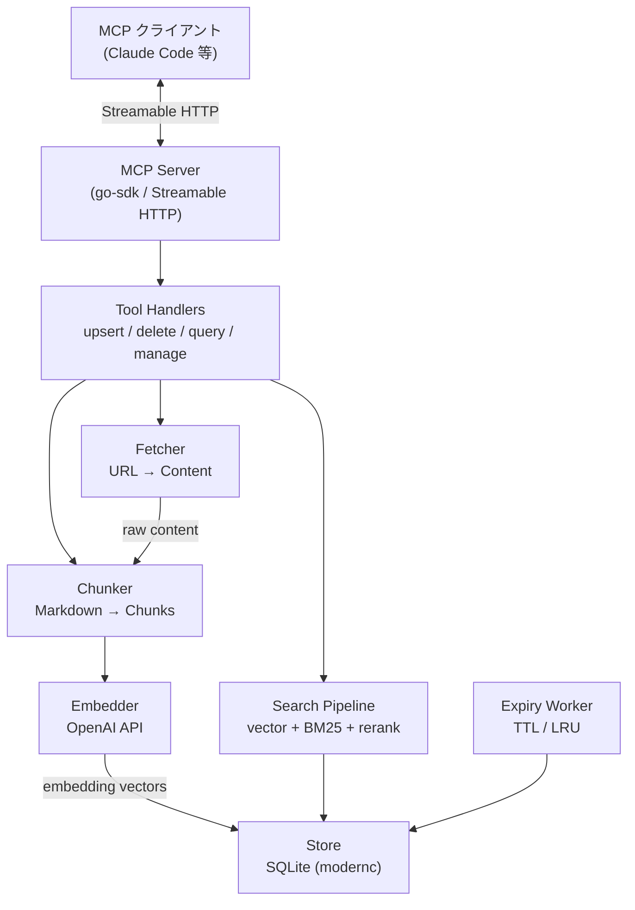
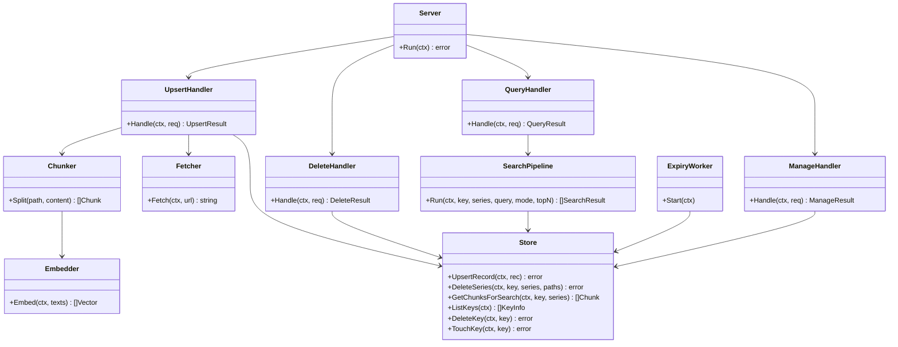
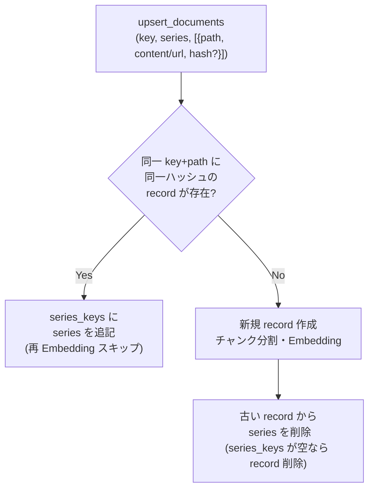
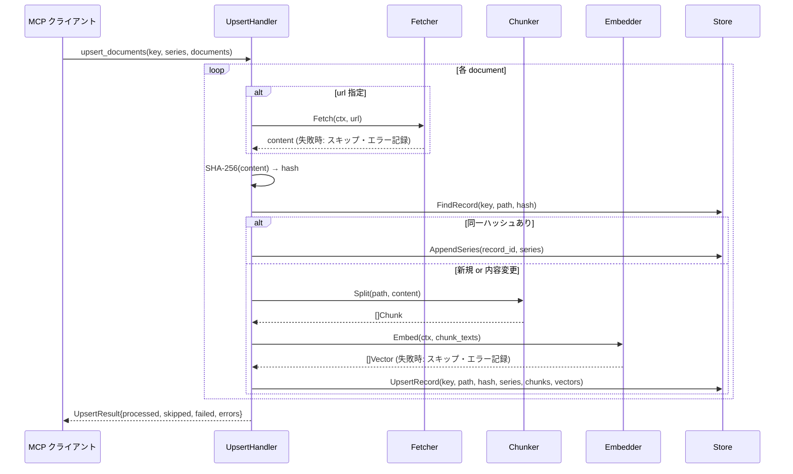
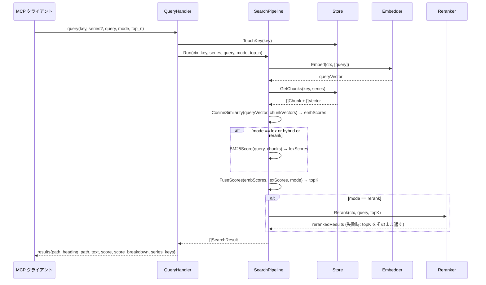

# DES-001 doc-db MCP Server 設計書

## メタデータ

| 項目     | 値                                        |
| -------- | ----------------------------------------- |
| 設計ID   | DES-001                                   |
| 関連要件 | APP-001                                   |
| 作成日   | 2026-06-20                                |

## 1. 概要

Markdown テキストのハイブリッド検索（ベクトル + BM25 + LLM Rerank）を提供する汎用 MCP サーバー。Go で実装し、純粋 Go 製 SQLite（`modernc.org/sqlite`）を採用することで CGO 不要・シングルバイナリ配布を実現する。MCP go-sdk の Streamable HTTP transport を使用し、OpenAI API は標準ライブラリの `net/http` で直接呼び出す。

**Streamable HTTP 採用理由**: MCP go-sdk の標準 transport であり、SSE と比較して双方向ストリーミングに適している。SSE transport は go-sdk のサポートが限定的（サーバー送信専用）であり、ツール呼び出しの応答返却が煩雑になる。Streamable HTTP は MCP 2025-03 仕様で推奨される transport であり、将来互換性の観点からも採用する（PRE-02/NFR-03）。

## 2. アーキテクチャ概要



### レイヤー構成と依存方向

```
cmd/          → internal/mcp
internal/mcp  → internal/store, internal/search, internal/chunker, internal/embedder, internal/fetcher
internal/search → internal/store
internal/chunker → internal/embedder
internal/expiry → internal/store
internal/store  → (外部依存なし)
```

上位レイヤーのみが下位を参照する。循環依存は禁止。

## 3. モジュール設計

### 3.1 パッケージ一覧

| パッケージ | 責務 | 主な依存 |
| --- | --- | --- |
| `cmd/docdb` | エントリポイント・設定読み込み・サーバー起動 | `internal/mcp`, `internal/store`, `internal/expiry` |
| `internal/mcp` | MCP ツールハンドラ（upsert/delete/query/manage） | `internal/store`, `internal/search`, `internal/chunker`, `internal/fetcher` |
| `internal/store` | SQLite の読み書き・トランザクション管理 | `modernc.org/sqlite` |
| `internal/chunker` | Markdown を見出し境界でチャンク分割 | `internal/embedder` |
| `internal/embedder` | OpenAI Embedding API 呼び出し | `net/http` |
| `internal/fetcher` | HTTP/HTTPS URL からコンテンツ取得 | `net/http` |
| `internal/search` | ハイブリッド検索・BM25・コサイン類似度・LLM Rerank | `internal/store` |
| `internal/expiry` | TTL/LRU ポリシーによる自動廃棄ワーカー | `internal/store` |

### 3.2 主要な型関係



## 4. データモデル

### 4.1 SQLite スキーマ

```sql
-- インデックスキー管理
CREATE TABLE keys (
    key             TEXT PRIMARY KEY,
    doc_count       INTEGER NOT NULL DEFAULT 0,
    last_accessed_at TEXT NOT NULL,  -- RFC3339
    last_updated_at  TEXT NOT NULL,
    expiry_policy   TEXT             -- JSON: {"ttl_days": N, "max_chunks": N}
);

-- embedding record（key + path ごとにコンテンツ1バージョン）
CREATE TABLE records (
    id              INTEGER PRIMARY KEY AUTOINCREMENT,
    key             TEXT NOT NULL,
    path            TEXT NOT NULL,
    content_hash    TEXT NOT NULL,   -- SHA-256 hex
    created_at      TEXT NOT NULL,
    updated_at      TEXT NOT NULL,
    UNIQUE(key, path, content_hash)
);

-- series_keys（record と series の多対多）
CREATE TABLE series_keys (
    record_id INTEGER NOT NULL REFERENCES records(id) ON DELETE CASCADE,
    series    TEXT NOT NULL,
    PRIMARY KEY (record_id, series)
);

-- チャンク（見出し境界で分割されたテキスト）
CREATE TABLE chunks (
    id           INTEGER PRIMARY KEY AUTOINCREMENT,
    record_id    INTEGER NOT NULL REFERENCES records(id) ON DELETE CASCADE,
    chunk_index  INTEGER NOT NULL,
    heading_path TEXT NOT NULL,  -- "# A > ## B > ### C"
    text         TEXT NOT NULL
);

-- 埋め込みベクトル（BLOB: float32 配列をリトルエンディアンでシリアライズ）
CREATE TABLE embeddings (
    chunk_id  INTEGER PRIMARY KEY REFERENCES chunks(id) ON DELETE CASCADE,
    vector    BLOB NOT NULL,
    dim       INTEGER NOT NULL
);

-- BM25 用語頻度インデックス（key 単位）
CREATE TABLE bm25_stats (
    key         TEXT NOT NULL,
    chunk_id    INTEGER NOT NULL REFERENCES chunks(id) ON DELETE CASCADE,
    term        TEXT NOT NULL,
    tf          REAL NOT NULL,
    PRIMARY KEY (key, chunk_id, term)
);
CREATE TABLE bm25_df (
    key  TEXT NOT NULL,
    term TEXT NOT NULL,
    df   INTEGER NOT NULL,
    PRIMARY KEY (key, term)
);
```

### 4.2 並行アクセス方針（NFR-02）

SQLite の並行アクセス制御方針:

- **WAL モード採用**: 起動時に `PRAGMA journal_mode=WAL` を実行する。WAL モードにより、読み取りと書き込みが並行して実行可能になる（書き込み中も読み取りをブロックしない）。
- **書き込み直列化**: 書き込み操作（upsert/delete）は単一ライタ制約に従い、Go 側で `sync.Mutex` によって直列化する。複数ゴルーチンから同時に書き込みが発生しないよう Store レイヤーで保護する。
- **読み取り並行**: 読み取り操作（query/list）は `sync.RWMutex` を使用してリーダーロックを取得し、複数の並行リードを許可する。
- **ビジータイムアウト**: `PRAGMA busy_timeout=5000`（5秒）を設定し、ロック待機中の接続が即座にエラーになることを防ぐ。
- **接続プール**: `database/sql` の接続プールを使用。`SetMaxOpenConns(1)` で WAL モードの単一ライタ制約を補強する。

### 4.3 Embedding Record の series_keys 管理



## 5. ユースケース設計

### 5.1 ユースケース一覧

| ユースケース | 対応 MCP ツール | 関連要件 |
| --- | --- | --- |
| ドキュメント追加・更新 | `upsert_documents` | FNC-001 |
| ドキュメント削除 | `delete_documents` | FNC-002 |
| ドキュメント検索 | `query` | FNC-003 |
| インデックス一覧取得 | `list_indexes`（TBD-008） | FNC-004 MNG-01 |
| インデックス削除 | `delete_index`（TBD-008） | FNC-004 MNG-02 |

### 5.2 upsert_documents シーケンス



### 5.3 query シーケンス



## 6. 検索パイプライン詳細

### 6.1 ベクトル検索（emb）

- クエリテキストを Embedding API でベクトル化
- 対象 KEY（series 指定時はフィルタ）の全チャンクベクトルをメモリに展開
- コサイン類似度を `math` パッケージで計算（`f32` スライス）
- 上位 `top_n * rerank_factor` 件を候補として返す

**Embedding モデルと次元数の確定値（EMB-02）**:

| モデル（`DOCDB_EMBED_MODEL`） | 次元数 | `embeddings.dim` |
| --- | --- | --- |
| `text-embedding-3-small`（デフォルト） | 1536 | 1536 |
| `text-embedding-3-large` | 3072 | 3072 |

デフォルトモデル `text-embedding-3-small` を使用する場合、`embeddings.dim = 1536` で固定される。モデル変更時はデータベースを再構築する（異なる次元数のベクトルは混在不可）。

**設計判断**: ベクトルをすべてメモリに展開する方式を採用。`modernc.org/sqlite` は pure-Go のため `sqlite-vec` 等の C 拡張をロードできない。内部開発ツールであり大規模データを前提としないため（NFR-07）、in-process 計算で十分。

### 6.2 BM25 語彙検索（lex）

- upsert 時に各チャンクの term frequency（TF）と document frequency（DF）を `bm25_stats` / `bm25_df` に保存
- クエリ時に SQLite から TF/DF を取得し BM25 スコアをメモリ計算
- パラメータ（k1, b）はサーバー設定ファイルで指定（デフォルト: k1=1.5, b=0.75）

**チャンク削除時の BM25 テーブル更新方針**:

`ON DELETE CASCADE` で `chunks` が削除されると `bm25_stats`（`chunk_id` 参照）は自動削除されるが、`bm25_df`（`(key, term)` キーで `chunk_id` を持たない）は CASCADE では更新されない。整合性維持のため以下の手順をトランザクション内で実施する:

1. **CASCADE 前に** 削除対象 chunk_id の term 一覧を `bm25_stats` から取得する
2. チャンク削除（CASCADE により `bm25_stats` も削除）を実行する
3. 取得した term ごとに `bm25_df.df` を 1 減算する
4. `df <= 0` になった行を `bm25_df` から削除する

この処理はすべて同一トランザクション内で実施する。手順 1 が CASCADE 前であることが必須（削除後は term が取得できない）。

### 6.3 スコア融合（hybrid）

Reciprocal Rank Fusion（RRF）を採用:

```
score(d) = Σ 1 / (k + rank_i(d))   (k = 60)
```

embedding ランクと lexical ランクを統合。加重和より外れ値に頑健で、スケール正規化不要のため採用。

### 6.4 LLM Rerank

- OpenAI Chat Completions API（`gpt-4o-mini` 等、設定で変更可）を使用
- 候補チャンクとクエリを JSON で渡し、関連度順の ID 配列を返させる
- プロンプトテンプレートは設定ファイルで上書き可
- タイムアウト（デフォルト 30s）超過または API エラー時は RRF 順でフォールバック（RR-02）

## 7. 外部 API 連携

### 7.1 OpenAI Embedding API

- エンドポイント: `https://api.openai.com/v1/embeddings`
- モデル: 設定ファイルで指定（例: `text-embedding-3-small`）
- バッチ上限: 1 リクエストあたり最大 2048 テキスト（OpenAI 制限に従う）
- リトライ: 指数バックオフ（初回 1s、最大 3 回）
- タイムアウト: 60s（設定可）
- API キー: 環境変数 `OPENAI_API_DOCDB_KEY` → フォールバック `OPENAI_API_KEY`（PRE-01）

### 7.2 URL コンテンツ取得（Fetcher）

- `net/http.Client` にタイムアウト 30s を設定
- リダイレクト最大 5 回
- `Content-Type` が `text/` 系以外はエラーとしてスキップ
- 取得後に SHA-256 を算出し、hash フィールドとして扱う（クライアント提供 hash は `content` 指定時のみ）

## 8. 廃棄ポリシー（Expiry Worker）

バックグラウンドゴルーチンとして起動し、定期的（デフォルト 1 時間ごと）に実行する。

### 8.1 TTL（EXP-01）

```
SELECT key FROM keys
WHERE last_accessed_at < datetime('now', '-N days')
```

対象 KEY のすべての records・chunks・embeddings・series_keys を削除後、`keys` レコードも削除。

### 8.2 LRU（EXP-02）

```
SELECT SUM(count) FROM chunks  → total_chunks
```

`total_chunks > max_chunks` の場合、`keys` を `last_accessed_at ASC` でソートし、上限以下になるまで古い順に削除。

### 8.3 KEY ごとのポリシーオーバーライド（EXP-04）

`keys.expiry_policy` JSON に個別値を設定。`null` の場合はサーバーデフォルトを適用（TBD-007 確定後に upsert_documents または専用ツールで設定する）。

## 9. 設定

環境変数で管理（設定ファイルは `.env` または OS 環境変数）:

| 変数名 | デフォルト | 説明 |
| --- | --- | --- |
| `OPENAI_API_DOCDB_KEY` | — | OpenAI API キー（優先） |
| `OPENAI_API_KEY` | — | フォールバックキー |
| `DOCDB_EMBED_MODEL` | `text-embedding-3-small` | Embedding モデル（変更時は DB 再構築が必要） |
| `DOCDB_EMBED_DIM` | `1536` | Embedding ベクトル次元数（`text-embedding-3-small` = 1536、`text-embedding-3-large` = 3072）（EMB-02 確定値） |
| `DOCDB_MAX_CHUNK_SIZE` | `1500` | チャンクあたり最大文字数（CHK-03 確定値）。見出し境界を優先し、この文字数を超えるチャンクはさらに分割する |
| `DOCDB_RERANK_MODEL` | `gpt-4o-mini` | Rerank モデル |
| `DOCDB_RERANK_FACTOR` | `3` | LLM Rerank 候補数倍率（`top_n × rerank_factor` 件を Rerank に渡す）。暫定採用値。TBD-005 確定後に見直す |
| `DOCDB_DB_PATH` | `./docdb.sqlite` | SQLite ファイルパス |
| `DOCDB_PORT` | `8080` | HTTP ポート |
| `DOCDB_TTL_DAYS` | `30` | TTL デフォルト値（TBD-001） |
| `DOCDB_MAX_CHUNKS` | `100000` | LRU チャンク上限（TBD-002） |
| `DOCDB_EXPIRY_INTERVAL` | `3600` | 廃棄チェック間隔（秒） |
| `DOCDB_FETCH_TIMEOUT` | `30` | URL フェッチタイムアウト（秒） |
| `DOCDB_EMBED_TIMEOUT` | `60` | Embedding API タイムアウト（秒） |
| `DOCDB_RERANK_TIMEOUT` | `30` | Rerank タイムアウト（秒） |
| `DOCDB_BM25_K1` | `1.5` | BM25 パラメータ k1 |
| `DOCDB_BM25_B` | `0.75` | BM25 パラメータ b |

## 10. エラーハンドリング方針

要件 COMMON-REQ-002（外部要因エラーのみキャッチ、内部バグは伝播）に従う。

| レイヤー | 方針 |
| --- | --- |
| Fetcher | タイムアウト・HTTP エラーをキャッチし、該当 document をスキップして error 情報を返す |
| Embedder | API エラーをキャッチし、対象チャンクをスキップして error 情報を返す。指数バックオフで最大 3 回リトライ |
| Reranker | エラー時は RRF 順結果にフォールバック（RR-02）。error をログ出力するが呼び出し元には返さない |
| Store | DB エラーは内部バグとして伝播させる（panic または error return で MCP エラーレスポンス） |
| ExpiryWorker | エラーはログ出力して次回チェックまで継続。サーバー停止はしない |

## 11. テスト設計

- **単体テスト対象**: `store`（SQL クエリ正確性）、`chunker`（Markdown 分割境界）、`search`（コサイン類似度・BM25・RRF の計算結果）、`embedder`（リトライロジック）
- **統合テスト対象**: `upsert_documents` の series_keys 共有フロー（同一ハッシュで Embedding スキップされること）、`query` の mode 別結果差異、廃棄ポリシーによる削除動作
- **モック方針**: `Embedder` と `Fetcher` はインターフェース経由でモック可能にする。SQLite はインメモリ（`file::memory:`）で実テストする

## 12. 使用する既存コンポーネント

新規プロジェクトのため再利用対象なし。

## 改定履歴

| 日付       | バージョン | 内容 |
| ---------- | ---------- | ---- |
| 2026-06-20 | 0.1        | 初版作成 |
