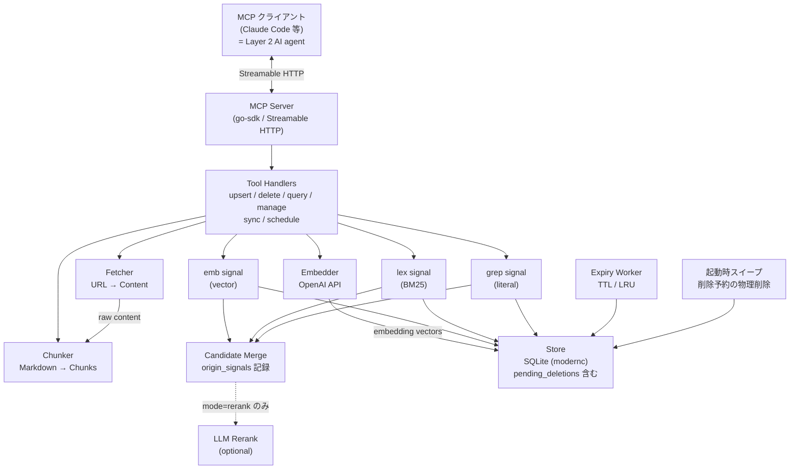
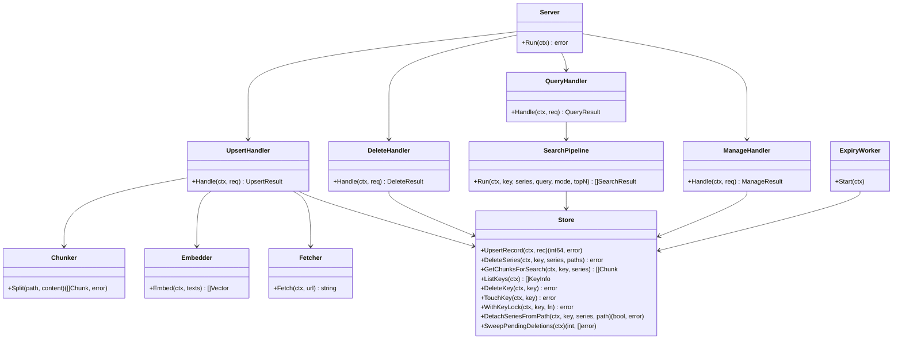
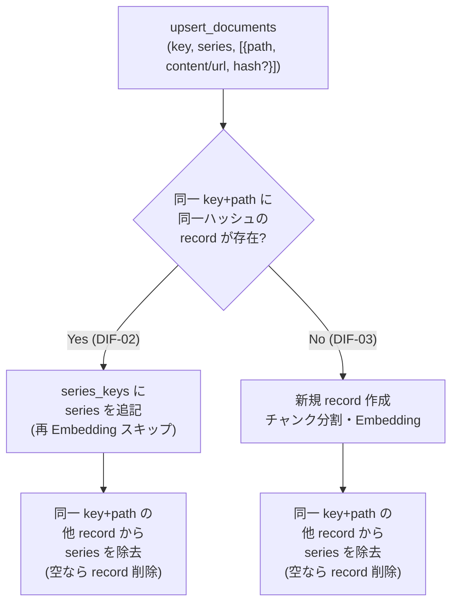
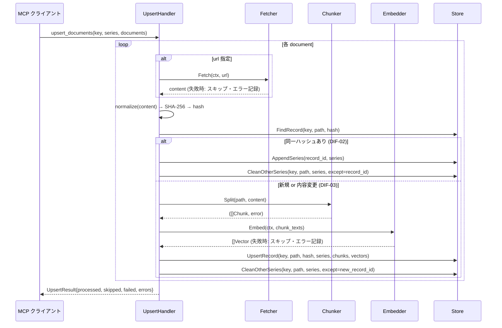
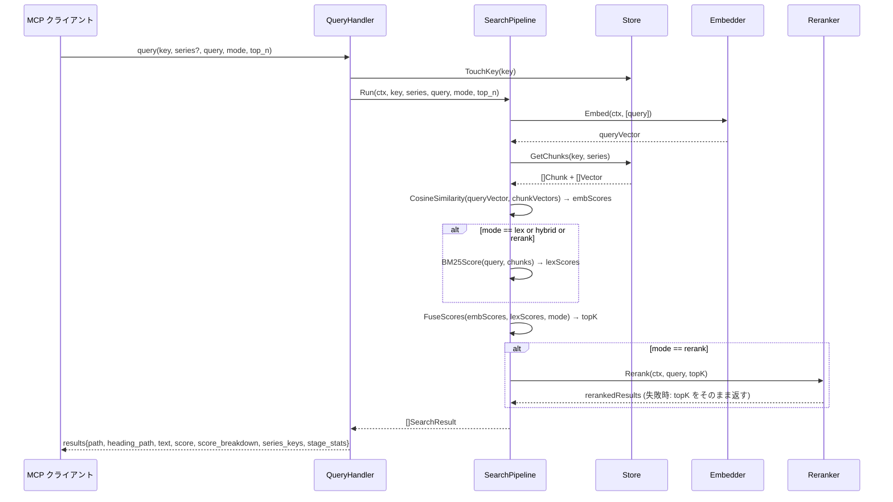
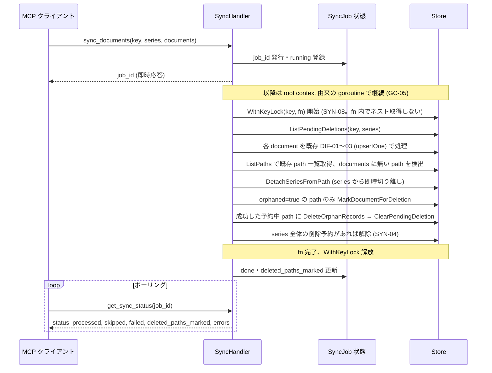

# DES-001 doc-db MCP Server 設計書

## メタデータ

| 項目     | 値         |
| -------- | ---------- |
| 設計ID   | DES-001    |
| 関連要件 | APP-001    |
| 作成日   | 2026-06-20 |

## 1. 概要

Markdown テキストのハイブリッド検索（ベクトル + BM25 + LLM Rerank）を提供する汎用 MCP サーバー。Go で実装し、純粋 Go 製 SQLite（`modernc.org/sqlite`）を採用することで CGO 不要・シングルバイナリ配布を実現する。MCP go-sdk の Streamable HTTP transport を使用し、OpenAI API は標準ライブラリの `net/http` で直接呼び出す。

**Streamable HTTP 採用理由**: MCP go-sdk の標準 transport であり、SSE と比較して双方向ストリーミングに適している。SSE transport は go-sdk のサポートが限定的（サーバー送信専用）であり、ツール呼び出しの応答返却が煩雑になる。Streamable HTTP は MCP 2025-03 仕様で推奨される transport であり、将来互換性の観点からも採用する（PRE-02/NFR-03）。

## 2. アーキテクチャ概要

### 2.1 二層検索アーキテクチャ (PHIL-01 / PHIL-02)

本サーバーは APP-001 PHIL-01 で定義される**二層検索アーキテクチャ**を実装する:

- **Layer 1 (本サーバー)**: Embedding + BM25 + 全文 GREP の 3 signal を並列実行し、
  各 signal の上位候補を合算した「取りこぼし無き候補プール」を返す。
  signal は互いに異なる種類の miss を補完する関係であり、いずれも代替できない。
- **Layer 2 (呼び出し側 AI agent)**: 返ってきた候補プールの本文を読んで関連性を
  判断する。本サーバーは関与しない。

LLM Rerank は本来 Layer 1 内部の ranking 最適化オプションであり、recall を広げる
手段ではない。Rerank 未使用時も 3 signal の併用結果が返る (PHIL-02)。


```mermaid
flowchart TB
    Client["MCP クライアント\n(Claude Code 等)\n= Layer 2 AI agent"]
    Server["MCP Server\n(go-sdk / Streamable HTTP)"]
    Tools["Tool Handlers\nupsert / delete / query / manage\nsync / schedule"]
    Chunker["Chunker\nMarkdown → Chunks"]
    Embedder["Embedder\nOpenAI API"]
    Fetcher["Fetcher\nURL → Content"]
    SearchEmb["emb signal\n(vector)"]
    SearchLex["lex signal\n(BM25)"]
    SearchGrep["grep signal\n(literal)"]
    Rerank["LLM Rerank\n(optional)"]
    Merge["Candidate Merge\norigin_signals 記録"]
    Store["Store\nSQLite (modernc)\npending_deletions 含む"]
    Expiry["Expiry Worker\nTTL / LRU"]
    Sweep["起動時スイープ\n削除予約の物理削除"]

    Client <-->|"Streamable HTTP"| Server
    Server --> Tools
    Tools --> Chunker
    Tools --> Embedder
    Tools --> Fetcher
    Tools --> SearchEmb & SearchLex & SearchGrep
    SearchEmb & SearchLex & SearchGrep --> Merge
    Merge -.->|"mode=rerank のみ"| Rerank
    Embedder -->|"embedding vectors"| Store
    Fetcher -->|"raw content"| Chunker
    SearchEmb & SearchLex & SearchGrep --> Store
    Expiry --> Store
    Sweep --> Store
```

### レイヤー構成と依存方向

```
cmd/          → internal/mcp
internal/mcp  → internal/store, internal/search, internal/chunker, internal/embedder, internal/fetcher
internal/search → internal/store
internal/expiry → internal/store
internal/store  → (外部依存なし)
```

上位レイヤーのみが下位を参照する。循環依存は禁止。

## 3. モジュール設計

### 3.1 パッケージ一覧

| パッケージ          | 責務                                                                                                               | 主な依存                                                                                         |
| ------------------- | ------------------------------------------------------------------------------------------------------------------ | ------------------------------------------------------------------------------------------------ |
| `cmd/docdb`         | エントリポイント・設定読み込み・起動時スイープ実行（§8.5）・ジョブ用 root context の生成保持（§5.4）・サーバー起動 | `internal/mcp`, `internal/store`, `internal/expiry`                                              |
| `internal/mcp`      | MCP ツールハンドラ（upsert/delete/query/manage/sync/schedule）・同期ジョブ状態管理                                 | `internal/store`, `internal/search`, `internal/chunker`, `internal/embedder`, `internal/fetcher` |
| `internal/store`    | SQLite の読み書き・トランザクション管理・KEY 単位排他（`WithKeyLock`、§4.3）・削除予約の記録と回収（§4.5）         | `modernc.org/sqlite`                                                                             |
| `internal/chunker`  | Markdown を見出し境界でチャンク分割                                                                                | （外部依存なし）                                                                                 |
| `internal/embedder` | OpenAI Embedding API 呼び出し                                                                                      | `net/http`                                                                                       |
| `internal/fetcher`  | HTTP/HTTPS URL からコンテンツ取得                                                                                  | `net/http`                                                                                       |
| `internal/search`   | 3 signal 並列検索（emb / BM25 lex / 全文 GREP）・候補 merge・LLM Rerank（オプション）                              | `internal/store`                                                                                 |
| `internal/reranker` | OpenAI Chat Completions による LLM Rerank（PHIL-02: オプション）                                                   | `internal/search`（interface 実装）                                                              |
| `internal/expiry`   | TTL/LRU ポリシーによる自動廃棄ワーカー（KEY 削除は `WithKeyLock` 経由、§4.3）                                      | `internal/store`                                                                                 |

### 3.2 主要な型関係


```mermaid
classDiagram
    class Server {
        +Run(ctx) error
    }
    class UpsertHandler {
        +Handle(ctx, req) UpsertResult
    }
    class DeleteHandler {
        +Handle(ctx, req) DeleteResult
    }
    class QueryHandler {
        +Handle(ctx, req) QueryResult
    }
    class ManageHandler {
        +Handle(ctx, req) ManageResult
    }
    class Store {
        +UpsertRecord(ctx, rec) (int64, error)
        +DeleteSeries(ctx, key, series, paths) error
        +GetChunksForSearch(ctx, key, series) []Chunk
        +ListKeys(ctx) []KeyInfo
        +DeleteKey(ctx, key) error
        +TouchKey(ctx, key) error
        +WithKeyLock(ctx, key, fn) error
        +DetachSeriesFromPath(ctx, key, series, path) (bool, error)
        +SweepPendingDeletions(ctx) (int, []error)
    }
    class Chunker {
        +Split(path, content) ([]Chunk, error)
    }
    class Embedder {
        +Embed(ctx, texts) []Vector
    }
    class Fetcher {
        +Fetch(ctx, url) string
    }
    class SearchPipeline {
        +Run(ctx, key, series, query, mode, topN) []SearchResult
    }
    class ExpiryWorker {
        +Start(ctx)
    }

    Server --> UpsertHandler
    Server --> DeleteHandler
    Server --> QueryHandler
    Server --> ManageHandler
    ManageHandler --> Store
    UpsertHandler --> Chunker
    UpsertHandler --> Embedder
    UpsertHandler --> Fetcher
    UpsertHandler --> Store
    DeleteHandler --> Store
    QueryHandler --> SearchPipeline
    SearchPipeline --> Store
    ExpiryWorker --> Store
```

**型定義**:

- `KeyInfo`: `ListKeys` の戻り値要素。`key string`・`series []string`・`doc_count int`・`last_updated_at string`・`last_accessed_at string`・`expiry_policy *ExpiryPolicy` を含む。MNG-01「KEY・series 一覧・ドキュメント数・最終更新日時・最終アクセス日時・廃棄ポリシー設定を取得できること」に対応する。

## 4. データモデル

### 4.1 SQLite スキーマ

```sql
-- インデックスキー管理
CREATE TABLE keys (
    key             TEXT PRIMARY KEY,
    doc_count       INTEGER NOT NULL DEFAULT 0,
    last_accessed_at TEXT NOT NULL,  -- RFC3339
    last_updated_at  TEXT NOT NULL,
    expiry_policy   TEXT             -- JSON: {"ttl_days": N, "max_chunks": N}
);

-- embedding record（key + path ごとにコンテンツ1バージョン）
CREATE TABLE records (
    id              INTEGER PRIMARY KEY AUTOINCREMENT,
    key             TEXT NOT NULL,
    path            TEXT NOT NULL,
    content_hash    TEXT NOT NULL,   -- SHA-256 hex
    created_at      TEXT NOT NULL,
    updated_at      TEXT NOT NULL,
    UNIQUE(key, path, content_hash)
);

-- series_keys（record と series の多対多）
CREATE TABLE series_keys (
    record_id INTEGER NOT NULL REFERENCES records(id) ON DELETE CASCADE,
    series    TEXT NOT NULL,
    PRIMARY KEY (record_id, series)
);

-- チャンク（見出し境界で分割されたテキスト）
CREATE TABLE chunks (
    id           INTEGER PRIMARY KEY AUTOINCREMENT,
    record_id    INTEGER NOT NULL REFERENCES records(id) ON DELETE CASCADE,
    chunk_index  INTEGER NOT NULL,
    heading_path TEXT NOT NULL,  -- "# A > ## B > ### C"
    text         TEXT NOT NULL
);

-- 埋め込みベクトル（BLOB: float32 配列をリトルエンディアンでシリアライズ）
-- dim カラム: 行ごとにベクトル次元数を記録する。起動時に SELECT DISTINCT dim FROM embeddings を実行し、
-- 結果が embedding.dim と異なる場合は「モデル変更後の DB 再構築が必要」として fail-fast する。
CREATE TABLE embeddings (
    chunk_id  INTEGER PRIMARY KEY REFERENCES chunks(id) ON DELETE CASCADE,
    vector    BLOB NOT NULL,
    dim       INTEGER NOT NULL
);

-- 削除予約（sync_documents / schedule_delete_series が記録し、起動時スイープが回収する。§4.5 / §8.5）
-- path = '' は「series 全体の削除予約」を表すセンチネル。SQLite の PRIMARY KEY は NULL の
-- 重複を許容してしまうため、NULL ではなく空文字列で series 全体 / 特定 path を区別する。
CREATE TABLE pending_deletions (
    key       TEXT NOT NULL,
    series    TEXT NOT NULL,
    path      TEXT NOT NULL DEFAULT '',
    marked_at TEXT NOT NULL,
    PRIMARY KEY (key, series, path)
);

-- bm25_stats / bm25_df は廃止された（v0.1.2 で削除）。
-- BM25 の TF/DF は事前集計テーブルを持たず、query 時に substring match で都度計算する
-- 方式に変更されている（reference doc-db SKILL と同方式）。詳細は §6.2 を参照。
```

### 4.2 並行アクセス方針（NFR-02）

SQLite WAL モードと Go 側ミューテックスの組み合わせで並行アクセスを制御する。

- **WAL モード採用**: 起動時に `PRAGMA journal_mode=WAL` を実行する。WAL モードでは読み取りと書き込みが並行して実行可能になる（書き込み中も読み取りをブロックしない）。
- **接続プール（複数接続）**: `database/sql` のデフォルト接続プールを使用し `SetMaxOpenConns(N)` で複数接続を許可する（N は `runtime.GOMAXPROCS(0)` を基準に設定）。複数の読み取りゴルーチンが独立した接続を取得し WAL の並行読み取り性能を活用する。`SetMaxOpenConns(1)` は採用しない — 単一接続では WAL モードの効果がなく、読み書きが全て直列化される。
- **書き込み直列化（Go 側 Mutex）**: 書き込み操作（upsert/delete/expiry）は Store レイヤーで `sync.Mutex` によって直列化する。SQLite 自体もシングルライタだが、Go 側でトランザクション単位の整合性を保証するために明示的に保護する。読み取り操作には Go 側ロックを掛けない（WAL が担う）。
- **ビジータイムアウト**: `PRAGMA busy_timeout=5000`（5秒）を設定する。書き込みロック競合が発生した場合（内部ミューテックスが解放後に DB レベル競合が起きる稀なケース）の保険として残す。
- **注意**: `sync.RWMutex` は使用しない。WAL + 接続プールが読み取り並行を担うため、Go 側に ReaderLock を設けても実効性がなく複雑になるだけ。
- **KEY 単位排他（`WithKeyLock`）との役割分担**: 上記 `sync.Mutex`（以下 `s.mu`）は個々の SQLite 書き込みトランザクション単位の直列化を担う。これとは**別レイヤー**の排他として、同一 KEY に対する複数回の Store 呼び出しを跨いだ一連の処理を直列化する KEY 単位ロック `WithKeyLock` を Store に設ける（§4.3）。両者は独立したミューテックスであり、`WithKeyLock` の内側で個々の Store メソッドが `s.mu` を取得しても問題は生じない。

### 4.3 KEY 単位排他制御（WithKeyLock）

`sync_documents`（§5.4、FNC-006 SYN-08）は「documents 処理 → 既存 path 一覧取得 → 欠落 path の切り離し・削除予約」を desired-state 判定の単一の論理処理として扱う。この間に同じ KEY へ他の書き込みが割り込むと、判定開始時点の desired-state と処理完了時点の実データがずれる。割り込みうる操作は series 単位のもの（`upsert_documents` / `delete_documents` / `delete_series` / `schedule_delete_series` / 別の `sync_documents`）に留まらず、**KEY 全体を削除する操作**（`delete_index`、EXP-01 の TTL、EXP-02 の LRU）も含む。KEY 全体削除が同時に走ると、sync 処理中の KEY 自体が消え、存在しない KEY への書き込みや削除と再挿入の競合による不整合が生じる。

これを防ぐため、Store は KEY 単位の論理ロック `WithKeyLock(ctx, key, fn func() error) error` を公開する。生の `LockKey(key) (unlock func())` ペアではなくクロージャ形式を採用するのは、呼び出し側の unlock 忘れを構造的に防ぐため。

**実装方式**: バッファ 1 の channel をミューテックス代わりに使う（send がロック取得、receive が解放に相当）。`sync.Mutex.Lock()` はブロッキング呼び出しで待機中にキャンセルできないが、channel であれば `select` で `ctx.Done()` と競合させられ、**ロック待機中でもキャンセルに応答できる**（FNC-006 GC-05: `sync_documents` がロック待ちのままシャットダウンに応答できなくなることを防ぐ。§5.4）。ロック取得後（`fn` 実行中）のキャンセル対応は、`fn` 自身が受け取った `ctx` を見て中断するかどうかに委ねる。KEY ごとのロックエントリは参照カウント方式で管理し、参照中の goroutine が 0 になったエントリは map から削除する（KEY の生成・削除が繰り返されても無制限に蓄積しない）。

**呼び出しルール [MANDATORY]**:

- `WithKeyLock` は各呼び出し元が対象 KEY につき 1 回だけ呼ぶ。**`fn` の内部でネストして `WithKeyLock` を呼んではならない**（非再入のため、同一 goroutine の二重取得はデッドロックする）
- 個々の Store メソッド（`DeleteKey` / `UpsertRecord` / `DeleteSeries` / `DeleteSeriesAll` 等）は KEY 単位ロックを**内部で取得しない**。KEY 単位排他が必要な呼び出し元が、メソッド呼び出し全体を `WithKeyLock` で囲む。「一部のメソッドは自分でロックを取り、一部の呼び出し元は外側から取る」という二重構造は再入デッドロックの温床になるため、取得主体を呼び出し側に統一する
- `fn` は「対象 KEY に対する Store 呼び出し一式」を指し、単一メソッド呼び出しとは限らない。呼び出し元一覧と囲み方:
  - `upsert_documents` ハンドラ: 複数ドキュメント分の `UpsertRecord` 呼び出しを含む、ハンドラの Store 書き込み処理全体を 1 回で囲む
  - `delete_documents` ハンドラ: `HasRecord` による存在チェック（warning 構築）から `DeleteSeries` までを囲む。**存在チェックをロック外に置いてはならない**: `sync_documents` がロック保持中に作成する path を「存在しない」と誤判定してブロックせず即完了し、削除要求を取りこぼす（TOCTOU）
  - `delete_series` ハンドラ: `DeleteSeriesAll` 呼び出しを囲む
  - `delete_index` ハンドラ: `DeleteKey` 呼び出しを囲む
  - `schedule_delete_series` ハンドラ: `MarkSeriesForDeletion` 呼び出しを囲む
  - `internal/expiry.Worker` の TTL / LRU: 削除対象 KEY ごとに `DeleteKey` 呼び出しを囲む（`storeForExpiry` インターフェースに `WithKeyLock` を含める。TTL/LRU の判定ロジック自体は §8 の通りで変更なし）
  - `sync_documents` のバックグラウンドゴルーチン: desired-state 判定全体（documents 処理 → path 一覧取得 → series 切り離し → 削除予約の記録・解除）を 1 回で囲む（§5.4）。`fn` 内で呼ぶ各 Store メソッドは `WithKeyLock` を持たないため、構造的に再入は起こり得ない

**ロック粒度は KEY 単位**（key+series 単位ではない）とし、同一 KEY 内の異なる series 間であっても並行実行しない。`delete_index` / TTL / LRU は KEY 全体に効くため、series 単位のロックでは「他の series はロックしていないので削除してよい」という誤った並行実行を防げない。単一 KEY 内で書き込み系操作が同時に複数走る想定は薄く（branch 運用は同一 KEY 内の逐次的な series 追加・削除が主）、並行度低下の実害は小さい。

### 4.4 Embedding Record の series_keys 管理


```mermaid
flowchart TB
    U["upsert_documents\n(key, series, [{path, content/url, hash?}])"]
    HashCheck{"同一 key+path に\n同一ハッシュの\nrecord が存在?"}
    Append["series_keys に\nseries を追記\n(再 Embedding スキップ)"]
    CleanOther1["同一 key+path の\n他 record から\nseries を除去\n(空なら record 削除)"]
    NewRec["新規 record 作成\nチャンク分割・Embedding"]
    CleanOther2["同一 key+path の\n他 record から\nseries を除去\n(空なら record 削除)"]

    U --> HashCheck
    HashCheck -->|"Yes (DIF-02)"| Append
    Append --> CleanOther1
    HashCheck -->|"No (DIF-03)"| NewRec
    NewRec --> CleanOther2
```

**重要**: series の剥がし処理（CleanOtherSeries）は DIF-02（同一ハッシュの Append）でも必須。たとえば series=main が hash=H1 に紐づいていた後、hash=H2 で上書きされ H2.series=[main] になった状態で、再び hash=H1 を main で upsert すると H1 が AppendSeries で復活しても H2 に main が残ったままになる。Append/NewRec のどちらの経路でも CleanOtherSeries を実行することで「同一 key+path+series の組み合わせは常に高々1 record」を保証する。

**例外 — sync_documents の series 切り離し（FNC-006 SYN-03）**: 「series_keys が空になった record は即時物理削除」という上記の掃除は、upsert 経路（DIF-02/03）の正であり続ける。一方、`sync_documents` が desired-state から欠落した path を series から切り離す `DetachSeriesFromPath` は、この不変条件の**意図的な例外**であり、orphan（どの series からも参照されない record）を物理削除せず起動時スイープまで保持する（自己修復を Embedding 再計算なしで成立させるため。詳細は §4.5）。

### 4.5 削除予約と orphan 回収（pending_deletions）

`sync_documents` / `schedule_delete_series`（FNC-006 SYN-03 / GC-01）は不要データを即時に物理削除せず、`pending_deletions` テーブル（§4.1）へ**削除予約**として記録する。物理削除は起動時スイープ（§8.5）が行う。予約は 2 種類ある:

- **path 単位**（`path` に実 path）: `sync_documents` が desired-state から欠落した path を series から**即時に切り離した**結果、orphan になった record の物理削除予約。切り離し済みのため当該 series 指定の検索からは既に消えており、予約は残骸（record・chunks・embeddings）の回収のみを意味する
- **series 全体**（`path=''` センチネル）: `schedule_delete_series` による series 丸ごとの削除予約。path 単位と異なり**即時切り離しは行わない**（遅延方式）。誤操作時の影響範囲が branch 全体に及ぶため、「予約は起動まで完全に無害（SYN-04 の再 sync で取り消せば何も起きない）」という安全性を優先する。削除済み branch の series を検索する動線は通常存在せず、検索最新性の実害は小さい

orphan record を物理削除せず残す目的は、SYN-04 の自己修復を Embedding 再計算なし（API 課金ゼロ）で成立させること。誤って欠落させた path を同一内容で再 sync すれば、DIF-02 が既存 record を再発見して series を再紐付けする。

#### Store メソッド仕様

| メソッド                                                            | 動作                                                                                                                                                                                                                                                                                                                                                                                                                             |
| ------------------------------------------------------------------- | -------------------------------------------------------------------------------------------------------------------------------------------------------------------------------------------------------------------------------------------------------------------------------------------------------------------------------------------------------------------------------------------------------------------------------- |
| `MarkSeriesForDeletion(ctx, key, series) (alreadyScheduled, error)` | `path=''` で 1 行 upsert（冪等）。既に予約済みなら `alreadyScheduled=true`（`schedule_delete_series` の `already_scheduled` 出力に使用）                                                                                                                                                                                                                                                                                         |
| `DetachSeriesFromPath(ctx, key, series, path) (orphaned, error)`    | 指定 key+path の record 群から当該 series の `series_keys` 行**のみ**を削除（SYN-03 の即時切り離し。当該 series 指定の検索から直ちに消える）。record・chunks・embeddings は削除しない（§4.4 の例外）。orphan が生じた場合 `orphaned=true` を返し、呼び出し元はその場合のみ `MarkDocumentForDeletion` を呼ぶ（他 series が残る record はその series の下で生き続けるため予約不要）。`records` 行は不変のため doc_count 更新は不要 |
| `MarkDocumentForDeletion(ctx, key, series, path)`                   | 指定 path で 1 行 upsert（orphan になった record の物理削除予約）                                                                                                                                                                                                                                                                                                                                                                |
| `ListPaths(ctx, key, series)`                                       | 当該 key+series に登録済みの path 一覧を返す（desired-state との差分検出に使用。読み取りのみ）                                                                                                                                                                                                                                                                                                                                   |
| `ListPendingDeletions(ctx, key, series) (paths, seriesWide, error)` | 当該 key+series の削除予約を 1 回で取得する（`paths` = path 単位予約の一覧、`seriesWide` = series 全体予約の有無）。`sync_documents` の冒頭で呼び、補償 + 予約解除の対象 path と SYN-04 の series 全体予約解除の要否を判定する（読み取りのみ）                                                                                                                                                                                   |
| `ClearPendingDeletion(ctx, key, series, path)`                      | 該当行を削除（SYN-04 の自己修復に使用）。`path=""` で series 全体の削除予約を解除する                                                                                                                                                                                                                                                                                                                                            |
| `DeleteOrphanRecords(ctx, key, path) (removed, error)`              | 指定 key+path の record のうち **`series_keys` が 0 件のもののみ**を物理削除する（chunks / embeddings / BM25 整合含む。既存 `deleteRecordWithBM25Tx` を再利用）。series 紐付きが残る record には一切触れないため冪等かつ常に安全。record 削除を伴うため doc_count を更新する。`WithKeyLock` は内部で取得しない（sync からの呼び出しは `fn` が保持済み・起動時スイープは §8.5 の通り不要）                                        |
| `SweepPendingDeletions(ctx) (processed, errs)`                      | `pending_deletions` 全行を処理する起動時スイープ。`path=''` なら `DeleteSeriesAll`、path 単位なら `DeleteOrphanRecords` を呼ぶ（§8.5）                                                                                                                                                                                                                                                                                           |

path 単位のスイープに `DeleteSeries` は**使用しない**。path 単位の予約行は「この path の orphan を回収せよ」という指示であり、`DeleteOrphanRecords` は series 紐付きが残る record に触れないため、**stale な予約行が残っていても live record を壊さない**（予約後に record が復活・再紐付けされていた場合は 0 件処理の冪等動作で行だけが消える）。`DeleteSeries` を使うと復活済み record から series を剥がして削除し得る。

**Mutex 直列化**: `MarkSeriesForDeletion` / `MarkDocumentForDeletion` / `ClearPendingDeletion` / `DetachSeriesFromPath` / `DeleteOrphanRecords` は単一トランザクションの書き込み操作であり、既存の削除系メソッドと同様に各メソッド自身が `s.mu` を取得して直列化する（§4.2。`WithKeyLock` とは別レイヤーであり、呼び出し側取得ルールの対象外）。

**stale 予約の発生源遮断 [MANDATORY]**: `DeleteKey` は当該 KEY の全 `pending_deletions` 行を、`DeleteSeriesAll` は当該 key+series の **series 全体予約（`path=''` センチネル）のみ**を、**それぞれ本体の削除と同一トランザクションで除去する**。これを行わないと、`schedule_delete_series(K, s)` → `delete_index(K)`（または `delete_series(K, s)`）→ 同名 KEY/series の再作成 → 再起動、の順序で stale な series 全体予約が残存し、起動時スイープの `DeleteSeriesAll` が**再作成された新データを削除する**。除去範囲が両メソッドで**非対称**なのは意図的な設計である:

- `DeleteKey` は orphan record（`series_keys` 0 件）を含む当該 KEY の全 record を物理削除するため、当該 KEY の予約はすべて（path 単位含め）無意味になる → 全行除去してよい
- `DeleteSeriesAll` は `series_keys` を JOIN して対象を列挙するため **orphan record には一切触れない**。切り離し済み orphan の唯一の回収手段は path 単位予約（起動時スイープの `DeleteOrphanRecords`）であり、ここで path 単位予約まで消すと**回収手段のない orphan が永久残留する**。path 単位予約を残しても `DeleteOrphanRecords` は orphan-only のため、同名 series 再作成後の live record を壊さない（無害） → **path 単位予約は残す**

**予約解除（`ClearPendingDeletion`）の実行条件 [MANDATORY]**: `sync_documents` は、`documents` に含まれる path のうち **1 件処理が成功（processed または skipped）し、かつ削除予約が存在する path** について、以下の 2 段階で予約を解除する:

1. **`DeleteOrphanRecords` を先に実行**する。upsert 経路の `CleanOtherSeries` は個別失敗しても警告扱いで処理継続する（record 単位では processed 扱い）ため、「processed = 旧 orphan は掃除済み」とは限らない。この補償呼び出しにより、`CleanOtherSeries` の成否に関係なく旧 orphan が決定的に回収される（掃除済みなら 0 件処理の冪等動作）
2. その後 `ClearPendingDeletion` で予約行を削除する。**手順 1 がエラーを返した場合は手順 2 を実行せず**、ログに記録して予約を保持する（次回 sync または起動時スイープが再試行する。スイープは orphan-only のため予約残置は無害）

処理が失敗（failed）した path の予約は保持し、上記 2 段階も実行しない。失敗 path は新 record が作られておらず、予約まで解除すると旧 orphan の回収手段が失われる。なお仮に実装が予約有無の判定を省き、成功 path 全件に `DeleteOrphanRecords` を呼んでも事故にはならない（DIF-02/03 の既存掃除の冪等な再実行にすぎない）。`ListPendingDeletions` で対象を絞るのは正しさのためではなく、無駄な呼び出しの削減と実装意図の明確化のためである。

**orphan record の既知の制約**: 起動時スイープまで一時的に残る orphan record について:

- **series 指定の検索には現れない**（`GetChunksForSearch` の series 指定経路は `series_keys` を JOIN するため）。sync 完了直後から削除済み path は当該 series の検索結果から消える（SYN-03）
- **series 未指定の KEY 全体検索には物理削除まで現れ得る**（`series == ""` 経路は `series_keys` を JOIN しない）。KEY 全体検索は全 series 横断の広域検索であり、over-recall 思想（PHIL-01）の範囲内として許容する
- doc_count（`COUNT(DISTINCT path) FROM records`）にも物理削除まで数えられる（起動時スイープは統計算出より前に走るため、起動時統計には影響しない。FNC-006 GC-03）
- 削除予約中の path を `sync_documents` を経由せず `upsert_documents` で復活させた場合、SYN-04 の予約解除は行われず予約行が残る。ただしスイープは orphan-only のため**復活済みの record が壊れることはなく**、stale な予約行は起動時に 0 件処理で除去されるだけで無害。予約解除を即時に行いたい場合は復活も `sync_documents` で行うこと
- **cross-series の自己修復猶予は保証されない**: SYN-04 の「API 課金ゼロ自己修復」は、当該 orphan が回収される前に同一 series の再 sync が行われた場合の保証である。`DeleteOrphanRecords` は series を見ずに同一 key+path の orphan を全回収し、既存の `CleanOtherSeries` / `AppendAndCleanSeries` も同一 key+path の空 record を掃除するため、別 series が同じ key+path を upsert / sync すると他 series の自己修復用に残していた orphan も回収される。その後の再 sync は通常の新規登録として Embedding を再計算する（動作は常に正しく、失われるのは課金ゼロの猶予のみ）。既存掃除機構と整合した挙動である

**予約を path 粒度とし record_id / content_hash を持たせない理由（設計判断）**:

1. **別内容での復活時**: DIF-03 経路は `UpsertRecord` 直後に必ず `CleanOtherSeries` を呼び、series 条件なしで同一 key+path の空 record を物理削除する。旧 orphan は原則、新 record 作成と同一の処理内で掃除される（同一内容での復活 = DIF-02 経路は record 再利用なので orphan 自体が生じない）。`CleanOtherSeries` の個別失敗は上記 [MANDATORY] の補償（予約解除直前の `DeleteOrphanRecords`）が拾う
2. **同一 key+path に複数 orphan（複数 content_hash）が並ぶ場合**: `DeleteOrphanRecords(key, path)` は path 配下の全 record を走査して orphan を全回収するため、予約行が個々の record を識別する必要がない
3. **record_id を持たせた場合の逆リスク**: DIF-02 の自己修復は既存 record への series 再紐付け（record 再利用）であるため、record 単位の予約では「再紐付けされて生き返った record を旧予約が指したままスイープで誤削除する」事故を防ぐ整合管理が別途必要になる。path 粒度 + 「`series_keys` 0 件のみ物理削除」の組み合わせは、この整合管理なしで安全側に倒れる

## 5. ユースケース設計

### 5.1 ユースケース一覧

| ユースケース                           | 対応 MCP ツール           | 関連要件              |
| -------------------------------------- | ------------------------- | --------------------- |
| ドキュメント追加・更新                 | `upsert_documents`        | FNC-001               |
| ドキュメント削除                       | `delete_documents`        | FNC-002               |
| series 一括削除（branch cleanup）      | `delete_series`           | FNC-002 DEL-03        |
| ドキュメント検索                       | `query`                   | FNC-003               |
| インデックス一覧取得                   | `list_indexes`（TBD-008） | FNC-004 MNG-01        |
| インデックス削除                       | `delete_index`（TBD-008） | FNC-004 MNG-02        |
| KEY ごとの廃棄ポリシー設定             | `manage_index`            | EXP-04                |
| desired-state 同期（削除ファイル追従） | `sync_documents`          | FNC-006 SYN-01〜05/08 |
| 同期ジョブの進捗取得                   | `get_sync_status`         | FNC-006 SYN-06        |
| series 削除予約（branch 削除検知時）   | `schedule_delete_series`  | FNC-006 GC-01         |

### 5.2 upsert_documents シーケンス

**content 取得の 3 経路 (exactly-one 排他)**:

| フィールド   | 取得元                  | 用途                                                          |
| ------------ | ----------------------- | ------------------------------------------------------------- |
| `content`    | クライアント payload    | 任意のテキストを直接投入 (旧来の使い方)                       |
| `url`        | Fetcher が HTTP GET     | リモート文書の取り込み                                        |
| `local_path` | doc-db が `os.ReadFile` | **ローカル運用推奨**。大容量文書を MCP payload に載せずに済む |

`local_path` の安全性: 絶対パスのみ、`..` 要素禁止、シンボリックリンク解決後のパスも再検証、
サイズ上限 10 MB、regular file 限定。`path` フィールド (search 表示用の識別子) と分離
されており、任意の相対パスを付けられる (例: `path="docs/api.md"` / `local_path="/abs/.../api.md"`)。


```mermaid
sequenceDiagram
    participant C as MCP クライアント
    participant H as UpsertHandler
    participant F as Fetcher
    participant Ch as Chunker
    participant E as Embedder
    participant S as Store

    C->>H: upsert_documents(key, series, documents)
    loop 各 document
        alt url 指定
            H->>F: Fetch(ctx, url)
            F-->>H: content (失敗時: スキップ・エラー記録)
        end
        H->>H: normalize(content) → SHA-256 → hash
        H->>S: FindRecord(key, path, hash)
        alt 同一ハッシュあり (DIF-02)
            H->>S: AppendSeries(record_id, series)
            H->>S: CleanOtherSeries(key, path, series, except=record_id)
        else 新規 or 内容変更 (DIF-03)
            H->>Ch: Split(path, content)
            Ch-->>H: ([]Chunk, error)
            H->>E: Embed(ctx, chunk_texts)
            E-->>H: []Vector (失敗時: スキップ・エラー記録)
            H->>S: UpsertRecord(key, path, hash, series, chunks, vectors)
            H->>S: CleanOtherSeries(key, path, series, except=new_record_id)
        end
    end
    H-->>C: UpsertResult{processed, skipped, failed, errors}
```

**ハッシュ算出の正規化規則（M1）**:

コンテンツの SHA-256 は以下の正規化を行った後の `[]byte` に対して算出する:

1. **BOM 除去**: UTF-8 BOM（`0xEF 0xBB 0xBF`）が先頭にある場合は除去する
2. **改行コード統一**: `\r\n` および単独 `\r` を `\n` に変換する
3. **エンコーディング**: UTF-8 として扱う（他エンコーディングは変換せず `Content-Type` charset ヘッダを参照。不明な場合は UTF-8 と仮定する）

クライアントが `hash` フィールドを省略せず送付する場合（`content` 指定時）、サーバーは同じ正規化を行った上で hash を算出し、クライアント提供値と照合する。不一致の場合はサーバー算出値を正として扱う（クライアントの正規化漏れを吸収する）。

**部分 Embed 失敗時の一貫性方針（M2）**:

チャンクの一部が Embedding API 呼び出し失敗でスキップされた場合、**成功チャンクのみを保存する（部分 record 保存）**。理由: all-or-nothing では一時的な API 障害で全ドキュメントが登録失敗になり、リトライまで検索不能になる。歯抜け record が検索品質に与える影響は許容範囲内（失敗チャンクは次回 upsert で再登録できる）。失敗したチャンクのインデックス番号はエラー情報（UPS-OUT-01）に含めて返す。

### 5.3 query シーケンス


```mermaid
sequenceDiagram
    participant C as MCP クライアント
    participant H as QueryHandler
    participant SP as SearchPipeline
    participant S as Store
    participant E as Embedder
    participant R as Reranker

    C->>H: query(key, series?, query, mode, top_n)
    H->>S: TouchKey(key)
    H->>SP: Run(ctx, key, series, query, mode, top_n)
    SP->>E: Embed(ctx, [query])
    E-->>SP: queryVector
    SP->>S: GetChunks(key, series)
    S-->>SP: []Chunk + []Vector
    SP->>SP: CosineSimilarity(queryVector, chunkVectors) → embScores
    alt mode == lex or hybrid or rerank
        SP->>SP: BM25Score(query, chunks) → lexScores
    end
    SP->>SP: FuseScores(embScores, lexScores, mode) → topK
    alt mode == rerank
        SP->>R: Rerank(ctx, query, topK)
        R-->>SP: rerankedResults (失敗時: topK をそのまま返す)
    end
    SP-->>H: []SearchResult
    H-->>C: results{path, heading_path, text, score, score_breakdown, series_keys, stage_stats}
```

### 5.4 sync_documents シーケンス（FNC-006 SYN-01〜08）

`upsert_documents` は追加専用の操作であり、クライアント側で削除されたファイルをインデックスから除去できない。`sync_documents` はクライアントが送る当該 key・series の**完全なファイル一覧**（desired-state）を正とし、各要素は既存の DIF-01〜03（`upsertOne`、無改造）で処理、一覧に含まれない既存 path は series から即時に切り離す。大量ファイルでも応答を遅延させないため、ジョブ投入（job_id 即時返却）+ `get_sync_status` ポーリングの 2 ツール構成とする（特別な非同期基盤は使わず、通常の同期 MCP ツールの組み合わせで実現する）。


```mermaid
sequenceDiagram
    participant C as MCP クライアント
    participant H as SyncHandler
    participant J as SyncJob 状態
    participant S as Store

    C->>H: sync_documents(key, series, documents)
    H->>J: job_id 発行・running 登録
    H-->>C: job_id (即時応答)
    Note over H,S: 以降は root context 由来の goroutine で継続 (GC-05)
    H->>S: WithKeyLock(key, fn) 開始 (SYN-08。fn 内でネスト取得しない)
    H->>S: ListPendingDeletions(key, series)
    H->>S: 各 document を既存 DIF-01〜03 (upsertOne) で処理
    H->>S: ListPaths で既存 path 一覧取得、documents に無い path を検出
    H->>S: DetachSeriesFromPath (series から即時切り離し)
    H->>S: orphaned=true の path のみ MarkDocumentForDeletion
    H->>S: 成功した予約中 path に DeleteOrphanRecords → ClearPendingDeletion
    H->>S: series 全体の削除予約があれば解除 (SYN-04)
    Note over H,S: fn 完了、WithKeyLock 解放
    H->>J: done・deleted_paths_marked 更新

    loop ポーリング
        C->>H: get_sync_status(job_id)
        H-->>C: status, processed, skipped, failed, deleted_paths_marked, errors
    end
```

**前提条件**: `key`・`series` は既存 KEY に対する呼び出しで、`documents` は当該 key・series の完全な現在状態であること（クライアントの責務）。要素形式は `upsert_documents` と同一（content / url / local_path 排他、§5.2）。**空リストも正当な desired-state として受理する**（「この series に現存ファイルがない」の宣言。既存 path は全て切り離し + orphan 予約となり、誤送信でも同一内容の再 sync で Embedding 再計算なしに復元できる。即時物理削除する `delete_series` への誘導は自己修復性を失うため行わない）。削除予約中の path の復活は `sync_documents` で行うこと（§4.5 既知の制約）。

**正常フロー**: 上図の通り。変更の無いファイルは DIF-02 によりそのまま skip される。desired-state から欠落した path は series から即時に切り離され、**当該 series を指定した検索には sync 完了直後から現れない**（SYN-03）。orphan になった record（chunks / embeddings 含む）は次回起動のスイープ（§8.5）まで物理的には残り、series 未指定の KEY 全体検索には現れ得る（§4.5 既知の制約）。予約解除は成功 path のみを対象に `DeleteOrphanRecords` → `ClearPendingDeletion` の 2 段階で行う（§4.5 [MANDATORY]）。同一 KEY を対象とする他の書き込み・削除操作（series を問わず。`delete_index`・TTL・LRU による KEY 削除を含む）は、処理完了までブロックされる（§4.3 SYN-08）。

**エラーフロー**: 個別ドキュメントの Embedding 失敗は既存 `upsertOne` の挙動を継承して処理継続（失敗 path の予約は解除しない）。存在しない・保持期限切れの `job_id` で `get_sync_status` を呼んだ場合はエラーを返す（SYN-06）。サーバーシャットダウンでジョブが中断された場合は `status="failed"` になる（GC-05）。

**ジョブ状態管理（SYN-06/07）**:

```go
type SyncJobStatus struct {
    Status              string // "running" | "done" | "failed"
    Processed, Skipped, Failed int
    DeletedPathsMarked  int
    Errors              []string
}
```

`internal/expiry.Worker` の `Stats` + `sync.Mutex` パターンを踏襲し、`Handlers` 構造体に `sync.Mutex` で保護された `map[string]*SyncJobStatus` を持たせる。**メモリ保持のみ、永続化しない**（SYN-07。サーバー再起動でジョブ状態が失われても、クライアントが再度 `sync_documents` を呼べば冪等に補われる）。完了済みジョブの保持上限は 100 件（`maxCompletedSyncJobs`）とし、超過分は古い順に破棄する。

**ジョブ用 context の寿命（GC-05）**: バックグラウンド処理に MCP リクエストの context をそのまま渡すと、job_id 返却でリクエストが完了した時点でキャンセルされ、ジョブが途中停止する。これを避けるため:

- サーバー起動時（`cmd/docdb`）に生成する、シャットダウンシグナルで cancel される長寿命の root context（`expiry.Worker.Start` に渡すものと同じ）を `Handlers` に保持させる
- バックグラウンドゴルーチンは root context から派生させた context で実行する。クライアントが切断してもジョブは継続する
- root context の cancel（シャットダウン）時は処理を中断し、`Status` を `"failed"` に更新してから終了する
- `WithKeyLock` のロック待機中に cancel された場合も、channel ベース実装（§4.3）により `fn` を実行せず即座に戻れるため、ロック取得前・取得後のいずれの段階でもシャットダウンに応答できる

## 6. 検索パイプライン詳細

### 6.1 ベクトル検索（emb）

- クエリテキストを Embedding API でベクトル化
- 対象 KEY（series 指定時はフィルタ）の全チャンクベクトルをメモリに展開
- コサイン類似度を `math` パッケージで計算（`f32` スライス）
- 上位 `top_n * rerank_factor` 件を候補として返す

**Embedding モデルと次元数の確定値（EMB-02）**:

| モデル（`embedding.model`）            | 次元数 | `embeddings.dim` |
| -------------------------------------- | ------ | ---------------- |
| `text-embedding-3-large`（デフォルト） | 3072   | 3072             |
| `text-embedding-3-small`               | 1536   | 1536             |

デフォルトモデル `text-embedding-3-large` を使用する場合、`embeddings.dim = 3072` で固定される。モデル変更時はデータベースを再構築する（異なる次元数のベクトルは混在不可）。

**モデル選択根拠**: `text-embedding-3-large` をデフォルトとして採用する。reference doc-db SKILL (Python 版) と同モデルにすることで日本語技術文書の検索精度を最大化する。コストは `-3-small` の約 6.5 倍だが、言い換え・抽象クエリでの recall 向上効果が大きい。コスト最適化が必要な場合は `text-embedding-3-small` (dim=1536) に切り替え可能。

**スケール上限**: `expiry.max_chunks`（デフォルト 10,000）はシステム全体の上限。key 単位では通常 1,000〜5,000 チャンク程度を想定する（1,000 チャンク × 1536 dim × 4 byte ≈ 6 MB）。10,000 チャンクでも 60 MB / クエリであり、内部ツール用途では許容範囲。100,000 チャンクを超える場合はベクトルキャッシュ（起動時 mmap またはプロセス内メモリキャッシュ）の導入を検討する。

**設計判断**: ベクトルをすべてメモリに展開する方式を採用。`modernc.org/sqlite` は pure-Go のため `sqlite-vec` 等の C 拡張をロードできない。内部開発ツールであり大規模データを前提としないため（NFR-07）、in-process 計算で十分。

### 6.2 BM25 語彙検索（lex）

- 事前集計テーブル（`bm25_stats` / `bm25_df`）は持たない（v0.1.2 で廃止）。クエリ時に対象 key のチャンク本文へ substring match を都度実行して TF/DF を計算する（reference doc-db SKILL と同方式）
- パラメータ（k1, b）はサーバー設定ファイルで指定（デフォルト: k1=1.5, b=0.75。Okapi BM25 の経験則デフォルト値（Robertson et al.）。k1 はワード頻度のサチュレーション、b は文書長正規化を制御する）

**トークナイザ仕様（LEX-01）**:

Unicode 正規化 + 正規表現ベースのトークン分割を採用する（形態素解析器は使用しない）。

1. NFKC 正規化 + 小文字化（`norm.NFKC.String(text)` 後 `strings.ToLower()` を適用。`golang.org/x/text/unicode/norm` + 標準 `strings` パッケージ）
2. 以下のパターンで順に優先マッチ:
   - `[A-Za-z]+-\d+` → ID パターン全体をひとつのトークンとして扱う（例: `FNC-001`）
   - `[A-Za-z0-9_]+` → ASCII 英数字・アンダースコア
   - `[^\W\d_A-Za-z]+` → 連続する CJK 等非 ASCII Unicode 文字をひとつのトークンとして扱う（日本語は単語境界で区切れないため近傍文字をグルーピング）
   - `\d+` → 数字列
3. 空文字列トークンは除外する

**ID 完全一致ボーナス（LEX-01）**:

BM25 スコアに加え、以下のボーナスを加算する:

- **ID パターン一致**: クエリ中の `[A-Z]+-\d+` 形式の ID がチャンク本文に含まれる場合 +10.0（例: `FNC-001`）
- **クエリ全文一致**: 正規化済みクエリ全体がチャンク本文に含まれる場合 +2.0

**チャンク削除時の扱い**: `bm25_stats` / `bm25_df` は廃止済み（v0.1.2）であり、BM25 は query 時の都度計算のため、チャンク削除時に BM25 側で追加の整合性維持処理は不要（`chunks` の `ON DELETE CASCADE` のみで完結する）。

### 6.3 スコア融合（hybrid）

Reciprocal Rank Fusion（RRF）を採用:

```
score(d) = Σ 1 / (k + rank_i(d))   (k = 60。Cormack et al. 2009 原論文の推奨値)
```

embedding ランクと lexical ランクを統合。加重和より外れ値に頑健で、スケール正規化不要のため採用。

**EMB フォールバックと保証（SC-01）**:

- **EMB フォールバック** (`EMB_FALLBACK_LEX_RATIO = 0.05`): lexical ヒット数 / emb ヒット数 < 0.05 の場合（日本語クエリで BM25 がほぼヒットしない場合など）、RRF ではなく embedding スコア降順でフォールバックする。（経験則による暫定値。実運用データで検証し調整する）
- **EMB top-K 保証** (`EMB_GUARANTEE_K = 5`): クロスランゲージ同義語など lexical スコアが 0 の文書が RRF で押し出されることを防ぐため、embedding 上位 5 件は fused 上位 K 件に必ず含まれるよう昇格させる。（経験則による暫定値。実運用データで検証し調整する）

**ステージ候補数トラッキング（QRY-OUT-02）**:

各検索ステージを通過した候補数を `stage_stats` としてクエリ単位で記録し、`SearchResult` に付与する:

```
stage_stats: {
  emb_candidates: N,    // embedding 検索でヒットした候補数
  lex_candidates: N,    // lexical 検索でヒットした候補数
  grep_candidates: N,   // GREP signal でヒットした候補数（§6.4）
  fused_candidates: N,  // RRF 融合後の候補数（merge 前）
  merged_candidates: N, // 3 signal 合算後のユニーク候補数（mode=all）
  rerank_candidates: N  // LLM Rerank に渡した候補数（Rerank スキップ時は 0）
}
```

### 6.4 全文 GREP signal（GRP-01 / GRP-02 / PHIL-01）

#### 目的

Embedding は固有 ID・特殊用語・低頻度トークンを意味空間で散らかす。BM25 もトークナイザ
境界で割れる場合がある。GREP は **literal 一致 (substring) のみ** を見るため、これら
2 signal で取りこぼされる候補を確実に拾える。3 signal は互いに代替できない関係にある
（PHIL-01）。

#### アルゴリズム

```
1. 正規化済みクエリ q_norm = NFKC.lower(query) を計算（BM25 と同じ正規化）
2. 全 chunk の正規化済み body について q_norm の出現回数 cnt を数える
3. cnt > 0 のチャンクのみを結果に含める
4. grep_score = cnt（単純な出現回数。スコア融合では使わず、ヒット有無の signal として扱う）
```

クエリの分割は行わない（query 全体を 1 文字列として substring 検索）。
複数キーワード対応は将来要件（YAGNI: 現状 1 keyword で十分実用的）。

#### 出力

GREP signal も他 signal と同様に candidate pool に合流し、`origin_signals` に `"grep"` を
付与する。`score_breakdown` には `grep` フィールドを含める。

### 6.5 Candidate Merge（ALL-01 / QRY-OUT-03）

`mode=all`（デフォルト）では 3 signal の結果を以下の手順で合算する:

```
1. emb 上位 N_emb 件、lex 上位 N_lex 件、grep ヒット全件を集める（GREP は順位なし）
   N_emb / N_lex は top_n に基づく（実装で確定）
2. chunk_id 単位で重複を排除し、各 chunk に origin_signals を記録
   例: chunk X が emb と grep で見つかれば origin_signals = ["emb", "grep"]
3. 合算結果を以下の優先順でソート:
   a. signal hit 数の降順 (3 → 2 → 1)
   b. emb_score 降順（tie-break）
   c. chunk_id 昇順（決定性）
4. 上位 top_n 件を返す（上位 AI agent は更にこれを本文判定する想定）
```

Layer 1 の責務は「**取りこぼしの無い候補プール**」を提供することなので、ranking の
fine-tuning は最小限とする（PHIL-01）。

### 6.6 LLM Rerank（オプション）

- OpenAI Chat Completions API（`gpt-4o-mini` 等、設定で変更可）を使用
- `mode=rerank` のときのみ実行
- §6.5 の merge 結果上位を LLM に渡し、関連度順に並び替える
- 候補チャンクとクエリを JSON で渡し、`{"ranking":[{"id","score":0..1}]}` を返させる
- プロンプトテンプレートは設定ファイルで上書き可
- タイムアウト（デフォルト 30s）超過または API エラー時は merge 順でフォールバック（RR-02）
- silent failure 禁止: 範囲外 id を返した場合は skip + `dropped_ids` を warnings に記録（detection memory）
- PHIL-02: Rerank は ranking 最適化であり、recall を広げる手段ではない。`mode=all` でも
  merge 結果は同等の signal recall を持ち、Rerank の有無で候補プールは変わらない

## 7. 外部 API 連携

### 7.1 OpenAI Embedding API

- エンドポイント: `https://api.openai.com/v1/embeddings`
- モデル: 設定ファイルで指定（例: `text-embedding-3-large`）
- バッチ上限: 1 リクエストあたり最大 100 テキスト（OpenAI 制限は 2048 だが、ペイロードサイズと遅延を抑えるため 100 を上限とする）
- リトライ: 指数バックオフ（初回 1s、最大 3 回）
- タイムアウト: 60s（設定可）
- API キー: 環境変数 `OPENAI_API_DOCDB_KEY` → フォールバック `OPENAI_API_KEY`（PRE-01）

### 7.2 URL コンテンツ取得（Fetcher）

- `net/http.Client` にタイムアウト 30s を設定
- リダイレクト最大 5 回
- `Content-Type` が `text/` 系以外はエラーとしてスキップ
- 取得後に SHA-256 を算出し、hash フィールドとして扱う（クライアント提供 hash は `content` 指定時のみ）

**SSRF 対策**: 本サーバーは内部ネットワークへの配備を前提とするため、プライベート IP へのリクエストをブロックする。

- DNS 解決後の IP アドレスが以下に該当する場合はエラーとしてスキップ:
  - `127.0.0.0/8`（ループバック）
  - `10.0.0.0/8`、`172.16.0.0/12`、`192.168.0.0/16`（RFC1918 プライベート）
  - `169.254.0.0/16`（リンクローカル / AWS IMDS 等）
  - `::1`、`fc00::/7`（IPv6 ループバック / ユニークローカル）
- ホワイトリストが必要な場合は設定ファイルの `fetcher.allow_private: true` で無効化できる（デプロイ管理者が責任を持つ）。

## 8. 廃棄ポリシー（Expiry Worker）

バックグラウンドゴルーチンとして起動し、定期的（デフォルト 1 時間ごと）に実行する。

TTL / LRU の**判定ロジックは以下の通り無改造**だが、削除の実行（`DeleteKey`）は KEY 単位排他の対象であり、対象 KEY ごとに `WithKeyLock` で囲んで呼び出す（FNC-006 SYN-08、§4.3。`sync_documents` 処理中の KEY を TTL/LRU が同時に消す競合を防ぐ）。

### 8.1 TTL（EXP-01）

```
SELECT key FROM keys
WHERE last_accessed_at < datetime('now', '-N days')
```

対象 KEY のすべての records・chunks・embeddings・series_keys を削除後、`keys` レコードも削除。

### 8.2 LRU（EXP-02）

```sql
-- システム全体のチャンク総数
SELECT COUNT(*) FROM chunks;

-- KEY ごとのチャンク数（削除優先順位の判定に使用）
SELECT r.key, COUNT(c.id) AS chunk_count
FROM chunks c
JOIN records r ON c.record_id = r.id
GROUP BY r.key
ORDER BY (SELECT last_accessed_at FROM keys WHERE key = r.key) ASC;
```

`total_chunks > max_chunks` の場合、`last_accessed_at ASC`（最も古いアクセス順）で KEY を削除し、上限以下になるまで繰り返す。

### 8.3 series 廃棄ポリシー（解決済み — 削除予約 + 起動時スイープ）

feature ブランチ運用ではブランチ削除後も series が残存し続ける問題があり、当初は廃棄ポリシー未確定（旧 TBD、APP-001 TBD-009）だった。FNC-006 で以下の方式により解決した:

- **`schedule_delete_series`（GC-01）**: クライアントが branch 削除等の事実を検知した時点で series 全体の削除予約を記録する（§4.5）。**即時削除はしない**
- **起動時スイープ（GC-02、§8.5）**: 予約された series を次回サーバー起動時に一括物理削除する
- **自己修復（SYN-04）**: 予約後に同一 key・series へ `sync_documents` が呼ばれた場合は予約を解除する。予約は起動まで完全に無害であり、誤操作しても取り消せる

**TTL/LRU の単位を series に拡張する案は不採用**。`last_accessed_at` という推測的指標に基づく自動廃棄を series へ広げるより、クライアントが確実に把握している事実（「この series はもう使われない」）だけを根拠にする方が、必要なデータが推測で消える事故（LRU 誤爆）を構造的に避けられるためである。ファイル単位の削除追従は `sync_documents` の desired-state 同期（§5.4）が担う。

### 8.4 KEY ごとのポリシーオーバーライド（EXP-04）

**設定方法**: 専用 MCP ツール `manage_index(key, expiry_policy)` を新設する（TBD-007 確定。B案採用）。

- `manage_index(key string, expiry_policy {ttl_days?: int, max_chunks?: int})` — KEY の廃棄ポリシーを設定・更新する。ドキュメントの再 upsert なしにポリシー変更が可能。
- `expiry_policy` に `null` を渡すとサーバーデフォルトにリセットする。
- `keys.expiry_policy` JSON カラムに値を保存。`null` の場合はサーバーデフォルトを適用。

> B案を採用した理由: ドキュメントの再 upsert なしにポリシーを変更できるため、大規模インデックスのポリシー変更が安全かつ効率的。MNG-01/02 と同様の管理操作として専用ツールへ集約することで、ツール責務が明確になる。

### 8.5 削除予約の起動時スイープ（GC-02〜04）

`pending_deletions`（§4.5）に記録された削除予約は、サーバー起動時に `SweepPendingDeletions` で一括物理削除する。`cmd/docdb` の起動シーケンスは `store.New()` 直後・**起動時 DB 統計表示（keyCount / totalChunkCount 算出）より前**にスイープを同期実行する（GC-03。統計が削除済みデータを含んだ値にならないようにする）。

- `path=''` の行（series 全体予約）: `DeleteSeriesAll` を呼ぶ（他 series が参照する record は保持する既存の安全な不変条件込み）
- path 単位の行: `DeleteOrphanRecords` を呼ぶ（orphan-only。stale な予約行が残っていても live record を壊さない。§4.5）
- 成功した行は `pending_deletions` から削除する。個別失敗は警告ログ + エラー集約で記録し**起動を継続**する（GC-04、silent failure 禁止方針）。失敗行・消し忘れ行は次回起動時に再試行されるだけで安全（両処理とも冪等）

スイープは MCP リクエストを受け付ける前の時間帯にのみ実行されるため `WithKeyLock` を取得しない。起動時以外（手動トリガー等）でスイープを実行する変更を加える場合はこの前提が崩れるため、各行ごとに `WithKeyLock` で囲むよう設計を見直すこと。

## 9. 設定

### 9.1 設定方式

設定は **YAML 設定ファイル** で管理する（環境変数による設定値オーバーライドは行わない）。API キーのみシークレットとして環境変数で扱う。

| 種別         | 渡し方        | 対象                                                                |
| ------------ | ------------- | ------------------------------------------------------------------- |
| シークレット | 環境変数      | `OPENAI_API_DOCDB_KEY`（優先） / `OPENAI_API_KEY`（フォールバック） |
| 動作設定     | YAML ファイル | Embedding モデル・タイムアウト・ポート・パス等のすべて              |

**設定ファイルパス（CFG-01）**: `~/.doc-db/doc-db.yaml`（固定）。`$HOME` が解決できない、またはファイルが存在しない場合は **fail-fast** でサーバーを終了する。CLI フラグ・環境変数によるパス変更は提供しない（設計上の簡潔性を優先）。

**ロード方式（CFG-02）**: 起動時に 1 回だけ読み込み、`internal/config` パッケージが `Config` 構造体を返す。サーバー稼働中の設定再読み込みは行わない（変更時は再起動）。

**検証（CFG-03）**: パース後にバリデーションを行う。未知のキー、型不一致、必須項目欠落、値域外（ポート範囲・正の整数等）は fail-fast で起動を中止する。

> **CFG-03 の例外（v0.1.12+）**: `log` セクションは省略可とする。既存の `doc-db.yaml`
> に破壊的変更を強いないための後方互換措置。省略時は `path: ~/.doc-db/doc-db.log` /
> `level: info` がロード時に補完される。他の全セクションは引き続き必須項目欠落を
> fail-fast で拒否する（この例外は `log` セクションのみに限定する）。

### 9.2 設定ファイルスキーマ

```yaml
# ~/.doc-db/doc-db.yaml
server:
  port: 58080 # HTTP ポート（dynamic range から選定）
  db_path: "./docdb.sqlite" # SQLite ファイルパス

embedding:
  model: "text-embedding-3-large" # Embedding モデル（変更時は DB 再構築必須）
  dim: 3072 # ベクトル次元数（EMB-02 確定値）
  timeout_seconds: 60 # API タイムアウト

rerank:
  model: "gpt-4o-mini" # LLM Rerank モデル
  factor: 3 # top_n × factor 件を Rerank に渡す
  timeout_seconds: 30 # API タイムアウト

chunker:
  max_chunk_size: 1500 # チャンクあたり最大文字数（CHK-03 確定値）

bm25:
  k1: 1.5 # サチュレーション係数（Robertson 経験則）
  b: 0.75 # 文書長正規化係数

fetcher:
  timeout_seconds: 30 # URL フェッチタイムアウト
  allow_private: false # プライベート IP へのフェッチを許可（SSRF 対策無効化）

expiry:
  ttl_days: 30 # 未アクセス KEY の自動削除日数（TBD-001）
  max_chunks: 10000 # システム全体のチャンク上限（TBD-002）
  interval_seconds: 3600 # 廃棄チェック間隔

log:
  path: "~/.doc-db/doc-db.log" # ログ出力先（省略可。"stdout"/"stderr" も指定可）
  level: "info" # debug/info/warn/error（省略可）
```

### 9.3 設計判断

| 項目                         | 判断                                 | 理由                                                                                                                           |
| ---------------------------- | ------------------------------------ | ------------------------------------------------------------------------------------------------------------------------------ |
| YAML 採用                    | TOML/JSON ではなく YAML              | コメント可・階層構造の可読性・運用者の編集容易性                                                                               |
| 環境変数オーバーライド不採用 | ファイルが唯一の正本                 | 設定の出所を一元化し、デバッグ時の挙動推定を容易にする                                                                         |
| パス固定                     | `~/.doc-db/doc-db.yaml` のみ         | CLI / env でのパス変更が増えると「実際にどの設定が使われているか」の判定コストが増す。サーバー用途では複数構成を持つ必要がない |
| API キーだけ環境変数         | シークレットは設定ファイルに書かない | 平文記録・git 誤コミットのリスク回避                                                                                           |

## 10. エラーハンドリング方針

外部要因エラーのみキャッチし、内部バグはサイレントフォールバックせず伝播させる（APP-001 エラーケース節）。

| レイヤー     | 方針                                                                                                                                                                                                                                   |
| ------------ | -------------------------------------------------------------------------------------------------------------------------------------------------------------------------------------------------------------------------------------- |
| 起動時       | `OPENAI_API_DOCDB_KEY` と `OPENAI_API_KEY` の両方が未設定の場合、サーバーを即座に終了する（PRE-01 fail-fast）。実際の API 疎通確認はしない（遅延検出コストが不要）。起動後に無効キーだと判明した場合は Embedder レイヤーでエラーを返す |
| Fetcher      | タイムアウト・HTTP エラーをキャッチし、該当 document をスキップして error 情報を返す                                                                                                                                                   |
| Embedder     | API エラーをキャッチし、複数バッチ失敗は `errors.Join` で全件保持し caller に返す。指数バックオフで最大 3 回リトライ                                                                                                                   |
| Reranker     | エラー時は merge 順結果にフォールバック（RR-02）。フォールバック発生は `QueryResult.warnings` に記録し caller が観測可能にする（silent failure 禁止方針）                                                                              |
| Store        | DB エラーは内部バグとして伝播させる（panic または error return で MCP エラーレスポンス）。tx.Rollback 失敗は `errors.Join` で caller に伝達                                                                                            |
| ExpiryWorker | 個別 KEY 削除失敗はログ + `Worker.Stats().LastKeyErrors` に記録し observability を担保。サーバー停止はしない                                                                                                                           |

**silent failure 禁止方針**: 全エラー経路で「ログのみ」で終わらせず caller / observable state
に必ず伝達する。詳細は memory `feedback_no_silent_failure.md` 参照。

## 11. テスト設計

- **単体テスト対象**: `store`（SQL クエリ正確性）、`chunker`（Markdown 分割境界）、`search`（コサイン類似度・BM25・RRF の計算結果）、`embedder`（リトライロジック）
- **統合テスト対象**: `upsert_documents` の series_keys 共有フロー（同一ハッシュで Embedding スキップされること）、`query` の mode 別結果差異、廃棄ポリシーによる削除動作
- **モック方針**: `Embedder` と `Fetcher` はインターフェース経由でモック可能にする。SQLite は通常の単体テストではインメモリ（`file::memory:`）を使用する
- **WAL 並行テスト**: WAL モードはファイルベースでしか有効化されない。並行アクセスの統合テスト（複数ゴルーチンの同時読み書き）は `os.MkdirTemp` で作成したテンポラリディレクトリに実 SQLite ファイルを使用する。インメモリ DB では WAL の挙動を検証できないため代替不可
- **KEY 単位排他（§4.3）**: `WithKeyLock` の直接排他性（同一 KEY ブロック / 異 KEY 非ブロック / 待機中 ctx キャンセル / 参照カウントによるエントリ解放）と、MCP ハンドラ層での排他（`sync_documents` 処理中の同一 KEY への `upsert_documents` / `delete_index` / TTL・LRU 相当呼び出しがブロックされること = SYN-08）を検証する
- **削除予約と orphan 回収（§4.5 / §8.5）**: 予約の冪等性、`DetachSeriesFromPath` の即時切り離し（series 指定検索から直ちに消え、record は物理残存）、stale 予約行の無害性（復活済み record をスイープが壊さないこと）、`DeleteKey` / `DeleteSeriesAll` の予約除去（非対称込み）、共有 content_hash record の保全、`DeleteOrphanRecords` の orphan-only 性を回帰テストとして常時検証する
- **sync_documents（§5.4）**: job_id 即時返却（SYN-05）、検索最新性（欠落 path が sync 完了直後の series 指定検索に現れないこと = SYN-03）、自己修復の API 課金ゼロ（Embedder spy で呼び出し 0 回 = SYN-04）、空 desired-state の受理、リクエスト context 非依存・root context キャンセルでの failed 遷移（GC-05）を検証する
- **DIF-02 不変条件**: 同一 `key + path + content_hash` で Embedding を再計算しないことを Store 層・ハンドラ層・Embedder spy の 3 テストで常時保証する（これらのテストを壊す変更は不変条件の破壊を意味する）

## 12. 使用する既存コンポーネント

初版は新規プロジェクトのため再利用対象なし。FNC-006（desired-state 同期 + 削除予約 GC）は以下の既存コンポーネントを再利用して実装されている:

| コンポーネント                     | 場所              | 利用方法                                                                                                       |
| ---------------------------------- | ----------------- | -------------------------------------------------------------------------------------------------------------- |
| `upsertOne`（DIF-01〜03 差分管理） | `internal/mcp`    | `sync_documents` の documents 処理で無改造再利用（SYN-02）                                                     |
| `Store.DeleteSeriesAll`            | `internal/store`  | series 全体予約のスイープで再利用（series-wide 予約行の同一 tx 除去を追加、§4.5 [MANDATORY]）                  |
| `Store.deleteRecordWithBM25Tx`     | `internal/store`  | `DeleteOrphanRecords` の物理削除（chunks / embeddings / BM25 整合）で再利用                                    |
| `Store.DeleteKey`                  | `internal/store`  | `delete_index`・TTL・LRU の削除実行。呼び出し側が `WithKeyLock` で囲む（§4.3。予約行の同一 tx 全行除去を追加） |
| `expiry.Worker` の Stats パターン  | `internal/expiry` | `SyncJobStatus`（`sync.Mutex` 保護 map）の設計踏襲（§5.4）                                                     |

## 改定履歴

| 日付       | バージョン | 内容                                                                                                                                                                                                                                                                                                                                                                                                                                                                                                                                                                    |
| ---------- | ---------- | ----------------------------------------------------------------------------------------------------------------------------------------------------------------------------------------------------------------------------------------------------------------------------------------------------------------------------------------------------------------------------------------------------------------------------------------------------------------------------------------------------------------------------------------------------------------------- |
| 2026-06-20 | 0.1        | 初版作成                                                                                                                                                                                                                                                                                                                                                                                                                                                                                                                                                                |
| 2026-06-20 | 0.2        | レビュー対応: C2(DIF-02 series 剥がし漏れ修正)・C3(WAL+接続プール方針に改訂)・H1(トークナイザ仕様追加)・H2(ID boost/EMB guarantee追加)・H3(スケール上限明記)・H5(LRU SQL修正)・H6(SSRF対策追加)・H7(起動時 fail-fast)・Chunker依存修正・WALテスト注記・series廃棄TBD追加                                                                                                                                                                                                                                                                                                |
| 2026-06-20 | 0.3        | レビュー対応(追補): M1(ハッシュ正規化規則追加)・M2(部分 Embed 失敗方針を部分保存に確定)・§4.1(dim 検査の動作主体を明示)・§3.1(internal/mcp の embedder 依存を追記)                                                                                                                                                                                                                                                                                                                                                                                                      |
| 2026-06-24 | 0.4        | §9 を YAML 設定ファイル方式に変更（`~/.doc-db/doc-db.yaml` 固定パス・環境変数オーバーライド不採用・API キーのみ環境変数）。本文中の `DOCDB_*` 環境変数参照を設定ファイルキー参照に更新                                                                                                                                                                                                                                                                                                                                                                                  |
| 2026-06-28 | 0.5        | APP-001 PHIL-01/02 (二層検索アーキ) に対応: §2.1 アーキテクチャ概要に Layer 1/2 説明と更新 mermaid 図を追加。§6.4 全文 GREP signal の設計を新規追加 (substring 一致・origin_signals 記録)。§6.5 Candidate Merge を新規追加 (3 signal 合算ロジック)。§6.6 LLM Rerank を従来の §6.4 から番号変更 + PHIL-02 (Rerank は optional) を明記。§10 エラーハンドリングを silent failure 禁止方針 (memory: no-silent-failure) に整合させ Embedder の `errors.Join` / Reranker の warnings / Expiry の Stats() 公開を反映                                                           |
| 2026-07-01 | 0.6        | §5.2 upsert_documents シーケンス冒頭に content 取得 3 経路 (content / url / **local_path**) の表を追加。local_path はローカル運用時の payload 削減用途で、doc-db が絶対パスから直接ディスク読み込みする。安全性制約 (絶対パス必須・`..` 禁止・symlink 解決後再検証・10MB 上限・regular file 限定) を明記                                                                                                                                                                                                                                                                |
| 2026-07-03 | 0.7        | §4.1 の `bm25_stats`/`bm25_df` スキーマ定義・§6.2 の関連更新手順を、v0.1.2 で廃止済み (実装は substring match による都度計算方式) の実態に合わせて修正                                                                                                                                                                                                                                                                                                                                                                                                                  |
| 2026-07-04 | 0.8        | §5.1 ユースケース一覧に未掲載だった `delete_series` / `manage_index` を追加し、既存ツール一覧として完全化                                                                                                                                                                                                                                                                                                                                                                                                                                                               |
| 2026-07-06 | 0.9        | FNC-006（desired-state 同期ジョブ + 削除予約の起動時 GC、追加設計書 v1.12 相当）を統合: §4.3 KEY 単位排他制御（WithKeyLock）・§4.5 削除予約と orphan 回収（pending_deletions、[MANDATORY] 2 件含む）を新設、§4.1 に pending_deletions スキーマ、§4.4 に sync 切り離しの意図的例外注記、§5.1 を 10 ツール化 + §5.4 sync_documents シーケンス新設、§8.3 の series 廃棄 TBD を解決（削除予約 + 起動時スイープ方式、TTL/LRU series 拡張は不採用）、§8.5 起動時スイープ新設、§11 に排他・削除予約・sync・DIF-02 不変条件の検証観点を追加、§12 に再利用コンポーネント表を追加 |
