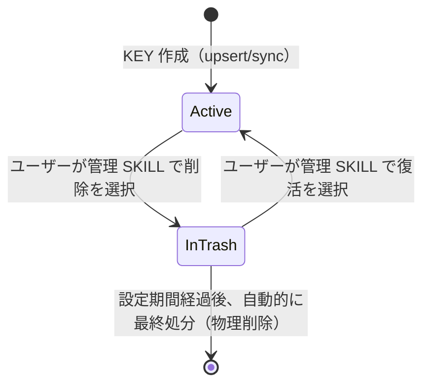

# APP-001 doc-db MCP Server 要件定義書

## 概要

Markdown テキストを受け取り、複数 signal の併用検索（ベクトル + 語彙一致 + 全文 GREP + 任意 LLM Rerank）を提供する汎用ドキュメント MCP サーバー。
サーバーは Git・文書構造を知らない。クライアントがドキュメントのテキスト内容（または取得元 URL）・識別キー（KEY）・時系列キー（series）を渡し、サーバーは KEY 単位でチャンクのベクトルデータを管理する。同一内容（同一ハッシュ）のドキュメントは embedding を共有し、series タグのみを追記することで重複 Embedding を排除する。
チームの複数メンバーが任意のドキュメントセットを共有 MCP サーバーに登録し、自然言語クエリで検索できる。

## 設計思想 — 二層検索アーキテクチャ (PHIL-01)

開発文書検索においては「**取りこぼし (recall miss)**」が precision 低下より致命的である。
本サーバーは検索パイプラインの最終目的を「正解 top-N の ranking」ではなく、
「**呼び出し側 (上位 AI agent) が本文を読み判定できるだけの候補プールを取りこぼし無く返すこと**」と
定義する。

このため検索は以下の二層構造を想定する:

1. **Layer 1: 候補収集 (本サーバーの責務)**
   - 異なる種類の取りこぼしを埋め合う 3 signal を併用する:
     - Embedding（意味類似） — 言い換え・抽象概念に強い
     - BM25 等の語彙検索 — トークン頻度に基づく確実性
     - **全文 GREP（literal 一致）** — 特殊用語・固有 ID・低頻度トークンを必ず捕捉
   - これらの signal は **互いに代替できない**。Embedding は固有 ID を散らかし、BM25 はトークナイザ境界で割れ、GREP は意味類似を解さない
   - LLM Rerank は ranking の最適化手段であり、recall を広げるものではないことに留意
2. **Layer 2: 内容判定 (呼び出し側 = 上位 AI agent の責務)**
   - Layer 1 が返す候補プールに対し、本文を読んで関連性を判断する
   - 親 Claude / SKILL / その他クライアント側で実施

| ID      | 要件                                                                                                                                                                                              |
| ------- | ------------------------------------------------------------------------------------------------------------------------------------------------------------------------------------------------- |
| PHIL-01 | サーバーは「ranking」ではなく「取りこぼしの無い候補収集」を最優先する。検索パイプラインに Embedding / BM25 / 全文 GREP の 3 signal を並列に組み込み、これらの結果を合算して呼び出し側に渡せること |
| PHIL-02 | LLM Rerank は ranking 最適化のオプションであり、recall を広げる手段ではない。Rerank 未使用時でも上記 3 signal の併用結果が返ること                                                                |

## 前提条件

| ID     | 要件                                                                                                                                          |
| ------ | --------------------------------------------------------------------------------------------------------------------------------------------- |
| PRE-01 | サーバーに OpenAI API キーが設定されていること。`OPENAI_API_DOCDB_KEY` を優先し、未設定時のみ `OPENAI_API_KEY` をフォールバックとして使用する |
| PRE-02 | MCP クライアントが MCP Server に MCP プロトコル準拠の HTTP transport で接続できること                                                         |

## 要件一覧

### FNC-001 ドキュメント追加・更新（upsert_documents）

ドキュメントのテキスト内容を受け取り、指定 KEY のインデックスに追加・更新する MCP ツールを提供する。

#### 入力パラメータ

| パラメータ | 型     | 必須 | 説明                                                                                                                                                                                                                                                                                                                                                                                                                                                                                                                                                                                                                                                                                                                                                                                                              |
| ---------- | ------ | ---- | ----------------------------------------------------------------------------------------------------------------------------------------------------------------------------------------------------------------------------------------------------------------------------------------------------------------------------------------------------------------------------------------------------------------------------------------------------------------------------------------------------------------------------------------------------------------------------------------------------------------------------------------------------------------------------------------------------------------------------------------------------------------------------------------------------------------- |
| key        | string | ✓    | インデックスを識別する opaque 文字列。クライアントが自由に定義する（例: "myrepo"）                                                                                                                                                                                                                                                                                                                                                                                                                                                                                                                                                                                                                                                                                                                                |
| series     | string | ✓    | 時系列を識別する opaque 文字列。クライアントが自由に定義する（例: "main", "feature-x", "v1.2.3"）。同一 key・path で series が異なる場合、内容が同じなら embedding を共有し series_keys に追記する                                                                                                                                                                                                                                                                                                                                                                                                                                                                                                                                                                                                                |
| documents  | array  | ✓    | 登録するドキュメントのリスト。各要素は以下のいずれか（`content` / `url` / `local_path` は排他、exactly-one）: ・`{path: string, content: string, hash?: string}` — クライアントがテキストを直接送付。`hash` はコンテンツ全体の SHA-256（省略時はサーバーが算出） ・`{path: string, url: string}` — サーバーが URL からコンテンツを取得しハッシュを算出 ・`{path: string, local_path: string}` — **ローカル運用時推奨**。`local_path` は絶対パスで、doc-db サーバーが直接ディスクから読む。payload 削減 (大容量ファイルを MCP で送らずに済む)。`..` やシンボリックリンク越しの相対パスは reject、10MB 上限 `path` はクライアントが自由に定義するドキュメント識別子（固定フォーマットなし。例: "README.md", "src/api.md"）で search 結果に表示される。`local_path` はファイル読み込み専用で保存されない |

#### チャンク分割

| ID     | 要件                                                                                                                             |
| ------ | -------------------------------------------------------------------------------------------------------------------------------- |
| CHK-01 | チャンクは Markdown の見出し境界（H1〜H6）で切り出す。チャンクには文書パスと見出し階層パス（例: `# A > ## B > ### C`）を保持する |
| CHK-02 | 見出しを持たない文書は文書全体を 1 チャンクとして扱う                                                                            |
| CHK-03 | チャンクの最大サイズは設計書で確定する                                                                                           |

#### 差分管理

| ID     | 要件                                                                                                                                                                                                                     |
| ------ | ------------------------------------------------------------------------------------------------------------------------------------------------------------------------------------------------------------------------ |
| DIF-01 | サーバーは key・path 単位で embedding record を管理する。各 record はコンテンツハッシュ・チャンク・ベクトルデータ・series_keys（この内容を参照する series の一覧）を保持する                                             |
| DIF-02 | upsert 時に同一 key・path で一致するハッシュの record が存在する場合、再 Embedding をスキップし、その record の series_keys に指定 series を追記する（同一 embedding を複数 series で共有）                              |
| DIF-03 | upsert 時にハッシュが一致しない場合は新規 record を作成し、同一 key・path で当該 series を保持する既存 record から当該 series を削除する。他 series が残る record は保持し、series_keys が空になった record のみ削除する |

#### Embedding

| ID     | 要件                                           |
| ------ | ---------------------------------------------- |
| EMB-01 | Embedding はチャンク単位で生成する             |
| EMB-02 | Embedding モデルおよび次元数は設計書で確定する |

#### 出力

| ID         | 要件                                                                                                                                         |
| ---------- | -------------------------------------------------------------------------------------------------------------------------------------------- |
| UPS-OUT-01 | 処理結果として以下を返す: 処理したドキュメント数・スキップしたドキュメント数・失敗したドキュメント数・失敗したドキュメントのパスとエラー内容 |
| UPS-OUT-02 | 一部ドキュメントの Embedding が失敗した場合も処理を継続し、失敗情報を結果に含めて返す                                                        |

### FNC-002 ドキュメント削除（delete_documents / delete_series）

指定 KEY から特定ドキュメントを削除する MCP ツールを提供する。

#### 入力パラメータ

| パラメータ | 型            | 必須 | 説明                                                                                                                              |
| ---------- | ------------- | ---- | --------------------------------------------------------------------------------------------------------------------------------- |
| key        | string        | ✓    | 対象インデックスの KEY                                                                                                            |
| series     | string        | ✓    | 削除対象の時系列キー。指定 series を各 embedding record の series_keys から削除し、series_keys が空になった record を物理削除する |
| paths      | array[string] | ✓    | 削除するドキュメントの識別子リスト（upsert_documents で登録した path の値）                                                       |

#### 処理

| ID         | 要件                                                                                                                                                                                                                                                                                                                                                       |
| ---------- | ---------------------------------------------------------------------------------------------------------------------------------------------------------------------------------------------------------------------------------------------------------------------------------------------------------------------------------------------------------- |
| DEL-01     | 指定 series を、指定 paths に対応する embedding record の series_keys から削除する。series_keys が空になった record のチャンクおよびベクトルデータを物理削除する                                                                                                                                                                                           |
| DEL-02     | 存在しないパスが指定された場合はそのパスをスキップし、処理結果に警告として含める                                                                                                                                                                                                                                                                           |
| **DEL-03** | **KEY 内の全 record から指定 series を一括除去する MCP ツール `delete_series` を提供する (v0.1.9)。branch cleanup 等で「path を列挙せずに series 全体を消したい」ユースケース向け。戻り値は removed_records (物理削除された record 数) と updated_records (他 series が残り保持された record 数)。存在しない series を指定してもエラーにならない (no-op)** |

### FNC-003 ドキュメント検索（query）

自然言語クエリでドキュメントを検索する MCP ツールを提供する。

#### 入力パラメータ

| パラメータ | 型      | 必須 | 説明                                                                                                                |
| ---------- | ------- | ---- | ------------------------------------------------------------------------------------------------------------------- |
| query      | string  | ✓    | 検索クエリ（自然言語、または ID・固有名詞を含むテキスト）                                                           |
| key        | string  | ✓    | 検索対象の KEY                                                                                                      |
| series     | string  | -    | 絞り込む時系列キー。省略時は全 series を横断検索する                                                                |
| mode       | string  | -    | 検索方式。`emb` / `lex` / `grep` / `hybrid` / `rerank` / `all`（デフォルト: `all`、PHIL-01 に従い全 signal を併用） |
| top_n      | integer | -    | 取得結果数の上限（デフォルト: 10。`all` モードでは各 signal ごとに top_n を返すため候補プール総数は最大 3×top_n）   |

#### 検索処理

| ID         | 要件                                                                                                                                                                                                           |
| ---------- | -------------------------------------------------------------------------------------------------------------------------------------------------------------------------------------------------------------- |
| LEX-01     | クエリ語に基づき登録済みチャンクテキストに対して語彙一致スコアを算出する。ID パターン（例: `FNC-001`）や固有名詞の完全一致を高スコアとして扱う。詳細アルゴリズムおよびパラメータは設計書で確定                 |
| **GRP-01** | **クエリ文字列を含むチャンクを literal 一致で検出する全文 GREP signal を提供する（PHIL-01）。NFKC 正規化＋大小無視の部分一致でマッチさせ、ヒットしたチャンクを返す。スコアは出現回数に比例する単純な値とする** |
| **GRP-02** | **GREP signal は Embedding/BM25 で取りこぼされる特殊用語・固有 ID・低頻度トークンを必ず捕捉することを目的とする。意味類似は解さない**                                                                          |
| SC-01      | Embedding スコアと語彙スコアを統合して候補をソートする。統合方式は設計書で確定                                                                                                                                 |
| RR-01      | 統合スコア上位の候補を LLM Rerank に渡し、関連度順に並び替える。`mode=rerank` のときのみ実行する。使用モデルは設計書で確定                                                                                     |
| RR-02      | LLM Rerank が失敗した場合は Rerank をスキップし、統合スコア順の結果を返す（フォールバック）                                                                                                                    |
| **ALL-01** | **`mode=all`（デフォルト）では Embedding / BM25 / GREP の 3 signal を並列実行し、各 signal の top_n 件を合算した候補プールを返す（PHIL-01）。重複チャンクは origin signal を全て記録した 1 件にまとめる**      |

#### 出力

| ID             | 要件                                                                                                                                                                   |
| -------------- | ---------------------------------------------------------------------------------------------------------------------------------------------------------------------- |
| QRY-OUT-01     | 検索結果には文書パス・見出し階層パス・チャンクテキスト・スコア・スコア内訳（embedding / lexical / **grep** / rerank）・所属 series_keys を含める                       |
| QRY-OUT-02     | 各検索ステージ（embedding / lexical / **grep** / rerank）を通過した候補数と、各チャンクがどのステージで残留したかを結果に含める                                        |
| **QRY-OUT-03** | **各チャンクが「どの signal でヒットしたか」を `origin_signals: [emb,lex,grep]` のような配列で明示する（PHIL-01 の二層アーキにおいて上位 AI agent が判定材料にする）** |

### FNC-004 インデックス管理

MCP ツールとして提供する。ツール名は TBD-008 で確定する。

| ID     | 要件                                                                                                                                                                                                                                                                                                                                                                                                                                                                                                                                                                                                                                                                                                               |
| ------ | ------------------------------------------------------------------------------------------------------------------------------------------------------------------------------------------------------------------------------------------------------------------------------------------------------------------------------------------------------------------------------------------------------------------------------------------------------------------------------------------------------------------------------------------------------------------------------------------------------------------------------------------------------------------------------------------------------------------ |
| MNG-01 | KEY 別のインデックス一覧（KEY・series 一覧・doc 数・chunk 数・最終更新日時・最終アクセス日時）を取得できること。ゴミ箱状態（TRS-01）の KEY は一覧から除外する（TRS-04 で別途確認できる）。**series 一覧は当該 KEY の record に現在紐づく series の集合であり、当該 series に紐づく record が 0 件なら一覧に現れない。したがって「その series で一度も同期していない」と「同期済みだが desired-state が空だった」（SYN-01 が空リストを正当な desired-state として受理し、SYN-03 が全 path を切り離した結果）は区別できない**。クライアントが本一覧で「未同期」を判定する場合、送信対象のドキュメント数が 0 かどうかを併せて確認して両者を切り分ける必要がある（後者に対して同期の再実行を促しても状態は変わらない） |
| MNG-02 | 指定 KEY を削除する場合、即時の物理削除ではなくゴミ箱投入操作（FNC-007 TRS-01〜03）を経由する。ゴミ箱内の KEY は自動最終処分（TRS-06/07）まで復活可能（TRS-05）                                                                                                                                                                                                                                                                                                                                                                                                                                                                                                                                                    |

### FNC-005 廃棄ポリシー（廃止 — FNC-007 参照）

旧 TTL（EXP-01）・LRU（EXP-02）による自動廃棄は、実運用で投入直後の唯一の KEY を無警告のまま削除する事故を起こしたため廃止した。doc-db は「削除すべきかどうか」の判定を一切行わない設計へ転換し、削除は必ずユーザー主導のゴミ箱投入（FNC-007）を経由する。KEY ごとの廃棄ポリシーオーバーライド（EXP-04、`manage_index` ツール）も TTL/LRU 廃止に伴い併せて廃止した。詳細は ADR-003 を参照。

| ID (廃止) | 旧要件                                                                    |
| --------- | ------------------------------------------------------------------------- |
| EXP-01    | TTL（最終アクセスからの経過時間による自動削除）。FNC-007 により廃止       |
| EXP-02    | LRU（容量制限による自動削除）。FNC-007 により廃止                         |
| EXP-03    | サーバー全体のデフォルト廃棄ポリシー設定。TTL/LRU 廃止に伴い廃止          |
| EXP-04    | KEY ごとの廃棄ポリシーオーバーライド（`manage_index` ツール）。同上で廃止 |
| EXP-05    | TTL/容量上限のデフォルト値。同上で廃止                                    |

### FNC-006 desired-state 同期 + 削除予約の起動時ガベージコレクション（sync_documents / get_sync_status / schedule_delete_series）

`upsert_documents`（FNC-001）は「渡されたドキュメントを追加・更新する」追加専用の操作であり、クライアント側で削除されたファイルを検出してインデックスから除去する手段を持たない。そのままでは削除済みファイルの record が無期限に残留し、検索結果を汚染する。一方 FNC-005 の TTL/LRU（EXP-01/02）は最終アクセス日時という推測的な指標に基づく KEY 単位の自動廃棄であり、削除済みの事実を確定的に検出するものではない（推測ベースで必要なデータが消えることは許容できない）。

そこで本機能は、クライアントが確実に把握している事実（「このファイル一覧が当該 series の現在の全て」「この series はもう使われない」）だけを根拠に不要データを除去する MCP ツールとして、`sync_documents` / `get_sync_status` / `schedule_delete_series` を提供する。これにより TBD-009（series の廃棄ポリシー）を解決する。

既存の `upsert_documents` / `delete_documents` / `delete_series` は、**処理ロジック本体を変更しない**。ただし SYN-08（KEY 単位排他）の実現のため、これらの呼び出しを KEY 単位排他ロックで包むラップのみ追加する（判定・削除・差分管理のロジック自体は無改造。ロックの実現方式は設計書で確定）。旧 EXP-01/02（TTL/LRU タイマーワーカー）は FNC-007 により廃止されたが、廃止時点でも SYN-08 が要求する KEY 単位排他ロックは維持したまま `trash_index`（TRS-01）・自動最終処分（TRS-06/07）に引き継がれている。

#### 入力パラメータ（sync_documents）

| パラメータ | 型     | 必須 | 説明                                                                                                                                             |
| ---------- | ------ | ---- | ------------------------------------------------------------------------------------------------------------------------------------------------ |
| key        | string | ✓    | 対象インデックスの KEY                                                                                                                           |
| series     | string | ✓    | 対象の時系列キー                                                                                                                                 |
| documents  | array  | ✓    | 当該 key・series の**完全な現在状態**を表すドキュメントのリスト。要素形式は upsert_documents（FNC-001）と同一（content / url / local_path 排他） |

#### 処理

| ID     | 要件                                                                                                                                                                                                                                                                                                                                                                                                                                                                                                                                                                                                                                                                                                                                                                                                                                                                                                                                                                                                                                                                                                                                                                                                                                                                                                                                                                                                                                                                                                         |
| ------ | ------------------------------------------------------------------------------------------------------------------------------------------------------------------------------------------------------------------------------------------------------------------------------------------------------------------------------------------------------------------------------------------------------------------------------------------------------------------------------------------------------------------------------------------------------------------------------------------------------------------------------------------------------------------------------------------------------------------------------------------------------------------------------------------------------------------------------------------------------------------------------------------------------------------------------------------------------------------------------------------------------------------------------------------------------------------------------------------------------------------------------------------------------------------------------------------------------------------------------------------------------------------------------------------------------------------------------------------------------------------------------------------------------------------------------------------------------------------------------------------------------------ |
| SYN-01 | サーバーは `sync_documents` の `documents` を、当該 key・series の完全な現在状態（desired-state）とみなす                                                                                                                                                                                                                                                                                                                                                                                                                                                                                                                                                                                                                                                                                                                                                                                                                                                                                                                                                                                                                                                                                                                                                                                                                                                                                                                                                                                                    |
| SYN-02 | `documents` の各要素には、既存の upsert_documents と同一の差分管理（DIF-01〜03）を適用する。無改造で再利用する                                                                                                                                                                                                                                                                                                                                                                                                                                                                                                                                                                                                                                                                                                                                                                                                                                                                                                                                                                                                                                                                                                                                                                                                                                                                                                                                                                                               |
| SYN-03 | 処理完了後、当該 key・series に既存登録されているが `documents` に含まれない path を検出し、当該 series との紐付けを**即座に**除去する（当該 series を指定した検索の結果に削除済みファイルが混入しないようにするため）。紐付け除去の結果どの series からも参照されなくなった record は、その場では物理削除せず削除予約として記録する（物理削除は GC-02 の起動時スイープ、または保持期間経過後の `internal/trash.Worker` 定期実行のいずれかで行う。record を残すのは SYN-04 の自己修復を Embedding 再計算なしで可能にするため）。なお series を指定しない検索（KEY 全体検索）には、物理削除まで当該 record が含まれ得る（既知の制約）                                                                                                                                                                                                                                                                                                                                                                                                                                                                                                                                                                                                                                                                                                                                                                                                                                                                         |
| SYN-04 | 過去に削除予約された path が、その後の `sync_documents` 呼び出しの `documents` に再度含まれ、**かつその path の処理が成功した場合**、削除予約を解除する（誤操作からの自己修復。処理が失敗した path の予約は解除しない）。予約解除の際は、当該 path に物理削除待ちの旧 record（どの series からも参照されないもの）が残っていれば先に回収してから解除し、**解除によって回収漏れが生じないこと**を保証する。record の物理削除は通常は起動時スイープ（GC-02）または保持期間経過後の `internal/trash.Worker` 定期実行で行われ、自己修復時は予約解除の直前に orphan-only 回収（前述）として行われる。それまで record は残っているため、内容が不変（content_hash 一致）であれば SYN-02 の差分管理（DIF-02）が record を再発見して series を再紐付けし、Embedding の再計算（API 課金）は発生しない（再紐付けは orphan-only 回収より先に行われるため、復活した record が回収されることはない）。ただしこの API 課金ゼロの保証は、**同一 key・path に対する他 series の upsert / sync や起動時スイープ・定期実行が先に当該 orphan を回収していない場合**に限る（回収済みなら通常の新規登録として Embedding を再計算する。動作としては常に正しく、課金だけが発生する）。内容が変わって復活した場合は通常の内容変更（DIF-03）として処理され、旧 record は既存の同一 path 掃除機構により物理削除される（orphan record は残らない）。当該 key・series に GC-01 由来の **series 全体の削除予約**が存在する場合も、`sync_documents` が呼ばれた時点でその series はまだ使われていると判断し、series 全体の削除予約を解除する |
| SYN-05 | `sync_documents` は処理完了を待たず、一意な job_id を即座に返す。実際の処理はサーバー内部で継続する                                                                                                                                                                                                                                                                                                                                                                                                                                                                                                                                                                                                                                                                                                                                                                                                                                                                                                                                                                                                                                                                                                                                                                                                                                                                                                                                                                                                          |
| SYN-06 | `get_sync_status` は job_id を受け取り、ジョブの進捗（処理済み・スキップ・失敗件数、削除予約件数）および完了有無を返す。存在しない job_id・保持期限切れの job_id を指定された場合はエラーを返す                                                                                                                                                                                                                                                                                                                                                                                                                                                                                                                                                                                                                                                                                                                                                                                                                                                                                                                                                                                                                                                                                                                                                                                                                                                                                                              |
| SYN-07 | ジョブの状態はメモリ上にのみ保持し、永続化しない。サーバー再起動でジョブ状態が失われても、クライアントが再度 `sync_documents` を呼び出せば冪等に補われるため実害はない                                                                                                                                                                                                                                                                                                                                                                                                                                                                                                                                                                                                                                                                                                                                                                                                                                                                                                                                                                                                                                                                                                                                                                                                                                                                                                                                       |
| SYN-08 | 同一 KEY に対する `sync_documents` は、**同じ KEY を対象とする他の全ての書き込み系操作**と**排他的に**実行する。対象は series を問わず KEY 全体に及ぶ: `upsert_documents` / `delete_documents` / `delete_series` / `schedule_delete_series` / 別の `sync_documents`（同一 KEY 内の別 series も含む）に加え、KEY 全体を削除する `trash_index`（TRS-01、ゴミ箱投入）・自動最終処分ワーカーによる `DeleteKey`（TRS-06/07）も対象に含む。desired-state 判定（ドキュメント処理→既存 path 一覧取得→削除予約）を単一の論理的な処理単位として扱い、途中に KEY の一部または全部を変更する操作が割り込んで desired-state と実データがずれることを防ぐ。排他の粒度は KEY 単位とする（同一 KEY 内の異なる series 間であっても並行実行しない。理由は設計書で確定）                                                                                                                                                                                                                                                                                                                                                                                                                                                                                                                                                                                                                                                                                                                                                        |

#### 出力仕様

| ツール                   | 出力                                                                                                                                                                                                |
| ------------------------ | --------------------------------------------------------------------------------------------------------------------------------------------------------------------------------------------------- |
| `sync_documents`         | `{job_id: string}`。処理完了を待たない即時応答（SYN-05）                                                                                                                                            |
| `get_sync_status`        | `{status: "running" \| "done" \| "failed", processed: int, skipped: int, failed: int, deleted_paths_marked: int, errors: string[]}`。存在しない・保持期限切れの job_id の場合はエラー応答（SYN-06） |
| `schedule_delete_series` | `{key: string, series: string, already_scheduled: bool}`。即時削除は行わない（GC-01）。`already_scheduled` は呼び出し時点で既に同一 series の削除予約が存在した場合に true（冪等呼び出しの判別用）  |

#### 削除予約と起動時ガベージコレクション

| ID    | 要件                                                                                                                                                                                                                                                                                                                                                                                                                                                                                                                                                                                                                    |
| ----- | ----------------------------------------------------------------------------------------------------------------------------------------------------------------------------------------------------------------------------------------------------------------------------------------------------------------------------------------------------------------------------------------------------------------------------------------------------------------------------------------------------------------------------------------------------------------------------------------------------------------------- |
| GC-01 | `schedule_delete_series` は指定 key・series を即座に削除せず削除予約として記録する MCP ツール。branch 削除等、クライアントが series の廃止を確定的に把握しているケース向け。既存の `delete_series`（DEL-03、即時削除）とは別ツールとして共存する                                                                                                                                                                                                                                                                                                                                                                        |
| GC-02 | series 単位（GC-01 由来）・path 単位（SYN-03 由来）いずれの削除予約も、サーバー起動時のスイープ、または保持期間経過後の `internal/trash.Worker` 定期実行（FNC-007 TRS-06/07）のいずれかで物理削除する。path 単位の予約は SYN-03 で series との紐付けを除去済みの record（どの series からも参照されない record）の物理削除を意味し、**どの series からも参照されない record のみを削除する**（series の紐付きが残る record・予約後に復活した record には一切触れない。予約が古くなって残っていても実データを壊さない）。series 単位の物理削除は既存の DEL-03 と同じ安全条件（他 series が参照する record は保持）に従う |
| GC-03 | 起動時の削除予約処理は、起動時統計情報（MNG-01 相当の集計値）の算出より前に完了させる（統計値が削除予約処理後の正しい状態を反映するようにするため）                                                                                                                                                                                                                                                                                                                                                                                                                                                                     |
| GC-04 | 削除予約の物理削除に個別失敗した場合、ログに記録し処理を継続する。失敗した予約は次回起動時のスイープ、または次回の `internal/trash.Worker` 定期実行で再試行される                                                                                                                                                                                                                                                                                                                                                                                                                                                       |
| GC-05 | `sync_documents` のバックグラウンド処理は、リクエストの生存期間から切り離された独立した context で実行する。MCP リクエストへの応答（job_id 返却）後にクライアントが切断してもジョブは継続する。サーバーがシャットダウンする場合はジョブを中断し、当該ジョブの状態を `"failed"` にする（進行中のまま応答が返らなくなることを避ける）                                                                                                                                                                                                                                                                                     |

### FNC-007 KEY のゴミ箱管理（ユーザー主導のゴミ箱投入・自動最終処分）

doc-db は「削除すべきかどうかの判定」を一切行わない。KEY ごとの正確な情報（データ量・最終アクセス日時等）をユーザーの近辺まで届けることに徹し、削除の要否判断と実行は、その情報を見た人間・AI エージェントに委ねる（旧 EXP-01/02 の TTL/LRU 自動削除は、投入直後で唯一の KEY を無警告のまま削除する事故を実運用で起こしたため、本要件で置き換えた。ADR-003 参照）。

削除は必ずゴミ箱投入を経由し、猶予期間なしに即座に物理削除される経路を残さない（旧 `delete_index` は本要件のゴミ箱投入操作に置き換えられ廃止した）。KEY は通常「利用可能（Active）」状態にあり、システムが自動判定して KEY をゴミ箱に入れることはない。ゴミ箱投入は常にユーザーの明示的な操作によってのみ発生する。

**用語**:

| 用語         | 定義                                                                                                                                                   |
| ------------ | ------------------------------------------------------------------------------------------------------------------------------------------------------ |
| ゴミ箱       | 削除対象になったデータ（KEY 単位または record 単位）が、実データ（record・chunk・embedding）を保持したまま置かれる状態                                 |
| 自動最終処分 | ゴミ箱投入から設定期間経過後、対象データ（KEY または record）を自動的に物理削除すること                                                                |
| 復活         | ゴミ箱内のデータを、自動最終処分前に元の利用可能な状態へ戻す操作。KEY 単位はユーザー操作、record 単位（orphan、GC-01/02 由来）はシステム自動で行われる |
| 管理 SKILL   | 対話型 SKILL（`manage-db-indexes`）。KEY メタデータ・ゴミ箱一覧の提示と、削除・復活の実行を担う                                                        |

#### ゴミ箱投入・操作拒否

| ID     | 要件                                                                                                                                                                                                                                                                                                                                                                 |
| ------ | -------------------------------------------------------------------------------------------------------------------------------------------------------------------------------------------------------------------------------------------------------------------------------------------------------------------------------------------------------------------- |
| TRS-01 | ユーザーは管理 SKILL を通じて、KEY メタデータ（MNG-01）を見た上で、削除したい KEY を選択できる。KEY に series が1つ以上ある場合は削除の実行前に確認を行う（強制操作）。KEY に series が無い場合は確認を伴わない簡易な操作で削除を選択できる。削除を選択した時点では KEY の実データは物理的に削除されず、ゴミ箱状態に遷移するのみ                                     |
| TRS-02 | ゴミ箱状態の KEY を指定して `query` が呼ばれた場合、検索は実行せず、対象 KEY がゴミ箱に入っている旨の明示的なエラーを返す（結果を空にするだけでは「何もヒットしなかった」のか「KEY がゴミ箱に入っている」のかユーザーが区別できないため）                                                                                                                            |
| TRS-03 | ゴミ箱状態の KEY に対して `upsert_documents` / `sync_documents` / `delete_documents` / `delete_series` / `schedule_delete_series` が呼ばれた場合、操作は拒否される。呼び出し元には、対象 KEY がゴミ箱に入っている旨と、操作の前に TRS-05 の復活操作が必要である旨を伝える。ゴミ箱状態の KEY は復活するまでのあいだ、種類を問わずいかなる書き込み系操作も受け付けない |

#### ゴミ箱一覧・復活

| ID     | 要件                                                                                                                                                                                                                         |
| ------ | ---------------------------------------------------------------------------------------------------------------------------------------------------------------------------------------------------------------------------- |
| TRS-04 | ユーザーは管理 SKILL を通じて、現在ゴミ箱に入っている KEY の一覧（投入日時・自動最終処分までの残り時間を含む）を確認できる。orphan record（GC-01/02 由来）は本一覧に表示しない（ユーザーが個別に操作できる対象ではないため） |
| TRS-05 | ユーザーは管理 SKILL を通じて、ゴミ箱内の KEY を自動最終処分前に選択し、利用可能な状態へ戻せる。復活した KEY は、ゴミ箱投入前と同じデータ（record・chunk・embedding）がそのまま利用できる                                    |

#### 自動最終処分

| ID     | 要件                                                                                                                                                                                                                                                                                                                                                                 |
| ------ | -------------------------------------------------------------------------------------------------------------------------------------------------------------------------------------------------------------------------------------------------------------------------------------------------------------------------------------------------------------------- |
| TRS-06 | ゴミ箱に投入された KEY は、投入時点から一定期間（デフォルト 3 日）経過後、自動的に物理削除される。保持期間は `doc-db.yaml` の `trash.retention_days` で変更できる。最終処分のチェック間隔は `trash.interval_seconds` で変更できる。自動最終処分の対象はユーザーが明示的にゴミ箱へ投入した KEY のみで、システムが独自に対象を追加することはない                       |
| TRS-07 | 自動最終処分を実行したときは、対象 KEY・実行日時を記録として残す。事後に「いつ何を消したか」を追跡できること。GC-01/02 由来の orphan record についても、同じ猶予期間の定義に従って自動的に物理削除され、実行時に同様の記録を残す（orphan record の物理削除はサーバーの起動を待たずに実行できる。復活は同一内容の再 `sync_documents` によってシステムが自動的に行う） |

## エラーケース

外部要因エラーのみキャッチし、内部バグはサイレントフォールバックせず伝播させる。

| 条件                                                                                                                            | 動作                                                                         |
| ------------------------------------------------------------------------------------------------------------------------------- | ---------------------------------------------------------------------------- |
| PRE-01 の API キーが未設定または無効                                                                                            | エラーを返し処理を中断する                                                   |
| 指定 KEY のインデックスが未登録の状態で query を実行                                                                            | インデックス未登録であることをエラーで返す                                   |
| upsert_documents の url 指定ドキュメントのコンテンツ取得失敗（タイムアウト・認証エラー等）                                      | 該当ドキュメントをスキップし、失敗情報を結果に含めて返す（処理継続）         |
| upsert_documents の Embedding API 呼び出し失敗（リトライ後も継続）                                                              | 成功したドキュメントのみ保存し、失敗情報を結果に含めて返す（処理継続）       |
| LLM Rerank 失敗                                                                                                                 | 統合スコア順の結果を返す（処理継続・フォールバック）                         |
| ゴミ箱投入済み KEY への `query`                                                                                                 | ゴミ箱に入っている旨を明示するエラーを返す（`restore_index` を案内。TRS-02） |
| ゴミ箱投入済み KEY への `upsert_documents` / `delete_documents` / `delete_series` / `schedule_delete_series` / `sync_documents` | 同様にゴミ箱に入っている旨を明示するエラーで拒否する（TRS-03）               |
| 存在しない・保持期限切れの `job_id` で `get_sync_status` を呼ぶ                                                                 | エラーを返す（SYN-06）                                                       |
| `sync_documents` 処理中に同一 KEY への他の書き込みが要求される                                                                  | SYN-08 により `sync_documents` の完了までブロックされる（拒否ではない）      |
| サーバーシャットダウン中に `sync_documents` が実行中                                                                            | ジョブを中断し `status: "failed"` にする（GC-05）                            |

### エラー種別の機械判別（ERR-01）

| ID     | 要件                                                                                                                                                                                                                                                                                                                                                                                                                                                                                                                                                                                                 |
| ------ | ---------------------------------------------------------------------------------------------------------------------------------------------------------------------------------------------------------------------------------------------------------------------------------------------------------------------------------------------------------------------------------------------------------------------------------------------------------------------------------------------------------------------------------------------------------------------------------------------------- |
| ERR-01 | **「指定 KEY が存在しない」と「KEY がゴミ箱状態である」を、クライアントがメッセージ文言に依存せず機械的に判別できる識別子を error 応答に含める**。クライアントはこの 2 つに対して取るべき行動が正反対である（前者は索引を作成してよい / 後者は作成してはならず `restore_index` を案内する）ため、判別を誤ると誤った同期を実行しうる。識別子の値は公開契約として固定し、変更しない。判別できない失敗をクライアントが「障害」として扱えるよう、識別子を持つ種別は上記 2 つに限定する（他のエラーへ網羅的に付与することは本要件の範囲外）。文言そのものは公開契約ではなく、実装の詳細として変更されうる |

対象は上表のうち「指定 KEY のインデックスが未登録の状態で query を実行」および「ゴミ箱投入済み KEY への各操作（TRS-02 / TRS-03）」である。載せ方（error 応答のどのフィールドに、どのような値で載せるか）は設計で確定する。

## 外部依存

| ID     | 依存先                                                                     |
| ------ | -------------------------------------------------------------------------- |
| EXT-01 | OpenAI API — Embedding 生成・LLM Rerank に使用する                         |
| EXT-02 | HTTP/HTTPS クライアント — `url` 指定ドキュメントのコンテンツ取得に使用する |

## 非機能要件

| ID     | 要件                                                                                                       |
| ------ | ---------------------------------------------------------------------------------------------------------- |
| NFR-01 | 複数ユーザーの同時クエリに対応すること                                                                     |
| NFR-02 | インデックスストレージは並行アクセスに耐えること（詳細は設計書で確定）                                     |
| NFR-03 | サーバーは MCP プロトコル準拠の HTTP transport で MCP クライアントと通信すること                           |
| NFR-04 | API キーはサーバー側の環境変数で管理し、クライアントに公開しないこと                                       |
| NFR-05 | サーバーが停止した場合、既存インデックスデータは失われないこと（データ保護）                               |
| NFR-06 | サーバーのエラーおよび処理状況をログとして出力すること（運用性）                                           |
| NFR-07 | 稼働率・フェイルオーバー要件はスコープ外とする（内部開発ツールであり外部公開・本番運用を前提としないため） |
| NFR-08 | クエリ応答時間の目標値は TBD-003 で確定する                                                                |

## スコープ外（後回し）

- ローカル未コミットファイルのインデックス対応
- 検索品質の評価機能（evaluate）
- CI/CD 連携による自動インデックス更新
- KEY 単位のアクセス制御・認証

## 未確定事項

| ID      | 内容                                                                                                                                                                      | 期限                                                                                                                                                                                                                                                                                               |
| ------- | ------------------------------------------------------------------------------------------------------------------------------------------------------------------------- | -------------------------------------------------------------------------------------------------------------------------------------------------------------------------------------------------------------------------------------------------------------------------------------------------- |
| TBD-001 | TTL デフォルト値（最終アクセスから何日で廃棄するか）                                                                                                                      | -                                                                                                                                                                                                                                                                                                  |
| TBD-002 | 容量上限のデフォルト値（総チャンク数またはストレージ使用量の基準）                                                                                                        | -                                                                                                                                                                                                                                                                                                  |
| TBD-003 | クエリ応答時間の目標値                                                                                                                                                    | -                                                                                                                                                                                                                                                                                                  |
| TBD-004 | 同時接続ユーザー数の上限                                                                                                                                                  | -                                                                                                                                                                                                                                                                                                  |
| TBD-005 | LLM Rerank に渡す候補数の上限（精度とコストのトレードオフ）                                                                                                               | -                                                                                                                                                                                                                                                                                                  |
| TBD-006 | 1 回の upsert_documents リクエストあたりのドキュメント数上限                                                                                                              | -                                                                                                                                                                                                                                                                                                  |
| TBD-007 | KEY 単位の廃棄ポリシーオーバーライドの設定方法（upsert_documents への埋め込みか専用ツールか）                                                                             | 設計書 §8.4 で専用ツール `manage_index` を採用と確定（2026-06-21）。ただし FNC-005（TTL/LRU 廃棄）自体が FNC-007 により廃止されたため `manage_index` も撤去された。KEY のライフサイクル管理は `trash_index` / `list_trashed_indexes` / `restore_index`（TRS-01/04/05）に置き換わった（2026-07-09） |
| TBD-008 | FNC-004 インデックス管理の MCP ツール名（MNG-01 用: インデックス一覧取得、MNG-02 用: インデックス削除）                                                                   | -                                                                                                                                                                                                                                                                                                  |
| TBD-009 | series の廃棄ポリシー: EXP-01/02 の廃棄単位を KEY のみとするか series まで拡張するか。未使用 series（feature ブランチ削除後など）の自動廃棄が必要かどうかの意思決定が必要 | FNC-006（GC-01〜05）で削除予約＋起動時スイープ方式を採用と確定（2026-07-06）。TTL/LRU の series 拡張は不採用                                                                                                                                                                                       |
| TBD-101 | 完了済み sync ジョブ状態（SYN-06/07）の保持ポリシー（件数上限 or 経過時間）の具体的な値                                                                                   | 実装判断で件数上限 100 件と確定（`internal/mcp/sync.go` の定数コメント参照）                                                                                                                                                                                                                       |

## 変更履歴

| 日付       | 変更者  | 内容                                                                                                                                                                                                                                                                                                                                                                                                                                                                                                            |
| ---------- | ------- | --------------------------------------------------------------------------------------------------------------------------------------------------------------------------------------------------------------------------------------------------------------------------------------------------------------------------------------------------------------------------------------------------------------------------------------------------------------------------------------------------------------- |
| 2026-06-19 | k2moons | 初版作成                                                                                                                                                                                                                                                                                                                                                                                                                                                                                                        |
| 2026-06-19 | k2moons | documents 要素に url フィールド追加（content/url 排他）、path をドキュメント識別子として明確化                                                                                                                                                                                                                                                                                                                                                                                                                  |
| 2026-06-19 | k2moons | series パラメータ追加（upsert/delete/query）、embedding record の series_keys 共有モデル導入（DIF-01〜03）、hash フィールド追加                                                                                                                                                                                                                                                                                                                                                                                 |
| 2026-06-20 | k2moons | TBD-009 追加: series 廃棄ポリシーの意思決定未確定を明示                                                                                                                                                                                                                                                                                                                                                                                                                                                         |
| 2026-06-28 | k2moons | 設計思想「二層検索アーキ」(PHIL-01/02) と GREP signal (GRP-01/02 / ALL-01) を追加。query 出力に origin_signals 必須化 (QRY-OUT-03)。reference doc-db / Forge / DocAdvisor で実証済みの方針を本サーバーにも採用                                                                                                                                                                                                                                                                                                  |
| 2026-07-01 | k2moons | upsert_documents の documents に `local_path` フィールドを追加 (v0.1.8)。ローカル運用時に大容量ドキュメントを content で送らずにサーバー側で直接ディスクから読める。content / url / local_path は exactly-one 排他                                                                                                                                                                                                                                                                                              |
| 2026-07-01 | k2moons | FNC-002 に DEL-03 追加 (v0.1.9)。`delete_series` MCP ツール: KEY 内の全 record から指定 series を一括除去。branch cleanup 用途。`/delete-db-series` SKILL のバックエンド                                                                                                                                                                                                                                                                                                                                        |
| 2026-07-06 | k2moons | FNC-006（desired-state 同期 `sync_documents` / `get_sync_status` + 削除予約 `schedule_delete_series` と起動時 GC、SYN-01〜08 / GC-01〜05）を追加要件書から統合。EXP-01/02 に SYN-08 の KEY 単位排他ロック取得を追記。TBD-009 を解決し TBD-101 を解決済みとして追加                                                                                                                                                                                                                                              |
| 2026-07-09 | k2moons | FNC-007（KEY のゴミ箱管理、TRS-01〜07）を追加要件書 `docs/specs/expiry-visibility/requirements/FNC-007_expiry_visibility_spec.md` から統合し、`docs/specs/expiry-visibility/` を削除（`/forge:merge-specs` 実行）。FNC-005（EXP-01〜05、TTL/LRU 廃棄）を廃止として明示し FNC-007 へ置き換え。FNC-004 MNG-01/02（KeyInfo.ChunkCount・ゴミ箱経由の削除）を更新。SYN-08・エラーケース表の `delete_index`/EXP-01/EXP-02 参照を `trash_index`/自動最終処分ワーカーに更新。TBD-007 に `manage_index` 撤去の経緯を追記 |
| 2026-07-30 | k2moons | FNC-004 MNG-01 に series 一覧の観測可能な制約を明記。series 一覧は record に現在紐づく series の集合であるため、「一度も同期していない」と「同期済みだが desired-state が空だった」（SYN-01 が空リストを受理し SYN-03 が全 path を切り離した結果）を区別できない。クライアントが本一覧で未同期を判定する場合は送信対象ドキュメント数 0 件との併用が必要である旨を追記（query 系 SKILL が本一覧で series 登録を検証する実装を追加したことに伴う契約の明文化）                                                    |
| 2026-08-01 | k2moons | エラーケース節に ERR-01（エラー種別の機械判別）を追加。「指定 KEY が存在しない」と「KEY がゴミ箱状態」はクライアントが取るべき行動が正反対であるため、メッセージ文言に依存せず判別できる識別子を error 応答に含めることを要件化した（識別子の値は公開契約として固定。載せ方は設計で確定）。Issue #7                                                                                                                                                                                                             |
