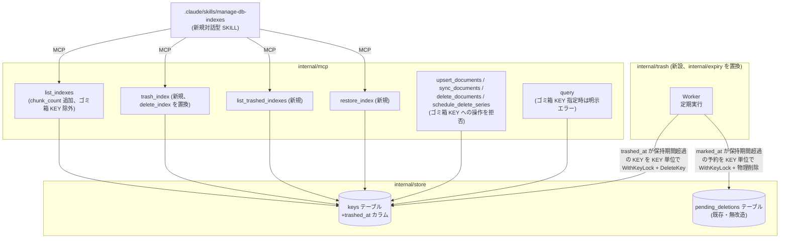
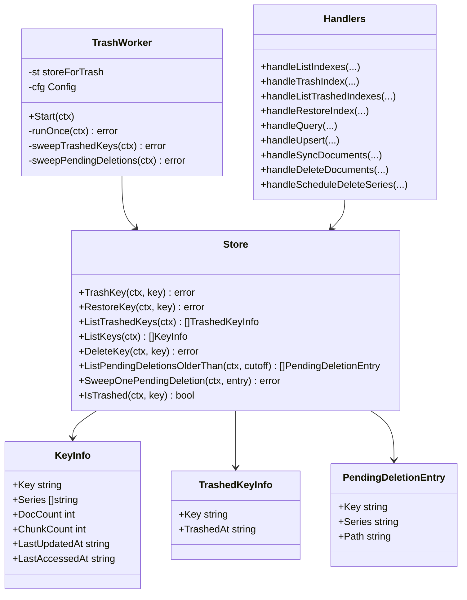
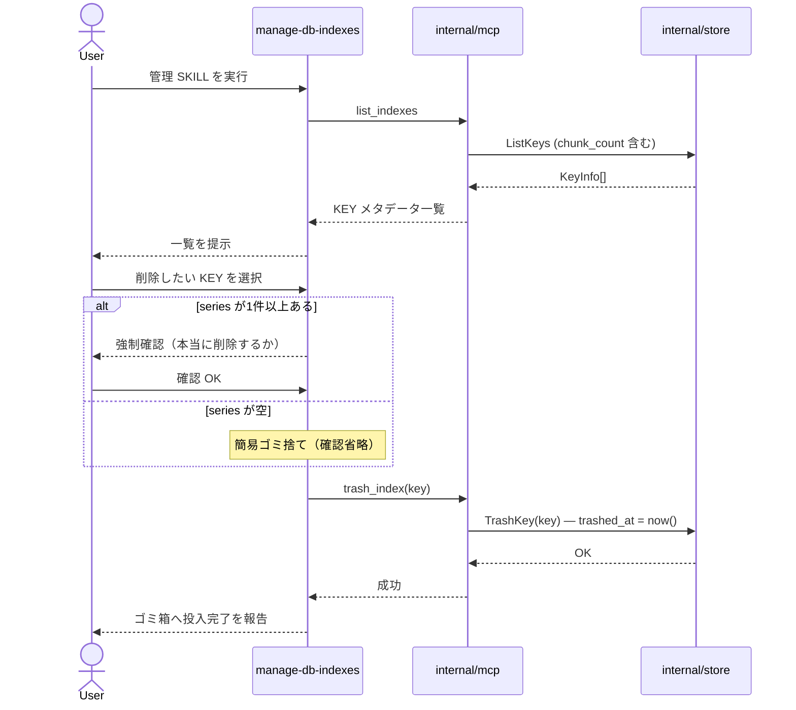
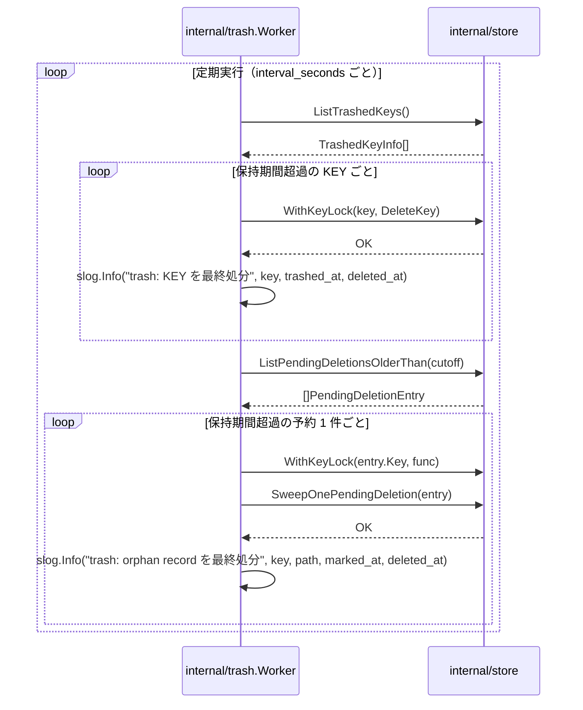
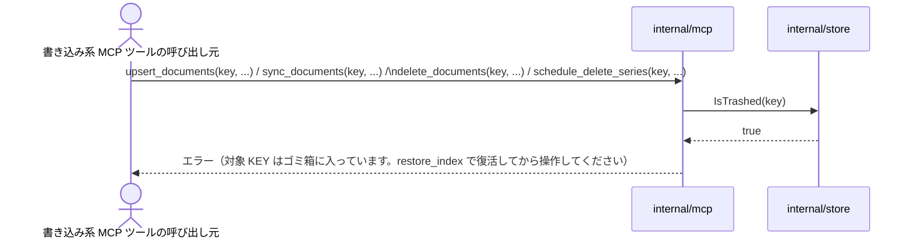
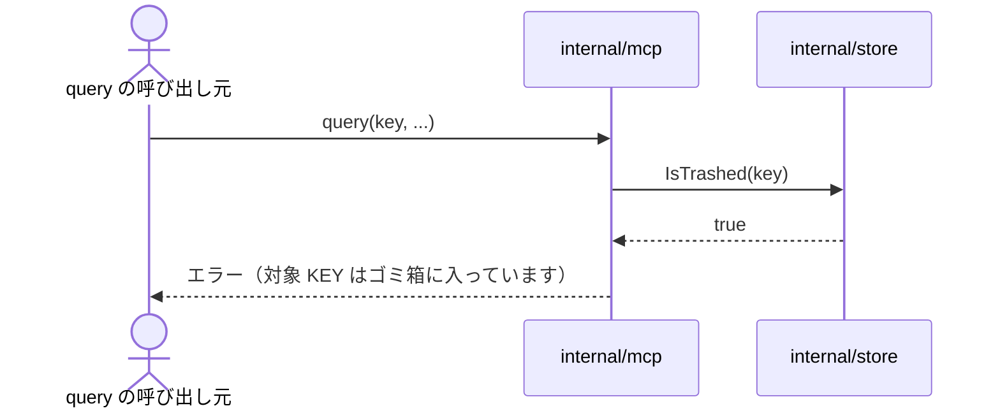

# DES-003 KEY 削除の可視化・ユーザー主導化 設計書

## メタデータ

| 項目     | 値               |
| -------- | ---------------- |
| 設計ID   | DES-003          |
| 関連要件 | FNC-007〜FNC-013 |
| 作成日   | 2026-07-08       |

## 1. 概要

既存の TTL/LRU 自動削除ワーカー（`internal/expiry`）を廃止し、KEY ごとの正確なメタデータ提示（`list_indexes` の拡充）とユーザー主導の削除操作（新規 SKILL `manage-db-indexes`）に置き換える。削除は即座に物理実行せず、`keys` テーブルに投入日時を記録する「ゴミ箱」状態を経由させ、新設のバックグラウンドワーカー（`internal/trash`）が設定期間経過後にのみ物理削除する。既存の `pending_deletions`（orphan record・series 全体予約）の仕組みは、処理契機を「起動時のみ」から「定期実行」に変更した上でそのまま再利用する。

## 2. アーキテクチャ概要



**廃止**: `internal/expiry`（TTL/LRU 自動削除ワーカー）、`manage_index` MCP ツール、`SetExpiryPolicy` / `ListExpiredKeysByTTL` / `ListKeysByLRU` の TTL/LRU 専用ロジック、**`delete_index` MCP ツール（`trash_index` に置換。即時物理削除の経路を残さないため）**。

**設計判断（レビュー反映）**: `delete_index` を「既存のまま維持」としていた当初案は、ADR-003 の「削除は必ずゴミ箱を経由する」という決定と矛盾していた（レビュー指摘）。KEY の削除経路を `trash_index` に一本化し、即時物理削除の抜け道を無くす。

**設計判断**: KEY 単位ゴミ箱の状態は `keys.trashed_at`（新設カラム、NULL 許容）で表現する。record 単位ゴミ箱（orphan）は既存の `pending_deletions` をそのまま流用する。

検討した代替案:

| 案        | 内容                                                                             | 不採用理由                                                                                                                                                                                                       |
| --------- | -------------------------------------------------------------------------------- | ---------------------------------------------------------------------------------------------------------------------------------------------------------------------------------------------------------------- |
| A（採用） | `keys.trashed_at` 新設カラム + 既存 `pending_deletions` の処理契機を定期実行化   | 既存構造への影響が最小。KEY 単位と record 単位で異なるライフサイクル（前者はユーザー操作起点、後者はシステム起点）を素直に表現できる                                                                             |
| B         | KEY 単位ゴミ箱も `pending_deletions`（`path=''` の series 全体予約と同型）に統合 | `pending_deletions` は「series 単位の削除予約」を表す設計であり、「KEY 全体を series は保持したままゴミ箱に入れる」操作とは意味が異なる。統合すると既存の GC-01（series 全体予約）とのセマンティクス混同が生じる |
| C         | 新規 `trash` テーブルで KEY・record 両方を一元管理                               | `pending_deletions` と役割が重複し、削除予約の管理箇所が二重化する                                                                                                                                               |

## 3. モジュール設計

### 3.1 モジュール一覧

| モジュール名                               | 責務                                                                                                                                                                                                                                                                                             | 依存                       |
| ------------------------------------------ | ------------------------------------------------------------------------------------------------------------------------------------------------------------------------------------------------------------------------------------------------------------------------------------------------ | -------------------------- |
| `internal/store`（既存拡張）               | `keys.trashed_at` の読み書き、chunk 数を含む KEY メタデータ取得                                                                                                                                                                                                                                  | なし（最下層）             |
| `internal/trash`（新設）                   | ゴミ箱投入から保持期間を超えた KEY・record を定期的に物理削除。監査ログ出力                                                                                                                                                                                                                      | `internal/store`           |
| `internal/mcp`（既存拡張）                 | `list_indexes` 拡充・ゴミ箱 KEY 除外、`trash_index`（`delete_index` を置換）/ `list_trashed_indexes` / `restore_index` 新設、`manage_index` 廃止、`query` はゴミ箱 KEY 指定時に明示エラー、`upsert_documents`/`sync_documents`/`delete_documents`/`schedule_delete_series` のゴミ箱 KEY 操作拒否 | `internal/store`           |
| `.claude/skills/manage-db-indexes`（新設） | KEY メタデータ・ゴミ箱一覧の提示、削除・復活操作の対話フロー                                                                                                                                                                                                                                     | `internal/mcp`（MCP 経由） |
| `cmd/docdb`（既存修正）                    | `internal/expiry.Worker` の起動を `internal/trash.Worker` に置換                                                                                                                                                                                                                                 | `internal/trash`           |

### 3.2 クラス図



**設計判断（レビュー反映）**: 既存 `SweepPendingDeletions`（1回の呼び出しで複数 KEY にまたがる全予約行をロック無しで一括処理）は、DES-001 §4.3 の「呼び出し元がメソッド呼び出し全体を 1 回の `WithKeyLock` で囲む」という規約と両立しない（1つのロックで複数 KEY を跨げないため）。`ListPendingDeletionsOlderThan`（読み取り専用、cutoff 絞り込み）と `SweepOnePendingDeletion`（1 件＝1 KEY 分の物理削除）に分割し、呼び出し元（`internal/trash.Worker` および `cmd/docdb/main.go` の起動時スイープ）が予約 1 件ごとに `WithKeyLock` で囲んで呼び出す。`IsTrashed` は `query` の明示エラー判定、および `upsert_documents`/`sync_documents`/`delete_documents`/`schedule_delete_series` の書き込み系操作拒否判定に使う。

**設計判断（レビュー反映・層分離）**: `TrashedKeyInfo` は当初 `RemainingSeconds`（自動最終処分までの残り秒数）を持つ設計だったが、これを計算するには `trashed_at` に加えて保持期間の設定値（`trash.retention_days`）が必要であり、`internal/store` は設定値を知らない（レビュー指摘）。`internal/store` の責務は `trashed_at` という事実を返すことに限定し、残り時間の計算は設定にアクセスできる呼び出し元（`handleListTrashedIndexes` および `internal/trash.Worker`）が `trashed_at` と `retention_days` から算出する。これにより「Store 層は判定を持たず事実のみを返す」という本 feature 全体の設計方針（ADR-003）とも一貫する。

## 4. ユースケース設計

### 4.1 ユースケース一覧

| ユースケース                          | 説明                                                                                                                                                             |
| ------------------------------------- | ---------------------------------------------------------------------------------------------------------------------------------------------------------------- |
| UC-1 KEY メタデータの確認             | ユーザーが管理 SKILL 経由で全 KEY（ゴミ箱状態を除く）の chunk 数・doc 数・series・最終アクセス日時を確認する                                                     |
| UC-2 KEY のゴミ箱投入                 | ユーザーが削除したい KEY を選択し、series の有無に応じた確認フローを経て `trash_index` を呼ぶ                                                                    |
| UC-3 ゴミ箱一覧の確認                 | ユーザーが管理 SKILL 経由でゴミ箱内 KEY と自動処分までの残り時間を確認する                                                                                       |
| UC-4 KEY の復活                       | ユーザーがゴミ箱内 KEY を選択し `restore_index` で Active 状態に戻す                                                                                             |
| UC-5 自動最終処分（KEY）              | `internal/trash.Worker` が `trashed_at` 超過 KEY を KEY 単位で `WithKeyLock` + `DeleteKey` する                                                                  |
| UC-6 自動最終処分（orphan record）    | `internal/trash.Worker` が `pending_deletions` の保持期間超過エントリを KEY 単位で `WithKeyLock` + 物理削除する                                                  |
| UC-7 ゴミ箱 KEY への操作拒否          | ゴミ箱状態の KEY に `upsert_documents` / `sync_documents` / `delete_documents` / `schedule_delete_series` が呼ばれた場合、操作を拒否し復活操作を促すエラーを返す |
| UC-8 ゴミ箱 KEY への query 明示エラー | ゴミ箱状態の KEY を指定して `query` が呼ばれた場合、検索を実行せず対象 KEY がゴミ箱に入っている旨の明示エラーを返す                                              |

### 4.2 シーケンス図（UC-2: KEY のゴミ箱投入）



**前提条件**: 対象 KEY が存在し、まだゴミ箱に入っていない（`trashed_at IS NULL`）こと。
**正常フロー**: 上図の通り。
**エラーフロー**: 対象 KEY が既にゴミ箱に入っている場合は `trash_index` がエラーを返す（多重投入防止）。存在しない KEY を指定した場合もエラーを返す。

### 4.3 シーケンス図（UC-5/UC-6: 自動最終処分）



**前提条件**: なし（バックグラウンド定期実行）。
**正常フロー**: 上図の通り。
**エラーフロー**: 個別 KEY・record の削除失敗はログに記録し処理を継続する（silent failure 禁止。既存 `internal/expiry` の個別エラー継続パターンを踏襲）。

**監査記録の永続化方針（レビュー反映）**: 自動最終処分の記録は `slog.Info` によるログ出力のみとし、DB への監査テーブル（`trash_audit` 相当）は設けない。本プロジェクトは単一ユーザー運用のログファイルで事後追跡が成立する規模であり、監査テーブルを追加する運用・実装コストに見合わないと判断した（レビューで論点になった箇所）。ログローテーション・削除によって記録が失われるリスクは残るが、許容する。

**`SweepPendingDeletions` の分割（レビュー反映）**: 既存実装は `pending_deletions` の全行を、KEY をまたいでロック無しで無条件に処理する 1 メソッドである（`SELECT key, series, path FROM pending_deletions` に絞り込みが無い）。これを定期実行に転用する場合、次の 2 点で既存規約と両立しない:

1. **猶予期間の絞り込みが無い**: 起動時スイープ（GC-02、1回限りの実行）を前提にした設計であり、定期実行にそのまま転用すると猶予期間中の予約まで即座に処理してしまい FNC-013 の猶予期間要件に反する
2. **ロック粒度がメソッド内に隠れている**: DES-001 §4.3 は「呼び出し元がメソッド呼び出し**全体**を 1 回の `WithKeyLock` で囲む」ことを要求するが、複数 KEY にまたがる行を 1 メソッドで処理する既存構造では、呼び出し元が 1 つの `WithKeyLock` で全体を囲むことができない（KEY ごとにロック対象が異なるため）

そこで `SweepPendingDeletions` を以下の 2 メソッドに分割する:

- `ListPendingDeletionsOlderThan(ctx, cutoff time.Time) ([]PendingDeletionEntry, error)`: `marked_at < cutoff` の予約一覧を返す読み取り専用メソッド（ロック不要）
- `SweepOnePendingDeletion(ctx, entry PendingDeletionEntry) error`: 1 件（1 KEY 分）の予約を物理削除し、予約を解除する

呼び出し元（`internal/trash.Worker` および `cmd/docdb/main.go` の起動時スイープ）が `ListPendingDeletionsOlderThan` で一覧を取得した後、エントリ 1 件ごとに `WithKeyLock(entry.Key, ...)` で囲んで `SweepOnePendingDeletion` を呼ぶ。これにより DES-001 §4.3 の「呼び出し元が対象 KEY への Store 呼び出し一式を 1 回の `WithKeyLock` で囲む」という規約と両立する（1 呼び出し = 1 KEY 分の処理単位になるため）。既存の起動時スイープも同じ分割 API に置き換える（起動時であっても猶予期間中の予約は処理しない）。

### 4.4 シーケンス図（UC-7: ゴミ箱 KEY への操作拒否）



**前提条件**: なし。
**正常フロー**: `IsTrashed` が false の場合は各ツールの既存処理をそのまま実行する。
**エラーフロー**: 上図の通り。4 ツールいずれも処理を一切実行せず、`trashed_at` も変更しない（黙って復活させない。復活は FNC-011 のユーザー明示操作のみで行う）。

**設計判断（レビュー反映・第2回）**: 初版は `upsert_documents`/`sync_documents` のみを拒否対象としていたが、`delete_documents`（series 単位削除）・`schedule_delete_series`（series 全体削除予約）もゴミ箱状態の KEY のデータを変更できてしまうと、復活後の内容がユーザーの想定とずれる（レビュー指摘）。ゴミ箱状態の KEY は復活するまでのあいだ、種類を問わずすべての書き込み系操作を拒否する方針に統一する。

**設計判断（レビュー反映）**: 既存の `UpsertRecord` の `ON CONFLICT(key) DO UPDATE SET` は `trashed_at` を更新対象に含めていないため、対策なしにゴミ箱 KEY へ upsert すると、データは書き込まれるのに `trashed_at` が残ったまま＝`query` から検索できない状態になり得る（レビュー指摘）。書き込み自体を拒否することで、この不整合を構造的に防ぐ。

### 4.5 シーケンス図（UC-8: ゴミ箱 KEY への query 明示エラー）



**前提条件**: なし。
**正常フロー**: `IsTrashed` が false の場合は既存の検索処理をそのまま実行する。
**エラーフロー**: 上図の通り。検索は一切実行しない。

**設計判断（レビュー反映）**: 初版は「検索結果から除外する」とだけ定めていたが、`query` は KEY 指定必須の API であるため、「除外」の具体的な意味（空結果を返すのか、KEY not found 扱いにするのか）が曖昧だった（レビュー指摘）。空結果では「対象データが本当に無いのか、KEY がゴミ箱に入っているのか」をユーザーが区別できないため、明示エラーを返す方式に統一する。

## 5. 使用する既存コンポーネント

| コンポーネント                                                                                                                | ファイルパス                       | 用途                                                                                                                                                                                                                                                                             |
| ----------------------------------------------------------------------------------------------------------------------------- | ---------------------------------- | -------------------------------------------------------------------------------------------------------------------------------------------------------------------------------------------------------------------------------------------------------------------------------- |
| `KeyInfo` 型・`ListKeys`                                                                                                      | `internal/store/store.go`          | `ChunkCount` フィールドを追加し拡張。`ListKeysByLRU` の chunk 数集計 SQL をマージする                                                                                                                                                                                            |
| `DeleteKey`                                                                                                                   | `internal/store/store.go`          | 自動最終処分（KEY 単位）でそのまま再利用                                                                                                                                                                                                                                         |
| `pending_deletions` 一式（`MarkSeriesForDeletion` / `ListPendingDeletions` / `DeleteOrphanRecords` / `ClearPendingDeletion`） | `internal/store/pending.go`        | orphan record のゴミ箱管理・自動処分でそのまま再利用。呼び出し契機のみ「起動時」から「定期実行」に変更                                                                                                                                                                           |
| `SweepPendingDeletions`                                                                                                       | `internal/store/pending.go`        | 廃止し `ListPendingDeletionsOlderThan` + `SweepOnePendingDeletion` に分割する（既存は KEY をまたいだ全件無条件処理のため、cutoff 絞り込みと呼び出し元 `WithKeyLock` の両立に変更が必要）。既存の起動時スイープ（`cmd/docdb/main.go` の `startupSweep`）もこの新 API に置き換える |
| `WithKeyLock`                                                                                                                 | `internal/store/store.go`          | `trash_index` / `restore_index` / 自動処分の KEY 単位排他にそのまま再利用（既存 SYN-08 と同一パターン）                                                                                                                                                                          |
| `Worker` の定期実行パターン（`Start`, `runOnce`, `Stats`, `KeyDeleteError`）                                                  | `internal/expiry/expiry.go`        | `internal/trash.Worker` の実装土台として構造を踏襲（TTL/LRU 判定ロジックは使わない）                                                                                                                                                                                             |
| `handleListIndexes`                                                                                                           | `internal/mcp/mcp.go`              | chunk_count 追加で拡張し、ゴミ箱状態の KEY を結果から除外する                                                                                                                                                                                                                    |
| `handleDeleteIndex` / `DeleteKey` 呼び出し                                                                                    | `internal/mcp/mcp.go`              | `handleDeleteIndex`（`delete_index` ツール）は廃止し、`trash_index`（`TrashKey` を呼ぶ）に置き換える。`DeleteKey` 自体は自動最終処分から引き続き呼ばれる                                                                                                                         |
| `handleScheduleDeleteSeries`                                                                                                  | `internal/mcp/schedule.go`         | 「即時削除せず予約する」ハンドラ実装パターンを `trash_index` / `restore_index` の参考にする。処理開始前に `IsTrashed(key)` を確認し、true ならゴミ箱操作拒否エラーを返す                                                                                                         |
| `handleDeleteDocuments`                                                                                                       | `internal/mcp/mcp.go`              | 処理開始前に `IsTrashed(key)` を確認し、true ならゴミ箱操作拒否エラーを返す                                                                                                                                                                                                      |
| `.claude/skills/delete-db-series/`（SKILL.md, `scripts/docdb_client.py`, `scripts/resolve_docs.py`）                          | `.claude/skills/delete-db-series/` | 新規 SKILL `manage-db-indexes` の雛形（frontmatter 構成、MCP HTTP 直叩き方式、Step 構成）として再利用                                                                                                                                                                            |

## 6. マイグレーション

**DB スキーマ**: 既存の `initSchema` は `CREATE TABLE IF NOT EXISTS` のみで、既存テーブルへのカラム追加を行わない。起動時に `PRAGMA table_info(keys)` で `trashed_at` 列の有無を確認し、無ければ `ALTER TABLE keys ADD COLUMN trashed_at TEXT` を実行してから起動を継続する。

**設定ファイル（`doc-db.yaml`）**: `expiry:` セクションの削除に伴う既存設定ファイルとの後方互換性は考慮しない（レビューで論点になったが、本プロジェクトは単一ユーザー運用のため、利用者自身が `doc-db.yaml` から `expiry:` セクションを手動で削除する前提とする）。`KnownFields(true)`（CFG-03）により、`expiry:` セクションが残ったままの設定ファイルでは起動時にエラーになる。この点は CHANGELOG に明記する。

`expiry:` セクションは以下の `trash:` セクションに置き換える（キー名はレビューで確定）:

```yaml
trash:
  retention_days: 3 # ゴミ箱投入から自動最終処分までの保持日数
  interval_seconds: 3600 # internal/trash.Worker のチェック間隔
```

`internal/config.Config` の `ExpiryConfig` を `TrashConfig{RetentionDays int, IntervalSeconds int}` に置き換える。

## 7. テスト設計

- **単体テスト対象**:
  - `internal/store`: `TrashKey` / `RestoreKey` / `ListTrashedKeys` の正常系・多重投入エラー・存在しない KEY のエラー
  - `internal/store`: `ListPendingDeletionsOlderThan` の cutoff 絞り込み（猶予期間内は返さない・超過分のみ返す）、`SweepOnePendingDeletion` の単発処理
  - `internal/store`: `IsTrashed` の正常系
  - `internal/trash`: `runOnce` が保持期間超過分のみを処理し、未超過分に触れないこと。個別エラー時の継続動作（既存 `expiry` の回帰テストパターンを踏襲）
  - `internal/mcp`: `trash_index` 実行後に `query` が当該 KEY に対して明示エラーを返すこと（空結果ではないこと）
  - `internal/mcp`: ゴミ箱状態の KEY に対する `upsert_documents` / `sync_documents` / `delete_documents` / `schedule_delete_series` が拒否され、`trashed_at` が変化しないこと
  - `internal/store`: 起動時マイグレーション（`trashed_at` カラムが存在しない DB に対して `ALTER TABLE` が実行されること）
- **統合テスト対象**:
  - UC-2〜UC-8 のフロー全体（ゴミ箱投入 → 一覧確認 → 復活 → 復活後の再ゴミ箱投入 → 保持期間経過後の自動処分 → ゴミ箱状態への操作拒否 → ゴミ箱状態への query 明示エラー）
  - `manage_index` / `delete_index` ツール削除後、既存の `ManageIndexInput` / `DeleteIndexInput` 系テストが残っていないことの確認（デッドコード検出）
  - 既存 DIF-02 不変条件テスト 3 件（`TestAppendAndCleanSeries_DIF02` 等）が本変更後も green であること
