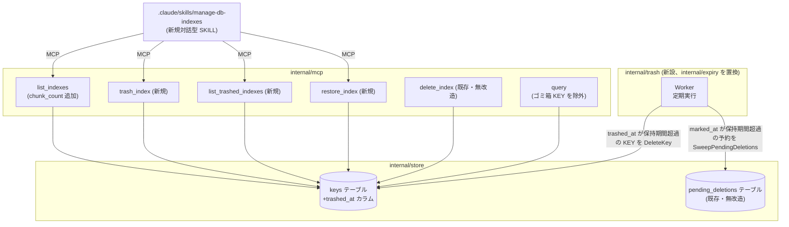
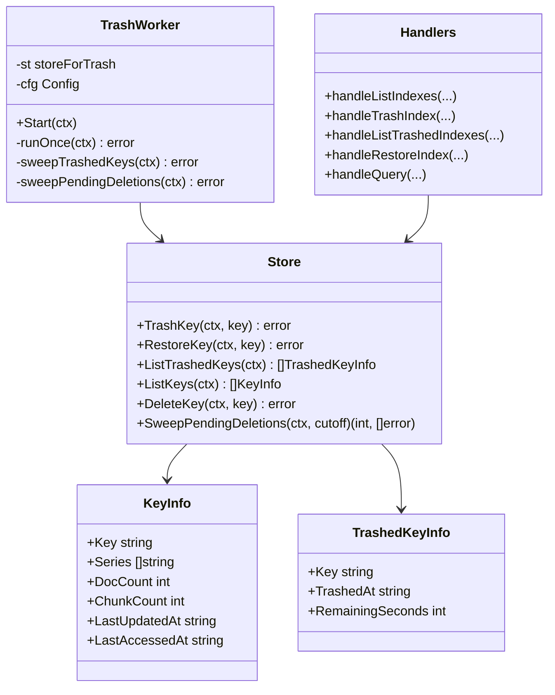
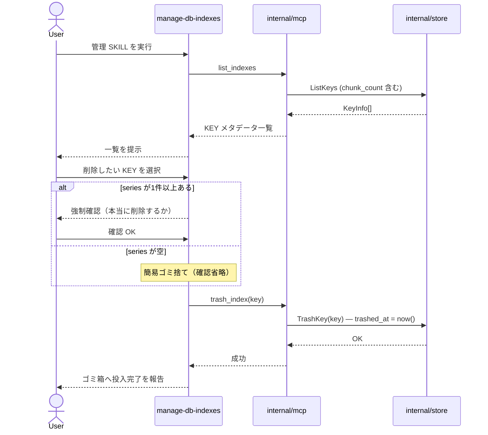
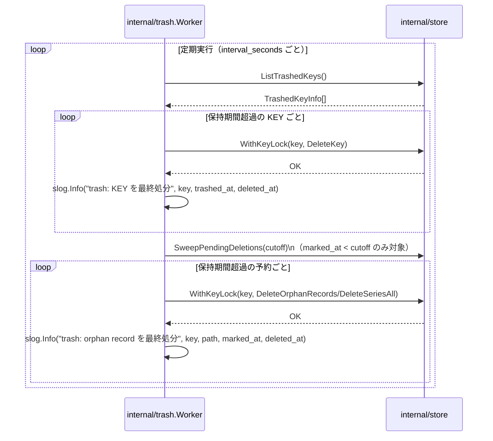

# DES-003 KEY 削除の可視化・ユーザー主導化 設計書

## メタデータ

| 項目     | 値               |
| -------- | ---------------- |
| 設計ID   | DES-003          |
| 関連要件 | FNC-007〜FNC-013 |
| 作成日   | 2026-07-08       |

## 1. 概要

既存の TTL/LRU 自動削除ワーカー（`internal/expiry`）を廃止し、KEY ごとの正確なメタデータ提示（`list_indexes` の拡充）とユーザー主導の削除操作（新規 SKILL `manage-db-indexes`）に置き換える。削除は即座に物理実行せず、`keys` テーブルに投入日時を記録する「ゴミ箱」状態を経由させ、新設のバックグラウンドワーカー（`internal/trash`）が設定期間経過後にのみ物理削除する。既存の `pending_deletions`（orphan record・series 全体予約）の仕組みは、処理契機を「起動時のみ」から「定期実行」に変更した上でそのまま再利用する。

## 2. アーキテクチャ概要

**廃止**: `internal/expiry`（TTL/LRU 自動削除ワーカー）、`manage_index` MCP ツール、`SetExpiryPolicy` / `ListExpiredKeysByTTL` / `ListKeysByLRU` の TTL/LRU 専用ロジック。

**設計判断**: KEY 単位ゴミ箱の状態は `keys.trashed_at`（新設カラム、NULL 許容）で表現する。record 単位ゴミ箱（orphan）は既存の `pending_deletions` をそのまま流用する。

検討した代替案:

| 案        | 内容                                                                             | 不採用理由                                                                                                                                                                                                       |
| --------- | -------------------------------------------------------------------------------- | ---------------------------------------------------------------------------------------------------------------------------------------------------------------------------------------------------------------- |
| A（採用） | `keys.trashed_at` 新設カラム + 既存 `pending_deletions` の処理契機を定期実行化   | 既存構造への影響が最小。KEY 単位と record 単位で異なるライフサイクル（前者はユーザー操作起点、後者はシステム起点）を素直に表現できる                                                                             |
| B         | KEY 単位ゴミ箱も `pending_deletions`（`path=''` の series 全体予約と同型）に統合 | `pending_deletions` は「series 単位の削除予約」を表す設計であり、「KEY 全体を series は保持したままゴミ箱に入れる」操作とは意味が異なる。統合すると既存の GC-01（series 全体予約）とのセマンティクス混同が生じる |
| C         | 新規 `trash` テーブルで KEY・record 両方を一元管理                               | `pending_deletions` と役割が重複し、削除予約の管理箇所が二重化する                                                                                                                                               |

## 3. モジュール設計

### 3.1 モジュール一覧

| モジュール名                               | 責務                                                                                                                          | 依存                       |
| ------------------------------------------ | ----------------------------------------------------------------------------------------------------------------------------- | -------------------------- |
| `internal/store`（既存拡張）               | `keys.trashed_at` の読み書き、chunk 数を含む KEY メタデータ取得                                                               | なし（最下層）             |
| `internal/trash`（新設）                   | ゴミ箱投入から保持期間を超えた KEY・record を定期的に物理削除。監査ログ出力                                                   | `internal/store`           |
| `internal/mcp`（既存拡張）                 | `list_indexes` 拡充、`trash_index` / `list_trashed_indexes` / `restore_index` 新設、`manage_index` 廃止、`query` のゴミ箱除外 | `internal/store`           |
| `.claude/skills/manage-db-indexes`（新設） | KEY メタデータ・ゴミ箱一覧の提示、削除・復活操作の対話フロー                                                                  | `internal/mcp`（MCP 経由） |
| `cmd/docdb`（既存修正）                    | `internal/expiry.Worker` の起動を `internal/trash.Worker` に置換                                                              | `internal/trash`           |

### 3.2 クラス図

## 4. ユースケース設計

### 4.1 ユースケース一覧

| ユースケース                       | 説明                                                                                                           |
| ---------------------------------- | -------------------------------------------------------------------------------------------------------------- |
| UC-1 KEY メタデータの確認          | ユーザーが管理 SKILL 経由で全 KEY の chunk 数・doc 数・series・最終アクセス日時を確認する                      |
| UC-2 KEY のゴミ箱投入              | ユーザーが削除したい KEY を選択し、series の有無に応じた確認フローを経て `trash_index` を呼ぶ                  |
| UC-3 ゴミ箱一覧の確認              | ユーザーが管理 SKILL 経由でゴミ箱内 KEY と自動処分までの残り時間を確認する                                     |
| UC-4 KEY の復活                    | ユーザーがゴミ箱内 KEY を選択し `restore_index` で Active 状態に戻す                                           |
| UC-5 自動最終処分（KEY）           | `internal/trash.Worker` が `trashed_at` 超過 KEY を定期的に `DeleteKey` する                                   |
| UC-6 自動最終処分（orphan record） | `internal/trash.Worker` が `pending_deletions` の保持期間超過エントリを `SweepPendingDeletions` 相当で処理する |

### 4.2 シーケンス図（UC-2: KEY のゴミ箱投入）

**前提条件**: 対象 KEY が存在し、まだゴミ箱に入っていない（`trashed_at IS NULL`）こと。
**正常フロー**: 上図の通り。
**エラーフロー**: 対象 KEY が既にゴミ箱に入っている場合は `trash_index` がエラーを返す（多重投入防止）。存在しない KEY を指定した場合もエラーを返す。

### 4.3 シーケンス図（UC-5/UC-6: 自動最終処分）

**前提条件**: なし（バックグラウンド定期実行）。
**正常フロー**: 上図の通り。
**エラーフロー**: 個別 KEY・record の削除失敗はログに記録し処理を継続する（silent failure 禁止。既存 `internal/expiry` の個別エラー継続パターンを踏襲）。

**`SweepPendingDeletions` の変更点**: 既存実装は `pending_deletions` の全行を無条件に処理する（`SELECT key, series, path FROM pending_deletions` に絞り込みが無い）。これは起動時スイープ（GC-02、1回限りの実行）を前提にした設計であり、定期実行に転用すると猶予期間中の予約まで即座に処理してしまい FNC-013 の猶予期間要件に反する。`marked_at` が cutoff（現在時刻 - 保持期間）より前の行のみを対象にする絞り込みを追加する。既存の起動時スイープ（`cmd/docdb/main.go` の `startupSweep`）も同じ cutoff 付きシグネチャに合わせて呼び出しを変更する（起動時であっても猶予期間中の予約は処理しない）。

**`WithKeyLock` の適用**: `pending_deletions` の物理削除（`DeleteOrphanRecords` / `DeleteSeriesAll`）は対象 KEY への他の書き込み系操作と排他する必要がある（DES-001 §4.3 SYN-08 の対象に本ワーカーも含める）。既存の `internal/expiry` の TTL/LRU 削除・起動時スイープと同じく、`WithKeyLock` で対象 KEY ごとに囲んで呼び出す。

## 5. 使用する既存コンポーネント

| コンポーネント                                                                                                                | ファイルパス                       | 用途                                                                                                                                                                                                                                                                    |
| ----------------------------------------------------------------------------------------------------------------------------- | ---------------------------------- | ----------------------------------------------------------------------------------------------------------------------------------------------------------------------------------------------------------------------------------------------------------------------- |
| `KeyInfo` 型・`ListKeys`                                                                                                      | `internal/store/store.go`          | `ChunkCount` フィールドを追加し拡張。`ListKeysByLRU` の chunk 数集計 SQL をマージする                                                                                                                                                                                   |
| `DeleteKey`                                                                                                                   | `internal/store/store.go`          | 自動最終処分（KEY 単位）でそのまま再利用                                                                                                                                                                                                                                |
| `pending_deletions` 一式（`MarkSeriesForDeletion` / `ListPendingDeletions` / `DeleteOrphanRecords` / `ClearPendingDeletion`） | `internal/store/pending.go`        | orphan record のゴミ箱管理・自動処分でそのまま再利用。呼び出し契機のみ「起動時」から「定期実行」に変更                                                                                                                                                                  |
| `SweepPendingDeletions`                                                                                                       | `internal/store/pending.go`        | シグネチャに `cutoff time.Time` を追加し、`marked_at < cutoff` の行のみ対象にする（既存は全件無条件処理のため FNC-013 の猶予期間要件に合わせて変更が必要）。既存の起動時スイープ（`cmd/docdb/main.go` の `startupSweep`）もこの新シグネチャに合わせて呼び出しを変更する |
| `WithKeyLock`                                                                                                                 | `internal/store/store.go`          | `trash_index` / `restore_index` / 自動処分の KEY 単位排他にそのまま再利用（既存 SYN-08 と同一パターン）                                                                                                                                                                 |
| `Worker` の定期実行パターン（`Start`, `runOnce`, `Stats`, `KeyDeleteError`）                                                  | `internal/expiry/expiry.go`        | `internal/trash.Worker` の実装土台として構造を踏襲（TTL/LRU 判定ロジックは使わない）                                                                                                                                                                                    |
| `handleListIndexes` / `handleDeleteIndex`                                                                                     | `internal/mcp/mcp.go`              | `handleListIndexes` は chunk_count 追加で拡張。`handleDeleteIndex` は無改造で維持（前提条件により既存機能として存続）                                                                                                                                                   |
| `handleScheduleDeleteSeries`                                                                                                  | `internal/mcp/schedule.go`         | 「即時削除せず予約する」ハンドラ実装パターンを `trash_index` / `restore_index` の参考にする                                                                                                                                                                             |
| `.claude/skills/delete-db-series/`（SKILL.md, `scripts/docdb_client.py`, `scripts/resolve_docs.py`）                          | `.claude/skills/delete-db-series/` | 新規 SKILL `manage-db-indexes` の雛形（frontmatter 構成、MCP HTTP 直叩き方式、Step 構成）として再利用                                                                                                                                                                   |

## 6. テスト設計

- **単体テスト対象**:
  - `internal/store`: `TrashKey` / `RestoreKey` / `ListTrashedKeys` の正常系・多重投入エラー・存在しない KEY のエラー
  - `internal/trash`: `runOnce` が保持期間超過分のみを処理し、未超過分に触れないこと。個別エラー時の継続動作（既存 `expiry` の回帰テストパターンを踏襲）
  - `internal/mcp`: `trash_index` 実行後に `query` の検索結果から当該 KEY が除外されること
- **統合テスト対象**:
  - UC-2〜UC-5 のフロー全体（ゴミ箱投入 → 一覧確認 → 復活 → 復活後の再ゴミ箱投入 → 保持期間経過後の自動処分）
  - `manage_index` ツール削除後、既存の `ManageIndexInput` 系テストが残っていないことの確認（デッドコード検出）
  - 既存 DIF-02 不変条件テスト 3 件（`TestAppendAndCleanSeries_DIF02` 等）が本変更後も green であること
