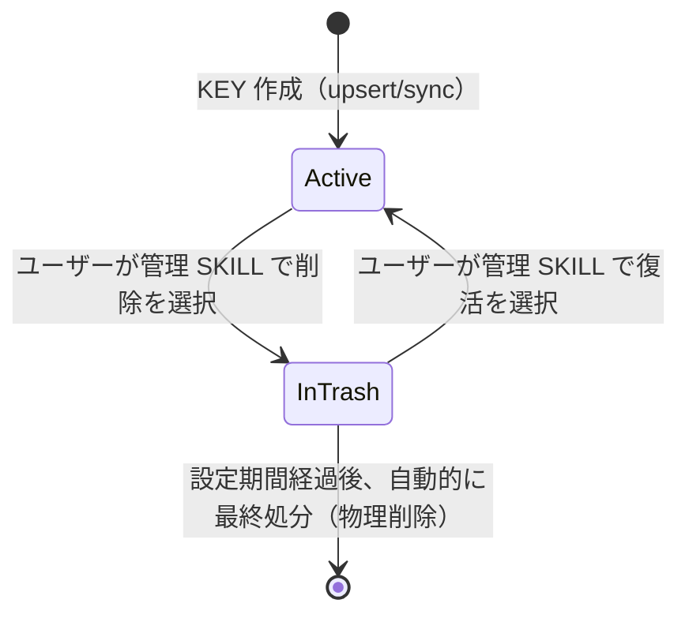

# FNC-007〜FNC-013 KEY 削除の可視化・ユーザー主導化 要件定義書

## 概要

doc-db は「削除すべきかどうかの判定」を一切行わず、KEY ごとの正確な情報（データ量・最終アクセス日時等）をユーザーの近辺まで届けることに徹する。削除の要否判断と実行は、その情報を見た人間・AI エージェントに委ねる。既存の TTL/LRU 自動削除（EXP-01/EXP-02）は、投入直後で唯一の KEY を無警告のまま削除する事故を実運用で起こしたため、本要件で置き換える。

## 前提条件

- 既存の `list_indexes` / `delete_index` / `schedule_delete_series` / `sync_documents` の機能はそのまま存在する
- 本要件が対象とするのは、KEY ごとのメタデータ提示・削除実行のユーザー主導化のみ

## 用語

| 用語           | 定義                                                                                                                                    |
| -------------- | --------------------------------------------------------------------------------------------------------------------------------------- |
| KEY メタデータ | KEY ごとの chunk 数・doc 数・series 一覧・最終更新日時・最終アクセス日時。削除要否の判定フラグを含まない事実情報                        |
| ゴミ箱         | 削除対象になったデータ（KEY 単位または record 単位）が、実データ（record・chunk・embedding）を保持したまま置かれる状態                  |
| 自動最終処分   | ゴミ箱投入から設定期間経過後、対象データ（KEY または record）を自動的に物理削除すること                                                 |
| 復活           | ゴミ箱内のデータを、自動最終処分前に元の利用可能な状態へ戻す操作。KEY 単位はユーザー操作、record 単位（orphan）はシステム自動で行われる |
| 管理 SKILL     | 本要件で新設する対話型 SKILL（`manage-db-indexes`）。KEY メタデータ・ゴミ箱一覧の提示と、削除・復活の実行を担う                         |
| orphan record  | 既存の `sync_documents` の処理で、どの series からも参照されなくなった record（KEY 全体ではなく個別ドキュメント単位のゴミ箱エントリ）   |

## KEY のライフサイクル

KEY は通常「利用可能（Active）」状態にあり、システムが自動判定して KEY をゴミ箱に入れることはない。ゴミ箱投入は常にユーザーの明示的な操作によってのみ発生する。

## 要件一覧

### FNC-007 TTL/LRU 自動削除の廃止

- 既存の TTL（最終アクセスからの経過時間による自動削除）・LRU（容量超過時の自動削除）は廃止する
- doc-db は「削除すべきかどうか」の判定を一切行わない
- TTL/LRU の KEY 単位オーバーライド機能（既存の `manage_index` ツール）も、TTL/LRU 自体の廃止に伴い併せて廃止する。KEY ごとに保持できる廃棄関連の個別設定は無くなる

### FNC-008 KEY メタデータ提供の拡充

- `list_indexes` は、既存の KEY・series 一覧・doc 数・最終更新日時・最終アクセス日時に加え、KEY ごとの chunk 数を返す
- 返す情報は判定フラグを含まない事実情報のみとする（「古い」「大きすぎる」等の判定結果は含めない）

### FNC-009 ゴミ箱投入

- ユーザーは管理 SKILL を通じて、KEY メタデータを見た上で、削除したい KEY を選択できる
- KEY に series が1つ以上ある場合、削除の実行前にユーザーへ確認を行う（強制操作）
- KEY に series が無い場合（`series` が空）、確認を伴わない簡易な操作で削除を選択できる
- 削除を選択した時点では、KEY の実データ（record・chunk・embedding）は物理的に削除されない。ゴミ箱状態に遷移するのみ
- ゴミ箱状態の KEY は `query`（検索）の結果から除外される

### FNC-010 ゴミ箱一覧の提示

- ユーザーは管理 SKILL を通じて、現在ゴミ箱に入っている KEY の一覧を確認できる
- 一覧には、各 KEY がゴミ箱に投入された日時、および自動最終処分までの残り時間を含む
- 本一覧は管理 SKILL の実行時にのみ確認できればよい

### FNC-011 復活

- ユーザーは管理 SKILL を通じて、ゴミ箱内の KEY を自動最終処分前に選択し、利用可能な状態へ戻せる
- 復活した KEY は、ゴミ箱投入前と同じデータ（record・chunk・embedding）がそのまま利用できる

### FNC-012 自動最終処分

- ゴミ箱に投入された KEY は、投入時点から一定期間（デフォルト 3 日）経過後、自動的に物理削除される
- 保持期間は `doc-db.yaml` の設定で変更できる
- 自動最終処分の対象は、ユーザーが明示的にゴミ箱へ投入した KEY のみ。システムが独自に対象を追加することはない
- 自動最終処分を実行したときは、対象 KEY・実行日時を記録として残す。事後に「いつ何を消したか」を追跡できること

### FNC-013 orphan record のゴミ箱統合

- 既存の `sync_documents` の処理でどの series からも参照されなくなった record（orphan record）は、FNC-012 と同じ「ゴミ箱」の猶予期間の定義に従って自動的に物理削除される
- orphan record の物理削除は、サーバーの起動を待たずに実行できる
- orphan record の復活は、同一内容の再 `sync_documents` によってシステムが自動的に行う。ユーザーが管理 SKILL を通じて個別に復活を指示することはない
- orphan record は FNC-010 のゴミ箱一覧には表示しない（ユーザーが操作できる対象ではないため）
- orphan record の自動最終処分を実行したときも、FNC-012 と同様に対象・実行日時を記録として残す

## 未確定事項

なし

## 将来の拡張（今回のスコープ外）

- ブラウザベースの管理 UI（Web 画面で KEY 一覧・削除候補を見て操作する）。今回は管理 SKILL（Claude Code 経由の対話型操作）のみを対象とする
