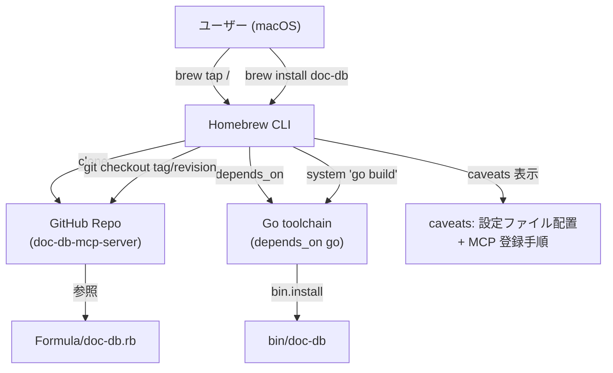
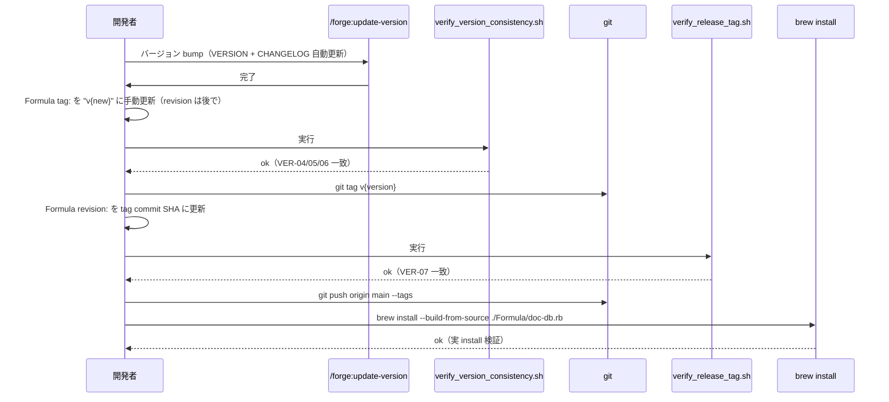

# DES-002 doc-db MCP Server インストール設計書

## メタデータ

| 項目     | 値                                |
| -------- | --------------------------------- |
| 設計ID   | DES-002                           |
| 関連要件 | APP-002                           |
| 作成日   | 2026-06-25                        |

## 1. 概要

doc-db MCP Server を macOS ユーザーが Homebrew で導入できるようにする。リポジトリ自体を Homebrew tap として機能させる「自家 tap」方式を採用する（専用 `homebrew-*` リポジトリを別途用意しない）。Go プロジェクトとしてのシングルバイナリ性質（CGO 不要・pure-Go SQLite）を活かし、Formula 内の `go build` でビルドして `bin/` に配置する。

**Swift-Selena プロジェクトとの差分**: ビルドツール（`swift build` → `go build`）、canonical version の置き場所（`Sources/Constants.swift` → `VERSION` ファイル）、test の方式（MCP `initialize` JSON-RPC → `doc-db --version` スモークテスト）を doc-db 用に変更する。残りの設計（自家 tap・Formula 配置・整合性検証スクリプト 2 本・caveats ガイダンス）は同方針を踏襲する。

## 2. アーキテクチャ概要



### 配布方式の選定根拠

| 方式 | 採用 | 理由 |
|------|------|------|
| 自家 tap（リポジトリ自身を tap） | ✅ | 専用 `homebrew-doc-db` リポジトリの維持コストが不要。Swift-Selena で実績がある |
| 公式 homebrew-core | ❌（スコープ外） | 新規 Formula 提出には popularity 要件などがあり、初期リリース段階では非現実的 |
| 公式以外の自前 tap リポジトリ（`homebrew-doc-db`） | ❌（スコープ外） | 自家 tap で十分。後続要件が現れたら検討 |
| ボトル配布（事前ビルド） | ❌（スコープ外） | 初期段階ではソースビルドで十分。`go build` は数十秒で完了する |

## 3. Formula 設計

### 3.1 ファイル配置

```
Formula/doc-db.rb        # Homebrew Formula 本体
```

### 3.2 Formula スケルトン

```ruby
class DocDb < Formula
  desc "Hybrid search MCP server for Markdown documents"
  homepage "https://github.com/<owner>/doc-db-mcp-server"
  # tag は v{version} 形式で統一（VER-06）。CHANGELOG.md / .version-config.yaml と整合する。
  url "https://github.com/<owner>/doc-db-mcp-server.git",
      tag:      "v0.1.0",
      revision: "<commit SHA of tag v0.1.0>"
  license "MIT"

  depends_on macos: :ventura
  depends_on "go" => :build

  def install
    # VERSION ファイルが canonical（VER-01）。Go embed はパッケージ外を参照できないため、
    # ldflags の -X 経由で main.version を上書きする（VER-02）。
    # `version.to_s` は Formula の url.tag から v prefix を取り除いた値（例: "0.1.0"）。
    system "go", "build",
           "-trimpath",
           "-ldflags", "-s -w -X main.version=#{version}",
           "-o", bin/"doc-db",
           "./cmd/docdb"

    # 設定ファイルサンプルを share/doc-db に配置（GUI-04）。
    # caveats でホームディレクトリへのコピー手順を案内する。
    (share/"doc-db").install "doc-db.yaml.example"
  end

  def caveats
    <<~EOS
      doc-db is installed as `doc-db` and is on your PATH.
      doc-db speaks MCP over Streamable HTTP. You must start the server
      before any MCP client (Claude Code / Desktop) can connect to it.

      1) Prepare the configuration file (required):
           mkdir -p ~/.doc-db
           cp #{share}/doc-db/doc-db.yaml.example ~/.doc-db/doc-db.yaml
           # Edit ~/.doc-db/doc-db.yaml as needed (port, db_path, embedding model, etc.).

      2) Export your OpenAI API key:
           export OPENAI_API_DOCDB_KEY=sk-...

      3) Start the server (foreground; configure launchd or similar for persistence):
           doc-db
           # Listens on the port specified in doc-db.yaml (default 8080).

      4) Register with Claude Code (Streamable HTTP transport):
           # All of your projects (user scope):
           claude mcp add --transport http -s user doc-db http://localhost:8080/mcp
           # This project only (local, default):
           claude mcp add --transport http doc-db http://localhost:8080/mcp

      5) Register with Claude Desktop. Add the following to
         ~/Library/Application Support/Claude/claude_desktop_config.json:

           {
             "mcpServers": {
               "doc-db": {
                 "url": "http://localhost:8080/mcp"
               }
             }
           }

         Then restart the Claude app.

      Full documentation: #{homepage}
    EOS
  end

  test do
    # smoke test: --version must exit immediately with the version string
    # (no config / API key required; see DES-002 §4.2.1).
    output = shell_output("#{bin}/doc-db --version")
    assert_match version.to_s, output
  end
end
```

> Formula の `version.to_s` は `tag:` の値から `v` プレフィックスを取り除いた数値部（Homebrew 仕様）。`tag: "v0.1.0"` のとき `version.to_s == "0.1.0"`。これを ldflags で `main.version` に渡すので、`doc-db --version` の出力は v なし（`0.1.0`）になり、VERSION ファイルの内容と一致する。

### 3.3 Formula の必須記述項目

| 項目 | 値 | 根拠 |
|------|-----|------|
| `desc` | Hybrid search MCP server for Markdown documents | Homebrew Formula 規約 |
| `homepage` | GitHub リポジトリ URL | Homebrew Formula 規約 |
| `url` + `tag` + `revision` | git tag と commit SHA | FML-02 / VER-05 / VER-06 |
| `license` | MIT | リポジトリと一致 |
| `depends_on macos: :ventura` | macOS 13+ | PRE-03 |
| `depends_on "go" => :build` | Go toolchain（ビルド時のみ） | PRE-04 / FML-03 |
| `install` メソッド | `go build` + `bin.install` + `share.install` | FML-01 / FML-04 |
| `caveats` メソッド | 設定ファイル配置・API キー・Claude 登録 | FML-05 / GUI-01〜04 |
| `test` メソッド | `--version` スモークテスト | FML-06 |

### 3.4 Formula コメント言語規約

Formula はコミュニティ標準に従って **英語コメント** とする。これは「ソースコードのコメントは日本語」というプロジェクト規約への明示的な例外。理由は Swift-Selena Formula の冒頭コメントに準拠：

- Homebrew 公式 / 個人 tap のほぼすべてが英語のみ
- 将来 homebrew-core 提出を検討する場合に書き換え不要
- 外部コントリビューターの参入障壁を下げる

`Sources/` 配下の Go コードコメントは引き続き日本語ベース（プロジェクト規約に従う）。

## 4. バージョン整合性の設計

### 4.1 canonical の所在

| 位置 | 役割 | 値の形式 |
|------|------|---------|
| `VERSION`（plain text） | **canonical**。改行で終わる版数 | `0.1.0`（v なし） |
| `cmd/docdb/main.go` の `var version` | ビルド時 `-ldflags "-X main.version=..."` で canonical 値が注入される（§4.2） | `0.1.0`（v なし） |
| `Formula/doc-db.rb` の `tag:` | `v` + canonical（VER-06） | `v0.1.0` |
| `Formula/doc-db.rb` の `revision:` | git tag `v<version>` が指す commit の SHA（VER-07） | hex |
| `CHANGELOG.md` の最新エントリ見出し | canonical と一致（VER-04） | `## [0.1.0] - YYYY-MM-DD` |
| `CHANGELOG.md` の link 定義 | git tag を URL で参照 | `[0.1.0]: .../releases/tag/v0.1.0` |
| `.version-config.yaml` の `version_file` | `VERSION` を指す（VER-05） | `VERSION` |
| `.version-config.yaml` の `tag_format` | `v` プレフィックス付き | `"v{version}"` |

### 4.2 バージョン埋め込み方式（ldflags 方式）

#### 4.2.1 採用方式

`go build -ldflags "-X main.version=<value>"` でビルド時に `cmd/docdb` パッケージの `version` 変数を上書きする。

```go
// cmd/docdb/main.go
package main

import (
    "fmt"
    "os"
    // ... 既存 import ...
)

// version はビルド時に -ldflags "-X main.version=..." で上書きされる（DES-002 §4.2）。
// VERSION ファイルが canonical（VER-01）。手元 `go build` でこの値を埋めるには
// Makefile の build target を使うか、`go build -ldflags "-X main.version=$(cat VERSION)"` を実行する。
var version = "dev"

func main() {
    // --version は設定ファイル読み込み・API キー検証・サーバー起動より前に処理する（VER-03）。
    // Homebrew test (`brew test doc-db`) はこの分岐を踏んで即時終了するため、
    // 設定ファイルや API キーがなくてもパスする。
    if len(os.Args) > 1 && (os.Args[1] == "--version" || os.Args[1] == "-v") {
        fmt.Println(version)
        return
    }

    // ... 以降は既存処理（signal.NotifyContext → run(ctx) など） ...
}
```

#### 4.2.2 `//go:embed` 不採用の理由

Go の `//go:embed` ディレクティブはパッケージディレクトリのサブツリー外を参照できない（`..` でディレクトリを抜けることは禁止）。リポジトリ root の `VERSION` を `internal/version/version.go` や `cmd/docdb/main.go` から `//go:embed VERSION` で取り込むことは仕様上できない。

代替案として `version/` パッケージをリポジトリ root に新設して同パッケージ内で `//go:embed` する案も検討したが、以下の理由で ldflags 方式を採用する：

- パッケージ追加よりも変更影響が小さい（`cmd/docdb/main.go` の `var version = "dev"` 1 行）
- Formula の `version.to_s` をそのまま `-X main.version=` に渡せる（Homebrew の慣用と整合）
- 開発者ローカルでは `var version = "dev"` がフォールバックとして機能し、ビルド不能になる事故を防ぐ

#### 4.2.3 ローカルビルドでの canonical 反映

開発者が手元で `go build` するとき VERSION の値を埋めるには Makefile の build target、または以下のワンライナーを使う：

```bash
go build -ldflags "-X main.version=$(cat VERSION)" -o doc-db ./cmd/docdb
```

CI / リリースフローでは Formula 経由の `brew install` がこれを自動化する（Formula §3.2 参照）。

### 4.3 整合性検証スクリプト

Swift-Selena の 2 本構成を踏襲する：

| スクリプト | 検証項目 | 実行タイミング |
|-----------|---------|----------------|
| `scripts/verify_version_consistency.sh` | VER-04（CHANGELOG）・VER-05（.version-config.yaml）・VER-06（Formula `tag:` が `v{canonical}`） | `/forge:update-version` 完了直後 |
| `scripts/verify_release_tag.sh` | VER-07（Formula `revision:` = `git tag v{version}` が指す commit の SHA） | git tag 確定後・push 前 |

```bash
# verify_version_consistency.sh の検証フロー
canonical=$(tr -d '\n' < VERSION)
# CHANGELOG.md: "## [0.1.0]" 形式（v なし）
changelog_latest=$(grep -E '^## \[[0-9]+\.[0-9]+\.[0-9]+\]' CHANGELOG.md | head -1 \
  | sed -E 's/^## \[([0-9]+\.[0-9]+\.[0-9]+)\].*/\1/')
# Formula tag: "v0.1.0" 形式（v 付き）
formula_tag=$(grep -E '^\s*tag:' Formula/doc-db.rb | sed -E 's/.*"v?([^"]+)".*/\1/' | head -1)
# .version-config.yaml の version_file
version_file=$(grep -E '^\s*version_file:' .version-config.yaml \
  | sed -E 's/.*version_file:[[:space:]]*"?([^"#]+)"?.*/\1/' | head -1 | tr -d ' ')
# .version-config.yaml の tag_format
tag_format=$(grep -E '^\s*tag_format:' .version-config.yaml \
  | sed -E 's/.*tag_format:[[:space:]]*"?([^"#]+)"?.*/\1/' | head -1 | tr -d ' ')

# 検証:
#   changelog_latest == canonical         (VER-04)
#   version_file     == "VERSION"          (VER-05)
#   tag_format       == "v{version}"       (VER-06 前段)
#   formula_tag      == canonical          (VER-06 後段、v を剥がして比較)
# いずれか不一致なら exit 1
```

```bash
# verify_release_tag.sh の検証フロー
canonical=$(tr -d '\n' < VERSION)
expected_tag="v${canonical}"
# git tag v0.1.0 が指す commit
tag_commit=$(git rev-parse "${expected_tag}^{commit}") || {
  echo "ERROR: tag '${expected_tag}' が見つかりません" >&2
  exit 1
}
# Formula revision
formula_revision=$(grep -E '^\s*revision:' Formula/doc-db.rb \
  | sed -E 's/.*"([0-9a-f]+)".*/\1/' | head -1)

# 検証: formula_revision == tag_commit (VER-07)
# 不一致なら exit 1
```

> Swift-Selena の `verify_version_consistency.sh` は `tag_format: "{version}"`（v なし）前提だったが、doc-db では `tag_format: "v{version}"` を採用するため、Formula `tag:` を比較するときに先頭の `v` を剥がして canonical と照合する点に注意（上記コードの `sed -E 's/.*"v?([^"]+)".*/\1/'`）。

### 4.4 リリースフローの位置付け



## 5. ユーザー体験設計（caveats）

### 5.1 ユースケース別の caveats メッセージ

caveats は **インストール直後に必ず必要な作業** のみ列挙する。設計判断として 5 項目に限定する：

1. 設定ファイルの配置（`~/.doc-db/doc-db.yaml`）
2. OpenAI API キーの環境変数設定
3. **サーバー起動**（Streamable HTTP transport のため、MCP クライアント接続前にサーバーを動かす必要がある）
4. Claude Code への HTTP transport 登録
5. Claude Desktop への HTTP transport 登録

`claude mcp add doc-db -- doc-db`（subprocess 起動による stdio transport）の登録形式は base 設計（DES-001 §1）の HTTP transport 採用と矛盾するため使用しない。すべて `--transport http` または `"url"` ベースで案内する。

詳細な使い方や設定オプションは README 側へ誘導する（`Full documentation: #{homepage}`）。

### 5.2 設定ファイルサンプルの同梱

`install` メソッドで `(share/"doc-db").install "doc-db.yaml.example"` を実行し、`#{prefix}/share/doc-db/doc-db.yaml.example` に配置する。caveats では `cp` コマンドでユーザーホームに展開する手順を示す。

> リポジトリ直下に `doc-db.yaml.example` を同梱する必要がある（実装時に作成）。

### 5.3 Claude Desktop の登録形式

doc-db は HTTP transport で動作するため、Claude Desktop の `mcpServers` エントリは `"command"` ではなく `"url"` を使う：

```json
{
  "mcpServers": {
    "doc-db": {
      "url": "http://localhost:8080/mcp"
    }
  }
}
```

`"command"` 形式（バイナリパスを subprocess として起動する形）は、サーバーが Streamable HTTP transport で動作することと矛盾するため使用しない。subprocess を経由しないので `HOMEBREW_PREFIX` の絶対パス問題（GUI 起動時の PATH 継承）も発生しない。

ただし、port を doc-db.yaml で変更した場合は url のポート番号も合わせて編集する必要がある旨を caveats と README で注意喚起する。

## 6. アンインストール設計

| 操作 | コマンド |
|------|---------|
| バイナリ・share 同梱物の削除 | `brew uninstall doc-db` |
| tap の削除 | `brew untap <owner>/<name>` |
| 設定ファイル | ユーザー手動削除（`rm -rf ~/.doc-db`）。Homebrew は触らない |
| SQLite データ | ユーザー手動削除（`rm <DB_PATH>`）。Homebrew は触らない |

`brew uninstall` 時点ではユーザーデータ（設定ファイル・DB）を残す。これは Homebrew 慣習に従う。caveats でアンインストール手順を案内するかは README に委ねる（caveats は install 直後のガイダンスに限定する設計判断）。

## 7. テスト設計

### 7.1 Formula の test

`brew test doc-db` で実行される項目：

| 項目 | 内容 |
|------|------|
| `--version` スモークテスト | `doc-db --version` を実行し、出力に `version.to_s`（Formula の version 属性 = `tag:` から v を除いた値）が含まれることを確認 |

実装上の前提（VER-03）：

- `cmd/docdb/main.go` の `--version` 分岐は **設定ファイル読み込み・OPENAI API キー検証・Store/Expiry 初期化のいずれよりも前** に実行する。これを満たさないと `brew test` 環境（`~/.doc-db/doc-db.yaml` 不在・API キー未設定）でテストがハングするか fail-fast で落ちる
- Formula の `test` ブロックではタイムアウトを明示しない（`--version` は即時終了する前提）

> Streamable HTTP 経由の MCP 機能テストは行わない。HTTP サーバー起動には設定ファイルと API キーが必要であり、`brew test` の隔離環境ではセットアップコストが高すぎる。MCP 機能の正しさは Go の単体・統合テストで担保する（DES-001 §11）。

### 7.2 リリース前検証

| 検証 | スクリプト |
|------|-----------|
| バージョン整合性（CHANGELOG / .version-config.yaml / Formula tag） | `scripts/verify_version_consistency.sh` |
| Formula revision の git commit SHA 一致 | `scripts/verify_release_tag.sh` |
| Formula 構文監査 | `brew audit --strict Formula/doc-db.rb` |
| 実 install 検証 | ローカルクローン上で `brew install --build-from-source ./Formula/doc-db.rb` |

## 8. 使用する既存コンポーネント

| コンポーネント | 用途 |
|----------------|------|
| Homebrew (`brew`) | パッケージ管理 |
| Go toolchain | `go build` ビルド実行 |
| git | tag・revision 参照 |
| Swift-Selena プロジェクトの Formula 構造 | 参考実装（Ruby Formula スケルトン・整合性検証スクリプト構造） |

## 9. 実装状況（2026-06-26 時点）

本設計書はインストール feature の **設計フェーズを完了** した段階で、コードベース側の実装は段階的に進める。

| 項目 | 実装状況 | 備考 |
|------|---------|------|
| `cmd/docdb/main.go` の `var version` + `--version`/`-v` 早期終了分岐 | ✅ 実装済み（2026-06-26） | `make build` または `go build -ldflags "-X main.version=$(cat VERSION)" -o doc-db ./cmd/docdb` で値が注入される。`doc-db --version` で `0.1.0` を出力することを検証済み |
| `Makefile`（`build` / `version` / `test` / `clean` / `verify` / `verify-version` / `verify-tag` target） | ✅ 実装済み（2026-06-26） | ldflags 経由でローカルビルド時に canonical 値を埋める。verify target で整合性検証スクリプトを呼ぶ |
| YAML 設定方式（DES-001 §9）の実装 | ✅ 実装済み（2026-06-26） | `internal/config` パッケージ・全 `DOCDB_*` 環境変数読み取り撤廃 |
| `doc-db.yaml.example` | ✅ 実装済み（2026-06-26） | DES-001 §9.2 スキーマに完全準拠 |
| `Formula/doc-db.rb` | ✅ 実装済み（2026-06-26） | revision は placeholder (40 桁 0)。git tag `v0.1.0` 作成後に SHA に書き換えて `verify-tag` でパスを確認する |
| `scripts/verify_version_consistency.sh` | ✅ 実装済み（2026-06-26） | `make verify-version` で実行。canonical (`VERSION`) と CHANGELOG / .version-config.yaml / Formula tag の整合性を検証。初回検証パス済み |
| `scripts/verify_release_tag.sh` | ✅ 実装済み（2026-06-26） | `make verify-tag` で実行。tag 未作成のため現時点では fail する（期待動作） |
| `.version-config.yaml` の `sync_files` に Formula 追加 | ✅ 実装済み（2026-06-26） | `/forge:update-version` 実行時に Formula tag が自動更新される |
| `cmd/docdb/main.go` のバイナリ出力名 `doc-db` | ⚠️ 部分対応 | Makefile・Formula は `doc-db` で出力。開発者が直接 `go build ./cmd/docdb` する場合は `docdb` になるので注意 |
| MCP サーバー本体・ツールハンドラ | 🚧 未実装 | DES-001 §3.1 / §5 で設計済み |
| 検索パイプライン（emb/lex/hybrid/rerank） | 🚧 未実装 | DES-001 §6 で設計済み |

実装順序の推奨：

1. `Formula/doc-db.rb` の skeleton 作成（YAML 設定実装より先でも `--version` テストはパスする）
2. `doc-db.yaml.example` を YAML 設定実装と同時に作成
3. YAML 設定実装（`internal/config` パッケージ新設・`DOCDB_*` 環境変数読み取りの撤廃）
4. `scripts/verify_*.sh` 作成・初回リリース時に動作確認
5. MCP サーバー本体・ツールハンドラ実装（DES-001 側）
6. Formula を実 install フローで検証し、初回 tag `v0.1.0` を打つ

## 10. 影響範囲

| 影響先 | 内容 |
|--------|------|
| `Formula/doc-db.rb` | 新規作成 |
| `scripts/verify_version_consistency.sh` | 新規作成 |
| `scripts/verify_release_tag.sh` | 新規作成 |
| `cmd/docdb/main.go` | `var version = "dev"` を追加（ldflags で上書き）。`--version` / `-v` を OS args の早期チェックで処理し即時終了する分岐を追加。ビルド出力名を `doc-db` に変更（旧 `docdb`） |
| `doc-db.yaml.example` | 新規作成（リポジトリ直下、Formula が `share/doc-db` へ配置） |
| `.version-config.yaml` | targets の `name` を `doc-db` に変更。`tag_format` は `"v{version}"` を維持（既存値）。sync_files に `Formula/doc-db.rb` の `tag:` 置換ルールを追加 |
| `Makefile`（新規任意） | `make build` で `go build -ldflags "-X main.version=$(cat VERSION)" -o doc-db ./cmd/docdb` を実行する target を提供（任意） |
| `README.md` | Homebrew インストール手順を最上位に追加。バイナリ名を `doc-db` に統一。設定方式を YAML（DES-001 §9）に統一。MCP 登録例を HTTP transport 形式に変更 |
| `CHANGELOG.md` | install feature 追加履歴を記録 |
| `internal/version/version.go` | **削除案。採用しない**（`//go:embed` がリポジトリ root の VERSION を参照できないため。理由は §4.2.2 参照） |

## 11. 改定履歴

| 日付       | バージョン | 内容 |
| ---------- | ---------- | ---- |
| 2026-06-25 | 0.1        | 初版作成（Swift-Selena Formula 構造を参考に Go プロジェクト向けへ翻訳） |
| 2026-06-25 | 0.2        | レビュー対応: §4.2 を `//go:embed`（パッケージ外参照不可で成立しない）から ldflags 方式に変更・`--version` 早期終了の設計上の制約を §4.2.1 / §7.1 に明文化・§3.2 Formula skeleton で tag を `v0.1.0` 形式に統一し yaml.example の install 行を追加・§5.1 / §5.3 caveats を HTTP transport 登録形式に統一・§4.3 verify スクリプトの v prefix 対応を反映 |
| 2026-06-26 | 0.3        | レビュー対応: §9「実装状況」を新設し、`cmd/docdb/main.go` の `--version` 早期終了分岐・Makefile build target を実装済みとして記録。Formula・yaml.example・verify スクリプト・YAML 設定実装は未実装として明示し、実装順序を推奨。章番号を 9→10→11 に繰り下げ |
