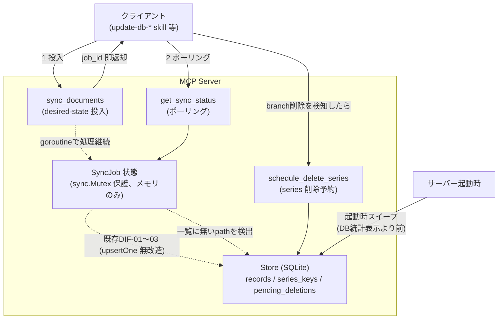
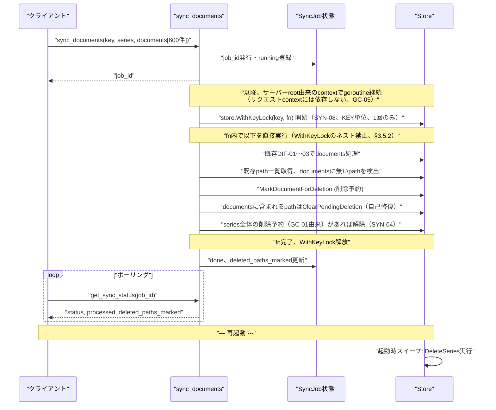

# DES-003 desired-state 同期ジョブ + 削除予約の起動時ガベージコレクション 設計書

## メタデータ

| 項目     | 値                                                                                                             |
| -------- | -------------------------------------------------------------------------------------------------------------- |
| 設計ID   | DES-003                                                                                                        |
| 関連要件 | APP-003 FNC-006（SYN-01〜08, GC-01〜05）, APP-001 EXP-01/EXP-02・MNG-02・DIF-01〜03・DEL-01/DEL-03（既存仕様） |
| 作成日   | 2026-07-03                                                                                                     |

## 1. 概要

`upsert_documents` は追加専用の操作であり、クライアント側でファイルが削除されても doc-db 側のインデックスに追従して除去する仕組みがない。また既存の TTL/LRU（`internal/expiry`、EXP-01/02）は `last_accessed_at` という推測的な指標に基づく KEY 単位の自動廃棄であり、実際に本番相当環境で「作成直後の KEY が LRU 誤爆で削除される」事故が発生している。仕事で使うドキュメント検索において、推測ベースで必要なデータが消えることは許容できない。

本設計は、クライアントが確実に把握している事実（「このファイル一覧が現在の全て」「この series はもう使われない」）だけを根拠に、以下の方式で不要データを除去する:

1. **desired-state 同期ジョブ**（`sync_documents`）: クライアントが key・series の完全なファイル一覧を送ると、サーバーは既存の DIF-01〜03 ロジック（無改造）で変更分のみ処理し、一覧に含まれない既存 path を**削除予約**する
2. **ジョブ投入 + ポーリング**（`get_sync_status`）: 大量ファイル処理はジョブとして投入し、進捗はポーリングで確認する。特別な非同期基盤は使わず、通常の同期 MCP ツール 2 つの組み合わせで実現する
3. **削除予約の起動時スイープ**: series 単位（`schedule_delete_series` 経由）・path 単位（`sync_documents` の副作用）いずれの削除予約も、サーバー起動時に一括して物理削除する。既存の `DeleteSeries` / `DeleteSeriesAll`（他 series が参照する record は保持する安全な不変条件込み）を無改造で再利用する

既存の `upsert_documents` / `delete_documents` / `delete_series` / `delete_index` / TTL・LRU タイマーワーカーの処理ロジック本体は変更しない。ただし `sync_documents` の desired-state 判定を同一 KEY への他の書き込み・削除と直列化するため（SYN-08、§3.5）、`internal/store.Store` に KEY 単位のロック（`WithKeyLock`）を新設し、上記すべての呼び出し元でロック取得のラップのみを追加する（`internal/expiry` も対象。呼び出し箇所を `store.WithKeyLock` で囲むだけで、TTL/LRU の判定ロジック自体は無改造）。

## 2. アーキテクチャ概要



## 3. モジュール設計

### 3.1 モジュール一覧

| モジュール名                                                    | 責務                                                                                                                                                                                 | 依存                                    |
| --------------------------------------------------------------- | ------------------------------------------------------------------------------------------------------------------------------------------------------------------------------------ | --------------------------------------- |
| `internal/store`（`pending_deletions` テーブル + 新規メソッド） | 削除予約の記録・解除・起動時スイープの実行                                                                                                                                           | 既存 `DeleteSeries` / `DeleteSeriesAll` |
| `internal/store`（KEY 単位排他ロック、§3.5）                    | `WithKeyLock(ctx, key, fn func() error) error` を新設する。**`DeleteKey` 自身はロックを取得しない**（呼び出し元が `WithKeyLock` で囲む規約、§3.5 参照）                              | なし（`internal/store` 内で完結）       |
| `internal/mcp`（新規3ツール）                                   | `sync_documents` / `get_sync_status` / `schedule_delete_series` のハンドラ、ジョブ状態管理                                                                                           | `internal/store`, 既存 `upsertOne`      |
| `internal/mcp`（既存ハンドラへのロック追加）                    | `upsert_documents` / `delete_documents` / `delete_series` / `delete_index` の処理本体は無改造のまま、対象 KEY への呼び出しを `store.WithKeyLock` で囲むだけを追加する（§3.5 SYN-08） | `internal/store`                        |
| `internal/expiry`（ロック追加、§3.5）                           | `runTTL` / `runLRU` の `DeleteKey` 呼び出しを `store.WithKeyLock` で囲む（`storeForExpiry` インターフェースに `WithKeyLock` を追加）。TTL/LRU の判定ロジック自体は無改造             | `internal/store`                        |
| `cmd/docdb`（起動シーケンス変更）                               | 起動時スイープの呼び出し、ジョブ用 root context の生成・保持（§3.6）                                                                                                                 | `internal/store`                        |

### 3.2 スキーマ追加

```sql
CREATE TABLE IF NOT EXISTS pending_deletions (
    key       TEXT NOT NULL,
    series    TEXT NOT NULL,
    path      TEXT NOT NULL DEFAULT '',  -- '' = series 全体の削除予約、それ以外 = 特定 path の削除予約
    marked_at TEXT NOT NULL,
    PRIMARY KEY (key, series, path)
)
```

`path` に空文字列を「series 全体」を表すセンチネルとして使う。SQLite の `PRIMARY KEY` は NULL の重複を許容してしまうため、NULL ではなく空文字列で区別する。定義位置は `internal/store/store.go` の既存スキーマ初期化ブロック（`keys` / `records` / `series_keys` / `chunks` / `embeddings` の `CREATE TABLE IF NOT EXISTS` が並ぶ箇所）の直後に追加する。

### 3.3 store 層メソッド

| メソッド                                                                            | 動作                                                                                                                                                                                                                                                                                                                                                                                                                                                                                                                                                                                                                                                                             |
| ----------------------------------------------------------------------------------- | -------------------------------------------------------------------------------------------------------------------------------------------------------------------------------------------------------------------------------------------------------------------------------------------------------------------------------------------------------------------------------------------------------------------------------------------------------------------------------------------------------------------------------------------------------------------------------------------------------------------------------------------------------------------------------- |
| `MarkSeriesForDeletion(ctx, key, series string) (alreadyScheduled bool, err error)` | `path=''` で1行 upsert（`ON CONFLICT DO UPDATE SET marked_at=...` で冪等）。挿入前に既存行の有無を確認し、既に削除予約済みだった場合は `alreadyScheduled=true` を返す（`schedule_delete_series` の `already_scheduled` 出力に使用）                                                                                                                                                                                                                                                                                                                                                                                                                                              |
| `MarkDocumentForDeletion(ctx, key, series, path string) error`                      | 指定 path で1行 upsert                                                                                                                                                                                                                                                                                                                                                                                                                                                                                                                                                                                                                                                           |
| `ClearPendingDeletion(ctx, key, series, path string) error`                         | 該当行を削除（SYN-04 の自己修復に使用）。`path=""` を渡すと series 全体の削除予約（GC-01 由来）を解除する                                                                                                                                                                                                                                                                                                                                                                                                                                                                                                                                                                        |
| `SweepPendingDeletions(ctx context.Context) (processed int, errs []error)`          | `pending_deletions` 全行を取得し、`path=''` なら既存 `DeleteSeriesAll(ctx, key, series)`、それ以外なら既存 `DeleteSeries(ctx, key, series, []string{path})` をそのまま呼ぶ。成功した行は削除。個別失敗はログ＋`errs`に集約して継続（silent failure 禁止方針）。行の消し忘れは次回起動時に再試行されるだけで安全（両関数とも対象が既に無ければ 0 件処理で冪等）。**起動時（サーバーがまだ MCP リクエストを受け付ける前）にのみ呼ばれる前提**であり、`WithKeyLock` を取得しない（並行する書き込みが存在しない時間帯のため不要）。将来、起動時以外（手動トリガー等）でスイープを実行する変更を加える場合は、この前提が崩れるため各行ごとに `WithKeyLock` で囲むよう設計を見直すこと |

`DeleteSeries`（`internal/store/store.go:664`）・`DeleteSeriesAll`（同 742）は無改造で再利用する。両関数とも「`series_keys` 除去後 `COUNT(*)=0` の場合のみ物理削除、他 series が残る record は保持」という既存の安全な不変条件を持ち、この設計はそれにそのまま乗る。

**Mutex 直列化方針（DES-001 §4.2 準拠）**: `MarkSeriesForDeletion` / `MarkDocumentForDeletion` / `ClearPendingDeletion` は `pending_deletions` テーブルへの単独の書き込み操作であるため、既存の `DeleteSeries` / `DeleteSeriesAll` 等と同様に各メソッド自身が `s.mu.Lock()` を取得して直列化する（この `s.mu` は §3.5 の `WithKeyLock` とは別レイヤーであり、`WithKeyLock` の外側呼び出しルールとは無関係）。

### 3.4 ジョブ状態管理（`internal/mcp`）

```go
type SyncJobStatus struct {
    Status              string // "running" | "done" | "failed"
    Processed, Skipped, Failed int
    DeletedPathsMarked  int
    Errors              []string
}
```

`internal/expiry.Worker` の `Stats` + `sync.Mutex` パターン（`internal/expiry/expiry.go:50-90`）を踏襲し、`Handlers` 構造体に `sync.Mutex` で保護された `map[string]*SyncJobStatus` を持たせる。**メモリ保持のみ、永続化しない**（SYN-07）。完了済みジョブの具体的な保持ポリシー（件数上限または経過時間）は APP-003 TBD-101 で未確定のため、実装時に確定させコード内コメントで根拠を残す。

### 3.5 KEY 単位の排他制御（SYN-08）

`sync_documents` は「`documents` 処理 → 既存 path 一覧取得 → 欠落 path の削除予約」を desired-state 判定の単一の論理処理として扱う。この間に同じ KEY へ他の書き込みが割り込むと、判定開始時点の desired-state と処理完了時点の実データがずれる。割り込みうる操作は series 単位のもの（`upsert_documents` / `delete_documents` / `delete_series` / `schedule_delete_series` / 別の `sync_documents`）に留まらない。**KEY 全体を削除する操作**（`delete_index` MNG-02、EXP-01 の TTL、EXP-02 の LRU）が同時に走ると、sync 処理中の KEY 自体が消え、以降の Store 呼び出しが存在しない KEY に対する処理になる、あるいは削除と再挿入が競合して不整合な状態が残る。

#### 3.5.1 ロック取得主体: 呼び出し側方式（`WithKeyLock`）

初版では「`DeleteKey` が自身の内部でロックを取得する」設計としたが、これはレビューで **再入デッドロックのリスク**を指摘された: `sync_documents` のように複数の Store 呼び出しを跨いでロックを保持する処理から、将来何らかの経路で `DeleteKey`（内部でも同じロックを取ろうとする）に到達すると、同一 goroutine が同じ `sync.Mutex` を二重取得してデッドロックする。`sync.Mutex` は非再入のため、「一部のメソッドは自分でロックを取り、一部の呼び出し元は外側からロックを取る」という二重構造そのものが危険源になる。

これを解消するため、**ロックの取得主体を呼び出し側に統一**する。`internal/store.Store` は KEY 単位ロックの取得手段として `WithKeyLock` のみを公開し、個々の Store メソッド（`DeleteKey` / `UpsertRecord` / `DeleteSeries` / `DeleteSeriesAll` 等）は KEY 単位ロックを**内部で取得しない**。

```go
// internal/store/store.go
// keyLockEntry.ch はバッファ 1 の channel をミューテックス代わりに使う。
// send（バッファへの書き込み）が「ロック取得」、receive が「解放」に相当し、
// select { case <-ctx.Done(): ... } と組み合わせられる（sync.Mutex にはできない）。
type keyLockEntry struct {
    ch  chan struct{}
    ref int // 参照中の goroutine 数（0 になったら map から削除）
}

type Store struct {
    // ...既存フィールド...
    keyLocksMu sync.Mutex
    keyLocks   map[string]*keyLockEntry
}

// WithKeyLock は KEY 単位の論理ロックを取得した状態で fn を実行する。
// ロック取得を待機している間に ctx がキャンセルされた場合、fn を実行せず ctx.Err() を返す
// （GC-05: sync_documents がロック待機中でもシャットダウンに応答できるようにするため）。
// 参照カウントが 0 になったエントリは map から削除し、無制限な蓄積を防ぐ（§3.5.3）。
// fn 内で WithKeyLock を再度呼んではならない（§3.5.2 の禁止規約）。
func (s *Store) WithKeyLock(ctx context.Context, key string, fn func() error) error {
    s.keyLocksMu.Lock()
    e, ok := s.keyLocks[key]
    if !ok {
        e = &keyLockEntry{ch: make(chan struct{}, 1)}
        s.keyLocks[key] = e
    }
    e.ref++
    s.keyLocksMu.Unlock()

    release := func() {
        s.keyLocksMu.Lock()
        e.ref--
        if e.ref == 0 {
            delete(s.keyLocks, key)
        }
        s.keyLocksMu.Unlock()
    }

    select {
    case e.ch <- struct{}{}:
        // ロック取得成功
    case <-ctx.Done():
        release()
        return ctx.Err()
    }

    defer func() {
        <-e.ch // 解放
        release()
    }()

    return fn()
}
```

`LockKey(key) (unlock func())` のような生の Lock/Unlock ペアではなく `WithKeyLock(ctx, key, fn)` のクロージャ形式を採用する理由: 呼び出し側が unlock を呼び忘れる事故を構造的に防げる（`defer` が漏れなく効く）。

**`sync.Mutex` ではなく channel を使う理由**: `WithKeyLock` は `ctx context.Context` を引数に取るが、`sync.Mutex.Lock()` はブロッキング呼び出しであり待機中にキャンセルできない。これでは GC-05（シャットダウン時にジョブを `"failed"` にする）と矛盾する: `sync_documents` が他の書き込みによる `WithKeyLock` 待ち状態でサーバーがシャットダウンしても、ロックを取得するまで応答できない。バッファ 1 の channel を使えば `select` で `ctx.Done()` と競合させられ、**ロック取得を待機している間もキャンセルに応答できる**。ロック取得後（`fn` 実行中）のキャンセル対応は、`fn` 自身が受け取った `ctx` を見て中断するかどうかに委ねる（既存の `upsertOne` 等の挙動を継承）。

#### 3.5.2 呼び出しルール（禁止事項）[MANDATORY]

- **`WithKeyLock` は各呼び出し元が対象 KEY につき 1 回だけ呼ぶ。`fn` の内部でネストして `WithKeyLock` を呼んではならない**（再入デッドロックの回避）
- `DeleteKey` / `UpsertRecord` / `DeleteSeries` / `DeleteSeriesAll` 自身は `WithKeyLock` を内部で呼ばない。KEY 単位排他が必要な呼び出し元が、これらのメソッド呼び出し全体を `WithKeyLock` で囲む
- 呼び出し元一覧と囲み方（`fn` は「対象 KEY に対する Store 呼び出し一式」を指し、実際には単一メソッド呼び出しとは限らない。例えば `upsert_documents` は複数ドキュメント・複数チャンクに対し `UpsertRecord` を繰り返し呼ぶが、そのハンドラ処理全体を 1 回の `WithKeyLock` で囲む）:
  - `internal/mcp` の `upsert_documents` ハンドラ: `store.WithKeyLock(ctx, key, func() error { /* ハンドラの Store 書き込み処理全体（複数ドキュメント分の UpsertRecord 呼び出しを含む） */ })`
  - `internal/mcp` の `delete_documents` ハンドラ: `store.WithKeyLock(ctx, key, func() error { return store.DeleteSeries(...) })`
  - `internal/mcp` の `delete_series` ハンドラ: `store.WithKeyLock(ctx, key, func() error { return store.DeleteSeriesAll(...) })`
  - `internal/mcp` の `delete_index` ハンドラ: `store.WithKeyLock(ctx, key, func() error { return store.DeleteKey(...) })`
  - `internal/mcp` の `schedule_delete_series` ハンドラ: `store.WithKeyLock(ctx, key, func() error { _, err := store.MarkSeriesForDeletion(...); return err })`
  - `internal/expiry.Worker.runTTL` / `runLRU`: 削除対象 KEY ごとに `w.st.WithKeyLock(ctx, key, func() error { return w.st.DeleteKey(ctx, key) })`（`storeForExpiry` インターフェースに `WithKeyLock` を追加）
  - `sync_documents`（新規ゴルーチン）: **1 回の `WithKeyLock` で desired-state 判定全体（documents 処理 → path 一覧取得 → 削除予約の記録・解除）を囲む**。`fn` の内部では `upsertOne` / `MarkDocumentForDeletion` / `ClearPendingDeletion` を直接呼び、これらの中から `WithKeyLock` を再度呼ばない（これらのメソッド自体が `WithKeyLock` を持たないため、構造的に再入は起こり得ない）

#### 3.5.3 ロック粒度とライフサイクル

**ロック粒度は KEY 単位**（key+series 単位ではない）とする。同一 KEY 内の異なる series 間であっても並行実行しない。理由: `delete_index` / TTL / LRU は KEY 全体に効くため、series 単位のロックでは「他の series はロックしていないので削除してよい」という誤った並行実行を防げない。KEY 単位に統一することで、上記の全操作が単一のロックで一貫して直列化される。単一 KEY 内での書き込み系操作が同時に複数走る想定は薄く（branch 運用は同一 KEY 内の逐次的な series 追加・削除が主）、並行度低下の実害は小さいと判断する。

`keyLocks` map は参照カウント方式（上記コード参照）で、参照中の goroutine が 0 になったエントリを削除し、KEY の生成・削除が繰り返されても無制限に蓄積しないようにする。

これは `internal/store.Store` の既存グローバル書き込み Mutex（`s.mu`、DES-001 §4.2）とは別レイヤーの排他制御である。`s.mu` は個々の SQLite 書き込みトランザクション単位の直列化、`WithKeyLock`（`keyLocks`）は「同一 KEY に対する一連の複数回の Store 呼び出し」を跨いだ直列化を担う。両者は独立したミューテックスであり、`WithKeyLock` の `fn` 内で個々の Store メソッドが `s.mu` を取得しても問題は生じない（§3.5.2 の禁止規約は `keyLocks` 自身の再入のみを対象とする）。

### 3.6 ジョブ用 context の寿命（GC-05）

`sync_documents` のバックグラウンド処理に MCP リクエストの `context.Context` をそのまま渡すと、ハンドラが job_id を返してリクエストが完了した時点でその context がキャンセルされ、ジョブが途中で停止する実装になりやすい。

- サーバー起動時（`cmd/docdb/main.go`）に生成する、シャットダウンシグナルで cancel される長寿命の root context（既存の `expiry.Worker.Start(ctx)` に渡している context と同じもの）を `Handlers` に保持させる
- `sync_documents` のバックグラウンドゴルーチンは、この root context から派生させた context で処理を実行する（MCP リクエストの context には依存しない）。これによりクライアントが切断してもジョブは継続する
- root context が cancel された場合（サーバーシャットダウン）、実行中のジョブは処理を中断し、`SyncJobStatus.Status` を `"failed"` に更新してから終了する。ジョブ状態はメモリ保持のみ（SYN-07）のため、次回起動後にクライアントが `get_sync_status` を呼んでも当該 job_id は失われているが、これは許容する（クライアントは再度 `sync_documents` を呼べば冪等に補われる）
- **`WithKeyLock` 待機中のキャンセル**: `sync_documents` が `store.WithKeyLock` で KEY ロックの取得を待っている最中に root context が cancel された場合も、§3.5.1 の channel ベース実装により `WithKeyLock` は `fn` を実行せず `ctx.Err()` を返して即座に戻る。これによりロック取得前・取得後のいずれの段階でもシャットダウンに応答でき、`SyncJobStatus.Status` を `"failed"` にできる（ロック取得後に `fn` 実行中のキャンセルは `fn` 内部の処理が個別に `ctx.Done()` を見て中断する）

## 4. ユースケース設計

### 4.1 ユースケース一覧

| ユースケース                             | 説明                                                                   |
| ---------------------------------------- | ---------------------------------------------------------------------- |
| desired-state 同期（ファイル削除の検出） | クライアントが完全なファイル一覧を送り、含まれない path を削除予約する |
| series 削除予約（branch 削除）           | クライアントが branch 削除を把握した時点で series を削除予約する       |
| 起動時スイープ                           | サーバー起動時に全ての削除予約を物理削除する                           |

### 4.2 シーケンス図



**前提条件**: `key`・`series` は既存 KEY に対する呼び出し。`documents` は当該 key・series の完全な現在状態であること（クライアントの責務）。
**正常フロー**: 上図の通り。変更の無いファイルは DIF-02 によりそのまま skip され、削除予約された path は次回起動まで検索結果に残り続ける（即座には消えない）。同一 KEY を対象とする他の書き込み・削除操作（series を問わず。`delete_index`・TTL・LRU による KEY 削除を含む）は、`sync_documents` の処理完了までブロックされる（§3.5 SYN-08）。
**エラーフロー**: 個別ドキュメントの Embedding 失敗は既存 `upsertOne` の挙動を継承し処理継続。削除予約の物理削除失敗はログ記録のうえ次回起動時に再試行。存在しない・保持期限切れの `job_id` で `get_sync_status` を呼んだ場合はエラーを返す。サーバーシャットダウンでジョブが中断された場合は `SyncJobStatus.Status="failed"` になる（§3.6 GC-05）。

## 5. 使用する既存コンポーネント

| コンポーネント          | ファイルパス                      | 用途                                                                                                                                    |
| ----------------------- | --------------------------------- | --------------------------------------------------------------------------------------------------------------------------------------- |
| `DeleteSeries`          | `internal/store/store.go:664`     | path 単位の削除予約スイープで再利用（無改造）                                                                                           |
| `DeleteSeriesAll`       | `internal/store/store.go:742`     | series 単位の削除予約スイープで再利用（無改造）                                                                                         |
| `upsertOne`             | `internal/mcp/mcp.go:282`         | `sync_documents` のドキュメント1件処理で再利用（無改造、DIF-01〜03継承）                                                                |
| `expiry.Stats` パターン | `internal/expiry/expiry.go:50-90` | `SyncJobStatus` の mutex 保護状態管理パターンの参考                                                                                     |
| スキーマ初期化ブロック  | `internal/store/store.go:165-210` | `pending_deletions` テーブルの追加位置                                                                                                  |
| 起動シーケンス          | `cmd/docdb/main.go:162-179`       | 起動時スイープの差し込み位置（DB統計表示より前）                                                                                        |
| `DeleteKey`             | `internal/store/store.go:816`     | `WithKeyLock` では囲まない（自身は無改造）。`delete_index` ハンドラ・`internal/expiry.Worker` が呼び出し側で `WithKeyLock` に包んで呼ぶ |
| `storeForExpiry`        | `internal/expiry/expiry.go:32-37` | `WithKeyLock` を追加するインターフェース定義箇所（`DeleteKey` 自体のシグネチャは不変）                                                  |

## 6. テスト設計

- **単体テスト対象**（`internal/store/store_test.go`）:
  - `MarkSeriesForDeletion` / `MarkDocumentForDeletion` の冪等性。`MarkSeriesForDeletion` は2回目呼び出しで `alreadyScheduled=true` を返すこと
  - `SweepPendingDeletions` が series 単位・path 単位それぞれで正しく物理削除すること
  - 回帰テスト: 同一 `content_hash` を複数 series が参照している状態で片方だけ削除予約・スイープした場合に record が残ること
  - 削除予約後、スイープ前に同じ path が再度 sync された場合、`ClearPendingDeletion` により解除されること
  - **`WithKeyLock` 直接テスト（§3.5.1 の核心・実装着手直後に書く）**: goroutine A が `WithKeyLock(key, fn)` を保持している間（`fn` 内で `time.Sleep` 等により意図的に遅延）、goroutine B が同一 `key` で `WithKeyLock` を呼ぶと A の `fn` 完了までブロックされることをタイムアウト付きで直接検証する。`sync_documents` 等の MCP ツール経由の間接確認ではなく、`internal/store` 単体でこの排他性そのものを保証する
  - `WithKeyLock` の参照カウントが 0 になったエントリが `keyLocks` map から削除されること（メモリリーク防止の回帰テスト）
  - 異なる `key` に対する `WithKeyLock` 呼び出しは互いにブロックしないこと（並行度が KEY 単位を超えて過剰に落ちていないことの確認）
  - **`WithKeyLock` 待機中キャンセルテスト（GC-05 の核心）**: goroutine A が `WithKeyLock(key, fnA)` を保持中に、goroutine B が同一 `key` に対して `WithKeyLock(ctxB, key, fnB)` を呼び、B の `ctxB` を（A が解放する前に）cancel すると、B は `fnB` を実行せず `ctxB.Err()` を即座に返してブロックが解除されることを確認する。ロック取得後ではなく**待機中**にキャンセルが効くことを直接検証する
- **統合テスト対象**（`internal/mcp/mcp_test.go`）:
  - `sync_documents` が job_id を即座に返しブロックしないこと
  - `get_sync_status` がジョブの進捗・完了を正しく反映すること
  - desired-state から path が欠落した場合に削除予約が作られること
  - `schedule_delete_series` が即座に削除しないこと。既に予約済みの series へ再度呼んだ場合 `already_scheduled=true` を返すこと
  - 存在しない・保持期限切れの `job_id` で `get_sync_status` を呼ぶとエラーが返ること
  - **最重要（回帰テスト）**: `sync_documents` 処理中に同一 KEY へ `upsert_documents` を呼ぶと、後者が `sync_documents` 完了までブロックされること（SYN-08）。ブロックされずに割り込んだ場合、新規追加した path が誤って削除予約されるという再発防止対象の不具合を検出する
  - **最重要（回帰テスト）**: `sync_documents` 処理中に同一 KEY へ `delete_index` または（テスト用に TTL/LRU 相当のロジックを直接呼び出して）KEY 削除を実行すると、`sync_documents` 完了までブロックされること（SYN-08）。ブロックされずに割り込んだ場合、削除中の KEY に対して sync が不整合なデータを書き込む・存在しない KEY への書き込みでエラーになる、のいずれかが再発する
  - `schedule_delete_series` で series 全体を削除予約した後、同一 key・series に `sync_documents` を呼ぶと series 全体の削除予約が解除されること（自己修復）
  - サーバーの root context を cancel した状態で `sync_documents` を実行すると、ジョブが `"failed"` になること（GC-05）
  - **request context 非依存の確認（GC-05 の再発防止テスト）**: `sync_documents` が `job_id` を返した直後に、その MCP リクエストの context を cancel しても（root context は生存させたまま）ジョブが中断されず `"done"` まで完走することを確認する。当初リスクとして指摘された「request context を誤って goroutine に渡してしまう」バグの再発を直接検出する
- **`internal/expiry` 回帰テスト**（`internal/expiry/expiry_test.go`）: `runTTL` / `runLRU` が `DeleteKey` を呼ぶ前に `WithKeyLock` を経由することを、モック `storeForExpiry` の呼び出し順序で確認する（既存の TTL/LRU 判定ロジック自体のテストは変更不要）
- `go test -race ./...` で goroutine + mutex まわりのレース検出

## 改定履歴

| 日付       | バージョン | 内容                                                                                                                                                                                                                                                                                                                                                                                                                                                                                                                                                                                                                                                                                                                              |
| ---------- | ---------- | --------------------------------------------------------------------------------------------------------------------------------------------------------------------------------------------------------------------------------------------------------------------------------------------------------------------------------------------------------------------------------------------------------------------------------------------------------------------------------------------------------------------------------------------------------------------------------------------------------------------------------------------------------------------------------------------------------------------------------- |
| 2026-07-03 | 1.0        | 初版作成                                                                                                                                                                                                                                                                                                                                                                                                                                                                                                                                                                                                                                                                                                                          |
| 2026-07-03 | 1.1        | レビュー指摘対応: §3.5 key+series 単位の排他制御を新設（SYN-08、並行書き込みによる desired-state ズレを防止）。§3.6 ジョブ用 context の寿命を新設（GC-05、リクエスト context 依存の脱却とシャットダウン時の failed 化）。§3.3 `ClearPendingDeletion` の series 全体解除を明記。§3.1 既存ハンドラへのロック追加を明記。シーケンス図・エラーフロー・テスト設計を上記に整合させて更新                                                                                                                                                                                                                                                                                                                                                |
| 2026-07-04 | 1.2        | レビュー指摘対応: §3.5 のロック対象漏れを修正。`delete_index`・TTL・LRU による KEY 全体削除が排他対象から漏れていたため、ロック実装を `internal/mcp` から `internal/store.Store` へ移し（`LockKey`）、粒度を key+series 単位から **KEY 単位**へ変更（`DeleteKey` が内部で自ら取得するため `internal/expiry` は無改造のまま対象に含められる）。参照カウント方式のロックライフサイクル（メモリリーク防止）を明記。メタデータの関連要件を SYN-08/GC-05/EXP-01/EXP-02/MNG-02 反映に更新。`schedule_delete_series` の出力を `{key, series, already_scheduled}` に具体化（APP-001 側）                                                                                                                                                  |
| 2026-07-04 | 1.3        | additive_development_spec.md §1（現行版）の判定基準に基づき、本設計書を APP-001 直接編集から独立 feature（sync-gc）へ retrofit。`temporary-feature-design` frontmatter を付与し、`docs/specs/sync-gc/design/` へ移動。メタデータの関連要件を APP-003（本 feature）と APP-001（既存仕様）に区別して記載。旧 APP-001/DES-001 への直接編集は revert 済み（ADR-001 参照）                                                                                                                                                                                                                                                                                                                                                             |
| 2026-07-04 | 1.4        | 実装戦略レビュー指摘対応（再入デッドロックリスク）: §3.5 を全面改訂し、ロック取得主体を「DeleteKey 内部取得」から呼び出し側方式 WithKeyLock(ctx, key, fn) に変更（DeleteKey 自身はロックを取得しない）。WithKeyLock のネスト呼び出し禁止を MANDATORY として明記。internal/expiry は storeForExpiry に WithKeyLock を追加する軽微な変更が必要になった（無改造ではなくなった旨を §1/§3.1 に反映）。MarkSeriesForDeletion の戻り値を (alreadyScheduled bool, err error) に変更（schedule_delete_series の already_scheduled 出力を正しく実装可能にする）。SweepPendingDeletions を「起動時専用（WithKeyLock 不要）」と明記。§3.4 の保持ポリシー未確定箇所を APP-003 TBD-101 に紐付け。§6 に WithKeyLock 自体の直接排他性テストを追加 |
| 2026-07-04 | 1.5        | 計画レビュー指摘対応（ctx 非対応ロック矛盾）: WithKeyLock が ctx を受け取るにもかかわらず sync.Mutex ではロック待機中にキャンセルできず GC-05 と矛盾していたため、§3.5.1 の実装をバッファ 1 の channel ベースに変更（select で ctx.Done() と競合させ、待機中キャンセルに応答できるようにする）。§3.6 に「WithKeyLock 待機中のキャンセル」挙動を追記。§3.5.2 の呼び出し例が単一メソッド呼び出しに限定されるかのように読めた点を修正し、ハンドラの Store 処理全体を囲む旨を明記。§6 に待機中キャンセルの直接テストと、request context 非依存を検証する再発防止テストを追加                                                                                                                                                          |
