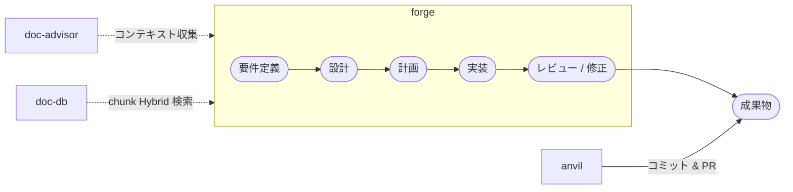
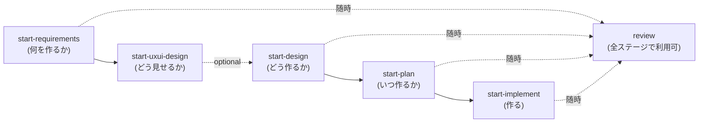

# bw-cc-plugins

**仕様駆動開発（Spec-Driven Development）** のための Claude Code プラグイン — 仕様を先に書き、AI がフルコンテキストで実装・レビューする。

**マーケットプレイスバージョン: 0.1.25**

マーケットプレイスは **4 つのプラグイン**（forge、anvil、doc-advisor、**doc-db**）で構成される。**doc-db** は見出し単位 chunk の Embedding + Lexical による Hybrid 検索と LLM Rerank で、ルール・仕様文書の発見精度を補完する。doc-advisor（ToC／軽量インデックス）と**上位互換ではなく併用**し、同一の `.doc_structure.yaml` を参照する。

[English README (README_en.md)](README_en.md)

## 仕様駆動開発とは

仕様駆動開発は、すべてのコード変更を書かれた仕様に遡れるワークフローである。**forge** が要件定義・設計・計画・実装・レビューの5段階を導き、AI が場当たり的な指示ではなく明文化された意図に基づいて作業する。各段階で文書が生まれ、次の段階の入力になる。結果として追跡可能で監査可能な成果物が得られる — コードがなぜ存在するかを常に説明できる。

→ 哲学と追加開発ワークフローの詳細は [仕様駆動開発ガイド](docs/readme/guide_sdd_ja.md) を参照。

## doc-advisor の役割

プロジェクトが大きくなると、ルール・規約・設計文書が蓄積される。AI がそれらを見つけられなければ活用できない。**doc-advisor** はこれらの文書をインデックス化し（ToC キーワード検索 + OpenAI Embedding セマンティック検索）、forge の重要な場面で自動的に提供する:

- **実装時** — コードを書く前にプロジェクト固有の実装ルールと関連仕様を収集する。
- **レビュー時** — 適用すべきルールをレビュー観点として追加し、汎用的なベストプラクティスではなくプロジェクトの実際の基準で検査する。

これによりコンテキストの欠損がなくなる — AI がシニアメンバーと同じ知識で実装・レビューできるようになる。

## ワークフロー



## プラグイン一覧

| プラグイン      | バージョン | 説明                                                                                                                                                     |
| --------------- | ---------- | -------------------------------------------------------------------------------------------------------------------------------------------------------- |
| **forge**       | 0.1.1      | AI によるドキュメントライフサイクルツール。要件定義・設計・計画書の作成、コード・文書レビュー、自動修正、品質確定に対応                                  |
| **anvil**       | 0.0.8      | GitHub 操作ツールキット。PR 作成、Issue 管理、GitHub ワークフロー自動化に対応                                                                            |
| **doc-advisor** | 0.3.0      | AI 検索可能な文書インデックス。キーワード（ToC）と OpenAI Embedding セマンティック検索の2層構造で、タスクに関連するルール・仕様文書を自動発見する        |
| **doc-db**      | 0.0.2      | 見出し chunk 単位の Hybrid 検索（Embedding + Lexical）と LLM Rerank。ID や固有名詞は grep 結果も統合して取りこぼしを抑える（doc-advisor とは併用・補完） |

## スキル一覧

### forge

> Feature と文書構造管理の詳細は [文書構造ガイド](docs/readme/guide_doc_structure_ja.md) を参照。

#### パイプライン



| 段階          | スキル             | 入力                        | 出力                       |
| ------------- | ------------------ | --------------------------- | -------------------------- |
| 要件定義      | start-requirements | 対話 / ソースコード / Figma | 要件定義書（Markdown）     |
| UXUI デザイン | start-uxui-design  | 要件定義書の ASCII アート   | デザイントークン + UI 仕様 |
| 設計          | start-design       | 要件定義書                  | 設計書（Markdown）         |
| 計画          | start-plan         | 設計書                      | 計画書（YAML）             |
| 実装          | start-implement    | 計画書                      | コード + 進捗更新          |
| レビュー      | review             | コード / 文書               | 指摘 + 修正                |

#### はじめかた

```bash
# 1. プロジェクト設定（初回のみ）
/forge:setup-doc-structure

# 2. 要件定義から実装まで
/forge:start-requirements my-feature --mode interactive --new
/forge:start-design my-feature
/forge:start-plan my-feature
/forge:start-implement my-feature

# 3. レビュー（随時）
/forge:review code src/ --auto
```

#### スキル一覧

| スキル                                                                                    | 説明                                                                                                                         | トリガー                            |
| ----------------------------------------------------------------------------------------- | ---------------------------------------------------------------------------------------------------------------------------- | ----------------------------------- |
| [**review**](docs/readme/forge/guide_review_ja.md)                                        | コード・文書を 🔴🟡🟢 重大度付きでレビュー。`--auto N` で自動修正                                                            | `"レビューして"`                    |
| [**start-requirements**](docs/readme/forge/guide_create_docs_ja.md#start-requirements)    | 対話・ソース解析・Figma の 3 モードで要件定義書を作成                                                                        | `"要件定義"`                        |
| [**start-design**](docs/readme/forge/guide_create_docs_ja.md#start-design)                | 要件定義書から設計書を作成。既存資産の再利用を重視                                                                           | `"設計書作成"`                      |
| [**start-plan**](docs/readme/forge/guide_create_docs_ja.md#start-plan)                    | 設計書からタスクを抽出し YAML 計画書を作成                                                                                   | `"計画書作成"`                      |
| [**start-implement**](docs/readme/forge/guide_implement_ja.md)                            | 計画書のタスクを選択し、実装・レビュー・計画書更新を一連で実行                                                               | `"実装開始"`                        |
| [**start-uxui-design**](docs/readme/forge/guide_uxui_design_ja.md)                        | 要件定義書からデザイントークン・UI 仕様を UX 評価付きで創造                                                                  | `"UXUIデザイン"`                    |
| **create-feature-from-markdown-plan**                                                     | Claude plan mode の Markdown plan から要件定義書 → 設計書を一気通貫で作成（forge 実装計画書 `{feature}_plan.yaml` は対象外） | `"markdown plan から feature 作成"` |
| **merge-specs**                                                                           | 2 つの仕様 DIR（基本 / 追加）を内容単位でマージ。追加側を正として基本側を改訂し、純粋新規分のみ移送                          | `"spec をマージ"`                   |
| [**setup-doc-structure**](docs/readme/guide_doc_structure_ja.md#forgesetup-doc-structure) | `.doc_structure.yaml` 生成 + ディレクトリ scaffold                                                                           | `"初期設定"`                        |
| [**setup-version-config**](docs/readme/forge/guide_setup_ja.md#setup-version-config)      | `.version-config.yaml` 生成・更新                                                                                            | `"バージョン設定"`                  |
| [**update-version**](docs/readme/forge/guide_setup_ja.md#update-version)                  | バージョン一括更新。patch/minor/major/直接指定                                                                               | `"バージョン更新"`                  |
| [**clean-rules**](docs/readme/forge/guide_setup_ja.md#clean-rules)                        | rules/ を分類学に基づいて分析・再構築                                                                                        | `"rules を整理"`                    |
| [**help**](docs/readme/forge/guide_setup_ja.md#help)                                      | インタラクティブヘルプ                                                                                                       | `"ヘルプ"`                          |
| [_reviewer_](docs/readme/forge/guide_review_ja.md#実行フロー)                             | criteria に基づき P1/P2/P3 をチェック順で順次評価 (1 起動原則)                                                               | ※ review が委譲                     |
| [_evaluator_](docs/readme/forge/guide_review_ja.md#実行フロー)                            | レビュー指摘を吟味し修正/スキップ/要確認を判定                                                                               | ※ review が委譲                     |
| [_fixer_](docs/readme/forge/guide_review_ja.md#実行フロー)                                | レビュー指摘に基づきコード・文書を修正                                                                                       | ※ review が委譲                     |
| [_present-findings_](docs/readme/forge/guide_review_ja.md#実行フロー)                     | レビュー結果を対話的に1件ずつ提示                                                                                            | ※ review が委譲                     |
| [_doc-structure_](docs/readme/guide_doc_structure_ja.md)                                  | `.doc_structure.yaml` のパース・パス解決                                                                                     | ※ 各オーケストレーターが呼び出し    |
| [_next-spec-id_](docs/readme/forge/guide_create_docs_ja.md)                               | 全ブランチをスキャンして仕様書 ID の次番を取得                                                                               | ※ start-requirements が呼び出し     |

### anvil

> [詳細ガイド](docs/readme/guide_anvil_ja.md) — 使い方、使用例

| スキル                                                   | 説明                                                                                   | トリガー              |
| -------------------------------------------------------- | -------------------------------------------------------------------------------------- | --------------------- |
| [**commit**](docs/readme/guide_anvil_ja.md#commit)       | 変更内容からコミットメッセージを自動生成し commit & push                               | `"コミットして"`      |
| [**create-pr**](docs/readme/guide_anvil_ja.md#create-pr) | GitHub PR をドラフト作成。コミット差分からタイトル/本文を自動生成                      | `"PR を作成"`         |
| **create-issue**                                         | 問題・背景・原因を整理して GitHub Issue を作成（解決策は impl-issue が担当）           | `"issue を作成"`      |
| **impl-issue**                                           | GitHub Issue から実装計画策定→ブランチ作成→実装→PR 作成までを一貫実行（UI Issue 対応） | `"この issue を実装"` |

### doc-advisor

> [詳細ガイド](docs/readme/guide_doc-advisor_ja.md) — 使い方、使用例

| スキル                                                                       | 説明                                                                           | トリガー           |
| ---------------------------------------------------------------------------- | ------------------------------------------------------------------------------ | ------------------ |
| [**query-rules**](docs/readme/guide_doc-advisor_ja.md#query-rules)           | ToC（キーワード）・Index（セマンティック）・ハイブリッドでルール文書を検索する | `"ルール確認"`     |
| [**query-specs**](docs/readme/guide_doc-advisor_ja.md#query-specs)           | ToC（キーワード）・Index（セマンティック）・ハイブリッドで仕様文書を検索する   | `"仕様確認"`       |
| [**create-rules-toc**](docs/readme/guide_doc-advisor_ja.md#create-rules-toc) | ルール文書の変更後に ToC を構築・更新する                                      | `"rules ToC 更新"` |
| [**create-specs-toc**](docs/readme/guide_doc-advisor_ja.md#create-specs-toc) | 仕様文書の変更後に ToC を構築・更新する                                        | `"specs ToC 更新"` |

> **太字** = ユーザー起動可能、_斜体_ = AI 専用（他スキルから内部的に呼び出される）

### doc-db

> [詳細ガイド](docs/readme/guide_doc-db_ja.md) — 使い方、使用例、doc-advisor との併用

| スキル                                                        | 説明                                                                 | トリガー            |
| ------------------------------------------------------------- | -------------------------------------------------------------------- | ------------------- |
| [**build-index**](docs/readme/guide_doc-db_ja.md#build-index) | 見出し chunk 単位で Index を構築・更新（rules / specs、`--full` 等） | `"doc-db の index"` |
| [**query**](docs/readme/guide_doc-db_ja.md#query)             | Hybrid / Rerank 検索。必要に応じ grep で全文行検索し結果を統合       | `"doc-db で検索"`   |

## インストール

### 方法 A: マーケットプレイス経由（永続）

Claude Code セッション内で:

```
/plugin marketplace add BlueEventHorizon/bw-cc-plugins
/plugin install forge@bw-cc-plugins
/plugin install anvil@bw-cc-plugins
/plugin install doc-advisor@bw-cc-plugins
/plugin install doc-db@bw-cc-plugins
```

無効化したプラグインを再有効化するには、ターミナルから:

```bash
claude plugin enable forge@bw-cc-plugins
```

`marketplace add` は GitHub リポジトリをプラグイン取得元として登録します（ユーザーごとに1回）。一度インストールすれば、常に利用可能です。

### 方法 B: ローカルディレクトリ（セッション限定）

```bash
git clone https://github.com/BlueEventHorizon/bw-cc-plugins.git
claude --plugin-dir ./bw-cc-plugins/plugins/forge
```

> **注意**: `--plugin-dir` はセッション限定です。Claude Code を起動するたびに指定が必要です。解除するには、フラグなしで起動するだけです。

### 更新

ターミナルから:

```bash
claude plugin update forge@bw-cc-plugins --scope local
```

## 文書構造管理 (.doc_structure.yaml)

`.doc_structure.yaml` はプロジェクトのドキュメント配置場所と種別を宣言する設定ファイル。forge・doc-advisor・doc-db が参照する。`/forge:setup-doc-structure` で生成する。
→ [文書構造ガイド](docs/readme/guide_doc_structure_ja.md) | [スキーマ仕様](plugins/forge/docs/doc_structure_format.md)

## Git 情報キャッシュ (.git_information.yaml)

`/anvil:create-pr` の初回実行時に `git remote` から GitHub リポジトリを検出し、`.git_information.yaml` への設定保存を提案します。

## 動作要件

- [Claude Code](https://claude.ai/code) CLI
- Python 3（setup スキャン用）
- [Codex CLI](https://github.com/openai/codex)（任意。Codex エンジン使用時に必要。未インストールの場合は Claude にフォールバック）
- OpenAI API キー（doc-advisor の embedding 使用時。`OPENAI_API_DOCDB_KEY` 推奨。未設定時は `OPENAI_API_KEY` にフォールバック。DES-007 統一仕様）
- OpenAI API キー（doc-db の Index 構築・検索・Rerank 使用時。`OPENAI_API_DOCDB_KEY` 推奨。未設定時は `OPENAI_API_KEY` にフォールバック。DES-007 統一仕様）
- [gh CLI](https://cli.github.com/)（anvil 用、認証済み）

## ライセンス

[MIT](LICENSE)
