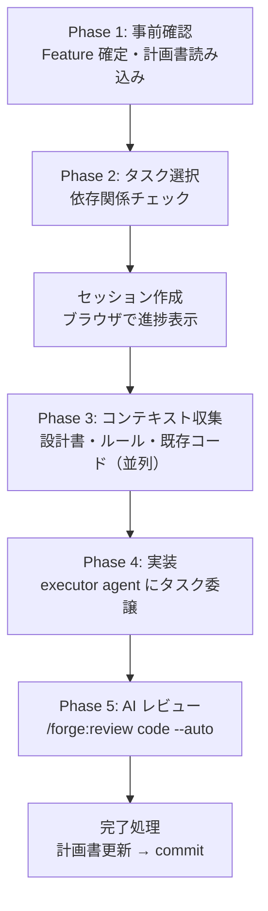

# 実装ガイド

計画書からタスクを選択し、コンテキスト収集 → 実装 → レビュー → 計画書更新を一貫して実行する。

## start-implement

```
/forge:start-implement [feature] [--task TASK-ID[,TASK-ID,...]]
```

| 引数      | 説明                                                              |
| --------- | ----------------------------------------------------------------- |
| `feature` | Feature 名（省略時は対話で確定）                                  |
| `--task`  | タスク ID（カンマ区切りで複数指定可。省略時は優先度順で自動選択） |

### 使用例

```bash
/forge:start-implement login                              # 優先度順で自動選択
/forge:start-implement login --task TASK-001              # 特定タスクを指定
/forge:start-implement login --task TASK-001,TASK-003     # 複数タスクを並列実行
```

### いつ使うか

- 計画書（`{feature}_plan.yaml`）が完成した後
- 計画書の `pending` タスクを 1 つずつ、または複数同時に実装するとき

### 実行フロー



### Phase 1: 事前確認

- Feature の確定（引数なしなら対話）
- `specs/{feature}/plan/{feature}_plan.yaml` を読み込み、全タスクの状態を表示

### Phase 2: タスク選択

| 指定方法                   | 動作                                         |
| -------------------------- | -------------------------------------------- |
| `--task` なし              | `pending` タスクから優先度順で 1 つ自動選択  |
| `--task TASK-001`          | 指定タスクのみ実行                           |
| `--task TASK-001,TASK-003` | 指定全タスクを並列実行（依存関係なしが条件） |

#### 依存関係チェック

- 依存タスク（`depends_on`）が `completed` でなければ実行不可
- 複数指定時にタスク間に依存関係があればエラー → 逐次実行を案内
- タスクグループ内は先頭から順次実行が必須

### Phase 3: コンテキスト収集

実装に必要な情報を並列 Agent で収集する:

| 収集対象                     | 用途                   |
| ---------------------------- | ---------------------- |
| 設計書（`design_id` に対応） | 何を実装するか         |
| 要件定義書（設計書が参照）   | なぜこの設計か         |
| 実装ルール（`/query-rules`） | プロジェクト固有の規約 |
| 既存コード                   | 参照実装・類似実装     |

### Phase 4: 実装

オーケストレーターが **executor agent** にタスクを委譲する。

executor の動作:

1. 提供された文書（設計書・ルール・既存コード）を全て読む
2. `description` の指示に従い実装する
3. ビルド・テストを実施して検証する
4. 実装結果を報告する

#### 制約

- **1 回の実行で 1 タスクのみ** — 隣接タスクへの着手禁止
- **計画書の更新はオーケストレーターの責務** — executor は触れない

#### 並列実行

`--task TASK-001,TASK-003` で複数指定した場合:

- 各タスクを独立した executor が同時実行
- 全 executor 完了後、成功タスクについて逐次レビュー
- いずれかが失敗した場合、再実行（上限 1 回）→ 人間にエスカレーション

### Phase 5: AI レビュー

実装差分に対して `/forge:review code --auto` を実行。修正起因の問題も自動検出・修正する。

### 完了処理

1. 計画書の更新: タスクステータスを `pending` → `completed` に変更
2. `/anvil:commit` で commit/push 確認
3. セッションディレクトリ削除
4. 未完了タスクがある場合は継続するか確認

### エラー時の対応

| 状況                            | 対応                                     |
| ------------------------------- | ---------------------------------------- |
| executor 失敗（ビルドエラー等） | 再実行（上限 1 回）→ 手動修正 → スキップ |
| 依存タスク未完了                | エラー。先に依存タスクを完了する         |
| 計画書が見つからない            | `/forge:start-plan` の実行を案内         |
