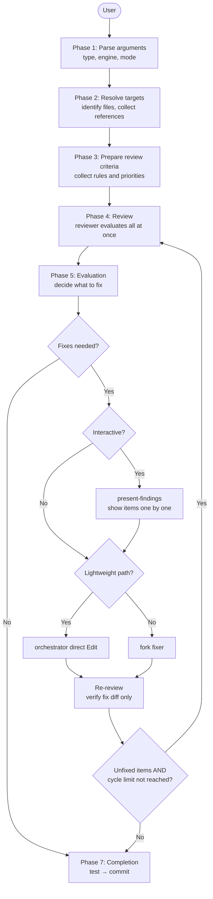

# Review Guide

AI reviews code and documents, scrutinizes findings, and fixes issues in a single workflow. In interactive mode, the user makes final decisions; in auto mode, AI fixes automatically.

## review

```
/forge:review <type> [--diff | --files path[,path...]] [--codex|--claude] [--interactive|--auto|--auto-critical]
```

| Argument               | Description                                                            |
| ---------------------- | ---------------------------------------------------------------------- |
| `type`                 | `code` / `requirement` / `design` / `plan` / `uxui` / `generic`        |
| `--diff` / `--files`   | Current branch diff / explicit file or directory list                  |
| `--codex` / `--claude` | Engine selection (default: Codex; falls back to Claude if unavailable) |
| `--interactive`        | Present findings for human decision-making                             |
| `--auto`               | Auto-fix 🔴 + 🟡; 🟢 minor findings are excluded                       |
| `--auto-critical`      | Auto-fix 🔴 only                                                       |

### Usage Examples

```bash
/forge:review code --diff --interactive                     # Current branch diff
/forge:review code --files src/ --auto                      # Auto-fix critical+major
/forge:review code --files src/ --auto-critical             # Critical only
/forge:review requirement --files docs/specs/login_req.md   # Requirement file
/forge:review design --files specs/login/design.md          # Direct file path
/forge:review generic --files README.md                     # Any document
/forge:review code --files src/ --claude                    # Claude engine
```

### When to Use

| Scenario                        | Recommended mode                            |
| ------------------------------- | ------------------------------------------- |
| Pre-PR final check              | `--auto` for bulk fix, then review the diff |
| Document quality review         | Interactive for careful per-item judgment   |
| CI-style quality gate           | `--auto-critical` for minimal safe fixes    |
| Completion step of other skills | start-design etc. call `--auto` internally  |

### Execution Flow



### Mode Comparison

| Mode                  | Fix targets   | Final judge | Use case                 |
| --------------------- | ------------- | ----------- | ------------------------ |
| Interactive (default) | User-selected | Human       | Careful quality control  |
| `--auto`              | 🔴 + 🟡       | AI          | Bulk quality improvement |
| `--auto-critical`     | 🔴 only       | AI          | Minimal safe fixes       |

The core loop (reviewer → evaluator → lightweight path or fork fixer → re-review) is identical across all modes. The only difference is whether human judgment is inserted before fixing.

### Review Types

| Type          | Target                   | Key check items                                 |
| ------------- | ------------------------ | ----------------------------------------------- |
| `code`        | Source code              | Correctness, resilience, maintainability        |
| `requirement` | Requirements docs        | Completeness, consistency, testability          |
| `design`      | Design docs              | Architecture, requirement coverage, feasibility |
| `plan`        | Plans                    | Task granularity, dependencies, traceability    |
| `uxui`        | Design tokens & UI specs | HIG compliance, usability, visual consistency   |
| `generic`     | Any document             | Structure, clarity, completeness                |

### Severity Levels

| Level       | Meaning                                              | Auto behavior                                |
| ----------- | ---------------------------------------------------- | -------------------------------------------- |
| 🔴 Critical | Must fix. Bugs, security, data loss, spec violations | Fixed by both `--auto` and `--auto-critical` |
| 🟡 Major    | Should fix. Standards, error handling, performance   | Fixed by `--auto` only                       |
| 🟢 Minor    | Nice to have. Readability, refactoring suggestions   | Never auto-fixed                             |

### Review Criteria

Criteria are accumulated from multiple sources and bundled together, then passed to a single reviewer.

| Source             | Content                                                        |
| ------------------ | -------------------------------------------------------------- |
| **Plugin default** | Built-in criteria file for each type (always included)         |
| **DocAdvisor**     | Project-specific rules added via `/query-rules` when available |

### Session Management

A session directory is created under `.claude/.temp/` during review.

| File               | Content                                       |
| ------------------ | --------------------------------------------- |
| `session.yaml`     | Session metadata (type, engine, cycle count)  |
| `refs.yaml`        | Reference files (targets, docs, criteria)     |
| `review_<type>.md` | Review results (findings and suggested fixes) |
| `plan.yaml`        | Fix plan and progress state                   |

Automatically deleted on normal completion. On interruption, the directory remains and a resume is proposed on next launch.
