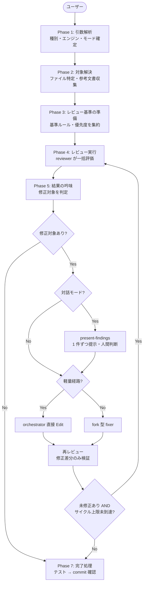

# レビューガイド

コード・文書を AI がレビューし、指摘事項の吟味・修正まで一貫して実行する。対話モードではユーザーが最終判断し、auto モードでは AI が自動修正する。

## review

```
/forge:review <種別> [--diff | --files path[,path...]] [--codex|--claude] [--interactive|--auto|--auto-critical]
```

| 引数                   | 説明                                                                |
| ---------------------- | ------------------------------------------------------------------- |
| `種別`                 | `code` / `requirement` / `design` / `plan` / `uxui` / `generic`     |
| `--diff` / `--files`   | 現ブランチ差分 / 明示したファイル・ディレクトリ一覧                 |
| `--codex` / `--claude` | エンジン選択（デフォルト: Codex。不在時は Claude にフォールバック） |
| `--interactive`        | 指摘を提示し、人間が修正可否を判断                                  |
| `--auto`               | 🔴 + 🟡 を自動修正。🟢 minor は対象外                               |
| `--auto-critical`      | 🔴 のみを自動修正                                                   |

### 使用例

```bash
/forge:review code --diff --interactive                     # 現ブランチ差分
/forge:review code --files src/ --auto                      # critical+major 自動修正
/forge:review code --files src/ --auto-critical             # 致命的のみ自動修正
/forge:review requirement --files docs/specs/login_req.md   # 要件定義書
/forge:review design --files specs/login/design.md          # ファイル直接指定
/forge:review generic --files README.md                     # 任意の文書
/forge:review code --files src/ --claude                    # Claude エンジン指定
```

### いつ使うか

| シーン                | 推奨モード                              |
| --------------------- | --------------------------------------- |
| PR 前の最終チェック   | `--auto` で一括修正後に差分を確認       |
| 文書の品質確認        | 対話モードで 1 件ずつ判断               |
| CI 的な自動品質ゲート | `--auto-critical` で致命的のみ修正      |
| 他スキルの完了処理    | start-design 等が内部で `--auto` を呼ぶ |

### 実行フロー



### モード比較

| モード             | 修正対象     | 最終判断者 | 用途             |
| ------------------ | ------------ | ---------- | ---------------- |
| 対話（デフォルト） | ユーザー選択 | 人間       | 慎重な品質管理   |
| `--auto`           | 🔴 + 🟡      | AI         | 一括品質向上     |
| `--auto-critical`  | 🔴 のみ      | AI         | 最小限の安全修正 |

コアループ（reviewer → evaluator → 軽量経路または fork 型 fixer → 再レビュー）は全モードで同一。違いは修正前に人間判断を挟むかどうかだけ。

### レビュー種別

| 種別          | 対象                      | 主な観点                               |
| ------------- | ------------------------- | -------------------------------------- |
| `code`        | ソースコード              | 正確性、堅牢性、保守性                 |
| `requirement` | 要件定義書                | 完全性、一貫性、テスト可能性           |
| `design`      | 設計書                    | アーキテクチャ、要件反映、実現可能性   |
| `plan`        | 計画書                    | タスク粒度、依存関係、トレーサビリティ |
| `uxui`        | デザイントークン・UI 仕様 | HIG 準拠、ユーザビリティ、視覚的一貫性 |
| `generic`     | 任意の文書                | 構造、明確さ、完全性                   |

### 重大度レベル

| レベル    | 意味                                               | auto での扱い                         |
| --------- | -------------------------------------------------- | ------------------------------------- |
| 🔴 致命的 | 修正必須。バグ、セキュリティ、データ損失、仕様違反 | `--auto` `--auto-critical` 両方で修正 |
| 🟡 品質   | 修正推奨。規約、エラーハンドリング、パフォーマンス | `--auto` のみで修正                   |
| 🟢 改善   | あると良い。可読性、リファクタリング提案           | 自動修正しない                        |

### レビュー基準

レビュー基準は複数ソースから集約され、1 つにまとめて reviewer に渡される。

| ソース             | 内容                                                          |
| ------------------ | ------------------------------------------------------------- |
| **プラグイン同梱** | 種別ごとに用意された基準ファイル（常に含む）                  |
| **DocAdvisor**     | `/query-rules` が利用可能な場合、プロジェクト固有ルールを追加 |

### セッション管理

レビュー中は `.claude/.temp/` にセッションディレクトリが作成される。

| ファイル           | 内容                                               |
| ------------------ | -------------------------------------------------- |
| `session.yaml`     | セッションメタデータ（種別・エンジン・サイクル数） |
| `refs.yaml`        | 参照ファイル一覧（対象・参考文書・基準ルール）     |
| `review_<種別>.md` | レビュー結果（指摘事項・修正案）                   |
| `plan.yaml`        | 修正プランと進捗状態                               |

正常完了時は自動削除。中断時は残存し、次回起動時に再開提案される。
