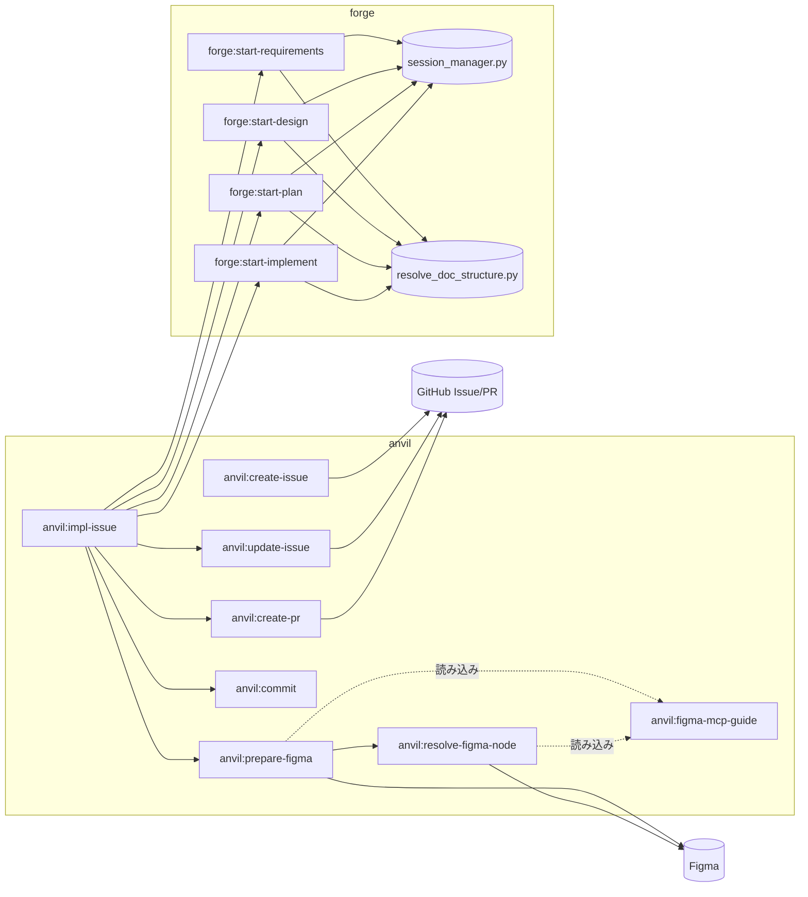
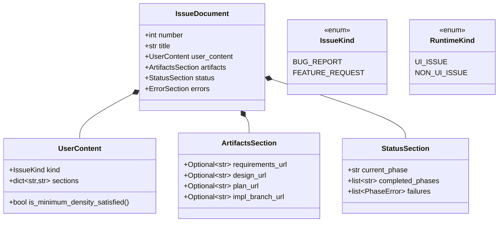
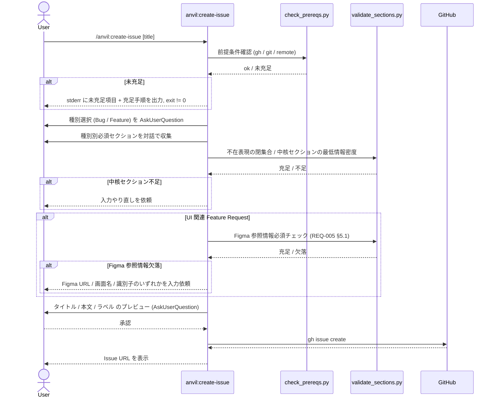
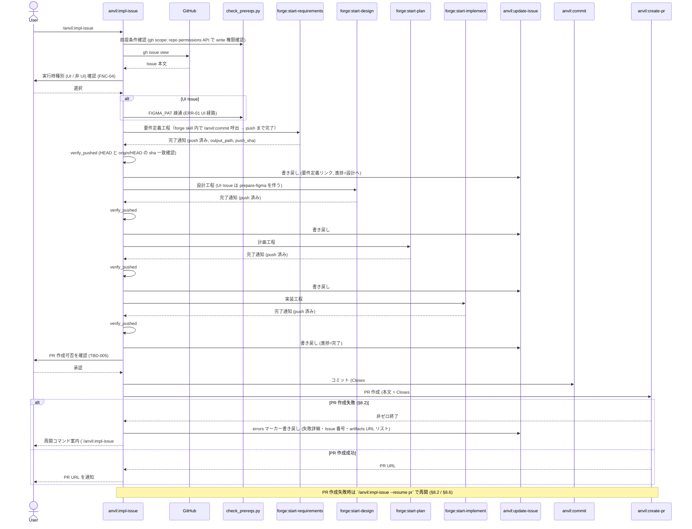
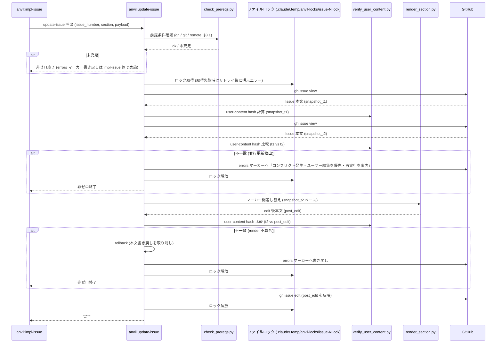
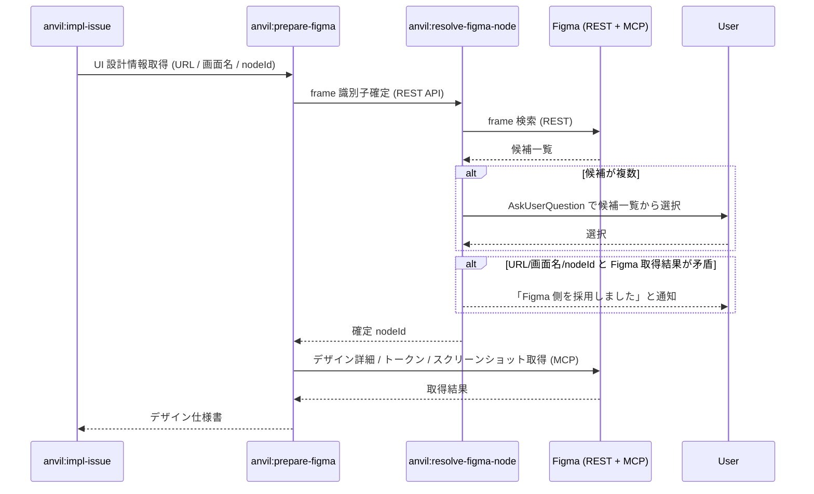

# DES-025 issue-driven-flow 設計: GitHub Issue を起点にした SDD パイプライン連携

> 本設計書は temporary-feature-design として位置付け、REQ-005（issue-driven-flow 要件定義）に対応する。要件と矛盾する場合は要件定義書を正とする。本 feature 実装完了後、本設計書は恒久的な設計書群へ merge される予定。

## メタデータ

| 項目     | 値                           |
| -------- | ---------------------------- |
| 設計ID   | DES-025                      |
| 関連要件 | REQ-005, COMMON-REQ-002      |
| 親設計   | なし（feature トップレベル） |
| 作成日   | 2026-04-25                   |
| 対象     | anvil プラグイン             |

---

## 1. 概要

GitHub Issue を入口に、要件定義 → 設計 → 計画 → 実装 → PR 作成までを一連で回せるオーケストレーションを anvil プラグイン配下の skill 群として構成する。SDD 各工程は forge 既存 skill（`/forge:start-requirements`, `/forge:start-design`, `/forge:start-plan`, `/forge:start-implement`）を Skill tool 経由で呼び出し、forge は改変しない（NFR-01）。Issue への書き戻しは「ユーザー記述セクション」と「機械追記セクション」を HTML コメントマーカーで分離し、機械追記セクションのみを冪等に上書きすることで I-03（ユーザー記述不変）を **機械的に検証可能** にする。

---

## 2. アーキテクチャ概要

### 2.1 プラグイン境界と依存方向



- `anvil → forge` の一方向依存のみを許容する（NFR-01 / I-01）。
- forge スクリプト（`session_manager.py`, `resolve_doc_structure.py`, `next-spec-id`）は anvil から直接 import / subprocess 呼び出ししない。常に forge skill を Skill tool 経由で起動し、結果は forge の出力契約（session_dir / refs/*.yaml）越しに受け取る。forge skill の出力契約詳細は `DES-014_orchestrator_session_protocol_design.md` および `DES-017`〜`DES-019` に従う（§6.3 で取得経路を再掲）。

### 2.2 役割分担（Skill 単位）

| Skill                      | 種別           | 責務                                                                                          |
| -------------------------- | -------------- | --------------------------------------------------------------------------------------------- |
| `anvil:create-issue`       | user-invocable | FNC-01。Issue 種別（Bug Report / Feature Request）を確認し、必須セクションを満たす Issue 起票 |
| `anvil:impl-issue`         | user-invocable | FNC-02。Issue 番号を入口に SDD パイプライン → PR 作成までをオーケストレーション               |
| `anvil:update-issue`       | AI-only        | FNC-03。Issue 本文の機械追記セクション（成果物リンク・進捗）を冪等に書き戻し                  |
| `anvil:prepare-figma`      | AI-only        | FNC-05。Figma 由来情報を取得しデザイン仕様書を作成（汎用 Agent として呼ばれる）               |
| `anvil:resolve-figma-node` | AI-only        | FNC-05 補助。Figma URL/画面名/識別子から正しい frame ID を確定                                |
| `anvil:figma-mcp-guide`    | リファレンス   | Figma MCP の知識ベース（呼び出されず参照される）                                              |

委譲のみで内部処理を持たない skill（`anvil:commit`, `anvil:create-pr`）は既存のまま流用する。

---

## 3. モジュール設計

### 3.1 モジュール一覧

| モジュール                     | 責務                                                                                                                                                                                                                                                 | 依存                                                                                                                                                                                                                                                                                         |
| ------------------------------ | ---------------------------------------------------------------------------------------------------------------------------------------------------------------------------------------------------------------------------------------------------- | -------------------------------------------------------------------------------------------------------------------------------------------------------------------------------------------------------------------------------------------------------------------------------------------- |
| `anvil:create-issue` SKILL.md  | 種別選択 / 必須セクション充足検証 / `gh issue create` 実行 / 中核セクション最低情報密度の判定                                                                                                                                                        | `gh` CLI、`plugins/anvil/scripts/check_prereqs.py`、`plugins/anvil/scripts/audit_log.py`、`plugins/anvil/skills/create-issue/scripts/validate_sections.py`                                                                                                                                   |
| `anvil:impl-issue` SKILL.md    | Phase 0〜14 のオーケストレーション、種別対話確認、forge skill 起動、各工程完了で update-issue 呼び出し、push 完了後に create-pr 呼び出し                                                                                                             | `forge:start-*` skill 群、`anvil:update-issue`、`anvil:prepare-figma`、`anvil:commit`、`anvil:create-pr`、`plugins/anvil/scripts/check_prereqs.py`、`plugins/anvil/scripts/verify_pushed.py`、`plugins/anvil/scripts/audit_log.py`、`plugins/anvil/skills/impl-issue/scripts/parse_issue.py` |
| `anvil:update-issue` SKILL.md  | 機械追記セクション（artifacts / status / errors）の冪等書き戻し、マーカー検出、ユーザー記述セクション保護検証、並行更新検出（取得時点 t1 / edit 直前 t2 / edit 後 t3 の三時点 hash 比較）、ファイルロック取得                                        | `gh` CLI、`plugins/anvil/scripts/check_prereqs.py`、`plugins/anvil/scripts/audit_log.py`、`plugins/anvil/skills/update-issue/scripts/render_section.py`、`plugins/anvil/skills/update-issue/scripts/verify_user_content.py`                                                                  |
| `anvil:prepare-figma` SKILL.md | Figma 由来情報の取得とデザイン仕様書生成、resolve-figma-node 呼び出し                                                                                                                                                                                | `anvil:resolve-figma-node`、`Figma MCP`、`FIGMA_PAT`                                                                                                                                                                                                                                         |
| `anvil:resolve-figma-node`     | URL / 画面名 / nodeId を起点に Figma 上で frame を確認し正規 ID を確定。複数候補検出時は候補一覧を返却し SKILL.md 側で AskUserQuestion 提示。URL / 画面名 / nodeId と Figma 取得結果が矛盾する場合は Figma 側を採用しユーザーに通知                  | `Figma REST API`、`FIGMA_PAT`                                                                                                                                                                                                                                                                |
| `anvil:figma-mcp-guide`        | Figma MCP 各 tool の使い分け・引数仕様の知識ベース（呼び出されず、prepare-figma / resolve-figma-node から参照のみ）                                                                                                                                  | (参照のみ)                                                                                                                                                                                                                                                                                   |
| 共通スクリプト                 | 前提条件チェック (`check_prereqs.py`) / 共通監査ログ出力 (`audit_log.py`) / push 完了検証 (`verify_pushed.py`)。Issue 本文パース (`parse_issue.py`) / マーカー差し替え (`render_section.py`) は skill ローカル責務として各 SKILL.md 行の依存列に記載 | 標準ライブラリのみ（implementation_guidelines.md 準拠）                                                                                                                                                                                                                                      |

### 3.2 共通スクリプトの配置と関数境界

```text
plugins/anvil/
├── scripts/                        # プラグイン共通スクリプト（複数 skill から参照）
│   ├── audit_log.py                # NFR-03 ローカルログ出力（create-issue / impl-issue / update-issue から参照）
│   ├── check_prereqs.py            # ERR-01 前提条件チェック（gh / git / 任意で FIGMA_PAT。create-issue / impl-issue / update-issue から参照）
│   └── verify_pushed.py            # FNC-03 push 完了検証（HEAD と `git ls-remote origin <branch>` の sha 一致判定）
└── skills/
    ├── create-issue/
    │   ├── SKILL.md
    │   └── scripts/
    │       └── validate_sections.py    # FNC-01 必須セクション・最低情報密度の判定 / UI 関連 Feature Request の Figma 参照情報必須チェック
    ├── impl-issue/
    │   ├── SKILL.md
    │   ├── references/                 # Phase 別の詳細手順書（既存ドラフトから移植）
    │   └── scripts/
    │       └── parse_issue.py          # Issue 本文を user-content / artifacts / status / errors に分割
    ├── update-issue/
    │   ├── SKILL.md
    │   └── scripts/
    │       ├── render_section.py       # マーカー間差し替え（冪等）
    │       └── verify_user_content.py  # I-03 検証（取得時点・edit 直前・edit 後の三時点で user-content 区間 hash が一致するか）
    ├── prepare-figma/
    │   └── SKILL.md
    ├── resolve-figma-node/
    │   └── SKILL.md
    └── figma-mcp-guide/
        └── SKILL.md
```

責務境界:

- `check_prereqs.py` は ERR-01 の判定だけを行い、メッセージ整形は SKILL.md 側が担当する。共通スクリプトとして 3 skill（create-issue / impl-issue / update-issue）から参照される。
- `audit_log.py` は NFR-03 が外部 API 呼出の全操作を対象とするため、3 skill 横断の共通ログ機構として `plugins/anvil/scripts/` 配下に配置する。`implementation_guidelines.md` のスクリプト配置規約（プラグイン共通は `plugins/{plugin}/scripts/`）に従う。
- `verify_pushed.py` は FNC-03 不変条件「成果物作成 → push → 書き戻し」の機械的検証を担う。書き戻し直前に `git ls-remote origin <branch>` と HEAD sha の一致を確認する。
- `validate_sections.py` / `verify_user_content.py` は **判定** のみ。修正・テンプレ書き戻しは行わない（これは AI 側の責務）。
- `validate_sections.py` は種別別必須セクション充足・不在表現の閉集合・最低情報密度の判定に加え、UI 関連 Feature Request 検出時には Figma 参照情報（Figma URL / 画面名 / 対象フレームの識別子のいずれか 1 つ以上）の有無を必須チェックする。判定軸はキーワード一覧（「画面」「レイアウト」「UI」「ボタン」等）と AskUserQuestion による対話確認の併用とする。
- `render_section.py` は **マーカー間差し替え** に限定し、user-content マーカー外を絶対に編集しない。不変条件として: (a) `<marker>:start` と `<marker>:end` が各 1 回だけ出現することを前提とし、不一致（複数出現・順序逆転・対の一方欠損）を検出した場合は非ゼロ終了して errors マーカー書き戻しに帰着する、(b) `:start` の前に必ず `user-content:end` または BOF が来ること（user-content の内側に機械マーカーを挟まれた場合は ERR）、(c) マーカー不在時は機械追記用マーカーを Issue 末尾に挿入する。
- `verify_user_content.py` は I-03 検証として、(1) 取得時点の user-content 区間 hash、(2) edit 直前に再取得した user-content 区間 hash、(3) edit 後の user-content 区間 hash の三時点で一致することを必須条件とする。(1)/(2) 不一致なら並行更新（GitHub UI 直接編集 / impl-issue 並走）と判定し edit を行わず errors マーカーに「コンフリクト発生・ユーザー編集を優先・再実行を案内」を書き戻して非ゼロ終了する。
- Figma API 呼び出しは `Authorization` 系ヘッダ（`X-Figma-Token` 等）を `env=` で渡し argv に埋め込まない。`/proc/<pid>/cmdline` 経由の漏洩を避ける。
- 共通スクリプトおよび SKILL.md は機密マスクの責務を持つ（§8.5 参照）。stderr / errors マーカー書き戻し / audit_log message に出力する直前で `FIGMA_PAT` / `Authorization` ヘッダ値 / `gh` トークン形式に一致する文字列を `***REDACTED***` に置換する。
- 同一 Issue に対する update-issue の並行実行を防ぐため `.claude/.temp/anvil-locks/issue-<N>.lock` のファイルロックを取得する。取得失敗時はリトライ後に明示エラーで終了。

### 3.3 クラス図（主要型のみ）



`IssueKind`（FNC-01: Bug Report / Feature Request）と `RuntimeKind`（FNC-04: UI Issue / 非 UI Issue）は別軸として明確に分離する。

### 3.4 `anvil:impl-issue` の内部責務分割

`anvil:impl-issue` は Phase 0〜14 のオーケストレーション・種別対話・forge 4 skill 起動・update-issue 連携・prepare-figma 呼出・commit/create-pr 委譲・承認ダイアログ・失敗ハンドリングを束ねる単一 skill だが、SKILL 分割基準（`docs/rules/skill_authoring_notes.md`）と `DES-010_create_skills_orchestrator_design.md` のオーケストレータ／汎用 Agent 分離パターンに従い、責務は次の通り分離する:

| 配置                                                    | 責務                                                                                                                                               |
| ------------------------------------------------------- | -------------------------------------------------------------------------------------------------------------------------------------------------- |
| `plugins/anvil/skills/impl-issue/SKILL.md`              | Phase 進行制御のみ。Phase 番号運用 / 工程起動順序 / 書き戻しタイミング / 完了判定 / 中断検知                                                       |
| `plugins/anvil/skills/impl-issue/references/phase_*.md` | 各 Phase の詳細手順（コンテキスト構築・対話文言・失敗時の errors メッセージテンプレート）。SKILL.md から `Read` で参照されるドキュメントとして分離 |
| `anvil:resolve-runtime-kind`（必要に応じ別 skill）      | FNC-04 の RuntimeKind 確認対話。impl-issue から Skill tool 経由で起動する形に切り出す余地あり。本 feature では impl-issue Phase 2 内に内包する     |

これにより TBD-001（種別粒度拡張）の際は references/* と RuntimeKind enum / Phase 経路表のみを更新すれば済み、SKILL.md 本体の Phase 進行ロジックには影響しない。

---

## 4. ユースケース設計

### 4.1 ユースケース一覧

| ユースケース              | 起動                                | 主たる成果                                                |
| ------------------------- | ----------------------------------- | --------------------------------------------------------- |
| UC-01 Issue 起票          | `/anvil:create-issue [タイトル]`    | 種別別必須セクションを満たす Issue が GitHub に作成される |
| UC-02 Issue 起点 SDD 実行 | `/anvil:impl-issue #N`              | SDD パイプライン完了後に PR が作成される                  |
| UC-03 工程完了の書き戻し  | impl-issue 内部から呼び出し         | Issue 本文の機械追記セクションが工程完了で更新される      |
| UC-04 UI 設計情報取得     | impl-issue Phase 7（UI Issue のみ） | Figma 由来情報がデザイン仕様書として保存される            |

### 4.2 シーケンス図

#### UC-01 Issue 起票（FNC-01）



**前提条件**: gh CLI 認証済み、カレントディレクトリが git リポジトリ、remote 設定済み（ERR-01）。
**正常フロー**: 種別選択 → 必須セクション収集 → 検証 → ユーザー承認 → 起票。
**エラーフロー**: 前提条件未充足 → stderr 出力 + 非ゼロ終了。中核セクション不足 → 再入力。

#### UC-02 Issue 起点 SDD 実行（FNC-02）



**前提条件**: UC-01 の前提に加え、UI Issue の場合は `FIGMA_PAT` が設定されかつ Figma ファイルメタ情報取得に成功する。さらに `gh` 認証は `gh api repos/{owner}/{repo} --jq .permissions.push` で write 権限を Phase 0 に事前確認する（§8.1）。
**正常フロー**: 種別確認 → 4 工程順次起動 → 各工程は forge skill 側で push まで完了 → impl-issue は `verify_pushed` で HEAD と origin の sha 一致を確認後に書き戻し → ユーザー承認 → PR 作成。
**push 責務**: push の実行は forge skill の責務（forge skill 内部で `/anvil:commit` を呼び push まで完了）。impl-issue は forge skill 完了通知を受領後 push SHA をセッションに記録し `verify_pushed` で機械的に確認するに留める。push 失敗は forge skill 側が非ゼロ終了で返し、impl-issue は §8.2 表「forge skill が非ゼロ終了」の経路で扱う。`pending_push` 状態（forge 側 commit 成功後の push 段階失敗等）からの復帰は §7 状態管理 / §8.2 の `--resume-push <phase>` で再開する。
**エラーフロー**: TBD-003 解決方針（§9.1）に従う。

#### UC-03 工程完了の書き戻し（FNC-03）



**update-issue 内部処理順序**: (1) ファイルロック取得、(2) `verify_user_content` による事前 snapshot（取得時点 hash）、(3) edit 直前の再取得 hash 比較で並行更新を検出、(4) `render_section` でマーカー間差し替え、(5) `verify_user_content` による事後比較、(6) 不一致なら write をロールバックして errors マーカーへ書き戻し非ゼロ終了、(7) 一致なら `gh issue edit` を発行、(8) ファイルロック解放。

#### UC-04 UI 設計情報取得（FNC-05）



**矛盾解決方針** (REQ-005 §5.5): URL / 画面名 / nodeId が Figma 取得結果と矛盾する場合は Figma 側の存在確認結果を優先し、ユーザーに採用結果を通知する。識別子が複数一致した場合は候補一覧を AskUserQuestion で提示しユーザーに選択を求める。
**依存先別の失敗挙動** (§8.2 と整合): frame 識別子確定（REST: resolve-figma-node）の失敗と、デザイン詳細取得（MCP: prepare-figma）の失敗は §8.2 で別行として扱う。

---

## 5. 使用する既存コンポーネント

| コンポーネント                                                                                                    | ファイルパス                                       | 用途                                                                                                     |
| ----------------------------------------------------------------------------------------------------------------- | -------------------------------------------------- | -------------------------------------------------------------------------------------------------------- |
| forge:start-requirements                                                                                          | `plugins/forge/skills/start-requirements/SKILL.md` | FNC-02 の要件定義工程として Skill tool 経由で起動                                                        |
| forge:start-design                                                                                                | `plugins/forge/skills/start-design/SKILL.md`       | FNC-02 の設計工程として起動。UI Issue 経路では先に anvil:prepare-figma で得た Figma 由来情報を入力に渡す |
| forge:start-plan                                                                                                  | `plugins/forge/skills/start-plan/SKILL.md`         | FNC-02 の計画工程として起動                                                                              |
| forge:start-implement                                                                                             | `plugins/forge/skills/start-implement/SKILL.md`    | FNC-02 の実装工程として起動                                                                              |
| anvil:commit                                                                                                      | `plugins/anvil/skills/commit/SKILL.md`             | Phase 14 のコミット委譲。`Closes #N` を commit message に含む                                            |
| anvil:create-pr                                                                                                   | `plugins/anvil/skills/create-pr/SKILL.md`          | Phase 14 の PR 作成委譲。`.git_information.yaml` 解決を委ねる                                            |
| `.git_information.yaml`                                                                                           | リポジトリルート                                   | owner / repo / default_base_branch / pr_template の参照（impl-issue Phase 0 / create-pr 共通）           |
| ローカルドラフト `.claude/skills/{create-issue, impl-issue, prepare-figma, resolve-figma-node, figma-mcp-guide}/` | 既存                                               | 移植元。SKILL.md / references / assets を `plugins/anvil/skills/` 配下に複製し、anvil 名前空間化する     |
| dprint                                                                                                            | `dprint.jsonc`                                     | SKILL.md / Markdown のフォーマット                                                                       |

### 5.1 既存ドラフト移植時の不変条件

§5.1 は移植時に守るべき不変条件のみを定義する。実行手順の順序は §11 で一意に定義する。

- **複製先**: `.claude/skills/{create-issue, impl-issue, prepare-figma, resolve-figma-node, figma-mcp-guide}/` → `plugins/anvil/skills/{同名}/`
- **書き換える要素**:
  - frontmatter `name`（namespace は plugin.json で付与されるため変更不要）
  - 内部参照のパス（`.claude/skills/...` → `plugins/anvil/skills/...`）
  - skill 起動コマンド（Phase 14 等で書かれている `/anvil:commit` 等は既に namespace 付与済みのため変更不要）
- **削除規約**: 旧 `.claude/skills/` 配下の同名 skill は複製・書き換え完了確認後にのみ削除する。具体的削除タイミングと検証方法は §11 Step 5 を参照（重複記述を避けるため本節では二重記載しない）。

---

## 6. データフロー設計

### 6.1 Issue 本文構造

書き戻し対象を機械的に識別するため、Issue 本文を以下の構造に固定する。

```markdown
<!-- issue-driven-flow:user-content:start -->

（FNC-01 で記録されたユーザー記述セクション。Bug Report / Feature Request の必須セクション）

<!-- issue-driven-flow:user-content:end -->

<!-- issue-driven-flow:artifacts:start -->

## 成果物リンク

- 要件定義書: <REQ-* の GitHub blob URL>
- 設計書: <DES-* の GitHub blob URL>
- 計画書: <plan.yaml の GitHub blob URL>
- 実装コード: <branch / PR diff の GitHub URL>

<!-- issue-driven-flow:artifacts:end -->

<!-- issue-driven-flow:status:start -->

## 進捗ステータス

- 現在進行中: <要件定義 / 設計 / 計画 / 実装 / 完了>
- 完了済み: <列挙>

<!-- issue-driven-flow:status:end -->

<!-- issue-driven-flow:errors:start -->

（任意。失敗時のみ存在。TBD-003 §9.1 解決方針に従い、エラー詳細・再開手順を記載）

<!-- issue-driven-flow:errors:end -->
```

書き戻し（FNC-03）は `:start` / `:end` マーカー対の **間** のみを差し替える。マーカーが見つからない場合は user-content マーカー対の直後に新規挿入し、user-content の本文には一切触れない。これにより I-03 を機械的に検証可能にする（TBD-002 解決）。

### 6.2 セクション ID と冪等性

| セクションマーカー | 書き戻しタイミング    | 冪等戦略                                                 |
| ------------------ | --------------------- | -------------------------------------------------------- |
| `user-content`     | FNC-01 で 1 回のみ    | 以降は読み取り専用。書き戻しで触れない                   |
| `artifacts`        | 各工程完了 push 後    | マーカー間を毎回全置換                                   |
| `status`           | 各工程開始時 / 完了時 | マーカー間を毎回全置換                                   |
| `errors`           | 工程失敗時            | 失敗時のみ作成。再実行で成功した場合はマーカー対ごと削除 |

### 6.3 セッション連携

- impl-issue は自身の session（`.claude/.temp/impl-issue-XXXX/`）を作成し、対象 Issue 番号 / 種別（IssueKind / RuntimeKind）/ 進捗を保持する。
- forge skill は各々が自身の session（`start-requirements-XXXX` 等）を持つ。impl-issue は forge skill が出力する session_dir のパスを記録するに留め、forge の session 内部には立ち入らない。
- impl-issue session の構造:
  ```yaml
  feature: issue-driven-flow
  issue_number: 123
  issue_kind: bug_report | feature_request
  runtime_kind: ui_issue | non_ui_issue
  phases:
    requirements: {
      status: completed,
      output: docs/specs/.../REQ-NNN_*.md,
      push_sha: <sha>, # 必須項目: 書き戻し直前に origin と一致確認
      forge_session: <相対パス>, # forge skill 出力の session_dir 相対パス
    }
    design: { status: in_progress, ... }
    plan: { status: pending }
    implement: { status: pending }
  ```
- **forge skill 成果物パス取得の公式経路**: forge skill の出力契約は `DES-014_orchestrator_session_protocol_design.md` および `DES-017`〜`DES-019` に従う。impl-issue は当該契約に定められた `<forge_session>/output.yaml`（相当）から成果物パス（`output`）と push SHA（`push_sha`）を取得する。forge skill 内部スクリプト（`session_manager.py` 等）への直接アクセスは NFR-01 / I-01 違反となるため禁止する。
- **session 保存の不変条件**: session に書き込んでよいのは「Issue 番号 / 種別 / 工程ステータス / forge session_dir 相対パス / push_sha / 成果物 path」のみ。以下は session に保存しない:
  - `FIGMA_PAT` / `Authorization` ヘッダ値 / `gh` トークン / URL に埋め込まれたトークン
  - Figma API レスポンス本文（中間キャッシュとして必要な場合は別パス `.claude/.temp/anvil-figma-cache-XXXX/` に隔離し、PAT を含めない）
- `push_sha` は必須項目とし、各書き戻しの直前に `git ls-remote origin <branch>` の sha と一致することを §7 の不変条件に従って機械検証する。

---

## 7. 状態管理設計

| 状態軸         | 値                                                                  | 遷移トリガー                                            |
| -------------- | ------------------------------------------------------------------- | ------------------------------------------------------- |
| Phase 進行     | `pending → in_progress → completed` (各 SDD 工程および PR 作成工程) | forge skill 起動 / 成果物 push 完了                     |
| Runtime Kind   | 未確定 → `ui_issue` / `non_ui_issue`                                | FNC-04 の対話確認（impl-issue Phase 2）                 |
| Figma 取得     | `not_required → in_progress → completed / failed`                   | UI Issue が選択された時点で `in_progress` に遷移        |
| Issue 書き戻し | `not_written → written` (artifacts / status の各マーカーごと)       | 各工程完了時に update-issue が `written` に更新         |
| Error          | `none → present (TBD-003 解決方針に従い停止 or リトライ)`           | forge skill から非ゼロ終了 / Figma 取得失敗 / push 失敗 |

完了判定は「成果物ファイルが存在 **かつ** リモートへ push 済み」（FNC-02 完了判定）とし、push を待たずに書き戻しを実行しない（FNC-03 不変条件）。push 完了の機械的検証は `verify_pushed.py`（§3.2 共通スクリプト）で行い、HEAD commit が `git ls-remote origin <branch>` の sha と一致することを `update-issue` 呼出直前の不変条件として要求する。`pending_push` 状態（forge skill 完了後に push 段階で失敗）からの復帰は `/anvil:impl-issue #N --resume-push <phase>` で再開する（§8.2 と整合）。

---

## 8. エラーハンドリング設計

### 8.1 ERR-01: 前提条件未充足

`anvil:create-issue` / `anvil:impl-issue` / `anvil:update-issue` は起動時に `check_prereqs.py` を呼び、以下を順序通り検査する。最初に失敗した項目で即時 stop する（後段の検査を実行しない、複合エラーで stderr を汚さない）。

| 順序 | 検査項目                     | 検査方法                                                                                                                                            | 対象                                     |
| ---- | ---------------------------- | --------------------------------------------------------------------------------------------------------------------------------------------------- | ---------------------------------------- |
| 1    | `gh` インストール / 認証     | `gh --version` / `gh auth status` 終了コード                                                                                                        | 全 skill                                 |
| 2    | `gh` write 権限 (scope 確認) | `gh api repos/{owner}/{repo} --jq .permissions.push` が `true` を返すこと。Issue 起票・書き戻し・PR 作成いずれにも write 権限が必要なため事前に確認 | 全 skill（impl-issue は Phase 0 で実施） |
| 3    | git リポジトリ               | `git rev-parse --is-inside-work-tree`                                                                                                               | 全 skill                                 |
| 4    | リモート設定                 | `git remote get-url origin`                                                                                                                         | 全 skill                                 |
| 5    | `FIGMA_PAT` 環境変数         | `os.environ.get("FIGMA_PAT")`                                                                                                                       | UI Issue 経路のみ                        |
| 6    | Figma ファイルメタ情報取得   | `https://api.figma.com/v1/files/{key}` HEAD 200。HEAD が 405 を返す場合は GET でヘッダのみ取得                                                      | UI Issue 経路のみ                        |

未充足時:

- 終了コード **`2`**（標準的な「コマンド誤用 / 環境不備」を示す慣例値）。
- stderr に「未充足項目名 + 充足手順 / 参照ドキュメント URL」を **赤色** で出力（`docs/rules/cli_output_formatting.md` 準拠）。
- 標準出力には何も書かない（ERR-01 受け入れ条件）。
- ローカルログ（NFR-03）に検査結果を記録。

### 8.2 TBD-003 解決: 工程失敗時の振る舞い

| 失敗パターン                                                              | 振る舞い                                                                                                                                                                                                                                                                                                                                                                                               |
| ------------------------------------------------------------------------- | ------------------------------------------------------------------------------------------------------------------------------------------------------------------------------------------------------------------------------------------------------------------------------------------------------------------------------------------------------------------------------------------------------ |
| forge skill が非ゼロ終了                                                  | impl-issue は当該工程の status を `failed` にし、Issue の `errors` マーカー間に「失敗工程・直近のエラーメッセージ・再開コマンド（`/anvil:impl-issue #N --resume <phase>`）」を書き戻して終了。後続工程は自動起動しない                                                                                                                                                                                 |
| push 失敗（forge skill が commit 後 push 段階で失敗）                     | 工程は `completed` ではなく `pending_push` に留め、書き戻しは行わない。再開コマンド `/anvil:impl-issue #N --resume-push <phase>` を案内し、`verify_pushed` で origin と一致確認後に書き戻し再開                                                                                                                                                                                                        |
| frame 識別子確定失敗 (REST: resolve-figma-node)                           | 識別子（URL / 画面名 / nodeId）が解決できない場合は再試行 → 別識別子の入力依頼。複数候補時は AskUserQuestion で選択。最終的に解決不能なら UI Issue 経路を中断し、`errors` マーカーに失敗詳細を書き戻す                                                                                                                                                                                                 |
| デザイン詳細 / トークン / スクリーンショット取得失敗 (MCP: prepare-figma) | MCP 接続失敗・トークン取得失敗時はユーザーに 3 択を提示: (a) 別フレームの再指定, (b) 非 UI Issue へ切り替え, (c) 中断。MCP のみの一時障害で REST 側は健在な場合は frame 識別子のみ確定済みとして session に残し、後続再開で MCP 取得のみ再試行可能とする                                                                                                                                               |
| PR 作成失敗                                                               | impl-issue は `errors` に「失敗詳細・Issue 番号・artifacts URL リスト」を書き戻して終了。再実行は **`/anvil:impl-issue #N --resume pr`** で行い、impl-issue 側のレジューム経路を通す。impl-issue は session に記録された `issue_number` を anvil:create-pr に渡し、`Closes #<issue-number>` 必須化（§9.1 TBD-006）を維持する。`/anvil:create-pr` を直接呼ぶ運用は Issue 番号引き継ぎ経路がないため禁止 |
| レート制限再試行尽き (GitHub / Figma)                                     | §8.4 の指数バックオフ上限到達後は forge skill 非ゼロ終了と同じ経路で扱う。errors 書き戻し自体が再度 429 / 403 を踏んだ場合はローカル監査ログ（NFR-03）のみに記録し stderr 出力で終了（無限再帰を防ぐ）                                                                                                                                                                                                 |

サイレントフォールバックは行わず、失敗は必ず Issue の `errors` セクションと stderr の両方に残す（COMMON-REQ-002）。Issue 本文（公開）に書き戻すメッセージは §8.5 の機密情報マスクを通過させる。

### 8.3 NFR-03 ローカル監査ログ

`audit_log.py` が以下のフォーマットで `.claude/.temp/anvil-audit/<YYYY-MM-DD>.log` に追記する。

```text
<ISO8601>\t<skill>\t<operation>\t<target_id>\t<phase>\t<correlation_id>\t<status>\t<message>
```

| 列             | 値                                                                                        |
| -------------- | ----------------------------------------------------------------------------------------- |
| ISO8601        | UTC タイムスタンプ                                                                        |
| skill          | `anvil:create-issue` / `anvil:impl-issue` / `anvil:update-issue` 等                       |
| operation      | `create_issue` / `forge_invoke` / `rewrite` / `figma_fetch` 等                            |
| target_id      | Issue 番号 / `#-`（未確定時）                                                             |
| phase          | `start` / `end` / `error` のいずれか（TBD-007 解決の事後集計に必要な開始/終了ペア識別子） |
| correlation_id | 開始/終了ログをペアにする UUID（同一 operation の start ↔ end で共通値）                  |
| status         | `ok` / `failed`                                                                           |
| message        | 補足情報。§8.5 の機密マスクを必ず通過させた後に書き込む                                   |

例:

```text
2026-04-25T10:00:01Z   anvil:create-issue    create_issue   #-     start  c1a2...  ok       title="Bug: Login fails"
2026-04-25T10:00:02Z   anvil:create-issue    create_issue   123    end    c1a2...  ok       elapsed_ms=1100
2026-04-25T10:05:30Z   anvil:impl-issue      forge_invoke   123    start  d4b5...  ok       phase=requirements
2026-04-25T10:05:42Z   anvil:impl-issue      forge_invoke   123    end    d4b5...  ok       elapsed_ms=12000
2026-04-25T10:08:12Z   anvil:update-issue    rewrite        123    end    e7c8...  ok       section=artifacts
```

#### 8.3.1 ログ保存ポリシー

| 項目                   | 規定                                                                                                                                                                 |
| ---------------------- | -------------------------------------------------------------------------------------------------------------------------------------------------------------------- |
| ファイル名の日付       | UTC                                                                                                                                                                  |
| 既定保存期間           | 90 日。超過分は次回呼び出し時に `audit_log.py` が削除                                                                                                                |
| 上限サイズ             | 1 ファイル 10MiB を超えたら `<YYYY-MM-DD>_<seq>.log` にローテーション                                                                                                |
| ディスク書き込み失敗時 | audit_log の失敗を理由に upstream skill を停止させず、stderr に `WARN: audit_log write failed` を出して呼び出し元に処理継続させる（補助情報のため）。WARN は必須出力 |

### 8.4 レート制限（NFR-03）

GitHub / Figma の HTTP レスポンス `429` または `X-RateLimit-Remaining: 0` を含む 4xx を検出した場合、COMMON-REQ-002 の方針に従って指数バックオフで再試行する（最大 3 回 / 初期 30s）。Figma API のレート制限ヘッダ表記揺れ（`X-Rate-Limit-Remaining`）にも対応する。再試行を尽くしてもなお失敗する場合は §8.2 「レート制限再試行尽き」行に従う。

> 上限値（最大 3 回 / 初期 30s）は GitHub secondary rate limit（短期スパイク）の回復を想定する。primary rate limit（1 時間枠）はバックオフ単独では回復しないため、上限到達時は §8.2 のサイレント停止経路（errors 書き戻しの再 429 を抑止しつつ stderr / audit_log のみに記録）に帰着させる。

### 8.5 機密情報マスク

公開チャネル（GitHub Issue 本文の errors マーカー / PR 本文 / stderr / 監査ログ message）に書き出す前に、以下の文字列パターンを `***REDACTED***` に置換する不変条件を全スクリプト・SKILL.md に課す。

| マスク対象                                 | 検出方法                                                                                        |
| ------------------------------------------ | ----------------------------------------------------------------------------------------------- |
| `FIGMA_PAT` の値                           | 環境変数 `FIGMA_PAT` の現在値と完全一致するすべての部分文字列                                   |
| `Authorization` / `X-Figma-Token` ヘッダ値 | HTTP リクエスト/レスポンスシリアライズ時に当該ヘッダ値を除去                                    |
| `gh` 認証トークン形式                      | `gho_[A-Za-z0-9]+` / `ghp_[A-Za-z0-9]+` / `github_pat_[A-Za-z0-9_]+` の正規表現に一致する文字列 |
| URL に埋め込まれた basic auth 形式         | `https://[^@/]+:[^@/]+@` パターンに一致する文字列                                               |

責務帰属:

- 共通スクリプト（`audit_log.py` / `parse_issue.py` 等）は呼び出し元から渡された `message` 文字列に対し、TSV エスケープより先にマスクを適用する。
- subprocess 呼び出しは `Authorization` 系ヘッダを `env=` で渡し argv に埋め込まない（`/proc/<pid>/cmdline` 経由の漏洩を防ぐ）。
- 単体テスト（§10.1）で各マスク対象が公開チャネルに出力されないことを検証する。

### 8.6 PR 本文生成の境界

NFR-02 は成果物 → Issue 方向の複製を禁止する。逆方向（Issue → PR）の転記境界は本節で規定する。

| 項目                                                        | 規定                                                                                                                                                         |
| ----------------------------------------------------------- | ------------------------------------------------------------------------------------------------------------------------------------------------------------ |
| PR 本文に転記してよい情報                                   | (a) `Closes #<issue-number>`、(b) artifacts セクションのリンクのみ、(c) コミットメッセージ由来の実装サマリ                                                   |
| PR 本文に転記しない情報                                     | Bug Report の「証跡」「環境情報」「再現手順」など user-content セクション全般。社内ドメイン URL / 端末識別子 / スクリーンショット内 PII 含む                 |
| anvil:create-pr に渡す本文の生成方法                        | `parse_issue.py` で artifacts セクションのみ抽出し、commit message と組み合わせて生成。Issue 本文全体の `--body-file` 渡しは禁止                             |
| `Closes #<issue-number>` の必須化（§9.1 TBD-006）の維持手段 | impl-issue が session の `issue_number` を anvil:create-pr に明示的に渡す。再実行（§8.2 PR 作成失敗時）も `/anvil:impl-issue --resume pr` 経由で同経路を通る |

---

## 9. 主要 TBD の解決

### 9.1 TBD 解決一覧

| TBD                           | 解決方針（本設計書での確定）                                                                                                                                                                                          |
| ----------------------------- | --------------------------------------------------------------------------------------------------------------------------------------------------------------------------------------------------------------------- |
| TBD-001 種別の粒度            | 2 種固定（UI Issue / 非 UI Issue）。3 種以上は本 feature では追加しない。粒度拡張は別 feature                                                                                                                         |
| TBD-002 書き戻し本文構造      | §6.1 の HTML コメントマーカー対による「user-content / artifacts / status / errors」の 4 セクション分離                                                                                                                |
| TBD-003 失敗時の振る舞い      | §8.2 の表に従う。サイレント継続禁止、必ず errors マーカーと stderr に痕跡を残し、後続工程は自動起動しない                                                                                                             |
| TBD-004 PR 作成完了判定       | **PR 作成成功時**（`gh pr create` の正常終了 + PR URL 返却）を完了とする。マージは責務外                                                                                                                              |
| TBD-005 SDD → PR 遷移トリガー | **実装工程の push 完了後にユーザーに PR 作成可否を AskUserQuestion** で確認。自動遷移しない                                                                                                                           |
| TBD-006 PR-Issue 紐づけ       | PR 本文に `Closes #<issue-number>` を **必須** で含める。マージ時に Issue が自動クローズされる                                                                                                                        |
| TBD-007 個別操作の応答時間    | 設けない（NFR-03 と同じくスコープ外）。NFR-03 のローカル監査ログで `phase: start \| end` 列と `correlation_id` 列をペアにする（§8.3 / §8.3.1）ことで開始 / 終了の対を機械的に再構成可能にし、事後集計の根拠を提供する |

### 9.2 TBD-005 で「自動遷移」を採らない理由

実装工程は人間のレビュー対象（コードレビュー）を含むため、push 完了直後に PR 作成へ移行すると「実装の自己レビューを飛ばす」運用を誘発する。明示的なユーザー承認を挟むことで、実装直後の見直し機会を担保する。

---

## 10. テスト設計

### 10.1 単体テスト対象

| 対象                       | 主たる検証                                                                                                                                                                                                                                                                   |
| -------------------------- | ---------------------------------------------------------------------------------------------------------------------------------------------------------------------------------------------------------------------------------------------------------------------------- |
| `check_prereqs.py`         | 各前提条件のモック下で順序通り検査されること、最初の失敗で即終了すること、`gh` write 権限検査（順序 2）が `permissions.push: false` で失敗すること                                                                                                                           |
| `validate_sections.py`     | 種別別必須セクション充足、不在表現の閉集合、最低情報密度の判定、UI 関連 Feature Request 検出時の Figma 参照情報必須チェック                                                                                                                                                  |
| `parse_issue.py`           | 4 マーカー対のパース、マーカー欠損 / 順序逆転 / 重複時の挙動                                                                                                                                                                                                                 |
| `render_section.py`        | (a) 既存マーカー間の置換、(b) マーカー不在時の追加、(c) user-content マーカー外への非影響、(d) `<marker>:start` / `<marker>:end` が複数出現する場合に非ゼロ終了、(e) `:start` の前に `user-content:end` も BOF も無い場合（user-content 内側に機械マーカー混入）に非ゼロ終了 |
| `verify_user_content.py`   | 書き戻し前後で user-content が一字一句不変であることの検証、取得時点 (t1) と edit 直前 (t2) の二時点 hash 比較で並行更新を検出すること、edit 後 (t3) との比較で render 不具合を検出すること                                                                                  |
| `verify_pushed.py`         | HEAD と `git ls-remote origin <branch>` の sha 一致時のみ ok、不一致時は非ゼロ終了                                                                                                                                                                                           |
| `audit_log.py`             | ファイル排他、ローテーション境界（10MiB / 90 日）、TSV エスケープ、機密マスクが TSV エスケープより先に適用されること、phase/correlation_id 列が start/end ペアで再構成可能であること、ディスク書き込み失敗時に WARN を stderr 出力して非停止                                 |
| 機密マスク（横断テスト）   | `FIGMA_PAT` の値・`gho_/ghp_/github_pat_` トークン形式・basic auth URL 形式が、errors マーカー書き戻し / PR 本文 / stderr / audit_log message の各経路で `***REDACTED***` に置換されること                                                                                   |
| session 構造（横断テスト） | `session.yaml` に `FIGMA_PAT` / `Authorization` 値 / `gh` トークン形式が混入していないこと（正規表現で禁止パターンチェック）                                                                                                                                                 |

テストは `tests/anvil/{create_issue, impl_issue, update_issue}/` に配置する（CLAUDE.md `## Testing` 規約準拠、Python 標準ライブラリのみ）。

### 10.2 統合テスト対象

| シナリオ                                                                  | 期待動作                                                          |
| ------------------------------------------------------------------------- | ----------------------------------------------------------------- |
| Bug Report Issue → SDD 全工程 → PR 作成                                   | 4 工程の書き戻し、Issue マーカー構造の保持、PR 本文に `Closes #N` |
| Feature Request UI Issue → Figma 取得 → SDD 全工程                        | Phase 7 で prepare-figma が起動、デザイン仕様書が design/ に出力  |
| 設計工程の失敗 → 書き戻しに errors マーカー追加 → 後続工程未起動          | §8.2 の失敗パターン通り、errors セクションが Issue に出現         |
| user-content 改変試行（テストでマーカー外を編集） → render_section が拒否 | I-03 の機械的検証                                                 |

### 10.3 ゴールデンサンプル

`tests/anvil/golden/` に以下を配置:

- `bug_report_full.md` — Bug Report Issue の完全本文サンプル
- `feature_ui_full.md` — Feature Request UI Issue サンプル
- `roundtrip_artifacts.md` — 書き戻しの差分テスト用 before / after ペア

---

## 11. 移植・実装順序

| Step | 作業                                                                                                    | 依存           | 検証方法                                                                                                                                                                   |
| ---- | ------------------------------------------------------------------------------------------------------- | -------------- | -------------------------------------------------------------------------------------------------------------------------------------------------------------------------- |
| 1    | `plugins/anvil/skills/{prepare-figma, resolve-figma-node, figma-mcp-guide}/` を移植                     | -              | 単独で `/anvil:resolve-figma-node` 等が起動可能                                                                                                                            |
| 2    | `update-issue` 系スクリプト（`render_section`, `verify_user_content`, `parse_issue`）と SKILL.md を実装 | -              | 単体テスト + golden roundtrip                                                                                                                                              |
| 3    | `create-issue` を移植 + `validate_sections` / `check_prereqs` を実装                                    | Step 2         | 統合テスト（種別別 Issue 起票）                                                                                                                                            |
| 4    | `impl-issue` を移植し forge skill 委譲 + update-issue 連携を組む                                        | Step 1, 2, 3   | 統合テスト（SDD 全工程 + Figma 経路）                                                                                                                                      |
| 5    | 旧 `.claude/skills/` ドラフトを削除（§5.1 削除規約に従う）                                              | Step 1〜4 完了 | 既存 `/create-issue` 等のローカル呼び出しが skill 解決経由で plugins/anvil 側を指すことを確認、`grep -r '\.claude/skills/' plugins/anvil/skills/` がヒットしないことを確認 |
| 6    | marketplace.json / plugin.json を anvil 側に新 skill を登録                                             | Step 1〜5      | `/plugin install anvil` 後に新 skill が解決される                                                                                                                          |
| 7    | dprint fmt / 全テスト実行                                                                               | Step 1〜6      | `python3 -m unittest discover -s tests` 全 pass                                                                                                                            |

---

## 12. 設計判断の根拠

### 12.1 forge スクリプトを直接 import せず Skill 経由とする理由

- NFR-01 の「anvil → forge」一方向依存を **物理的に強制** するため。Python import 経由だと anvil 側のテストで forge 内部実装に踏み込みやすく、依存の越境が発生しやすい。Skill 起動経由なら forge の出力契約（session_dir / refs/*.yaml / 標準出力 JSON）越しの結合に限定できる。
- forge の内部実装変更（`session_manager.py` の関数シグネチャ等）が anvil に伝播しない。

### 12.2 HTML コメントマーカー方式を採用する理由

- GitHub Issue の Markdown レンダリング時に不可視であり、ユーザー閲覧体験を損なわない。
- before/after の機械比較が `BEGIN..END` 区間切り出しで容易に書ける（`render_section.py` / `verify_user_content.py`）。
- 代替案として「専用フィールド（GitHub Projects 等）への外部化」「JSON ブロック」も検討したが、(a) 外部化は GitHub Issue のコメント / 本文をワンストップで参照できる利点を失う、(b) JSON ブロックは Markdown レンダリングで視認性が悪化し、ユーザー編集時に壊しやすい、ため不採用。

### 12.3 `IssueKind` と `RuntimeKind` を別 enum とする理由

- FNC-01（Issue 種別 = 静的なコンテンツ分類）と FNC-04（実行時種別 = 経路分岐）は本質的に別軸であり、要件定義書のグロッサリーでも明示的に区別している。同一の enum で兼用するとレビューや保守時に混同が起きるため、最初から分離する。

### 12.4 種別 2 種固定（TBD-001 解決）

- 「Figma 由来情報を参照するか否か」は要件で必須軸として規定済み（FNC-04）。
- 3 種以上の細分化は運用知見が蓄積してから検討すべきで、本 feature の最小実装段階で複雑性を持ち込まない。
- 別 feature で粒度拡張する場合も `RuntimeKind` enum の追加で吸収可能。
- **拡張時のガイドライン**: 拡張時は `RuntimeKind` への列挙追加 + 各 forge skill 経路へのマッピング更新で済むよう、UI Issue 経路の Figma 取得は `runtime_kind == ui_issue` の単一条件分岐に閉じ込める。Phase 番号運用と対話分岐の双方を改修しなくて済むよう、種別判定ロジックは §3.4 で示した Phase 進行制御の外（references/* または別 skill）に切り出す。
- **後方互換**: 既存 Issue（既に作成済みの非 UI / UI Issue）の後方互換は `RuntimeKind` の既存値（`ui_issue` / `non_ui_issue`）を変更しないことで担保する。新たな種別は新規列挙値の追加のみで導入する。

---

## 改定履歴

| 日付       | バージョン | 内容     |
| ---------- | ---------- | -------- |
| 2026-04-25 | 1.0.0      | 初版作成 |
