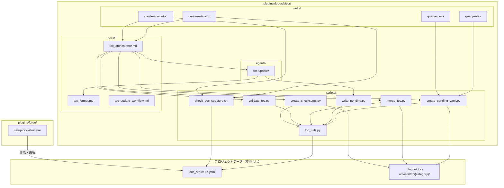
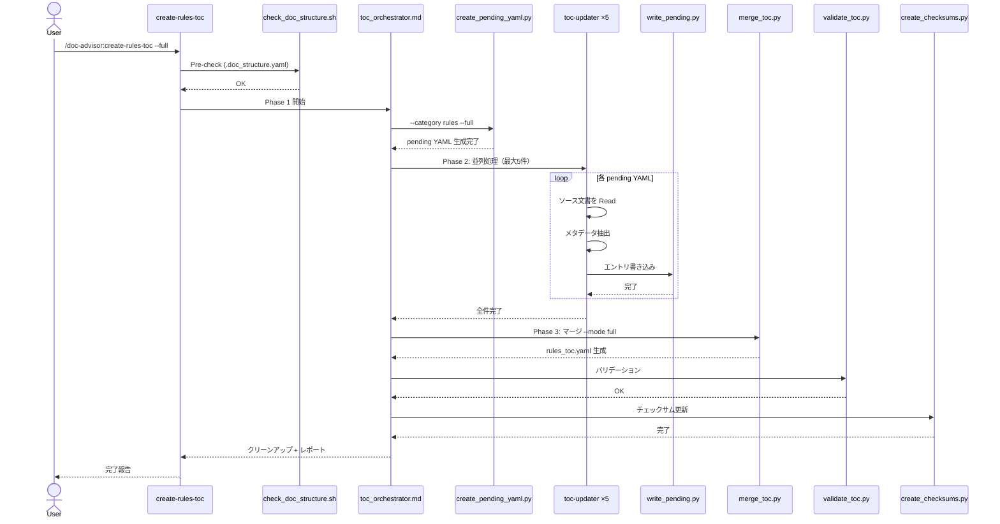
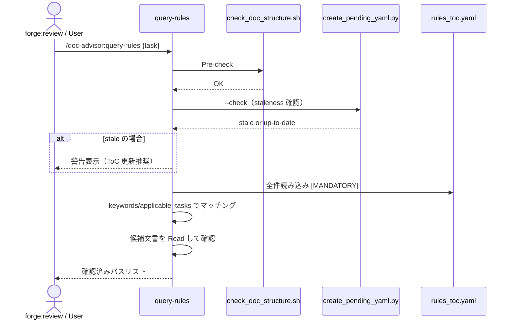

# DES-001 DocAdvisor プラグイン移行 設計書

## メタデータ

| 項目     | 値                                                                                     |
| -------- | -------------------------------------------------------------------------------------- |
| 設計ID   | DES-001                                                                                |
| 関連要件 | （移行計画書: `docs/specs/doc-advisor/reference/specs/plan/plugin_migration_plan.md`） |
| 作成日   | 2026-03-27                                                                             |

## 1. 概要

DocAdvisor-CC（テンプレートベースのインストーラ）を Claude Code プラグインとして bw-cc-plugins リポジトリに移行する。setup.sh による `.claude/` への展開方式を廃止し、`plugins/doc-advisor/` 配下に全コンポーネントを配置する。最大の設計変更は config.yaml の廃止と `.doc_structure.yaml` の直接参照への切り替えである。

**採用アプローチ**: 既存の forge/anvil プラグインパターンに準拠しつつ、DocAdvisor 固有の制約（スクリプト間の共有 import）に対応するため scripts/ をプラグインルート直下にフラット配置する。

> **移行計画書との関係**: 本設計書は移行計画書（`docs/specs/doc-advisor/reference/specs/plan/plugin_migration_plan.md`）の Phase 1〜7 を詳細化したものである。移行計画書との差異がある場合は本設計書を正とする。

### 1.1 移行計画書との Phase マッピング

| 移行計画 Phase                       | 設計書セクション    | 備考                                                                                                             |
| ------------------------------------ | ------------------- | ---------------------------------------------------------------------------------------------------------------- |
| Phase 1: プラグイン基盤構築          | 2.1, 6.1, 6.2       |                                                                                                                  |
| Phase 2: パス参照の書き換え          | 5.2, 7.1            |                                                                                                                  |
| Phase 3: スキル名の名前空間化        | 5.2 カテゴリ C, 6.3 |                                                                                                                  |
| Phase 4: Python スクリプトの環境対応 | 5.1                 |                                                                                                                  |
| Phase 5: plugin.json の詳細設定      | 6.1, 6.4            |                                                                                                                  |
| Phase 6: テスト                      | 9                   | **差異**: 移行計画書は bash テスト維持、本設計書は Python unittest に移行                                        |
| Phase 7: 配布                        | 6.2                 | **差異**: 移行計画書の source 形式はオブジェクト型だが、実際の marketplace.json はフラット文字列型。本設計書が正 |

## 2. アーキテクチャ概要

### 2.1 ディレクトリ構造

```
plugins/doc-advisor/
├── .claude-plugin/
│   └── plugin.json
├── agents/
│   └── toc-updater.md
├── skills/
│   ├── query-rules/
│   │   └── SKILL.md
│   ├── query-specs/
│   │   └── SKILL.md
│   ├── create-rules-toc/
│   │   └── SKILL.md
│   └── create-specs-toc/
│       └── SKILL.md
├── scripts/                          # 共有スクリプト（フラット配置）
│   ├── toc_utils.py
│   ├── create_pending_yaml.py
│   ├── write_pending.py
│   ├── merge_toc.py
│   ├── validate_toc.py
│   ├── create_checksums.py
│   └── check_doc_structure.sh
└── docs/
    ├── toc_format.md
    ├── toc_orchestrator.md
    └── toc_update_workflow.md
```

### 2.2 フラット配置の技術的理由

全 Python スクリプトが `from toc_utils import ...` で共通ユーティリティを参照している。同一ディレクトリにフラット配置することで import パスの変更が不要になる。forge プラグインはスキルごとに `scripts/` を分散配置しているが、DocAdvisor ではスクリプト間の依存が密結合（5つの Python スクリプト全てが toc_utils.py に依存）のため、分散配置は不適切。

### 2.3 移行しないコンポーネント

| コンポーネント             | 理由                                           |
| -------------------------- | ---------------------------------------------- |
| classify_dirs.py           | forge:setup-doc-structure に統合済み           |
| import_doc_structure.py    | config.yaml 生成用。config.yaml 廃止により不要 |
| setup.sh / setup_test.sh   | プラグインインストールに置き換わる             |
| classify-docs スキル       | forge:setup-doc-structure で代替               |
| setup-doc-structure スキル | forge:setup-doc-structure で代替               |

## 3. モジュール設計

### 3.1 モジュール一覧

| モジュール              | 責務                                                                                                                                                               | 依存                                      |
| ----------------------- | ------------------------------------------------------------------------------------------------------------------------------------------------------------------ | ----------------------------------------- |
| toc_utils.py            | 共通ユーティリティ（設定読み込み、バージョンマイグレーション、パス正規化、YAML パーサ、除外判定、チェックサム管理、glob 展開、シンボリックリンク対応ファイル検索） | 標準ライブラリのみ                        |
| create_pending_yaml.py  | pending YAML テンプレート生成（full / incremental / check モード）                                                                                                 | toc_utils.py                              |
| write_pending.py        | toc-updater agent が抽出した情報を pending YAML に書き込み                                                                                                         | toc_utils.py                              |
| merge_toc.py            | pending YAML をマージして最終 `{category}_toc.yaml` を生成                                                                                                         | toc_utils.py                              |
| validate_toc.py         | 生成された ToC YAML の整合性検証                                                                                                                                   | toc_utils.py                              |
| create_checksums.py     | SHA-256 チェックサム生成（増分更新の差分検知）                                                                                                                     | toc_utils.py                              |
| check_doc_structure.sh  | .doc_structure.yaml の Pre-check（スキル実行前の検証）                                                                                                             | なし                                      |
| toc-updater agent       | 個別文書の ToC エントリ生成（並列実行）                                                                                                                            | write_pending.py, toc_format.md           |
| create-rules-toc スキル | rules カテゴリの ToC 更新オーケストレーション                                                                                                                      | 全スクリプト, toc-updater agent           |
| create-specs-toc スキル | specs カテゴリの ToC 更新オーケストレーション                                                                                                                      | 全スクリプト, toc-updater agent           |
| query-rules スキル      | rules ToC を検索して関連文書を返却                                                                                                                                 | create_pending_yaml.py（staleness check） |
| query-specs スキル      | specs ToC を検索して関連文書を返却                                                                                                                                 | create_pending_yaml.py（staleness check） |

### 3.2 コンポーネント図



## 4. ユースケース設計

### 4.1 ユースケース一覧

| ユースケース             | 説明                                                                   |
| ------------------------ | ---------------------------------------------------------------------- |
| UC-1: ToC フル生成       | `/doc-advisor:create-rules-toc --full` で全文書の ToC を生成           |
| UC-2: ToC 増分更新       | `/doc-advisor:create-rules-toc` で変更分のみ更新                       |
| UC-3: ルール文書検索     | `/doc-advisor:query-rules` でタスクに関連するルール文書を特定          |
| UC-4: 仕様文書検索       | `/doc-advisor:query-specs` でタスクに関連する仕様文書を特定            |
| UC-5: forge レビュー連携 | forge:review が query-rules/query-specs を呼び出し perspectives を取得 |

### 4.2 シーケンス図: UC-1 ToC フル生成



**前提条件**: `.doc_structure.yaml` が存在し、rules セクションに `root_dirs` が設定されていること
**正常フロー**: 上記シーケンス
**エラーフロー**: Pre-check 失敗時は `/forge:setup-doc-structure` への案内を表示して終了

### 4.3 シーケンス図: UC-3 ルール文書検索



## 5. 主要設計変更

### 5.1 toc_utils.py のプラグイン環境対応

reference テンプレートの toc_utils.py は既に `.doc_structure.yaml` のみを参照する実装（config.yaml は `feature/for_plugin` で廃止済み）。プラグイン化で必要な変更は **プロジェクトルートの解決方法** のみ。

#### find_config_file() の変更

```
変更前: Path.cwd() / ".doc_structure.yaml" を探索
変更後: get_project_root() を使用して .doc_structure.yaml を探索
```

> **Note**: `.doc_structure.yaml` のみを対象とするロジック自体は変更不要。`get_project_root()` を使用することで CLAUDE_PROJECT_DIR 対応と CWD フォールバックが統一的に処理される。

#### get_project_root() の変更

```
変更前: __file__ から親ディレクトリを遡って .git / .claude を探索
変更後: 3段階フォールバック
```

プラグインモードではスクリプトの `__file__` がプラグインディレクトリ内を指すため、既存の探索ロジックは機能しない。

**3段階フォールバック戦略**:

1. `CLAUDE_PROJECT_DIR` 環境変数（Claude Code が設定。check_doc_structure.sh で実績あり）
2. CWD から `.git` / `.claude` ディレクトリを遡り探索（既存ロジックの CWD 版）
3. エラー（「CLAUDE_PROJECT_DIR を設定するか、プロジェクトルートから実行してください」を案内）

**具体的変更**: toc_utils.py L53-74 の既存 `get_project_root()` は `__file__` から遡り探索する。これを以下に置き換える:

1. `os.environ.get("CLAUDE_PROJECT_DIR")` を確認
2. 未設定の場合、`Path.cwd()` から `.git` / `.claude` を遡り探索（既存ロジックの `__file__` → `Path.cwd()` 置換）
3. 見つからない場合、RuntimeError を送出

#### load_config() のデフォルトマージ

`.doc_structure.yaml` は config.yaml より少ないフィールドを持つ（toc_file, checksums_file, work_dir, common.parallel 等が存在しない）。これらは `_get_default_config()` から補完する:

```
defaults = _get_default_config()      # toc_file, work_dir 等のデフォルト値
raw_config = _parse_config_yaml()     # .doc_structure.yaml の内容
detected_version = _detect_version(raw_content)
doc_structure = apply_migrations(raw_config, detected_version)  # v1→v2→v3
config = _deep_merge(defaults, doc_structure)   # doc_structure が defaults を上書き
```

既存の `_get_default_config()` が正しいデフォルト値を返すことを確認済み。`.doc_structure.yaml` は config.yaml と同じ YAML サブセットを使用するため、カスタム YAML パーサの変更は不要。

### 5.2 パス参照の書き換え

3カテゴリに分類:

#### カテゴリ A: プラグインリソース参照（約33箇所 → 書き換え対象）

| 変更前                                 | 変更後                                   |
| -------------------------------------- | ---------------------------------------- |
| `.claude/doc-advisor/scripts/{script}` | `${CLAUDE_PLUGIN_ROOT}/scripts/{script}` |
| `.claude/doc-advisor/docs/{doc}`       | `${CLAUDE_PLUGIN_ROOT}/docs/{doc}`       |

対象ファイルと箇所数:

| ファイル                         | 箇所数 |
| -------------------------------- | ------ |
| skills/query-rules/SKILL.md      | 2      |
| skills/query-specs/SKILL.md      | 2      |
| skills/create-rules-toc/SKILL.md | 3      |
| skills/create-specs-toc/SKILL.md | 3      |
| agents/toc-updater.md            | 4      |
| docs/toc_orchestrator.md         | 16     |
| create_pending_yaml.py           | 3      |

#### カテゴリ B: プロジェクトデータ参照（約54箇所 → 変更不要）

`.claude/doc-advisor/toc/` 配下のパスはプロジェクトローカルデータであり変更しない。

#### カテゴリ C: スキル名の名前空間化（約23箇所 + forge 側約10箇所）

**doc-advisor プラグイン内（約23箇所）**:

| 変更前              | 変更後                               |
| ------------------- | ------------------------------------ |
| `/create-rules-toc` | `/doc-advisor:create-rules-toc`      |
| `/create-specs-toc` | `/doc-advisor:create-specs-toc`      |
| `/query-rules`      | `/doc-advisor:query-rules`           |
| `/query-specs`      | `/doc-advisor:query-specs`           |
| `/classify-docs`    | `/forge:setup-doc-structure`（代替） |

**Python スクリプト内（3箇所）**:

- `create_pending_yaml.py`: `/create-{CATEGORY}-toc` → `/doc-advisor:create-{CATEGORY}-toc`（2箇所）
- `merge_toc.py`: `/create-{CATEGORY}-toc` → `/doc-advisor:create-{CATEGORY}-toc`（1箇所）

**forge プラグイン側（約10箇所、本移行のスコープ外だが記録）**:

| ファイル                                    | 変更内容                                                         |
| ------------------------------------------- | ---------------------------------------------------------------- |
| `plugins/forge/skills/review/SKILL.md`      | `/query-rules` → `/doc-advisor:query-rules` 等（約6箇所）        |
| `plugins/forge/skills/clean-rules/SKILL.md` | `/create-rules-toc` → `/doc-advisor:create-rules-toc`（約2箇所） |
| `plugins/forge/skills/fixer/SKILL.md`       | `/query-rules` → `/doc-advisor:query-rules`（約2箇所）           |

> **Note**: forge 側の更新は doc-advisor プラグイン移行完了後に別タスクで実施する。forge は「利用可能な場合」の条件分岐でスキルを参照しているため、名前空間更新前でも動作に支障はない。

### 5.3 check_doc_structure.sh の変更

reference テンプレートの check_doc_structure.sh（`check_config.sh` から改名済み）は既に `.doc_structure.yaml` のみをチェックする実装に更新済み。プラグイン移行時の変更は不要。

### 5.4 エージェント名前空間 [確定]

`toc_orchestrator.md` / `toc_update_workflow.md` 内の `Task(subagent_type: toc-updater)` 参照（14箇所）について。

**調査結果（TASK-001）**: Claude Code 公式ドキュメントにより **名前空間付き `doc-advisor:toc-updater` が必要** と確定。プラグイン内エージェントは `{plugin-name}:{agent-name}` 形式で参照される。名前空間なし `toc-updater` はプロジェクトレベル（`.claude/agents/`）が優先されるため、プラグイン内エージェントを確実に参照するには名前空間付きが必須。

**対応**: 14箇所全てを `doc-advisor:toc-updater` に更新する。

**変更対象リスト**（14箇所）:

- `docs/toc_orchestrator.md`: `subagent_type: doc-advisor:toc-updater`（6箇所）+ 説明参照（3箇所）= 9箇所
- `docs/toc_update_workflow.md`: `subagent_type: doc-advisor:toc-updater`（2箇所）+ 説明参照（3箇所）= 5箇所

### 5.5 バージョン識別子の除去

DocAdvisor-CC の `feature/for_plugin` ブランチで `doc-advisor-version-xK9XmQ` マーカが除去済み。移行時にリファレンスプロジェクトから残存マーカがないか確認し、残っていれば除去する。プラグインは `plugin.json` の `version` フィールドでバージョン管理する。

## 6. 外部インターフェース設計

### 6.1 plugin.json

```json
{
  "name": "doc-advisor",
  "description": "AI-searchable document index (ToC) generator for Claude Code",
  "version": "0.1.0",
  "author": { "name": "moons" },
  "license": "MIT"
}
```

**設計判断 — skills/agents フィールド**: 移行計画書 Phase 5-1 では `"skills": "./skills/"`, `"agents": "./agents/"` を plugin.json に含めているが、既存の forge/anvil/doc-db の plugin.json にはこれらのフィールドが存在しない。Claude Code はデフォルトで `skills/` と `agents/` ディレクトリを自動検出するため、明示的な宣言は不要と判断した。ただし、Phase 7 の統合テストでスキル・エージェントの認識を検証し、認識されない場合は追加する。

### 6.2 marketplace.json エントリ

```json
{
  "name": "doc-advisor",
  "description": "AI-searchable document index (ToC) generator for Claude Code",
  "version": "0.1.0",
  "author": { "name": "moons" },
  "source": "./plugins/doc-advisor",
  "homepage": "https://github.com/BlueEventHorizon/bw-cc-plugins"
}
```

### 6.3 forge との連携

**依存関係**: forge → doc-advisor は間接的（`.doc_structure.yaml` ファイル経由）

```
forge:setup-doc-structure  ──作成──>  .doc_structure.yaml  <──読み込み──  doc-advisor:*
forge:review  ──呼び出し──>  doc-advisor:query-rules / doc-advisor:query-specs
forge:clean-rules  ──呼び出し──>  doc-advisor:create-rules-toc
```

**forge 側の必要変更**: forge の SKILL.md 内で `/query-rules`, `/query-specs`, `/create-rules-toc`, `/create-specs-toc` を参照している箇所を `doc-advisor:` 名前空間付きに更新する。ただし forge は既に「利用可能な場合」の条件分岐で DocAdvisor スキルを参照しているため、doc-advisor プラグイン未インストール時も動作する。

### 6.4 パーミッション設計

プラグインインストール時に以下のパーミッションが必要:

```json
{
  "permissions": {
    "allow": [
      "Skill(doc-advisor *)",
      "Bash(python3 ${CLAUDE_PLUGIN_ROOT}/scripts/*)",
      "Bash(bash ${CLAUDE_PLUGIN_ROOT}/scripts/*)",
      "Bash(rm -rf .claude/doc-advisor/toc/*/.toc_work)",
      "Bash(cp .claude/doc-advisor/toc/*/.toc_checksums_pending.yaml *)"
    ]
  }
}
```

**調査結果（TASK-002）**: plugin.json でのパーミッション宣言は **不可** と確定。plugin.json にパーミッション系セクションは存在しない。プラグイン独自 settings.json は `agent` キーのみサポート。

**対応策**:

- README.md に「インストール後の設定」セクションを追加し、上記パーミッションの設定手順を記載
- 初回スキル実行時に Claude Code 標準のパーミッションプロンプトが表示されることを案内
- `${CLAUDE_PLUGIN_ROOT}` は SKILL.md 内で展開されるが、settings.json パーミッション定義内での展開は不確実。ユーザー向けには実際のパスでの記載を案内する

## 7. ファイル移行マッピング

### 7.1 ソース → デスティネーション

移行ソースは DocAdvisor-CC リファレンスプロジェクトの `feature/for_plugin` ブランチ。
パスの起点: `docs/specs/doc-advisor/reference/`

| ソース（reference 配下）                               | デスティネーション（plugins/doc-advisor/ 配下） | アクション                         |
| ------------------------------------------------------ | ----------------------------------------------- | ---------------------------------- |
| `templates/skills/create-rules-toc/SKILL.md`           | `skills/create-rules-toc/SKILL.md`              | コピー + パス書き換え + 名前空間化 |
| `templates/skills/create-specs-toc/SKILL.md`           | `skills/create-specs-toc/SKILL.md`              | コピー + パス書き換え + 名前空間化 |
| `templates/skills/query-rules/SKILL.md`                | `skills/query-rules/SKILL.md`                   | コピー + パス書き換え + 名前空間化 |
| `templates/skills/query-specs/SKILL.md`                | `skills/query-specs/SKILL.md`                   | コピー + パス書き換え + 名前空間化 |
| `templates/agents/toc-updater.md`                      | `agents/toc-updater.md`                         | コピー + パス書き換え              |
| `templates/doc-advisor/scripts/toc_utils.py`           | `scripts/toc_utils.py`                          | コピー + 5.1 の変更適用            |
| `templates/doc-advisor/scripts/create_pending_yaml.py` | `scripts/create_pending_yaml.py`                | コピー + docstring 更新            |
| `templates/doc-advisor/scripts/write_pending.py`       | `scripts/write_pending.py`                      | コピー + docstring 更新            |
| `templates/doc-advisor/scripts/merge_toc.py`           | `scripts/merge_toc.py`                          | コピー + docstring 更新            |
| `templates/doc-advisor/scripts/validate_toc.py`        | `scripts/validate_toc.py`                       | コピー + docstring 更新            |
| `templates/doc-advisor/scripts/create_checksums.py`    | `scripts/create_checksums.py`                   | コピー + docstring 更新            |
| `templates/doc-advisor/scripts/check_doc_structure.sh` | `scripts/check_doc_structure.sh`                | コピー（変更なし）                 |
| `templates/doc-advisor/docs/toc_format.md`             | `docs/toc_format.md`                            | コピー（変更なし）                 |
| `templates/doc-advisor/docs/toc_orchestrator.md`       | `docs/toc_orchestrator.md`                      | コピー + パス書き換え + 名前空間化 |
| `templates/doc-advisor/docs/toc_update_workflow.md`    | `docs/toc_update_workflow.md`                   | コピー + 名前空間化                |
| （新規作成）                                           | `.claude-plugin/plugin.json`                    | 新規                               |

## 8. 使用する既存コンポーネント

| コンポーネント           | ファイルパス                                                          | 用途                                                                                         |
| ------------------------ | --------------------------------------------------------------------- | -------------------------------------------------------------------------------------------- |
| resolve_doc_structure.py | `plugins/forge/skills/doc-structure/scripts/resolve_doc_structure.py` | `.doc_structure.yaml` パーサの参照実装。toc_utils.py の `load_config()` 変更時に互換性を確認 |
| test_plugin_integrity.py | `tests/common/test_plugin_integrity.py`                               | 既存のプラグイン整合性テスト。marketplace.json 登録後に自動で doc-advisor を検証             |
| session_manager.py       | `plugins/forge/scripts/session_manager.py`                            | forge スキルのセッション管理（直接依存なし。パターン参照のみ）                               |
| migrate_doc_structure.py | `plugins/forge/scripts/doc_structure/migrate_doc_structure.py`        | .doc_structure.yaml v1→v3 マイグレーション                                                   |

**設計判断 — toc_utils.py と resolve_doc_structure.py の重複**: 両者は異なるプラグインに属し（doc-advisor / forge）、YAML パーサ・パス正規化等のロジックが重複している。プラグイン間でコードを共有する仕組みが Claude Code に存在しないため、**意図的に分離を維持する**。同期ルールとして、`.doc_structure.yaml` フォーマット変更時には両スクリプトのテストを実行して互換性を検証する。

**設計判断 — migrate_doc_structure.py との統合**: toc_utils.py 内の `apply_migrations()` と forge 側の `migrate_doc_structure.py` はどちらも v1→v3 マイグレーションを実装する。用途が異なり（toc_utils.py はインメモリ変換、migrate_doc_structure.py はファイル書き換え）、統合はスコープ外とする。

## 9. テスト設計

### 9.1 テスト戦略

DocAdvisor-CC の bash テストを Python unittest に移行する。bw-cc-plugins の `python3 -m unittest discover` に統合する。

### 9.2 テストディレクトリ構造

```
tests/
└── doc_advisor/
    ├── __init__.py
    ├── scripts/
    │   ├── __init__.py
    │   ├── test_toc_utils.py          # should_exclude, normalize_path, yaml_escape, load_config
    │   ├── test_merge_toc.py          # full/incremental/delete-only マージ
    │   ├── test_write_pending.py      # エントリ書き込み・バリデーション・エラーモード
    │   ├── test_create_checksums.py   # SHA-256 生成・チェックサム比較・target_glob
    │   ├── test_create_pending.py     # pending YAML 生成・staleness check
    │   ├── test_validate_toc.py       # ToC バリデーション（正常/異常入力）
    │   └── test_check_doc_structure.py # check_doc_structure.sh の動作検証
    └── integration/
        ├── __init__.py
        ├── test_config_loading.py     # .doc_structure.yaml / config.yaml 読み込み
        ├── test_edge_cases.py         # 日本語ファイル名、特殊文字、空配列
        ├── test_symlink.py            # シンボリックリンク対応
        └── test_migration.py          # config フォーマットマイグレーション
```

### 9.3 テスト移行マッピング

| bash テスト            | Python テスト            | テスト内容                                 |
| ---------------------- | ------------------------ | ------------------------------------------ |
| test_should_exclude.sh | test_toc_utils.py        | 除外パターンマッチング                     |
| test_merge.sh          | test_merge_toc.py        | ToC マージ（full/incremental/delete-only） |
| test_write_pending.sh  | test_write_pending.py    | pending YAML 書き込み                      |
| test_checksums.sh      | test_create_checksums.py | チェックサム生成                           |
| test_custom_dirs.sh    | test_config_loading.py   | カスタムディレクトリ設定                   |
| test_edge_cases.sh     | test_edge_cases.py       | エッジケース                               |
| test_symlink.sh        | test_symlink.py          | シンボリックリンク                         |
| test_migration.sh      | test_migration.py        | バージョンマイグレーション                 |

**移行しないテスト**: test.sh（setup.sh 実行テスト）、test_setup_upgrade.sh の setup.sh 固有テスト（レガシーファイル削除、バージョン保護、スマートコピー等）。DocAdvisor-CC リポジトリに残存。

### 9.4 test_setup_upgrade.sh からの移行テスト [MANDATORY]

test_setup_upgrade.sh 内にはスクリプトロジックを検証するテストが含まれる。これらは setup.sh に依存しないため移行が必要:

| 元テスト（test_setup_upgrade.sh 内） | 移行先                      | 検証内容                                                                      |
| ------------------------------------ | --------------------------- | ----------------------------------------------------------------------------- |
| Test 25: check_doc_structure.sh 動作 | test_check_doc_structure.py | root_dirs 設定あり/なし、カテゴリ別チェック、.doc_structure.yaml 不在時の動作 |
| Test 27: validate_toc.py 異常入力    | test_validate_toc.py        | title 欠損、存在しないファイル参照、正常 ToC のバリデーション                 |
| Test 28: root_dirs: [] 空配列        | test_edge_cases.py          | create_checksums.py / validate_toc.py が空 root_dirs でクラッシュしないこと   |
| Test 29: write_pending.py --error    | test_write_pending.py       | `--error --error-message` で status が pending のまま保持されること           |
| Test 30: target_glob 尊重            | test_create_checksums.py    | .md のみ対象、.txt は除外（target_glob パターン尊重）                         |

### 9.5 test_edge_cases.sh 内の yaml_escape テスト

test_edge_cases.sh 内には `yaml_escape()` 関数の 40 件超のユニットテストが含まれる。これらは test_toc_utils.py に移行する:

- プレーンテキスト（クォート不要）
- コロン+スペース、特殊 YAML 文字（クォート必要）
- 数値・真偽値文字列（クォート必要）
- Unicode 文字列の保持

### 9.6 新規テスト

| テスト                 | テスト内容                                                                                                           |
| ---------------------- | -------------------------------------------------------------------------------------------------------------------- |
| test_config_loading.py | `.doc_structure.yaml` 直接読み込み、config.yaml フォールバック、CLAUDE_PROJECT_DIR 参照、検索順序整合性              |
| test_plugin_env.py     | CLAUDE_PLUGIN_ROOT / CLAUDE_PROJECT_DIR 環境変数の設定・未設定時の動作、get_project_root() の3段階フォールバック検証 |

### 9.7 テスト環境セットアップ

各テストクラスの `setUp()` で以下を設定:

- `CLAUDE_PLUGIN_ROOT`: プラグインディレクトリを指す
- `CLAUDE_PROJECT_DIR`: tempfile.mkdtemp() で作成した一時ディレクトリ
- `.doc_structure.yaml`: テスト用設定ファイルを一時ディレクトリに配置
- `.claude/doc-advisor/toc/{category}/`: ToC 出力ディレクトリを作成

### 9.8 テスト実行コマンド

```bash
# 全テスト
python3 -m unittest discover -s tests -p 'test_*.py' -v

# doc-advisor のみ
python3 -m unittest discover -s tests/doc_advisor -p 'test_*.py' -v
```

## 10. リスクと対策

| リスク                                                             | 影響度 | 対策                                                                                                        |
| ------------------------------------------------------------------ | ------ | ----------------------------------------------------------------------------------------------------------- |
| `CLAUDE_PLUGIN_ROOT` が SKILL.md 内で展開されない                  | 高     | Phase 7 で早期テスト。失敗時は相対パス使用                                                                  |
| toc-updater の名前空間解決                                         | 高     | Phase 1 前に claude-code-guide で仕様確認。確認不可の場合は名前空間なしで実装→テスト→切り替え（5.4 節参照） |
| CLAUDE_PROJECT_DIR 未設定                                          | 高     | 3段階フォールバック（5.1 節参照）: 環境変数 → CWD 遡り探索 → エラー                                         |
| 既存ユーザーの移行                                                 | 低     | config.yaml は既に廃止済み。`.doc_structure.yaml` 未作成時は `/forge:setup-doc-structure` を案内            |
| toc_utils.py のカスタム YAML パーサと .doc_structure.yaml の互換性 | 低     | 同一 YAML サブセット。.doc_structure.yaml はフィールドが少ない（サブセット）                                |
| パーミッション自動宣言不可                                         | 中     | Phase 1 前に仕様確認。不可の場合は README.md にセットアップ手順を記載                                       |

### 10.1 ロールバック方針

移行作業は git ブランチ（`feature/doc-advisor`）で実施する。問題発覚時は `git switch main` でロールバック可能。プロジェクトデータ（`.claude/doc-advisor/toc/`）はプラグイン移行の影響を受けないため、ロールバック時にデータ損失は発生しない。

### 10.2 移行後のクリーンアップ

doc-advisor プラグインの正常動作確認後、bw-cc-plugins リポジトリ内の以下を削除する:

| 対象                               | 理由                                       |
| ---------------------------------- | ------------------------------------------ |
| `.claude/doc-advisor/scripts/`     | プラグイン内 `scripts/` に移行済み         |
| `.claude/doc-advisor/docs/`        | プラグイン内 `docs/` に移行済み            |
| `.claude/skills/query-rules/`      | `/doc-advisor:query-rules` に置き換え      |
| `.claude/skills/query-specs/`      | `/doc-advisor:query-specs` に置き換え      |
| `.claude/skills/create-rules-toc/` | `/doc-advisor:create-rules-toc` に置き換え |
| `.claude/skills/create-specs-toc/` | `/doc-advisor:create-specs-toc` に置き換え |
| `.claude/agents/toc-updater.md`    | プラグイン内 `agents/` に移行済み          |

> **Note**: `.claude/doc-advisor/toc/` はプロジェクトデータであり削除しない。

## 改定履歴

| 日付       | バージョン | 内容                                                                                                                                                                                                                                                                                                                   |
| ---------- | ---------- | ---------------------------------------------------------------------------------------------------------------------------------------------------------------------------------------------------------------------------------------------------------------------------------------------------------------------- |
| 2026-03-27 | 1.0        | 初版作成                                                                                                                                                                                                                                                                                                               |
| 2026-03-27 | 1.1        | AIレビュー指摘反映: Phase マッピング表追加、get_project_root() 3段階フォールバック、forge 側名前空間変更一覧、エージェント名前空間事前調査、config.yaml フォールバック設計根拠、plugin.json フィールド設計判断、パーミッション確認方針、コード重複の設計判断、ロールバック方針、クリーンアップ手順                     |
| 2026-03-27 | 1.2        | テスト設計補完: test_setup_upgrade.sh 内のスクリプトロジックテスト5件を追加。yaml_escape ユニットテスト（40件超）の移行先を明記                                                                                                                                                                                        |
| 2026-03-28 | 1.3        | config.yaml フォールバック削除: reference テンプレートで既に廃止済みのため、設計書から config.yaml 関連の後方互換設計を除去                                                                                                                                                                                            |
| 2026-03-28 | 1.4        | 第2回レビュー反映: カテゴリA箇所数修正(56→33)、load_config()マイグレーション処理追記、toc-updater参照箇所数修正(8→14)、Python内スキル名参照追加、check_doc_structure.shアクション修正、スクリプト数修正(6→5)、get_project_root()具体的変更仕様、find_config_file()詳細、toc_utils.py責務充実、プラグイン環境テスト追加 |
