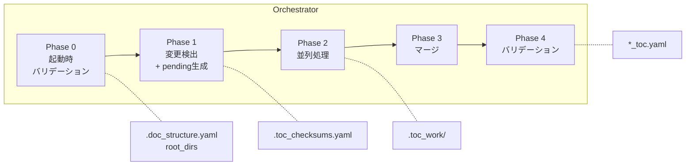
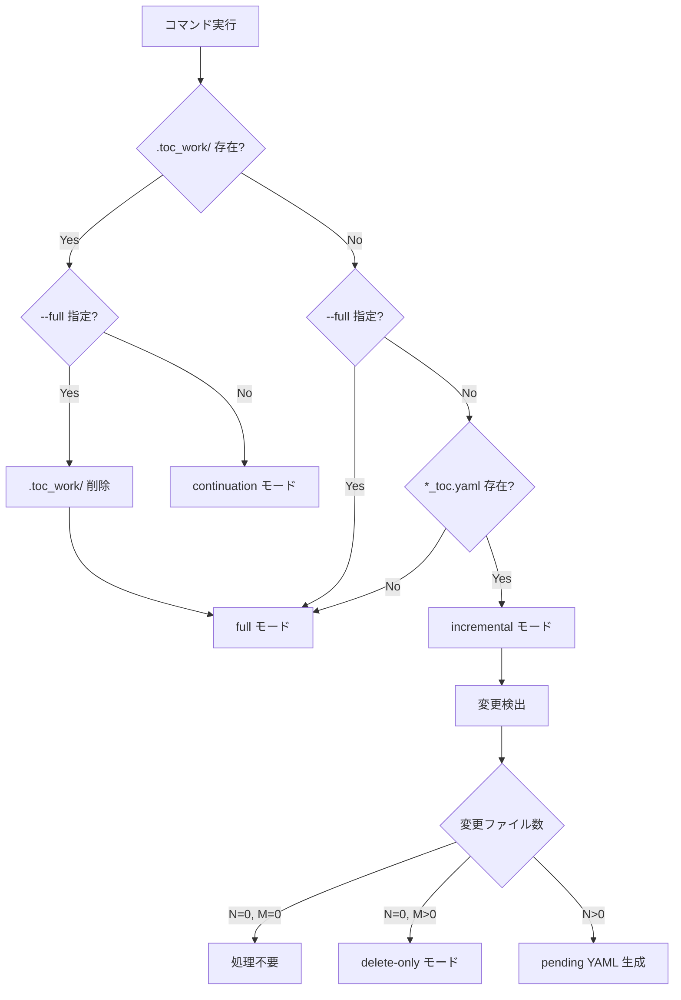
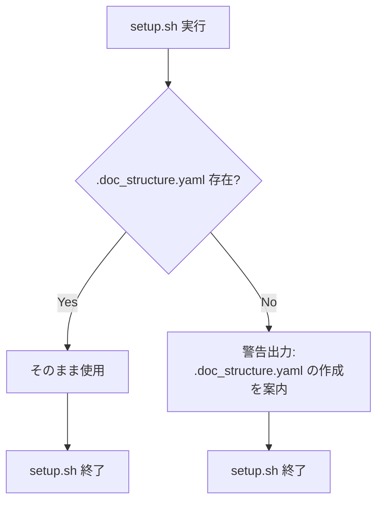
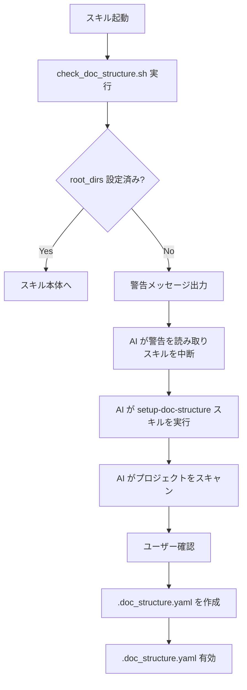
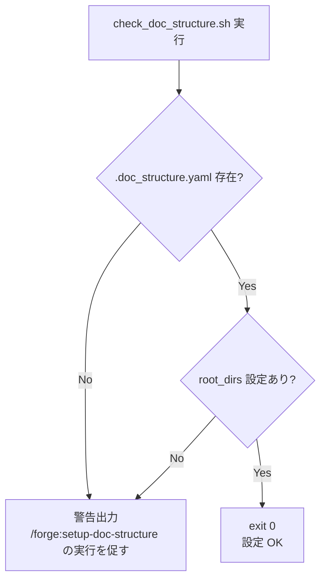
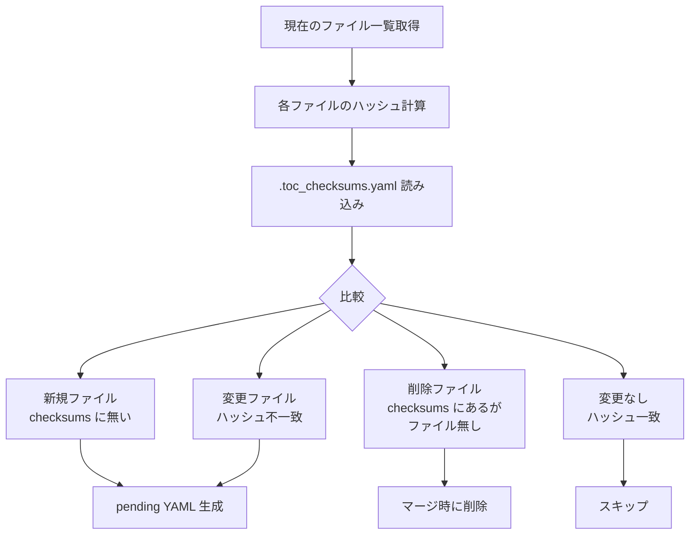
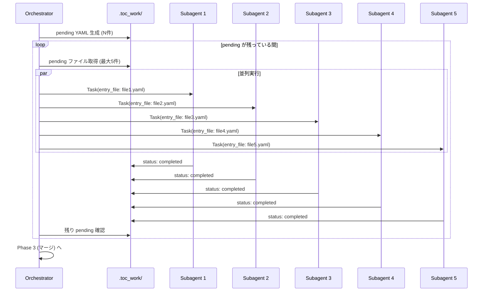
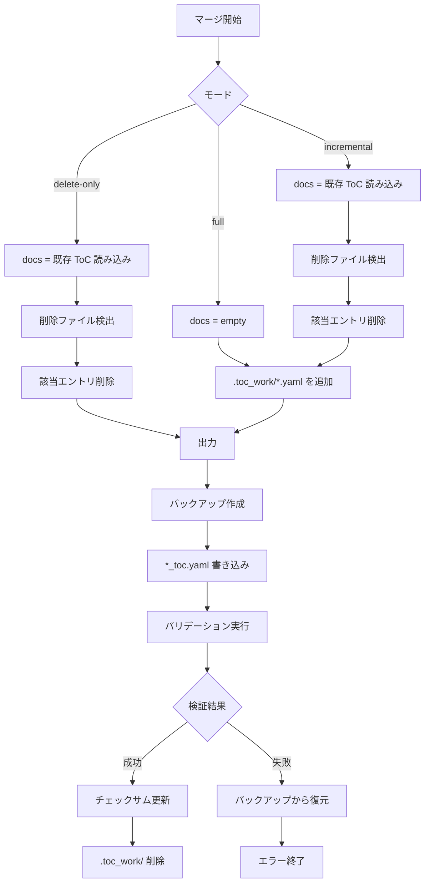
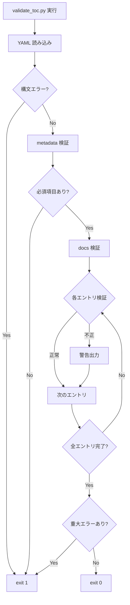
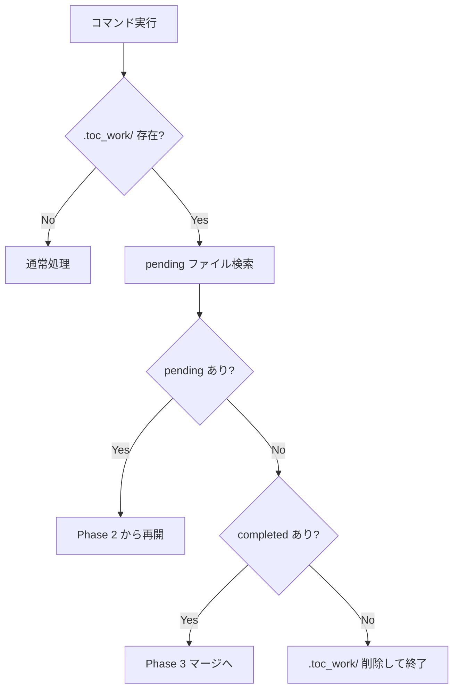

# DES-005: ToC 生成フロー設計書

## 概要

本設計書では、Doc Advisor の ToC（Table of Contents）自動生成システムの全体フロー、変更検出メカニズム、並列分割処理、マージ処理を定義する。

## 関連要件

- REQ-001 FR-02: ToC 自動生成
- REQ-001 FR-03: 変更検出
- REQ-001 FR-04: 並列処理
- REQ-001 FR-08: ランタイム設定原則

---

## システム構成

### コンポーネント一覧

| コンポーネント     | 役割                  | 実装                                                        |
| ------------------ | --------------------- | ----------------------------------------------------------- |
| Orchestrator       | 全体フロー制御        | `skills/create-*-toc/SKILL.md`                              |
| Subagent           | 個別ファイル処理      | `agents/toc-updater.md`（`--category rules\|specs` で切替） |
| Checksum Generator | ハッシュ計算          | `create_checksums.py --category rules\|specs`               |
| Pending Generator  | pending YAML 生成     | `create_pending_yaml.py --category rules\|specs`            |
| Writer             | pending YAML 書き込み | `write_pending.py --category rules\|specs`                  |
| Merger             | エントリ統合          | `merge_toc.py --category rules\|specs`                      |
| Validator          | 出力検証              | `validate_toc.py --category rules\|specs`                   |

> **前提条件**: `.doc_structure.yaml` はプロジェクトルートに配置される文書構造の SSOT である。全スクリプトは `load_config()`（toc_utils.py）を経由して `.doc_structure.yaml` を読み込み、コードデフォルト（toc_file, checksums_file, work_dir, output, common）とマージした設定を使用する。

### データフロー



---

## 処理モード

### モード一覧

| モード         | トリガー                                             | 動作                                |
| -------------- | ---------------------------------------------------- | ----------------------------------- |
| `full`         | `--full` オプション または ToC 未存在                | 全ファイルスキャン、ToC 新規生成    |
| `incremental`  | デフォルト                                           | 変更ファイルのみ処理、差分マージ    |
| `continuation` | `.claude/doc-advisor/toc/{target}/.toc_work/` が存在 | 中断された処理を再開                |
| `delete-only`  | 変更0件、削除あり                                    | 削除のみ反映（カスタム Agent 不要） |

### モード判定フロー



---

## Phase 0: 起動時バリデーション

### 設計思想

- **`.doc_structure.yaml` + コードデフォルトがランタイム設定**: `.doc_structure.yaml` はランタイムで直接参照する
- **入口集約**: check_doc_structure.sh を通過すれば後段スクリプトは二重検証不要
- **ソフトゲート**: AI への指示として機能（スキル Pre-check で呼び出される）

### .doc_structure.yaml 確立フロー

`.doc_structure.yaml` の `root_dirs` と `doc_types_map` は以下の2つの独立した経路で設定される。いずれも最終成果物は `.doc_structure.yaml`（プロジェクトルート）である。

#### 経路 A: setup.sh（インストール時）



> `.doc_structure.yaml` が存在すれば、doc-structure プラグインが分析済みの結果である。setup.sh は内容の妥当性を判定せず、そのまま使用する。root_dirs の有効性検証は setup.sh の責務ではなく、check_doc_structure.sh（スキル起動時）の責務である。

#### 経路 B: /forge:setup-doc-structure（check_doc_structure.sh の警告を契機に AI が実行）



**重要**: 経路 A と経路 B は独立した操作であり、循環しない。setup.sh は `.doc_structure.yaml` の有無で処理して終了する。root_dirs が未設定のままスキルが起動された場合、check_doc_structure.sh が警告を出力し、AI がそれを読み取って `/forge:setup-doc-structure` の実行を判断する（自動実行ではなく、AI の判断による実行）。

### check_doc_structure.sh 検証フロー

スキル起動時に `.doc_structure.yaml` の状態を検証する:



### 現行からの変更点

| 項目   | 現行                                        | 改善後                                              |
| ------ | ------------------------------------------- | --------------------------------------------------- |
| Case 1 | `.doc_structure.yaml` 存在 + root_dirs あり | exit 0（設定 OK）                                   |
| Case 2 | `.doc_structure.yaml` 存在 + root_dirs なし | 警告出力（/forge:setup-doc-structure の実行を促す） |
| Case 3 | `.doc_structure.yaml` 不存在                | 警告出力（/forge:setup-doc-structure の実行を促す） |

### 判定条件テーブル

| .doc_structure.yaml | root_dirs 行                    | 判定 | 出力           |
| ------------------- | ------------------------------- | ---- | -------------- |
| 存在しない          | —                               | NG   | 警告メッセージ |
| 存在する            | `root_dirs:` あり（空配列含む） | OK   | なし（exit 0） |
| 存在する            | コメントアウト or 行なし        | NG   | 警告メッセージ |

- **入力**: `.doc_structure.yaml`（プロジェクトルート）
- **出力**: 警告メッセージ（stdout）または出力なし
- **副作用**: なし（`.doc_structure.yaml` を変更しない）
- **exit code**: 常に 0

### 関連要件

- REQ-001 FR-08: ランタイム設定原則

---

## Phase 1: 変更検出（ハッシュベース）

### 設計思想

- **Git 非依存**: コミット状態に関係なく、実際のファイル内容で判定
- **高精度**: SHA-256 ハッシュで変更を確実に検出
- **チーム共有**: `.claude/doc-advisor/toc/{target}/.toc_checksums.yaml` を Git 管理し、チーム間で差分検出を共有

### チェックサムファイル形式

```yaml
# .claude/doc-advisor/toc/{target}/.toc_checksums.yaml
generated_at: 2026-01-22T12:00:00Z
file_count: 25
checksums:
  specs/requirements/app_overview.md: a1b2c3d4e5f6...
  specs/design/login_screen.md: b2c3d4e5f6a1...
```

### 変更検出アルゴリズム



### ハッシュ計算処理

```python
def calculate_file_hash(filepath):
    """SHA-256 ハッシュを計算"""
    sha256 = hashlib.sha256()
    with open(filepath, 'rb') as f:
        for chunk in iter(lambda: f.read(8192), b''):
            sha256.update(chunk)
    return sha256.hexdigest()
```

### 変更カウントと処理分岐

| 条件     | 処理                                           |
| -------- | ---------------------------------------------- |
| N=0, M=0 | 処理終了（変更なし）                           |
| N=0, M>0 | delete-only モード（マージスクリプトのみ実行） |
| N>0      | pending YAML 生成 → カスタム Agent → マージ    |

**N** = 新規 + 変更ファイル数、**M** = 削除ファイル数

---

## Phase 2: 並列分割処理（個別エントリファイル方式）

### 設計思想

1. **1ファイル = 1 カスタム Agent**: 各ドキュメントを `doc-advisor:toc-updater` カスタム Agent で独立処理
2. **永続的成果物**: カスタム Agent の出力をファイルとして保存
3. **中断耐性**: 完了分は保持、未完了分から再開可能
4. **並列効率**: 最大5並列で処理時間を短縮

### 作業ディレクトリ構造

```
.claude/doc-advisor/toc/{target}/.toc_work/               # 作業ディレクトリ
├── a1b2c3d4e5f67890.yaml
├── f0e1d2c3b4a59678.yaml
└── ... (対象ファイルごとに1つ)
```

### ファイル名変換規則

```
元パス: specs/requirements/login.md
作業ファイル: <SHA256先頭16文字>.yaml  (例: a1b2c3d4e5f67890.yaml)

変換: SHA256(source_file_path)[:16] + '.yaml'
```

> ハッシュベースのファイル名を使用する理由:
>
> - macOS のファイル名長制限（255 バイト）を回避
> - 大文字小文字を区別しないファイルシステムでの衝突を防止
> - ディレクトリ名やファイル名の特殊文字によるエスケープ問題を回避
> - 元パスは YAML 内の `_meta.source_file` で保持される

### pending YAML テンプレート

共通フィールド:

```yaml
_meta:
  source_file: specs/requirements/app_overview.md # 処理対象ファイルパス
  doc_type: requirement # ドキュメント種別（.doc_structure.yaml の doc_types_map から決定）
  status: pending # pending | completed
  updated_at: null # 完了時刻

# 以下はカスタム Agent (toc-updater) が埋める
title: null
purpose: null
content_details: []
applicable_tasks: []
keywords: []
```

> **Note**: `doc_type` は `.doc_structure.yaml` の `doc_types_map` から決定される。マップに一致しない場合はディレクトリ名からの推論、最終的にはカテゴリ名（rule/spec）をデフォルトとする。

### 並列処理フロー



### Subagent 処理内容

1. pending YAML を読み込み（`_meta.source_file` を取得）
2. 元ドキュメント（.md）を読み込み
3. メタデータを抽出:
   - `title`: H1 見出しから
   - `purpose`: ドキュメントの目的（1-2行）
   - `content_details`: 内容詳細（5-10項目）
   - `applicable_tasks`: 適用タスク
   - `keywords`: キーワード（5-10語）
4. `_meta.status: completed`、`_meta.updated_at` を設定
5. YAML を保存

---

## Phase 3: マージ処理

### マージモード

| モード        | 入力                                                           | 処理                  |
| ------------- | -------------------------------------------------------------- | --------------------- |
| `full`        | `.claude/doc-advisor/toc/{target}/.toc_work/*.yaml` のみ       | 新規生成              |
| `incremental` | 既存 ToC + `.claude/doc-advisor/toc/{target}/.toc_work/*.yaml` | 差分マージ + 削除反映 |
| `delete-only` | 既存 ToC のみ                                                  | 削除のみ反映          |

### マージフロー



### 削除検出ロジック

```python
# チェックサムファイルに記録されているファイル
checksum_files = load_checksums(checksums_file)

# 現在実際に存在するファイル
existing_files = get_existing_files()

# 削除されたファイル = チェックサムにあるが実ファイルがない
deleted_files = checksum_files - existing_files

# ToC から該当エントリを削除
for del_file in deleted_files:
    if del_file in docs:
        del docs[del_file]
```

### マージ後の出力形式

```yaml
# .claude/doc-advisor/toc/{target}/{target}_toc.yaml
metadata:
  name: Project Specification Search Index
  generated_at: 2026-01-22T12:00:00Z
  file_count: 25

docs:
  specs/requirements/app_overview.md:
    title: Application Overview
    purpose: Defines overall requirements
    content_details:
      - User authentication
      - Use cases
    applicable_tasks:
      - New feature planning
    keywords:
      - application
      - requirements
```

---

## Phase 4: バリデーション

### 検証項目

| カテゴリ           | 検証内容                                                    | 実装状況    |
| ------------------ | ----------------------------------------------------------- | ----------- |
| YAML 構文          | インデント、コロン、ハイフンの正確性                        | ✅ 実装済み |
| 必須フィールド     | metadata: name, generated_at, file_count                    | 📋 将来対応 |
| エントリフィールド | title, purpose, content_details, applicable_tasks, keywords | ✅ 実装済み |
| ファイル存在       | docs に記載された全ファイルが実在                           | ✅ 実装済み |

> **Note**: metadata セクションの必須フィールド検証は現行実装では未対応。エントリレベルの検証のみ実施。

### バリデーションフロー



### 検証失敗時の動作

1. バックアップファイル（`*.yaml.bak`）から復元
2. チェックサムは更新しない
3. `.claude/doc-advisor/toc/{target}/.toc_work/` は削除しない（再実行可能）
4. エラー内容を報告

---

## エラーハンドリングと再開

### エラー種別と対応

| エラー種別             | 発生箇所  | 対応                                                         |
| ---------------------- | --------- | ------------------------------------------------------------ |
| ファイル読み込みエラー | Subagent  | エラーメッセージ出力、該当 YAML は pending のまま            |
| YAML 構文エラー        | Merger    | 該当ファイルをスキップ、警告出力                             |
| バリデーションエラー   | Validator | バックアップ復元、処理中断                                   |
| マージエラー           | Merger    | .claude/doc-advisor/toc/{target}/.toc_work/ 保持、再実行可能 |

### Subagent エラー時の扱い

- エラーは標準出力に報告
- 該当 entry は pending のまま（error status は使用しない）

### 再開（Continuation）処理



### 中断耐性の実現

| 状況         | 保持されるもの                                            | 再開時の動作         |
| ------------ | --------------------------------------------------------- | -------------------- |
| Phase 1 中断 | なし                                                      | 最初から実行         |
| Phase 2 中断 | completed な YAML                                         | pending から処理再開 |
| Phase 3 中断 | .claude/doc-advisor/toc/{target}/.toc_work/、バックアップ | マージから再実行     |

---

## 処理統計と完了レポート

### 完了レポート形式

```
✅ {target}_toc.yaml has been updated

[Summary]
- Mode: incremental
- Files processed: 5
- Deleted: 1

[Cleanup]
- Deleted .claude/doc-advisor/toc/{target}/.toc_work/
```

### エラーレポート形式

```
⚠️ {target}_toc.yaml generation completed with warnings

[Summary]
- Mode: full
- Files processed: 23
- Errors: 2

[Error Files]
- specs_requirements_broken.yaml: File read error
- specs_design_invalid.yaml: Invalid YAML syntax

[Action Required]
- Review error files manually
- Re-run /doc-advisor:create-specs-toc to retry
```

---

## 性能考慮

### 並列処理の効果

| ファイル数 | 直列処理 | 5並列処理 | 短縮率 |
| ---------- | -------- | --------- | ------ |
| 5          | 5T       | T         | 80%    |
| 25         | 25T      | 5T        | 80%    |
| 100        | 100T     | 20T       | 80%    |

**T** = 1ファイルあたりの処理時間

### ボトルネック

1. **LLM API 呼び出し**: カスタム Agent の処理時間の大部分
2. **ファイル I/O**: ハッシュ計算、YAML 読み書き
3. **マージ処理**: 大量エントリの結合

### 最適化ポイント

- 並列数はコードデフォルト（toc_utils.py の _get_default_config()）で定義
- incremental モードで変更ファイルのみ処理
- チェックサムファイルで不要な再計算を回避

---

## Skill / Agent 設計根拠

### コンポーネントの使い分け

| コンポーネント                         | 種別                        | 根拠                                                                                                     |
| -------------------------------------- | --------------------------- | -------------------------------------------------------------------------------------------------------- |
| `query-rules`, `query-specs`           | **Skill** (`context: fork`) | ユーザー呼び出し (`/query-*`)、Claude 自動トリガー、隔離実行が必要                                       |
| `create-rules-toc`, `create-specs-toc` | **Skill** (fork なし)       | ユーザー呼び出し (`/create-*-toc`) が必要。agent を並列起動するため fork 不可                            |
| `toc-updater`                          | **Agent**                   | ツール制限 (`Read, Bash` のみ)、並列起動、system prompt の確実性が必要。`--category rules\|specs` で分岐 |

### 重要な制約: fork 型 SKILL と Agent の関係

```
メイン会話 ─── 継承型 SKILL ──→ Agent ツール (汎用/カスタム Agent) ✅ 可能
メイン会話 ─── fork 型 SKILL ──→ Agent ツール (汎用/カスタム Agent) ❌ 不可能
                                  ↑ fork 型 SKILL は Agent を起動できない
```

このため、orchestrator (`create-*-toc`) は fork **しない**（カスタム Agent を並列起動するため）。
検索 (`query-*`) は fork **する**（Agent 起動不要、コンテキスト隔離が有益）。

---

## 関連設計書

| 設計書  | 内容                         |
| ------- | ---------------------------- |
| DES-003 | 文書識別子の設計             |
| DES-004 | ドキュメントモデルと設定仕様 |
