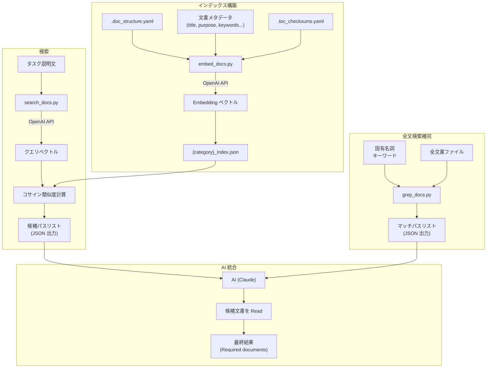
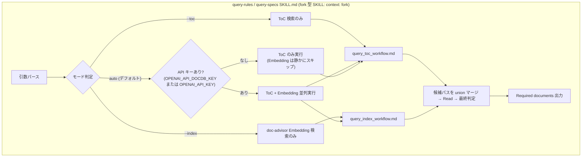
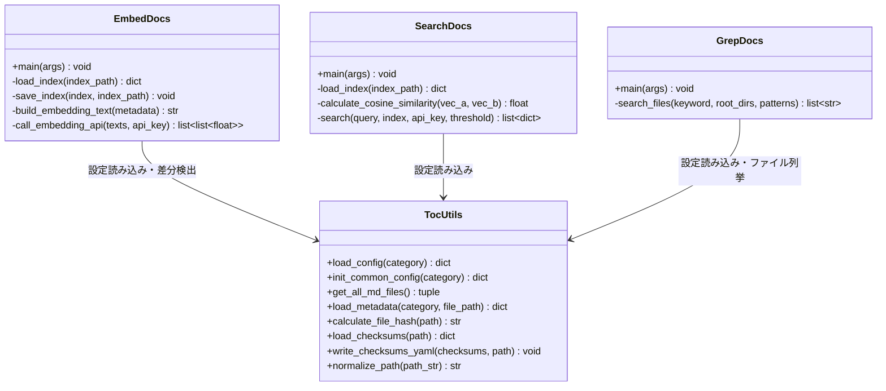
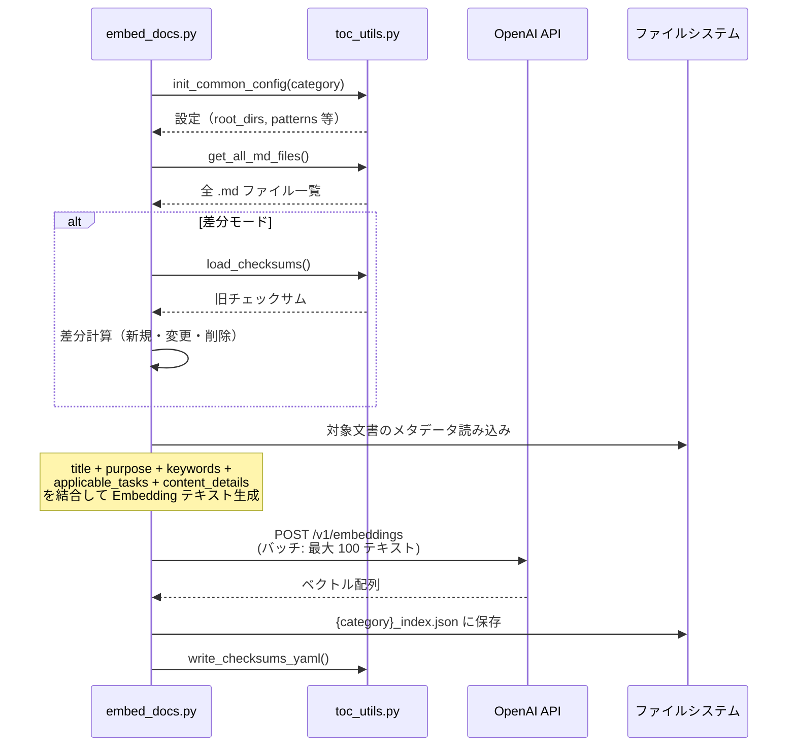
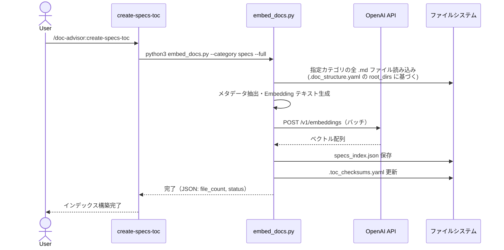
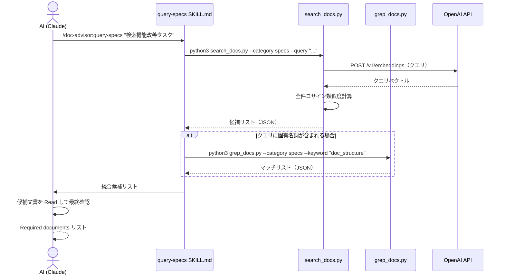

# DES-006 セマンティック検索 設計書

## メタデータ

| 項目     | 値                                                                                                     |
| -------- | ------------------------------------------------------------------------------------------------------ |
| 設計ID   | DES-006                                                                                                |
| 関連要件 | FNC-001, FNC-002, FNC-003, FNC-004, NFR-001, NFR-002, NFR-003                                          |
| 関連設計 | DES-007 (統一 API KEY 参照規約), forge:DES-001_forge_query_abstraction_design (検索バックエンド抽象化) |
| 作成日   | 2026-03-30                                                                                             |
| 改定日   | 2026-05-18                                                                                             |

## 1. 概要

doc-advisor の文書検索（query-specs / query-rules）は、`--toc`（ToC キーワード検索のみ）/ `--index`（doc-advisor Embedding 検索のみ）/ `auto`（ToC + Embedding 並列実行 + union マージ）の **3 モード検索アーキテクチャ** を提供する。**doc-advisor は単独で完結し、doc-db plugin を呼ばない**。検索バックエンド選択（doc-db / doc-advisor）の責務は forge 側 `/forge:query-db-*` 抽象 SKILL にあり、doc-advisor 側で二重判定しない（forge:DES-001_forge_query_abstraction_design §1.2 / §2.3）。

採用アプローチ:

- **OpenAI Embedding API** で文書メタデータをベクトル化し、JSON ファイルに保存（doc-advisor Embedding Index）
- **既存 ToC YAML** は AI によるキーワードマッチングで高精度検索を提供（ToC）
- **3モード検索**: `--toc`（ToC のみ）、`--index`（doc-advisor Embedding のみ）、`auto`（ToC 常時実行 + API キーがあれば Embedding を並列実行し union マージ）
- auto モードは fork 型 SKILL (`context: fork`) が **doc-advisor 内蔵の検索パイプラインのみ** を fork 内で実行し、最終結果のみを親 Claude へ return する（§2.4 fork 型 SKILL 内完結フロー）。**他プラグイン（doc-db 等）の SKILL は呼ばない**
- 固有名詞・識別子の検索は `--index` モードの `grep_docs.py` で補完。`auto` モードでは `grep_docs.py` は呼ばない（forge 側で doc-db バックエンドが採用された場合に doc-db の Lexical 成分が担う）
- 外部依存は **OpenAI API キーのみ**（pip install 不要。ToC モードは外部依存なし）。API KEY 参照規約は FNC-004 / DES-007 で統一

> 過去の設計方針（Phase 3 凍結 / Phase 4 撤回）の経緯は §10 移行設計および改訂履歴を参照。

## 2. アーキテクチャ概要

### 2.1 コンポーネント図



### 2.2 責務の分担

| レイヤー             | 責務                                                           | 担当                                                          |
| -------------------- | -------------------------------------------------------------- | ------------------------------------------------------------- |
| ToC 生成             | AI による文書メタデータ抽出と YAML ToC 構築                    | `create_pending_yaml.py` + toc-updater agent + `merge_toc.py` |
| Index 構築           | 文書メタデータの Embedding 化と JSON 永続化                    | `embed_docs.py`                                               |
| ToC 検索             | ToC YAML の全量読み込みとキーワードマッチング                  | AI（`query_toc_workflow.md` の手順に従う）                    |
| セマンティック検索   | クエリとインデックスのコサイン類似度計算                       | `search_docs.py`                                              |
| 全文検索             | 固有名詞・識別子のテキストマッチング                           | `grep_docs.py`                                                |
| 検索統合・モード切替 | 3モードの切り替え、候補の union、本文確認、最終判断            | AI（query-specs / query-rules SKILL.md）                      |
| ワークフロー定義     | ToC / Index 各検索手順の文書化                                 | `query_toc_workflow.md` / `query_index_workflow.md`           |
| 設定・差分検出       | .doc_structure.yaml の読み込み、チェックサム管理、ファイル列挙 | `toc_utils.py`（既存・再利用）                                |

### 2.3 3モード検索アーキテクチャ

query-rules / query-specs は以下の 3 モードを提供する:



| モード | フラグ     | 動作                                                                                                                              | フォールバック                                                                                                              |
| ------ | ---------- | --------------------------------------------------------------------------------------------------------------------------------- | --------------------------------------------------------------------------------------------------------------------------- |
| ToC    | `--toc`    | ToC YAML を全量 Read しキーワードマッチング                                                                                       | なし（ToC 不在時はエラー通知）                                                                                              |
| Index  | `--index`  | `search_docs.py` + `grep_docs.py` で doc-advisor Embedding 検索                                                                   | なし（API エラー時はエラー通知）                                                                                            |
| auto   | フラグなし | ToC キーワード検索を **常時** 実行 + API キーがあれば doc-advisor Embedding 検索も **並列実行**し、両者を **集合 union** でマージ | Embedding 失敗（API キー未設定 / Index 未生成 / API エラー）は静かに空リスト扱い。auto 全体は失敗にしない（ToC 結果は維持） |

**設計判断**:

- auto モードは **doc-advisor 単独完結** とする。fork 型 SKILL (`context: fork`) は doc-advisor 内蔵の ToC / Embedding 検索パイプラインのみを fork 内で実行し、**他プラグインの SKILL（特に `/doc-db:query` / `/doc-db:build-index`）は呼ばない**。検索バックエンドの選択（doc-db / doc-advisor）は **forge 側の `/forge:query-db-*` 抽象 SKILL** が `plugins/forge/scripts/backend_selection/select_backend.py` で行う責務であり、doc-advisor 側で二重判定しない（forge:DES-001_forge_query_abstraction_design §1.2 / §2.3）。
- ToC は AI によるキーワードマッチングで高精度な検索を提供し、Embedding はセマンティック類似性で ToC の見落としを補完する。auto モードでは両者を **常に並列実行** し union マージすることで再現率を最大化する（ToC が主軸、Embedding が補完）。
- Embedding 失敗（API キー未設定 / Index 未生成 / API エラー等）は **静かに空リスト** として扱い、ToC 結果のみで応答する。auto モード全体としては失敗にしない。Embedding を必須としたい場合は `--index` モードを明示する。
- API キー判定は forge 全体で統一（DES-007）。`OPENAI_API_DOCDB_KEY` または `OPENAI_API_KEY` のいずれかが空でない値で設定されていれば真。詳細は forge:DES-001_forge_query_abstraction_design §1.2.1。

### 2.4 fork 型 SKILL 内完結フロー [MANDATORY]

`query-specs` / `query-rules` SKILL は fork 型 SKILL (`context: fork`) として親 Claude とは独立したコンテキストで隔離実行される。fork の目的は「ToC 等の大量文書を読み込むコンテキストを親と分離すること」であり、fork 型 SKILL は fork 内で必要な処理を完結させてから最終結果のみを親に return する。

これに基づき auto モードのフローは以下のように fork 型 SKILL 内完結とする:

1. **fork 型 SKILL 起動** (`context: fork`)
2. **API キー有無の判定**: `Bash` で `[ -n "${OPENAI_API_DOCDB_KEY:-}" ] || [ -n "${OPENAI_API_KEY:-}" ]` を評価する（DES-007）
3. **ToC 検索ワークフロー** (`query_toc_workflow.md`) を fork 内で実行し、候補パス集合 `S_toc` を取得（常時実行）
4. **API キーがあれば**、`query_index_workflow.md` を fork 内で並列実行し、候補パス集合 `S_index` を取得。Embedding 失敗（API キー未設定 / Index 未生成 / API エラー）は **静かに空リスト** として扱い、auto 全体は失敗にしない
5. `S_toc` と `S_index` を **集合 union** でマージし、候補パスを Read して内容確認
6. **最終的に集約した候補ドキュメント + 内容要約のみを親 Claude に return**

> **doc-db 等の他プラグイン SKILL は呼ばない [MANDATORY]**: auto モードは doc-advisor 単独完結とする。`/doc-db:query` / `/doc-db:build-index` / その他の `Skill` ツール呼び出しは禁止する（ADR-002 §B の read-only 制約に準拠）。検索バックエンドの選択は forge 側の `/forge:query-db-*` 抽象 SKILL の責務であり、doc-advisor 側で二重判定しない（forge:DES-001_forge_query_abstraction_design §1.2 / §2.3）。

親 Claude のコンテキストには検索の最終成果物のみが残り、ToC データ・中間 JSON・stderr ログは fork 型 SKILL 側で消費される。

#### auto モードの ToC サイズ別動作（Issue #9）

ToC エントリ数に応じて ToC 候補生成の方法を切り替える:

| ToC エントリ数 | ToC 候補生成方法                                                                        | 精度       |
| -------------- | --------------------------------------------------------------------------------------- | ---------- |
| ≤ 100          | ToC を全量 Read してキーワードマッチング（従来動作）                                    | 最高       |
| > 100          | Index 候補（`search_docs.py --threshold 0.2`）を `filter_toc.py` に渡し縮小 ToC を Read | 妥協的下限 |

> **設計判断**: 100 件超では AI が ToC 全文を読みきれず精度が下がるため、Index で広めに絞った候補だけ ToC エントリを抽出する縮小 YAML（`filter_toc.py` の出力）を Read する。これは「苦肉の策」であり、100 件以下では従来動作で最高精度を維持する。
>
> 100 件超で Index が利用不可（`OPENAI_API_DOCDB_KEY` および `OPENAI_API_KEY` 双方未設定等。DES-007 統一参照規約）の場合は ToC 全量 Read にフォールバックする（精度低下より候補ゼロ回避を優先）。
>
> Compact 形式の ToC（旧 `toc_format_compact.md`）は精度低下の懸念から廃止し、ToC は常に full 形式で生成する。100 件超のサイズ問題はこの Filtered ToC 機構で対処する。

### 2.4 ワークフロー文書アーキテクチャ

検索手順を SKILL.md から分離し、再利用可能なワークフロー文書として定義する:

| ワークフロー文書               | 責務                                          | パラメータ   |
| ------------------------------ | --------------------------------------------- | ------------ |
| `docs/query_toc_workflow.md`   | ToC YAML の読み込みとキーワードマッチング手順 | `{category}` |
| `docs/query_index_workflow.md` | Index の auto-update + セマンティック検索手順 | `{category}` |

ワークフロー文書は **候補パスの生成まで** が責務。ファイル Read・最終判定は SKILL.md 側で行う。

## 3. モジュール設計

### 3.1 モジュール一覧

| モジュール       | ファイルパス                                       | 責務                                                                                            | 依存                             |
| ---------------- | -------------------------------------------------- | ----------------------------------------------------------------------------------------------- | -------------------------------- |
| `embed_docs.py`  | `plugins/doc-advisor/scripts/embed_docs.py`        | Embedding インデックス構築（全体・差分）                                                        | `toc_utils.py`, `urllib`（標準） |
| `search_docs.py` | `plugins/doc-advisor/scripts/search_docs.py`       | セマンティック検索実行                                                                          | `toc_utils.py`, `urllib`（標準） |
| `grep_docs.py`   | `plugins/doc-advisor/scripts/grep_docs.py`         | 全文検索（テキストマッチング）                                                                  | `toc_utils.py`                   |
| `filter_toc.py`  | `plugins/doc-advisor/scripts/filter_toc.py`        | 指定パス群に対応する ToC エントリだけを抽出した縮小 YAML を stdout 出力（auto モード 100 件超） | `toc_utils.py`                   |
| `toc_utils.py`   | `plugins/doc-advisor/scripts/toc_utils.py`（既存） | 共通ユーティリティ                                                                              | 標準ライブラリのみ               |

### 3.2 クラス図



### 3.3 embed_docs.py 詳細設計

#### CLI インターフェース

```
python3 embed_docs.py --category {specs|rules} [--full] [--check]
```

| 引数         | 説明                                                                                                                                                                              |
| ------------ | --------------------------------------------------------------------------------------------------------------------------------------------------------------------------------- |
| `--category` | 対象カテゴリ（必須）                                                                                                                                                              |
| `--full`     | 全文書を再構築（省略時は差分更新）                                                                                                                                                |
| `--check`    | インデックスの新鮮さを確認し、古い場合は再構築を案内する（staleness check）。インデックスが存在しない場合や、文書のチェックサムが不一致の場合に `{"status": "stale", ...}` を返す |

#### 処理フロー



#### Embedding テキストの構成

各文書のメタデータから以下の順で結合し、1つのテキストとして Embedding API に送信する:

```
{title}\n{purpose}\n{keywords をスペース区切り}\n{applicable_tasks をスペース区切り}\n{content_details を改行区切り}
```

技術選択の理由: メタデータの全フィールドを含めることで、タイトルだけでなく目的やキーワードの意味的類似性も検索に反映される。フィールドの順序は重要度順（title が先頭で最も影響大）。

#### メタデータの取得元

**既存 ToC YAML からメタデータを読み込む**。ToC は廃止せず維持する方針のため（§10.2 参照）、ToC YAML は Embedding インデックスのメタデータソースとしても継続利用する。

**抽象化レイヤー**: メタデータ取得は `toc_utils.py` の `load_metadata(category, file_path)` 関数経由で行う。`embed_docs.py` はこの関数を呼び出すため、将来 ToC YAML 以外からメタデータを取得する方式に変更する場合も `embed_docs.py` への影響を局所化できる。

#### インデックス JSON スキーマ

```json
{
  "metadata": {
    "category": "specs",
    "model": "text-embedding-3-small",
    "dimensions": 1536,
    "generated_at": "2026-03-30T12:00:00Z",
    "file_count": 29
  },
  "entries": {
    "docs/specs/doc-advisor/design/DES-004_document_model.md": {
      "title": "Document Model Design Specification",
      "embedding": [0.012, -0.045, 0.078, ...],
      "checksum": "a1b2c3d4..."
    }
  }
}
```

| フィールド                 | 型           | 説明                            |
| -------------------------- | ------------ | ------------------------------- |
| `metadata.category`        | string       | `specs` または `rules`          |
| `metadata.model`           | string       | 使用した Embedding モデル名     |
| `metadata.dimensions`      | int          | ベクトルの次元数                |
| `metadata.generated_at`    | string       | ISO 8601 形式の生成日時         |
| `metadata.file_count`      | int          | エントリ数                      |
| `entries.{path}.title`     | string       | 文書タイトル（検索結果表示用）  |
| `entries.{path}.embedding` | array[float] | Embedding ベクトル              |
| `entries.{path}.checksum`  | string       | ファイル内容の SHA-256 ハッシュ |

#### 差分更新ロジック

1. `load_checksums()` で旧チェックサムを読み込む
2. 現在のファイルのハッシュを計算し、旧チェックサムと比較
3. 新規・変更ファイルのみ Embedding API を呼び出す
4. 削除ファイルはインデックスから削除
5. チェックサム更新

既存の `create_pending_yaml.py` の差分検出ロジックと同じアルゴリズムを使用する。

**NFR-002 中断再開への対応**: 処理が中断された場合、チェックサムは未更新のままとなるため、次回の差分更新で未処理分が自動的に再処理される。これにより、明示的な再開機構なしに中断再開要件を満たす。

#### OpenAI API 呼び出し

```
POST https://api.openai.com/v1/embeddings
Content-Type: application/json
Authorization: Bearer {API_KEY}  # OPENAI_API_DOCDB_KEY 優先、未設定時 OPENAI_API_KEY (DES-007)

{
  "model": "text-embedding-3-small",
  "input": ["text1", "text2", ...]
}
```

- API キーは環境変数から取得（`OPENAI_API_DOCDB_KEY` を優先参照、未設定時のみ `OPENAI_API_KEY` をフォールバック。DES-007 統一仕様）
- バッチサイズ: 最大 100 テキスト/リクエスト（API 制限内）
- エラー時: JSON エラー出力（`{"status": "error", "error": "..."}`)
- API キー未設定時: エラーメッセージで設定方法を案内

技術選択の理由: `text-embedding-3-small` を選択。コスト効率が最も高く（$0.02/1M tokens）、1536 次元で十分な精度。600 件の全体再構築でも $0.01 以下。`urllib.request` で HTTP リクエストを送信するため pip install 不要。

#### インデックスの保存先

```
.claude/doc-advisor/toc/{category}/{category}_index.json
```

既存の ToC YAML と同じディレクトリに配置する。

### 3.4 search_docs.py 詳細設計

#### CLI インターフェース

```
python3 search_docs.py --category {specs|rules} --query "タスクの説明文" [--threshold 0.3]
```

| 引数          | 説明                                                 | デフォルト |
| ------------- | ---------------------------------------------------- | ---------- |
| `--category`  | 対象カテゴリ（必須）                                 | —          |
| `--query`     | 検索クエリ（必須）                                   | —          |
| `--threshold` | 類似度スコアの下限閾値（この値以上の候補を全件返却） | 0.3        |

FNC-002「件数制限を設けない」要件に基づき、件数での制限（top-k）は設けず、閾値ベースで候補を返却する。

#### 処理フロー

1. `{category}_index.json` を読み込む
2. クエリを OpenAI Embedding API でベクトル化
3. インデックス内の全エントリとコサイン類似度を計算
4. スコア降順でソートし、閾値以上の全候補を JSON 出力

#### コサイン類似度の計算

```python
import math

def cosine_similarity(vec_a, vec_b):
    dot = sum(a * b for a, b in zip(vec_a, vec_b))
    norm_a = math.sqrt(sum(a * a for a in vec_a))
    norm_b = math.sqrt(sum(b * b for b in vec_b))
    if norm_a == 0 or norm_b == 0:
        return 0.0
    return dot / (norm_a * norm_b)
```

技術選択の理由: 600 件 × 1536 次元のコサイン類似度計算は、Pure Python でも数十ミリ秒で完了する。numpy や Vector DB は不要。

#### 出力形式

```json
{
  "status": "ok",
  "query": "検索機能を改善するタスク",
  "results": [
    {
      "path": "docs/specs/doc-advisor/design/DES-005_toc_generation_flow.md",
      "title": "ToC Generation Flow Design",
      "score": 0.89
    },
    {
      "path": "docs/specs/doc-advisor/design/DES-004_document_model.md",
      "title": "Document Model Design",
      "score": 0.82
    }
  ]
}
```

#### エラーケース

| 条件                                     | 出力                                                                                                                                                                                                                                                    |
| ---------------------------------------- | ------------------------------------------------------------------------------------------------------------------------------------------------------------------------------------------------------------------------------------------------------- |
| インデックスが存在しない                 | `{"status": "error", "error": "Index not found. Run embed_docs.py first."}`                                                                                                                                                                             |
| インデックスが古い（チェックサム不一致） | `{"status": "error", "error": "Index is stale. Run embed_docs.py to update."}` — 検索を実行せず再生成を案内する（FNC-002 対応）。検出方法: インデックス JSON の各エントリに記録された `checksum`（SHA-256）を、現在のファイルのハッシュ値と照合する     |
| Embedding モデル不一致                   | `{"status": "error", "error": "Model mismatch: index uses {old_model}, current is {new_model}. Run embed_docs.py --full to rebuild."}` — インデックスの `metadata.model` と現在のモデル定数を比較し、不一致時は検索を実行せず `--full` 再構築を案内する |
| API キー未設定                           | `{"status": "error", "error": "OPENAI_API_DOCDB_KEY（または OPENAI_API_KEY）が設定されていません。"}` — DES-007 統一エラー文言。`OPENAI_API_DOCDB_KEY` 優先、未設定時のみ `OPENAI_API_KEY` をフォールバックし、双方未設定時にこのエラーを返す           |
| API 呼び出し失敗                         | `{"status": "error", "error": "API error: {詳細}"}`                                                                                                                                                                                                     |

### 3.5 grep_docs.py 詳細設計

#### CLI インターフェース

```
python3 grep_docs.py --category {specs|rules} --keyword "doc_structure.yaml"
```

| 引数         | 説明                   |
| ------------ | ---------------------- |
| `--category` | 対象カテゴリ（必須）   |
| `--keyword`  | 検索キーワード（必須） |

#### 処理フロー

1. `toc_utils.init_common_config(category)` で設定を読み込む
2. `toc_utils.get_all_md_files()` で対象ファイルを列挙
3. 各ファイルの内容を読み込み、キーワードの部分一致を検索（大文字小文字区別なし）
4. マッチしたファイルのパスを JSON 出力

#### 出力形式

```json
{
  "status": "ok",
  "keyword": "doc_structure.yaml",
  "results": [
    { "path": "docs/specs/doc-advisor/design/DES-004_document_model.md" },
    { "path": "docs/rules/implementation_guidelines.md" }
  ]
}
```

技術選択の理由: 600 件程度のファイルを順次読み込んでの文字列検索は、外部ツール（ripgrep 等）なしでも数百ミリ秒で完了する。AI が固有名詞を検出した場合にのみ呼び出されるため、頻度も低い。

## 4. ユースケース設計

### 4.1 ユースケース一覧

| ユースケース                  | 説明                                          |
| ----------------------------- | --------------------------------------------- |
| UC-1 インデックス構築（全体） | 初回または再構築時に全文書の Embedding を生成 |
| UC-2 インデックス更新（差分） | 文書の追加・変更・削除を検出し、差分のみ更新  |
| UC-3 セマンティック検索       | タスク説明文から関連文書を検索                |
| UC-4 全文検索補完             | 固有名詞・識別子で文書を検索                  |
| UC-5 精度検証                 | ゴールデンセットで検索精度を測定              |

### 4.2 シーケンス図

#### UC-1: インデックス構築（create-specs-toc 経由）



#### UC-3: セマンティック検索（query-specs 経由）



## 5. 使用する既存コンポーネント

| コンポーネント           | ファイルパス                                                                                      | 用途                                                                                              |
| ------------------------ | ------------------------------------------------------------------------------------------------- | ------------------------------------------------------------------------------------------------- |
| `load_config()`          | `plugins/doc-advisor/scripts/toc_utils.py`                                                        | `.doc_structure.yaml` の読み込み                                                                  |
| `init_common_config()`   | 同上                                                                                              | root_dirs, patterns, チェックサムパス等の初期化                                                   |
| `get_all_md_files()`     | 同上（※現在は `create_pending_yaml.py` に存在。本設計の前提作業として `toc_utils.py` へ移動する） | 対象ファイルの列挙（glob パターン対応）                                                           |
| `load_metadata()`        | 同上（新規追加）                                                                                  | メタデータ取得の抽象化レイヤー（将来のメタデータ取得方式変更時に embed_docs.py への影響を局所化） |
| `calculate_file_hash()`  | 同上                                                                                              | SHA-256 ハッシュによる変更検出                                                                    |
| `load_checksums()`       | 同上                                                                                              | 旧チェックサムの読み込み                                                                          |
| `write_checksums_yaml()` | 同上                                                                                              | チェックサムの書き出し                                                                            |
| `normalize_path()`       | 同上                                                                                              | macOS NFC 正規化                                                                                  |
| `ConfigNotReadyError`    | 同上                                                                                              | 設定未準備エラー                                                                                  |

## 6. SKILL.md の変更設計

### 6.1 query-specs / query-rules SKILL.md

旧 query-xxx（ToC 専用）と query-xxx-index（Index 専用）を **単一の query-xxx スキル** に統合し、3モードスイッチャーとして再設計する。

```
[旧構成]
  query-rules (SKILL) — ToC 検索のみ
  query-specs (SKILL) — ToC 検索のみ
  query-rules-index (SKILL) — Index 検索のみ
  query-specs-index (SKILL) — Index 検索のみ

[新構成（v0.2.0〜）]
  query-rules (SKILL) — 3モードスイッチャー: auto / --toc / --index
  query-specs (SKILL) — 3モードスイッチャー: auto / --toc / --index
  docs/query_toc_workflow.md — ToC 候補生成手順（ワークフロー文書）
  docs/query_index_workflow.md — Index 候補生成手順（ワークフロー文書）
```

#### 実行フロー

```
引数パース: --toc / --index / (なし = auto)
context: fork で fork 型 SKILL 起動。以降のフローは fork 型 SKILL の fork 内で完結する（§2.4）。

--toc:
  Read query_toc_workflow.md → 手順に従い ToC 候補パス取得
  ToC なし → ユーザに通知（create-toc を案内）。他モードにフォールバックしない
  候補あり → Read して確認 → 親 Claude へ集約結果を return

--index:
  Read query_index_workflow.md → 手順に従い doc-advisor Embedding 検索の候補パス取得
  Index 構築失敗（API key 等）→ ユーザに通知。他モードにフォールバックしない
  候補あり → Read して確認 → 親 Claude へ集約結果を return

auto（デフォルト）:
  Step A: API キー有無の判定
          Bash で `[ -n "${OPENAI_API_DOCDB_KEY:-}" ] || [ -n "${OPENAI_API_KEY:-}" ]` を評価
          - exit 0      → api_key_present = true（Step C も実行する）
          - exit 非 0   → api_key_present = false（Step C はスキップ）

  Step B: ToC 検索ワークフロー実行（常時）
          Read query_toc_workflow.md → 手順に従い ToC 候補パスを取得し S_toc として保持
          - ToC が未生成の場合: 候補なし（空リスト）として扱う（query_toc_workflow.md の既存仕様）。エラーにしない

  Step C: Index 検索ワークフロー実行（api_key_present = true の場合のみ並列実行）
          Read query_index_workflow.md → 手順に従い Embedding 検索の候補パスを取得し S_index として保持
          - Auto-update / Procedure いずれの段階でも `{"status": "error", ...}` が返ったら静かに空リストとして扱う
          - auto モードを失敗にしない（ToC 結果は維持）

  Step D: 結果マージ
          S_toc ∪ S_index を集合 union でマージ（重複除去、ToC ヒットを先、Index 追加分を後）
          各パスを Read で内容確認 → 親 Claude へ集約結果を return
          - 両方空の場合: "該当する文書が見つかりませんでした" を 0 件応答として return（エラーではない）
```

> auto モードは **doc-advisor 単独完結** であり、`/doc-db:query` / `/doc-db:build-index` 等の他プラグイン SKILL は呼ばない（§2.4 [MANDATORY]）。検索バックエンドの選択は forge 側の `/forge:query-db-*` 抽象 SKILL の責務（forge:DES-001_forge_query_abstraction_design §2.3）。
>
> Embedding 失敗時に ToC へ「フォールバック」する設計ではなく、auto モードは **ToC を常に主軸として実行** し Embedding は **API キーがあれば追加並列実行する補完成分** という位置付けである。Embedding 失敗は静かに空リスト扱いとし、ToC 結果のみで応答することで、検索品質の劣化を起こさず安定的に動作する。

query-xxx-index スキルは廃止し、ディレクトリごと削除する。

### 6.2 create-specs-toc / create-rules-toc SKILL.md

**ToC 生成パイプラインは維持する**。Embedding インデックスの構築は create-xxx-toc 実行時に **追加で** 実行される:

```
[現行（v0.2.0〜）]
Phase 1: create_pending_yaml.py → pending YAML テンプレート生成
Phase 2: toc-updater agent × N（並列 AI 解析）
Phase 3: merge_toc.py → validate_toc.py → checksums
Phase 4（追加）: embed_docs.py --category {category}（Index 構築・差分更新）
```

> **初版（v1.0）からの変更**: 初版では create-xxx-toc を `embed_docs.py` 単一コマンドに置換する計画だったが、品質テストで ToC の優位性が確認されたため、ToC パイプラインを維持し Index を追加ステップとして実行する方針に変更した。

## 7. データフロー設計

### 7.1 インデックス構築時

```
.doc_structure.yaml
    ↓ load_config()
root_dirs, patterns
    ↓ get_all_md_files()
対象 .md ファイル一覧
    ↓ load_checksums() + calculate_file_hash()
差分ファイル一覧（新規・変更のみ）
    ↓ 各ファイルのメタデータ読み込み（ToC YAML から）
Embedding テキスト生成
    ↓ OpenAI API（バッチ）
ベクトル配列
    ↓ save_index()
{category}_index.json
    ↓ write_checksums_yaml()
.toc_checksums.yaml 更新
```

### 7.2 検索時

```
タスク説明文（クエリ）
    ↓ OpenAI API
クエリベクトル
    ↓ load_index()
{category}_index.json の全エントリ
    ↓ cosine_similarity()（全件計算）
スコア付きリスト
    ↓ 閾値でフィルタ（threshold 以上の全件）
候補パスリスト（JSON 出力）
```

## 8. エラーハンドリング

| エラー                           | 検出方法                                                                                               | 対応                                                                                                 |
| -------------------------------- | ------------------------------------------------------------------------------------------------------ | ---------------------------------------------------------------------------------------------------- |
| API キー未設定                   | `get_api_key()` が空文字（`OPENAI_API_DOCDB_KEY` / `OPENAI_API_KEY` 双方未設定。DES-007 統一参照規約） | JSON エラー出力 + `OPENAI_API_DOCDB_KEY` 設定方法を案内                                              |
| API 呼び出し失敗（ネットワーク） | `urllib.error.URLError`                                                                                | リトライ 1 回 → 失敗時 JSON エラー出力                                                               |
| API 呼び出し失敗（認証エラー）   | HTTP 401                                                                                               | JSON エラー出力 + API キー確認を案内                                                                 |
| API 呼び出し失敗（レート制限）   | HTTP 429                                                                                               | 60 秒待機 → リトライ 1 回                                                                            |
| インデックス JSON が破損         | JSON パースエラー                                                                                      | 全体再構築を案内                                                                                     |
| インデックスが存在しない         | ファイル不在                                                                                           | 構築を案内                                                                                           |
| バッチ処理の部分失敗             | API 呼び出しエラー（バッチ途中）                                                                       | 処理済み分のインデックスとチェックサムを保存し、未処理分は次回の差分更新で再処理する（冪等性を保証） |
| .doc_structure.yaml 未設定       | `ConfigNotReadyError`                                                                                  | JSON エラー出力（既存パターン踏襲）                                                                  |

## 9. テスト設計

### 9.1 単体テスト

| テスト対象       | テストファイル                                  | テスト内容                                                             |
| ---------------- | ----------------------------------------------- | ---------------------------------------------------------------------- |
| `embed_docs.py`  | `tests/doc_advisor/scripts/test_embed_docs.py`  | Embedding テキスト生成、インデックス JSON の読み書き、差分検出ロジック |
| `search_docs.py` | `tests/doc_advisor/scripts/test_search_docs.py` | コサイン類似度計算、閾値フィルタリング、出力 JSON 形式                 |
| `grep_docs.py`   | `tests/doc_advisor/scripts/test_grep_docs.py`   | キーワードマッチング、大文字小文字無視、出力 JSON 形式                 |

### 9.2 テスト方針

- **OpenAI API 呼び出しはモック化する**: テスト用の固定ベクトルを返すモックを使用
- **コサイン類似度の計算は実値でテスト**: 既知のベクトルペアで期待値を検証
- **差分検出は既存テスト（test_create_pending.py）のパターンを踏襲**

### 9.3 精度検証テスト（FNC-002 対応）

- ゴールデンセット（テストクエリ + 正解文書のペア）を `tests/doc_advisor/golden_set/` に配置
- テストスクリプトが search_docs.py を実行し、正解文書が全て候補に含まれるか検証
- 見落とし 0 件を自動テストで確認

## 10. 移行設計

### 10.1 移行フェーズ

| Phase       | 内容                                                                                                                                                                        | ToC YAML            | doc-advisor Embedding Index | doc-db Hybrid    | ステータス                                                      |
| ----------- | --------------------------------------------------------------------------------------------------------------------------------------------------------------------------- | ------------------- | --------------------------- | ---------------- | --------------------------------------------------------------- |
| **Phase 1** | doc-advisor Embedding インデックス構築スクリプト実装                                                                                                                        | **維持**            | 構築                        | -                | **完了**                                                        |
| **Phase 2** | query-xxx を 3 モードハイブリッドに統合。品質テスト実施                                                                                                                     | **維持（主軸）**    | 運用（補完）                | -                | **完了**（v0.2.0）                                              |
| ~~Phase 3~~ | ~~精度検証完了後、ToC YAML と生成パイプラインを廃止~~                                                                                                                       | ~~廃止~~            | ~~単独運用~~                | -                | **凍結**                                                        |
| ~~Phase 4~~ | ~~auto モードを doc-db Hybrid 検索 (Embedding + Lexical + LLM Rerank) に切替~~                                                                                              | ~~維持（`--toc`）~~ | ~~維持（`--index`）~~       | ~~運用（主軸）~~ | **撤回**（forge:DES-001_forge_query_abstraction_design へ移行） |
| **Phase 5** | auto モードを doc-advisor 単独完結（ToC 常時 + API キーありで Embedding 並列実行 + union マージ）に再定義。検索バックエンド選択は forge 側 `/forge:query-db-*` の責務に移管 | **維持（常時）**    | **運用（auto で並列実行）** | -（呼ばない）    | **完了**（v0.3.x）                                              |

### 10.2 Phase 3 凍結の経緯と根拠

v0.2.0 の品質テスト（ゴールデンセット 43 クエリ × 3 モード比較）で以下が判明:

| 検索モード           | 精度傾向         | 特徴                                                                                                     |
| -------------------- | ---------------- | -------------------------------------------------------------------------------------------------------- |
| ToC（`--toc`）       | **最高**         | AI が YAML メタデータ（keywords, applicable_tasks）を全量読みしてマッチング。false negative が最も少ない |
| Index（`--index`）   | 良好             | コサイン類似度ベースで高速。ただし ToC メタデータが古い文書で ToC が見落とすケースを補完できる           |
| auto（ハイブリッド） | **最良の網羅性** | 両方の候補を union し、AI が Read して最終判定。false negative を最小化                                  |

**結論**: ToC は Embedding より高い精度を示し、廃止の前提条件（NFR-002「Embedding が ToC と同等以上」）を満たさない。ToC を主軸として維持し、Index を補完に使うハイブリッド方式を正式アーキテクチャとする。

NFR-002（YAML ToC 廃止要件）は **凍結** とする。将来 Embedding の精度が ToC を上回ることが確認された場合に再検討する。

### 10.3 Phase 2 で実施した変更

Phase 2 の実装（v0.2.0）で以下を変更:

1. **query-xxx-index スキルの廃止**: query-rules-index / query-specs-index ディレクトリを削除
2. **query-xxx の 3 モード化**: query-rules / query-specs を `--toc` / `--index` / `auto` の 3 モードスイッチャーに書き換え
3. **ワークフロー文書の新設**: `docs/query_toc_workflow.md` / `docs/query_index_workflow.md` を作成し、検索手順を SKILL.md から分離
4. **plugin.json の更新**: skills リストから query-xxx-index を削除（4 スキル構成に）

### 10.4 現行アーキテクチャの安定性

ToC + Index のハイブリッド構成は以下の理由で安定的に運用可能:

- **ToC は単独で十分な精度**: Index なし（API キー未設定。`OPENAI_API_DOCDB_KEY` / `OPENAI_API_KEY` 双方未設定。DES-007 統一参照規約）環境でも `--toc` モードで高品質な検索を提供
- **Index は任意追加**: API キー（`OPENAI_API_DOCDB_KEY` 優先、`OPENAI_API_KEY` フォールバック）が設定されていれば auto モードで自動的に Index も活用
- **相互独立性**: ToC 障害時は Index のみ、Index 障害時は ToC のみで検索を継続可能

### 10.5 ToC スケール対応（Issue #9 / v0.2.2）

プロジェクトが大きくなり ToC エントリが 100 件を超えると、AI が ToC を全量読みきれず精度が下がる問題に対処する:

1. **`filter_toc.py` の追加**: 指定パス群に対応する ToC エントリだけを抽出した縮小 YAML を stdout 出力する薄いラッパースクリプト
2. **auto モードの ToC 候補生成にしきい値導入**: ToC エントリ ≤100 件は従来どおり全量 Read、>100 件のときのみ Index 候補を `filter_toc.py` に渡して縮小 ToC を Read する
3. **Compact 形式 ToC の廃止**: 旧 `toc_format_compact.md`（100 件超で自動切替されていた縮小フォーマット）は精度低下の懸念から削除。ToC は常に full 形式で生成し、サイズ問題は Filtered ToC 機構で対処する
4. **Index 閾値の緩和**: auto モードの Step 1 では `search_docs.py --threshold 0.2`（広め）で実行し、ToC のフィルタ用に広めに候補を取る

> 100 件以下では従来動作を完全維持し、最高精度を確保する。Filter は「ToC 全量を読めない」状況に対する compromise（妥協的下限）であり、常時オンにはしない。

### 10.6 Phase 4 撤回と Phase 5: doc-advisor 単独完結への再定義（v0.3.x）

#### 撤回の経緯

v0.3.x の中間案として「auto モードを doc-db plugin の Hybrid 検索（Embedding + Lexical + LLM Rerank）に切替する」Phase 4 を計画していたが、検索バックエンド選択の責務を **forge 側の抽象 SKILL に集約する** 方針に転換した結果、doc-advisor の auto モードが doc-db を呼ぶ設計は不適切となったため Phase 4 を撤回した。詳細な責務分離は forge:DES-001_forge_query_abstraction_design §1.2（関心の分離: forge: バックエンド選択、doc-advisor: モード実行）を参照。

#### Phase 5 仕様

doc-advisor の auto モードを以下のように再定義する:

- **doc-advisor 単独完結**: auto モードは ToC キーワード検索（常時）+ doc-advisor 内蔵の Embedding 検索（API キーありの場合のみ並列実行）を fork 内で完結させ、結果を集合 union でマージして親 Claude へ return する
- **他プラグイン SKILL は呼ばない**: `/doc-db:query` / `/doc-db:build-index` 等の Skill ツール呼び出しは禁止（§2.4 [MANDATORY]）。検索バックエンドの選択は forge 側の `/forge:query-db-*` 抽象 SKILL の責務
- **Embedding 失敗の静かな扱い**: API キー未設定 / Index 未生成 / API 実行エラーはいずれも空リスト扱いとし、auto モード全体を失敗にしない（ToC 結果は維持）
- **`--toc` / `--index` モード維持**: 既存ワークフロー文書 `query_toc_workflow.md` / `query_index_workflow.md` および `embed_docs.py` / `search_docs.py` / `embedding_api.py` は維持（`--toc` / `--index` モードと auto モード Step B/C で稼働）

#### 採用根拠

| 検索方式                           | 強み                                                                                                                               | 弱み                                                                           |
| ---------------------------------- | ---------------------------------------------------------------------------------------------------------------------------------- | ------------------------------------------------------------------------------ |
| ToC キーワードマッチング (`--toc`) | メタデータ全量を AI が読み高精度                                                                                                   | ToC 100 件超で AI がコンテキストを使い切る。固有名詞 ID の完全一致が弱い       |
| doc-advisor Embedding (`--index`)  | 高速、セマンティック類似性に強い                                                                                                   | ID の完全一致が弱い、ToC メタデータが古い文書で取りこぼし発生                  |
| auto (ToC + Embedding union)       | ToC の高精度メタデータマッチング + Embedding の意味的類似性を並列実行して **union で見落としを最小化**。doc-advisor 単独で動作可能 | ID 完全一致の精度向上は限定的（必要なら forge 側で doc-db バックエンドを選択） |

#### 主要な永続原則

- **fork 型 SKILL 内完結フロー** (§2.4): `query-specs` / `query-rules` SKILL の fork 型 SKILL (`context: fork`) が doc-advisor 内蔵の検索パイプラインを fork 内で完結させ、最終結果のみを親 Claude に return する
- **doc-advisor 単独完結 [MANDATORY]**: auto モードは他プラグインの SKILL（特に `/doc-db:query` / `/doc-db:build-index`）を一切呼ばない。検索バックエンドの選択責務は forge 側にあり、doc-advisor 側で二重判定しない
- **ToC を主軸、Embedding を補完**: auto モードでは ToC を常に実行し、Embedding は API キーがあれば追加並列実行する補完成分とする。Embedding 失敗時は静かに空リスト扱いとして ToC 結果のみで応答する（ToC フォールバックではなく「ToC が常に走っている」状態）

#### API KEY 参照規約

doc-advisor の Embedding 関連スクリプト（`embed_docs.py` / `search_docs.py` / `embedding_api.py`）と doc-db の Embedding 利用箇所は同一の API KEY 参照規約に従う。詳細は FNC-004 / DES-007（統一 API KEY 参照規約）を参照。

## 改定履歴

| 日付       | バージョン | 内容                                                                                                                                                                                                                                                                                                                                                                                                                                                                                                                                                                                   |
| ---------- | ---------- | -------------------------------------------------------------------------------------------------------------------------------------------------------------------------------------------------------------------------------------------------------------------------------------------------------------------------------------------------------------------------------------------------------------------------------------------------------------------------------------------------------------------------------------------------------------------------------------- |
| 2026-03-30 | 1.0        | 初版作成                                                                                                                                                                                                                                                                                                                                                                                                                                                                                                                                                                               |
| 2026-04-11 | 2.0        | ハイブリッドアーキテクチャに改定。§1 概要を ToC+Index 共存方針に変更、§2.3/2.4 に 3 モード検索・ワークフロー文書を追加、§6 を実装に合わせて書き換え、§10 Phase 3 凍結                                                                                                                                                                                                                                                                                                                                                                                                                  |
| 2026-04-28 | 2.1        | Issue #9 対応。§2.3 に auto モードの 100 件しきい値ロジック追加、§3.1 に `filter_toc.py` 追加、§6.1 実行フローに Filter Procedure 追記、§10.5 に ToC スケール対応の節を追加。`toc_format_compact.md` は精度低下のため廃止                                                                                                                                                                                                                                                                                                                                                              |
| 2026-05-16 | 3.0        | Phase 4 (v0.3.x doc-db Hybrid 統合) を反映。§2.3 auto モードを doc-db Hybrid + ToC フォールバックに改定、§2.4 fork 型 SKILL 内完結フローを新設、§6.1 実行フロー更新、§10.6 を追加。Issue #51 で誤配置されていた FNC-008 / DES-028 の永続原則を本書に書き戻し                                                                                                                                                                                                                                                                                                                           |
| 2026-05-18 | 4.0        | **Phase 4 を撤回し Phase 5 (doc-advisor 単独完結) に再定義**。forge:DES-001_forge_query_abstraction_design で検索バックエンド選択責務を forge 側 `/forge:query-db-*` 抽象 SKILL に集約する方針が確定したため、doc-advisor の auto モードを「ToC 常時実行 + API キーがあれば Embedding を並列実行 + union マージ」の doc-advisor 単独完結に再定義。§1 概要・§2.3 3モード検索アーキテクチャ・§2.4 fork 型 SKILL 内完結フロー・§6.1 実行フロー・§10.1 移行フェーズ表・§10.6 をすべて改訂。auto モードは `/doc-db:query` / `/doc-db:build-index` 等を呼ばない契約を [MANDATORY] として明記 |
| 2026-05-23 | 4.1        | DES-007 統一参照規約の反映漏れを修正 (Issue #53)。§2.3 100 件超フォールバック条件、§3.3 embed_docs.py の OpenAI API 呼び出し節 (Authorization ヘッダ・API キー取得元)、§3.4 search_docs.py のエラーケース表 (API キー未設定エラー文言)、§8 エラーハンドリング表、§10.4 現行アーキテクチャ安定性節の旧 `OPENAI_API_KEY` 単独表記を「`OPENAI_API_DOCDB_KEY` 優先・`OPENAI_API_KEY` フォールバック (DES-007 / FNC-004 KEY-01)」に統一                                                                                                                                                     |
