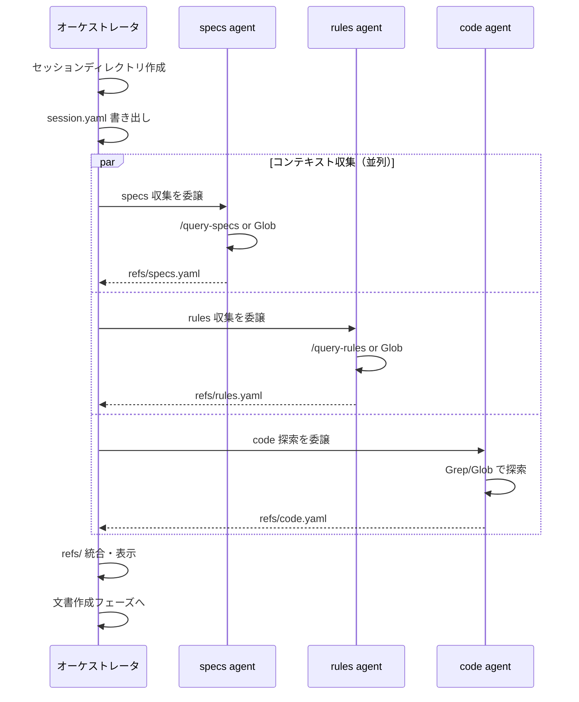
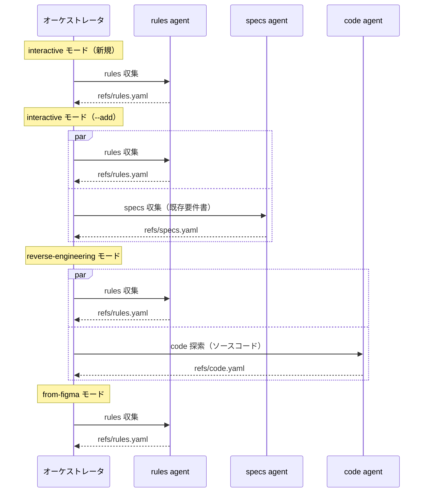

# DES-010 create-* スキル オーケストレータ化設計書

## メタデータ

| 項目     | 値                                                           |
| -------- | ------------------------------------------------------------ |
| 設計ID   | DES-010                                                      |
| 関連要件 | REQ-001 FNC-001, FNC-002, FNC-003, FNC-004                   |
| 関連設計 | `plugins/forge/docs/session_format.md`（セッションスキーマ） |
| 作成日   | 2026-03-13                                                   |
| 対象     | start-design, start-plan, start-requirements                 |

---

## 1. 概要

start-design / start-plan / start-requirements の 3 スキルは、review スキルと同じオーケストレータパターンで構成する。共通のコンテキスト収集フレームワークを抽出し、各スキルの SKILL.md をオーケストレータとして配置する。

---

## 2. アーキテクチャ概要

### 2.1 オーケストレータ構造

```
┌──────────────────────────────────────┐
│ start-design (オーケストレータ)       │
│  ├ 前提確認 + セッション作成          │
│  ├ コンテキスト収集 ──┬── specs agent │  ← 並列
│  │                     ├── rules agent │
│  │                     └── code agent  │
│  ├ refs/ 統合                          │
│  ├ 文書作成（メインコンテキスト）         │
│  ├ /forge:review → AIレビュー         │
│  └ 完了処理                            │
└──────────────────────────────────────┘
```

### 2.2 責務分担

| 役割                   | 実行場所                                    | 責務                                                                                   |
| ---------------------- | ------------------------------------------- | -------------------------------------------------------------------------------------- |
| オーケストレータ       | メインコンテキスト                          | 前提確認、セッション作成、進行管理、ユーザー対話、判断分岐                             |
| コンテキスト収集 Agent | 汎用 Agent (general-purpose)                | 仕様書・ルール・既存コードの探索 → refs/ に書き出し                                    |
| 文書作成               | メインコンテキスト                          | refs/ を読み込み、ユーザーと対話しながら文書を作成                                     |
| AIレビュー             | `/forge:review {type} {差分} --auto` に委譲 | レビュー+自動修正（差分のみ対象）                                                      |
| 後処理                 | メインコンテキスト                          | `/create-specs-toc` による ToC 更新、`/anvil:commit` による commit/push 確認、完了案内 |

> **設計判断**: 文書作成はメインコンテキストで実行する。理由: ユーザーとの対話（AskUserQuestion）が頻繁に発生し、汎用 Agent / fork 型 SKILL では対話ができないため。

---

## 3. 共通コンテキスト収集フレームワーク

### 3.1 概要

3 スキルに共通する「参考文書の収集」処理を標準化する。
review スキルの Phase 2 (Step 3~7) を汎用化し、create-* スキルでも同じパターンを使用する。

### 3.2 セッションディレクトリ構造（create-* 用）

```
.claude/.temp/{skill_name}-{random6}/
├── session.yaml       # セッションメタデータ
└── refs/              # コンテキスト収集結果
    ├── specs.yaml     # 仕様書検索結果
    ├── rules.yaml     # ルール検索結果
    └── code.yaml      # 既存コード探索結果
```

> review スキルとの違い: review.md / plan.yaml は不要。refs/ はサブディレクトリとして分離（session_format.md に準拠）。

### 3.3 session.yaml スキーマ（create-* 用）

```yaml
skill: start-design # start-design | start-plan | start-requirements
feature: login # 対象 Feature 名
mode: new # new | update（start-requirements は interactive | reverse-engineering | from-figma）
started_at: "2026-03-13T12:00:00Z"
last_updated: "2026-03-13T12:00:00Z"
status: in_progress # in_progress | completed
output_dir: "specs/login/design/" # 出力先ディレクトリ
```

### 3.4 refs/{category}.yaml スキーマ

session_format.md の統一スキーマに準拠:

```yaml
source: query-specs # query-specs | query-rules | doc_structure_fallback | code-exploration
query: "login 要件定義書" # 実行したクエリ（トレーサビリティ用）
documents:
  - path: specs/login/requirements/login_spec.md
    reason: "ログイン機能の要件定義書"
    lines: "" # 任意
```

### 3.5 コンテキスト収集 agent の指示方式

#### 仕様書による自己完結性の確保（FNC-003 準拠）

コンテキスト収集 agent には `plugins/forge/docs/context_gathering_spec.md`（自己完結型仕様書）のパスと `session_dir` のみを渡す。agent は仕様書を読むだけで収集作業を自律実行できる。

```yaml
session_dir: { session_dir }
spec: plugins/forge/docs/context_gathering_spec.md
tasks:
  - 仕様書調査
  - 実装ルール調査
```

### 3.6 並列実行と統合



### 3.7 並列収集の失敗時の扱い

各 agent は独立して動作するため、1つの agent が失敗しても他の agent には影響しない。失敗時の扱い:

- **agent がエラー終了**: 該当カテゴリの refs/{category}.yaml は作成されない。オーケストレータはファイルの不在を検知し、そのカテゴリの参照文書なしで後続工程に進む
- **agent が空結果を返す**: refs/{category}.yaml の `documents` が空配列。正常扱いとして後続工程に進む
- **agent がタイムアウト**: エラー終了と同じ扱い

> session_format.md の方針に準拠: 「refs/ がない場合、後続の agent は参照文書なしで動作する（最低限の品質でも実行可能）」

オーケストレータは失敗した agent があった場合、refs/ 統合表示でその旨を報告する（例: `**specs** — 収集失敗（スキップ）`）。

### 3.8 refs/ 統合後の表示

全 agent 完了後、オーケストレータは refs/ 内のファイルを Read し、Progress Reporting 規約に従って表示する:

```
### ✅ コンテキスト収集完了

**specs (N件)**
- `specs/login/requirements/login_spec.md` — ログイン機能の要件定義書
- `specs/login/design/login_design.md` — 既存設計書

**rules (N件)**
- `rules/design_workflow.md` — 設計書作成ワークフロー

**code (N件)**
- `src/auth/LoginService.swift` — ログイン処理の既存実装
- ... 他 N件
```

---

## 4. スキル別設計

各スキルのフェーズ構成と、コンテキスト収集 agent の適用マトリクスを定義する。

### 4.1 start-design

#### フェーズ構成

```
前提確認フェーズ [MANDATORY]
├── Step 1: .doc_structure.yaml の確認
├── Step 2: Feature 名の確定
├── Step 3: 出力先ディレクトリの解決
├── Step 4: モード判定（新規/既存）
└── Step 5: defaults 読み込み

セッション作成
└── session_dir 作成 + session.yaml 初期化

コンテキスト収集フェーズ（汎用 Agent 並列）
├── specs agent → refs/specs.yaml
├── rules agent → refs/rules.yaml
└── code agent  → refs/code.yaml

refs/ 統合・表示

Phase 1: 要件定義書の分析 [MANDATORY]
├── 1.1: refs/specs.yaml から要件定義書を Read
├── 1.2: 要件定義書の徹底確認
├── 1.3: 不明点の整理（AskUserQuestion）
└── 1.4: refs/code.yaml から既存実装を Read

Phase 2: 設計書の作成 [MANDATORY]
├── 2.1: フォーマット適用
├── 2.2: 設計ID体系の確認
└── 2.3: 設計書の作成（ファイルごとに AskUserQuestion [MANDATORY]）

Phase 3: AIレビュー（FNC-006 準拠）
└── /forge:review design --files {差分ファイル} --auto

Phase 4: 品質保証
└── 完全性チェック

完了処理
├── /create-specs-toc（利用可能な場合）
├── /anvil:commit
└── セッション削除 + 完了案内
```

#### コンテキスト収集の適用マトリクス

| agent | 必須 | 収集内容                             |
| ----- | ---- | ------------------------------------ |
| specs | ○    | 要件定義書（対象 Feature）           |
| rules | ○    | 設計書フォーマット、設計ワークフロー |
| code  | ○    | 既存実装資産（再利用候補）           |

---

### 4.2 start-plan

#### フェーズ構成

```
前提確認フェーズ [MANDATORY]
├── Step 1: .doc_structure.yaml の確認
├── Step 2: Feature 名の確定
├── Step 3: モード判定（新規/更新）
└── Step 4: defaults 読み込み

セッション作成

コンテキスト収集フェーズ（汎用 Agent 並列）
├── specs agent → refs/specs.yaml
└── rules agent → refs/rules.yaml

refs/ 統合・表示

Phase 1: 文書取得 [MANDATORY]
└── 1.1: refs/specs.yaml から要件定義書・設計書を Read

Phase 2: 計画書の作成・更新 [MANDATORY]
├── 2.1: 更新モード: 既存作業の確認
├── 2.2: 設計書からタスクを抽出 [MANDATORY]
├── 2.3: 計画書の作成・更新
└── 2.4: 完全性チェック [MANDATORY]

Phase 3: AIレビュー [MANDATORY]（FNC-006 準拠: --auto モード）
└── /forge:review plan --files {差分ファイル} --auto

完了処理
├── /create-specs-toc（利用可能な場合）
├── /anvil:commit
└── セッション削除 + 完了案内
```

#### コンテキスト収集の適用マトリクス

| agent | 必須                         | 収集内容                            |
| ----- | ---------------------------- | ----------------------------------- |
| specs | ○                            | 要件定義書 + 設計書（対象 Feature） |
| rules | △（/query-rules 利用可能時） | 計画書フォーマット（あれば）        |
| code  | ✕                            | 不要（計画書は実装を参照しない）    |

---

### 4.3 start-requirements

#### フェーズ構成

```
前提確認フェーズ [MANDATORY]
├── Step 1: .doc_structure.yaml の確認
├── Step 2: 出力先ディレクトリの解決
└── Step 3: defaults 読み込み

モード選択（AskUserQuestion）

Phase 0: 事前確認（全モード共通）
├── 0.1: 新規/追加の確認
└── 0.2: Feature 名の確定

セッション作成

コンテキスト収集フェーズ（汎用 Agent、モード依存）
├── rules agent → refs/rules.yaml   （全モード）
├── specs agent → refs/specs.yaml   （--add 時のみ）
└── code agent  → refs/code.yaml    （reverse-engineering 時のみ）

refs/ 統合・表示

Mode: interactive
├── Phase 1: ビジョン・価値の明確化
├── Phase 2: 体験フロー・画面構成
├── Phase 3: 詳細仕様（グロッサリー [MANDATORY]）
└── Phase 4: 統合・品質確認

Mode: reverse-engineering
├── Phase 1: refs/code.yaml を起点にソースコード解析
├── Phase 2: 要件抽出 [MANDATORY]
├── Phase 3: 要件定義書作成
└── Phase 4: 品質確認

Mode: from-figma
├── Phase 1: Figmaアクセス確認
├── Phase 2: デザインシステム構築
├── Phase 3: 要件定義書作成
├── Phase 4: 静的アセット管理
└── Phase 5: 品質確認

Phase: AIレビュー（FNC-006 準拠）
└── /forge:review requirement --files {差分ファイル} --auto

完了処理
├── /create-specs-toc（利用可能な場合）
├── /anvil:commit
└── セッション削除 + 完了案内
```

#### コンテキスト収集の適用マトリクス

| agent | 必須                         | 収集内容                             |
| ----- | ---------------------------- | ------------------------------------ |
| rules | ○                            | 要件書フォーマット、ワークフロー指示 |
| specs | `--add` 時のみ               | 既存の要件定義書（追加作成の参考）   |
| code  | `reverse-engineering` 時のみ | ソースコード探索（要件抽出の起点）   |

> **設計判断**: start-requirements の interactive モードではコンテキスト収集は最小限（rules のみ）。
> 要件定義は「何を実現するか」を定義する工程であり、既存実装への過度な依存は避ける（REQ-001 オーケストレータパターン要件の設計原則「What に集中」に準拠）。

#### モード別コンテキスト収集シーケンス



---

## 5. 使用する既存コンポーネント

| コンポーネント            | ファイルパス                                                    | 用途                                                                             |
| ------------------------- | --------------------------------------------------------------- | -------------------------------------------------------------------------------- |
| セッションスキーマ        | `plugins/forge/docs/session_format.md`                          | refs/ スキーマ、セッションライフサイクル                                         |
| review オーケストレータ   | `plugins/forge/skills/review/SKILL.md`                          | Phase 2 のパターンを参考実装として使用                                           |
| session_format.md         | `plugins/forge/docs/session_format.md`                          | ファイルフォーマット仕様（review 用。create-* は session.yaml + refs/ のみ使用） |
| resolve_review_context.py | `plugins/forge/skills/review/scripts/resolve_review_context.py` | 将来的に汎用化の候補（現状は review 専用）                                       |
| Progress Reporting 規約   | review/SKILL.md 内                                              | 5件以下全件表示、6件以上は先頭3件+省略                                           |

---

## 6. セッションライフサイクル

> セッション管理の詳細設計（ライフサイクルフロー、session_manager.py、残存セッションのスキル別扱い）は **DES-011 `DES-011_session_management_design.md`** を参照。

本セクションでは create-* スキル固有の補足のみ記述する。

### 6.1 セッション管理の実行

`session_manager.py` スクリプトに委譲する。詳細は DES-011 §5 を参照。

```bash
python3 ${CLAUDE_PLUGIN_ROOT}/scripts/session_manager.py init \
  --skill start-design \
  --feature "{feature}" \
  --mode "{new|update}" \
  --output-dir "{出力先ディレクトリ}"
```

### 6.2 残存セッションの扱い: 再開非対応

create-* スキルは直線的ワークフローであり、中断時は最初からやり直す方が効率的。
残存セッション検出時は AskUserQuestion で「削除 / 残す」のみを提示し、「再開」は提供しない。判断はスキル種別ごとの責務であり `session.yaml` のフラグには依存しない（Issue #99 / DES-011 §4.2）。

---

## 改定履歴

| 日付       | バージョン | 内容                                                                                                                                                                                                                                                                                                                                                                                                                                                                                                                                                                                                                                                                                   |
| ---------- | ---------- | -------------------------------------------------------------------------------------------------------------------------------------------------------------------------------------------------------------------------------------------------------------------------------------------------------------------------------------------------------------------------------------------------------------------------------------------------------------------------------------------------------------------------------------------------------------------------------------------------------------------------------------------------------------------------------------- |
| 2026-03-13 | 1.0        | 初版作成                                                                                                                                                                                                                                                                                                                                                                                                                                                                                                                                                                                                                                                                               |
| 2026-05-22 | 1.1        | 設計書から計画・移行情報を削除し完成形の記述に統一。削除: §1 概要の「現状の God-Skill 構造の問題点」記述 / §2.1 の【現状】God-Skill 構造図（タイトルを「現状と目標」→「オーケストレータ構造」に改題、目標図のみ残す） / §3.5 の「プロンプトテンプレート（暫定）」3 agent 分（自己完結型仕様書による指示方式のみ残す） / §4.1〜§4.3 の各 As-Is（現状 SKILL.md のフェーズ構成）ブロックおよび「コンテキスト収集が分散している箇所」リスト / §4.1〜§4.3 To-Be 内の「← 新規」「← 更新」「（変更なし）」マーカー。§4.x のフェーズ構成見出しを「To-Be（オーケストレータ化後）」→「フェーズ構成」に改題。§4 のリード文を As-Is/To-Be 対比から「フェーズ構成と適用マトリクス」の説明に書き換え |
