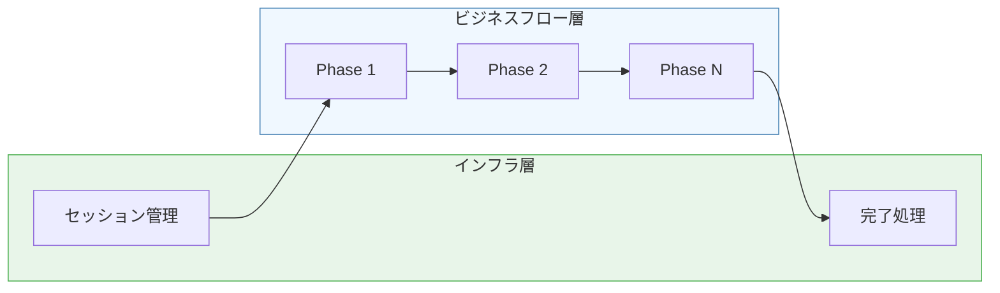
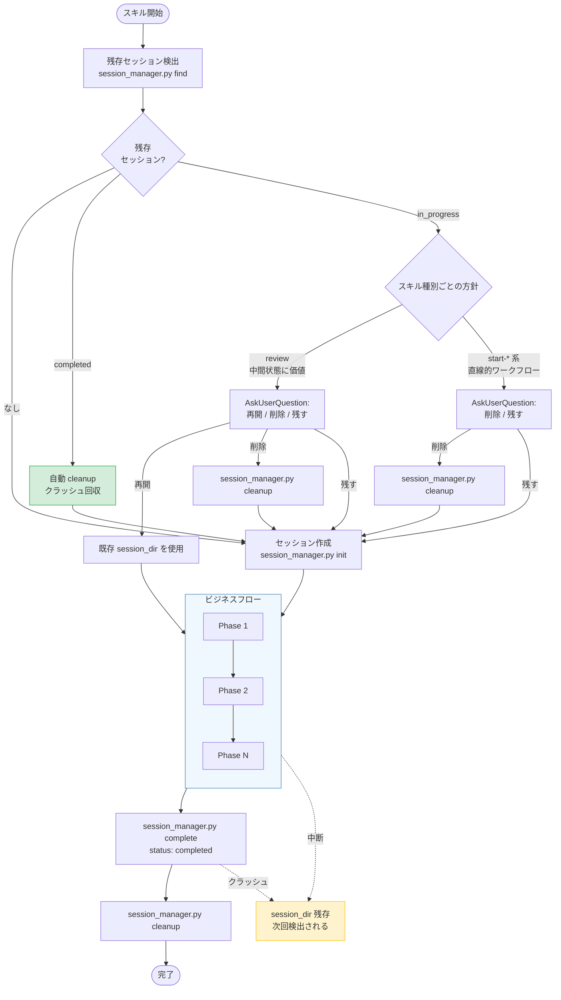
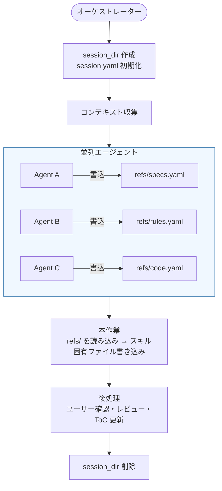
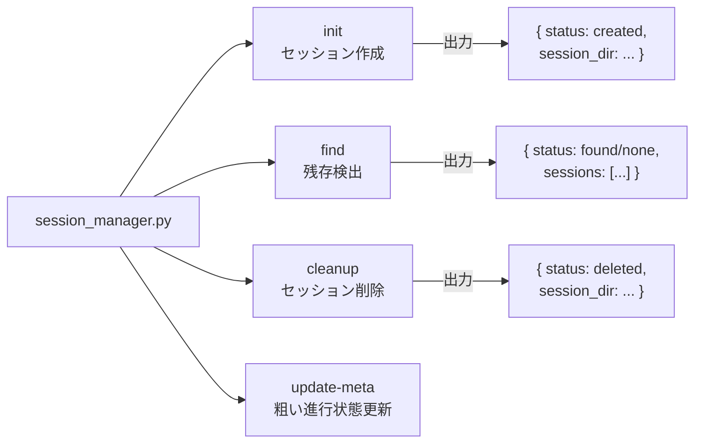

# DES-011 セッション管理設計書

## メタデータ

| 項目     | 値                                                                                                  |
| -------- | --------------------------------------------------------------------------------------------------- |
| 設計ID   | DES-011                                                                                             |
| 関連要件 | REQ-001 FNC-002                                                                                     |
| 関連設計 | DES-010, DES-014, DES-024                                                                           |
| 作成日   | 2026-03-13                                                                                          |
| 対象     | 全オーケストレータースキル（review, start-design, start-plan, start-requirements, start-implement） |

---

## 1. 概要

forge の全オーケストレータースキルが使用するセッション管理の設計を定義する。

セッションは**フェーズ間のデータをファイル経由で受け渡す**ための一時ディレクトリである。本設計書では、セッションの作成・検出・削除のライフサイクルと、それを実現する `session_manager.py` スクリプトの設計、および SKILL.md におけるセッション管理の位置づけを定義する。

### スコープ

| 本設計書のスコープ                                               | 参照先                                                          |
| ---------------------------------------------------------------- | --------------------------------------------------------------- |
| セッションの**ライフサイクル設計**（なぜ・どう管理するか）       | 本文書                                                          |
| セッションの**ファイルスキーマ**（session.yaml, refs/ 等の構造） | `plugins/forge/docs/session_format.md`                          |
| オーケストレータパターンの**要件**                               | `docs/specs/forge/requirements/REQ-001_orchestrator_pattern.md` |

---

## 2. 設計判断

### 2.1 なぜファイル経由の通信か

| 課題                               | ファイル経由の解決                       |
| ---------------------------------- | ---------------------------------------- |
| コンテキスト圧縮でデータが消失する | ファイルは永続。圧縮後も Read で復元可能 |
| 並列エージェントの出力が衝突する   | 各エージェントが別ファイルに書き込み     |
| 中断後にデータを再利用したい       | ディレクトリが残っていれば再開可能       |

> FNC-002「セッションディレクトリ通信」の実装。

### 2.2 なぜスクリプト（session_manager.py）に委譲するか

AI がセッションディレクトリを手作業で構築すると、以下の問題が発生する:

| 問題                           | 具体例                                                  |
| ------------------------------ | ------------------------------------------------------- |
| **YAML フォーマットミス**      | インデント不正、クォート漏れ、コロン後のスペース欠落    |
| **フィールド漏れ**             | `last_updated` や `status` の書き忘れ                   |
| **タイムスタンプ形式の不統一** | ISO 8601 の `T` / `Z` の有無がばらつく                  |
| **ディレクトリ名の衝突**       | ランダム部分の生成が不安定                              |
| **フィールド順序の不統一**     | 共通フィールド→スキル固有フィールドの順序が保証されない |

`session_manager.py` に以下を委譲することで、AI は引数を渡すだけで正しいセッションを作成できる:

- ディレクトリ名の生成（スキル名 + ランダム hex）
- `session.yaml` の YAML テキスト組み立て（フィールド順序保証）
- タイムスタンプの自動生成（UTC ISO 8601）
- 残存セッションの検索（YAML パース）
- 安全な削除（パストラバーサル防止）

### 2.3 正規状態を増やさない

セッション管理は新しい全体スナップショットを作らない。`session_state.yaml` のような
重複ファイルを追加すると、`session.yaml` / `refs/` / `refs.yaml` / `plan.yaml` のどれが
正か分からなくなり、AI と実装の両方で判断コストが増える。

既存ファイルの正規責務は次の通り。

| 状態カテゴリ                                    | 正規情報源                          |
| ----------------------------------------------- | ----------------------------------- |
| セッションの存在、skill、開始時刻、最終更新時刻 | `session.yaml`                      |
| 粗い進行状態、現在フェーズ、待機理由            | `session.yaml` の浅い追加フィールド |
| review の指摘状態                               | `plan.yaml`                         |
| review の参照情報                               | `refs.yaml`                         |
| create / implement 系の参照情報                 | `refs/{specs,rules,code}.yaml`      |
| 最終成果物                                      | `docs/specs/**` など既存出力先      |

### 2.4 `session.yaml` は manifest と粗い進行状態だけを持つ

`session.yaml` は全状態を持たない。review item、recommendation、auto_fixable、reason、
status 一覧など、`plan.yaml` が保持する review item state を複製してはならない。

`session.yaml` に追加できるのは、再開判断と進行状態確認に必要な浅いフィールドに限定する。

| フィールド        | 型     | 許容値 / 形式                                      | 既定値        | 説明                     |
| ----------------- | ------ | -------------------------------------------------- | ------------- | ------------------------ |
| `phase`           | string | 標準 phase または skill 固有文字列                 | `created`     | 粗い進行段階             |
| `phase_status`    | string | `pending` / `in_progress` / `completed` / `failed` | `in_progress` | phase の状態             |
| `focus`           | string | 1 行文字列                                         | `""`          | 進行状況表示用の短い焦点 |
| `waiting_type`    | string | `none` / `user_input` / `agent` / `command`        | `none`        | 待機種別                 |
| `waiting_reason`  | string | 1 行文字列                                         | `""`          | 待機理由                 |
| `active_artifact` | string | session_dir 相対パスまたは project 相対パス        | `""`          | 直近更新成果物           |

標準 phase は、進行状態表示とテスト安定化のために以下を優先して使う。ただし skill 固有 phase
を追加しやすくするため、未定義 phase は保存自体を拒否しない。

| phase               | 用途                                    |
| ------------------- | --------------------------------------- |
| `created`           | セッション作成直後                      |
| `context_gathering` | refs / refs.yaml 作成中                 |
| `context_ready`     | 参照情報が揃った                        |
| `review_running`    | reviewer / evaluator / fixer 実行中     |
| `review_extracted`  | `review.md` / `plan.yaml` 初期生成済み  |
| `evaluation_merged` | evaluator 結果を `plan.yaml` へ反映済み |
| `fixing`            | fixer 実行中                            |
| `document_drafting` | requirements / design / plan 作成中     |
| `artifact_ready`    | 主要成果物が作成済み                    |
| `completed`         | 正常完了                                |
| `failed`            | 失敗                                    |

### 2.5 なぜセッション管理はフェーズの外に独立するか

セッション管理はフロー全体のライフサイクルを管理する**インフラ関心事**であり、ビジネスロジックのフェーズ（コンテキスト収集、文書作成、レビュー等）とは**抽象レベルが異なる**。



**混在させた場合の問題:**

- AI がフェーズを読む時、ビジネスアクションとは無関係なセッション操作が途中に挟まり、ワークフローの本質が見えにくくなる
- セッション管理の配置がスキルごとにバラバラになる（Phase 1.5、独立セクション、Phase 3.1 等）

**分離した場合の利点:**

- ビジネスフローの Phase は「何をするか」だけに集中できる
- セッション管理は全スキルで統一パターン（`## セッション管理 [MANDATORY]`）
- 開始と終了のブックエンド構造が明確

---

## 3. SKILL.md の構造パターン

### 3.1 共通パターン

```
## 事前準備 [MANDATORY]         ← 引数解析・出力先解決・defaults 読み込み
## セッション管理 [MANDATORY]   ← インフラ（残存検出 → 作成）
## Phase 1: ...                 ← ビジネスフロー開始
## Phase 2: ...
## Phase N: ...
## 完了処理                     ← インフラ（セッション削除 + 案内）
```

- **セッション管理**と**完了処理**はビジネスフローの**ブックエンド**であり、Phase 番号を持たない
- 事前準備でセッション作成に必要な情報（Feature 名、モード等）を確定した後にセッション管理を実行する
- スキルごとに事前準備の内容は異なるが、セッション管理→ビジネスフロー→完了処理の3層構造は共通

### 3.2 スキル別の構造

| スキル             | 事前準備                                | セッション管理      | ビジネスフロー                |
| ------------------ | --------------------------------------- | ------------------- | ----------------------------- |
| start-design       | Feature確定・出力先・モード・defaults   | `## セッション管理` | Phase 1-4                     |
| start-plan         | Feature確定・出力先・モード・defaults   | `## セッション管理` | Phase 1-4                     |
| start-requirements | 前提確認・モード選択・Phase 0           | `## セッション管理` | コンテキスト収集 + Mode別処理 |
| start-implement    | Phase 1(事前確認) + Phase 2(タスク選択) | `## セッション管理` | Phase 3-5                     |
| review             | Phase 1(引数解析) + Phase 2(収集)       | `## セッション管理` | Phase 3-5                     |

> start-implement と review は事前準備のステップ数が多いため Phase 番号付きで記述するが、セッション管理は Phase の間に独立セクションとして挿入する。

---

## 4. セッションライフサイクル

### 4.1 全体フロー



> 残存セッションの扱いは `session.yaml` のフィールドではなく **スキル種別ごとの責務** で判断する（Issue #99 / session_format.md §4 と整合）。review は中間状態に価値があるため「再開」選択肢を提示し、start-* 系は最初からやり直す方が効率的なため「削除 / 残す」のみを提示する。

### 4.2 残存セッションの扱い（スキル種別ごとの責務）

`session.yaml` には `resume_policy` フィールドを持たない（Issue #99 / `session_manager.py` の `cmd_init` は 4 共通フィールド `skill / started_at / last_updated / status` のみを書く）。残存セッションの扱いは **スキル種別ごとの責務** で判断し、各 SKILL.md に直接記述する:

| スキル種別                                                    | 残存検出時の方針                                                                                                                                                                  |
| ------------------------------------------------------------- | --------------------------------------------------------------------------------------------------------------------------------------------------------------------------------- |
| review                                                        | サイクル実行（reviewer → evaluator → fixer）の中間状態に価値があるため、AskUserQuestion で「再開 / 削除 / 残す」の 3 択を提示する。レビュー結果や修正プランの再収集はコストが高い |
| start-design, start-plan, start-requirements, start-implement | 直線的ワークフロー。中断時は最初からやり直す方が効率的なため、AskUserQuestion で「削除 / 残す」の 2 択を提示する。コンテキスト収集の再実行コストは低い                            |

### 4.3 データフロー



---

## 5. session_manager.py の設計

### 5.1 設計方針

| 方針                    | 理由                                                                                                                                                                                                                                       |
| ----------------------- | ------------------------------------------------------------------------------------------------------------------------------------------------------------------------------------------------------------------------------------------ |
| 標準ライブラリのみ      | PyYAML 等の外部依存を避ける（プロジェクト規約）                                                                                                                                                                                            |
| 簡易 YAML writer/reader | フラット key-value のみ対応。ネスト構造は不要                                                                                                                                                                                              |
| JSON 出力               | AI がパースしやすい。`ensure_ascii=False, indent=2`                                                                                                                                                                                        |
| `parse_known_args`      | `--skill` 以外の任意 `--key value` をスキル固有フィールドとして受け入れる                                                                                                                                                                  |
| `--files` 予約 (#100)   | review 専用の予約キー。`--files` のみ可変長 list（レビュー対象ファイル群）として受け取り `session.yaml` に list 保存する。他 skill が `--files` を渡した場合は副作用ゼロで reject する（上記「任意 `--key value`」契約に対する明示的例外） |
| パストラバーサル防止    | cleanup 時に `realpath` で正規化し `.claude/.temp/` 配下であることを検証                                                                                                                                                                   |

### 5.2 サブコマンド



| サブコマンド  | 入力                                                                              | 処理                                                                                                                  | 出力                                                                                                                                         |
| ------------- | --------------------------------------------------------------------------------- | --------------------------------------------------------------------------------------------------------------------- | -------------------------------------------------------------------------------------------------------------------------------------------- |
| `init`        | `--skill` + 任意 `--key value`（review のみ `--files` 可変長 list 可、§5.1 例外） | `--files` 抽出・validation（review 限定）→ completed 残骸の自動回収（§5.6）→ ディレクトリ作成 + session.yaml 書き出し | `{"status": "created", "session_dir": "...", "auto_cleanup": {...}}`（invalid `--files` 時は `{"status": "error", ...}` を副作用ゼロで返す） |
| `find`        | `--skill`                                                                         | `.claude/.temp/*/session.yaml` を検索                                                                                 | `{"status": "found"/"none", "sessions": [...]}`                                                                                              |
| `cleanup`     | session_dir パス                                                                  | パス検証 + `shutil.rmtree()`                                                                                          | `{"status": "deleted", "session_dir": "..."}`                                                                                                |
| `update-meta` | session_dir + 任意 meta flag                                                      | `session.yaml` の浅い進行状態を更新                                                                                   | `{"status": "ok", "updated": [...]}`                                                                                                         |

### 5.3 `update-meta` の設計

> **未実装**: `update-meta` サブコマンドおよび関連フィールド (`phase` / `phase_status` / `focus` / `waiting_type` / `waiting_reason` / `active_artifact`) は本設計書に記載されているが、`session_manager.py` の現行実装にはサブコマンドとして登録されていない（`init` / `find` / `touch` / `complete` / `cleanup` / `cleanup-stale` のみ）。実装するか設計から削除するかは Epic #110 Phase 3 / Issue #106「resume/phase の実装 or 設計削除 — complexity debt 解消」で決定する。本セクションの記述は #106 への入力資料として保持する。

`update-meta` は `session.yaml` の浅いフィールドだけを更新する。`plan.yaml`、`refs.yaml`、
`refs/`、review item state は触らない。

```bash
python3 plugins/forge/scripts/session_manager.py update-meta {session_dir} \
  [--phase PHASE] \
  [--phase-status STATUS] \
  [--focus TEXT] \
  [--waiting-type TYPE] \
  [--waiting-reason TEXT] \
  [--active-artifact PATH]
```

更新規則:

- `last_updated` は成功時に必ず更新する
- 未指定フィールドは既存値を保持する
- 空文字指定は明示的な clear として扱う
- `waiting_type=none` の場合、`waiting_reason` は空文字へ正規化する
- `phase=completed` かつ `phase_status=completed` の場合、既存 `status` も `completed` にする
- `phase=failed` または `phase_status=failed` の場合、既存 `status` は変更しない
- 書き込みは同一ディレクトリ内の一時ファイル + `os.replace()` で atomic に行う

### 5.4 session.yaml のフィールド順序

共通フィールドを先に出力し、スキル固有フィールドはアルファベット順:

```
skill           ← 常に先頭
started_at
last_updated
status
---             ← ここからスキル固有
auto_count      ← アルファベット順
engine
feature
mode
output_dir
...
```

この順序保証により、YAML の diff が安定する。

> Issue #99: 旧 `resume_policy` フィールドは廃止済み（実装の `cmd_init` は共通 4 フィールドのみを書き、`test_only_common_fields_by_default` が `resume_policy` の不在を期待）。残存セッションの扱いは §4.2 のスキル種別ごとの責務で判断する。

### 5.6 `init` 時の completed 残骸自動回収（#93）

`cleanup-stale` の自動実行フックが存在しないため、明示的に叩かない限り `complete` 後の `cleanup` 漏れ（クラッシュ由来）による `status: completed` 残骸が回収されない問題があった（#93）。

**設計判断**: 任意の forge オーケストレーター起動時に必ず実行される `init` に、「completed 残骸のみを全スキル横断で回収する」処理を集約する。

| 項目                   | 決定                                                                                   | 根拠                                                                                     |
| ---------------------- | -------------------------------------------------------------------------------------- | ---------------------------------------------------------------------------------------- |
| 回収対象               | `status: completed` のみ                                                               | 中断中（`in_progress`）は再開価値があり得るため `init` では削除しない（誤削除防止）      |
| 回収範囲               | 全スキル横断（`skill_filter=None`）                                                    | 同プロジェクト内の他スキル残骸も同時回収（#93 原因 2 を解消）                            |
| in_progress の時間回収 | `init` では行わない                                                                    | 48h 経過 in_progress の削除は誤削除リスクとのトレードオフ。手動 `cleanup-stale` に委ねる |
| 失敗時の扱い           | 例外を捕捉し warning（stderr）を出して init 継続                                       | セッション作成というユーザー作業を残骸回収の失敗で妨げない                               |
| 実装                   | `cleanup-stale` のコアロジック（`_cleanup_stale_core`）を `completed_only=True` で共有 | 手動 `--completed-only` と同一経路。重複実装を避ける                                     |

`init` の戻り値に `auto_cleanup: {deleted, skipped}`（失敗時は `{error}`）を追加し、回収結果を可視化する。SKILL.md 側の変更は不要（`init` の入口がそのまま）。

---

## 6. session writer の設計

### 6.1 public entrypoint の安定性

wrapper が多数存在するため、以下の public CLI path は互換性のある entrypoint として維持する。
内部実装を分離する場合も、既存 path は facade として残す。

- `plugins/forge/scripts/session_manager.py`
- `plugins/forge/scripts/session/write_refs.py`
- `plugins/forge/scripts/session/update_plan.py`
- `plugins/forge/scripts/session/merge_evals.py`
- `plugins/forge/scripts/session/write_interpretation.py`
- `plugins/forge/scripts/session/summarize_plan.py`
- `plugins/forge/scripts/session/read_session.py`

### 6.2 writer の meta 更新

writer script は、成果物ファイルの保存に成功した後で必要に応じて
`session.yaml` の浅い進行状態を更新する。core writer は `plugins/forge/scripts/session/store.py`
の `SessionStore` を通し、artifact write → meta update の順序を共有する。

成果物本文の保存に成功し、session meta 更新だけ失敗した場合、writer 本体は成功扱いとする。
`session.yaml` は粗い進行状態であり、正規成果物ではないためである。
ただし stderr に警告を出す。

```text
[forge session] warning: update-meta failed: <reason>
```

writer 別の標準更新内容:

| writer / 処理                | 更新タイミング                    | updates                                                                          |
| ---------------------------- | --------------------------------- | -------------------------------------------------------------------------------- |
| `write_refs.py`              | `refs.yaml` 書き込み成功後        | `phase=context_ready`, `phase_status=completed`, `active_artifact=refs.yaml`     |
| `extract_review_findings.py` | `review.md` / `plan.yaml` 生成後  | `phase=review_extracted`, `phase_status=completed`, `active_artifact=review.md`  |
| `merge_evals.py`             | evaluator 結果 merge 成功後       | `phase=evaluation_merged`, `phase_status=completed`, `active_artifact=plan.yaml` |
| `update_plan.py`             | `plan.yaml` 更新成功後            | `active_artifact=plan.yaml`                                                      |
| `write_interpretation.py`    | `review_<種別>.md` 書き込み成功後 | `active_artifact=review_<種別>.md`                                               |

### 6.3 session 読み取りの共通化

`plugins/forge/scripts/session/reader.py` は session files / refs files の読み取りを共通化する。
`read_session.py` は CLI facade として reader の結果を JSON 出力する。これにより YAML / Markdown の
欠損・読み取り失敗・entry 形式が二重実装にならない。

---

## 改定履歴

| 日付       | バージョン | 内容                                                                                          |
| ---------- | ---------- | --------------------------------------------------------------------------------------------- |
| 2026-05-27 | 1.4        | §5.6 `init` 時の completed 残骸自動回収を追加（#93）。`cleanup-stale --completed-only` を新設 |
| 2026-05-07 | 1.3        | monitor（ブラウザ進捗表示）機能撤去に伴う整合更新                                             |
| 2026-05-06 | 1.2        | `SessionStore` と `session.reader` による writer / reader 共通化を追記                        |
| 2026-05-05 | 1.1        | session architecture cleanup の永続原則を統合。`update-meta` を追加                           |
| 2026-03-13 | 1.0        | 初版作成                                                                                      |
