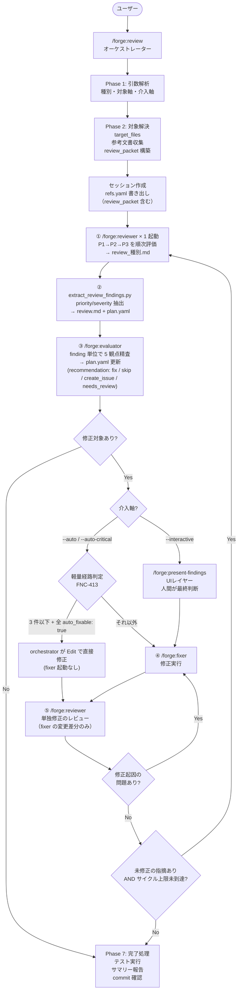
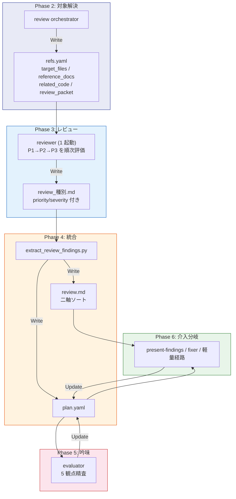

# DES-015 forge レビューワークフロー 設計書

## メタデータ

| 項目   | 値         |
| ------ | ---------- |
| 設計ID | DES-015    |
| 作成日 | 2026-03-14 |

---

> 対象プラグイン: forge | スキル: `/forge:review`

---

## 1. 概要

`/forge:review` はレビューワークフローのオーケストレータスキル。
引数解析 → 対象ファイル解決 → 参考文書収集 → レビュー実行 → 吟味 → 修正 → 完了処理の流れで動作する。

### 設計の背景

旧設計では `review` スキルが引数解析・参考文書収集・レビュー実行・吟味・修正・ToC更新・commit/push を全て担っていた（God-Skill 問題）。
単一責任原則に基づき、`review` をオーケストレーターとして整理し、各工程を専用スキルに委譲する構造に改めた。

### スキル一覧と責務

実際のレビュー・吟味・修正は専用の AI 専用スキルに委譲する:

| スキル                    | 役割                           |
| ------------------------- | ------------------------------ |
| `/forge:reviewer`         | レビュー実行（指摘事項の作成） |
| `/forge:evaluator`        | 指摘事項の吟味・修正判定       |
| `/forge:present-findings` | 対話モードでの段階的提示       |
| `/forge:fixer`            | 修正実行                       |

### レビュー種別

6 種別に対応: `code` / `requirement` / `design` / `plan` / `uxui` / `generic`

### CLI 軸とデフォルト

レビューポリシー (REQ-004 / DES-028) により、`/forge:review` は **対象軸** と **介入軸** の 2 軸フラグで挙動が決まる。詳細は DES-028 §2.4 を参照:

| 軸     | フラグ                                         | デフォルト (未指定時) |
| ------ | ---------------------------------------------- | --------------------- |
| 対象軸 | `--diff` / `--files a.md,b.md,...`             | `--diff`              |
| 介入軸 | `--interactive` / `--auto-critical` / `--auto` | `--interactive`       |

省略形と明示形は等価。例: `/forge:review code` と `/forge:review code --diff --interactive` は同一の内部状態。旧 `--auto N` (件数指定) は採用しない (REQ-004 FNC-404)。

---

## 2. フローチャート



コアループは auto / 対話 で同一。`--interactive` モードでは extract と fixer の間に present-findings（UIレイヤー）が挟まるだけ。

```
--auto / --auto-critical: reviewer(1 起動) → extract → evaluator → [軽量経路 or fixer] → re-review → (問題あり → fixer → ...) → 終了
--interactive (デフォルト): reviewer(1 起動) → extract → evaluator → present-findings → [軽量経路 or fixer] → re-review → 終了
                                                                ↑ UIレイヤー（提示+人間判断）
```

reviewer は **観点軸 (P1/P2/P3) も対象ファイル軸も並列分割しない 1 起動原則** (FNC-412) に従う。fixer の後は必ず reviewer が**単独修正のレビュー**（fixer が変更した差分のみ）を行う。target_files 全体の再レビューではない。修正起因の問題が見つかった場合は fixer → re-review のループで解消する。

軽量経路 (FNC-413) は `--auto-critical` / `--auto` で `recommendation: fix` 件数が 3 以下 + 全 `auto_fixable: true` の場合に発動し、orchestrator が直接 `Edit` で修正する (詳細は DES-028 §4.5)。

---

## 3. フェーズ詳細

### Phase 1: 引数解析

| Step | 内容                                                                     | 実行者             |
| ---- | ------------------------------------------------------------------------ | ------------------ |
| 1    | `$ARGUMENTS` を AI が解釈: 種別・対象軸・介入軸を確定                    | orchestrator（AI） |
| 2    | 解析結果をテーブル形式で表示                                             | orchestrator       |
| 3    | early validation (対象軸/介入軸の二重指定・廃止フラグ拒否) を実施        | orchestrator       |
| 4    | target_files が実用上限 (3〜5) を超える場合は AskUserQuestion で絞り込み | orchestrator       |

**設計判断**: 引数解析はスクリプトではなく AI が直接行う。理由: ユーザーの入力は自然言語が混在する（例: `design 先ほど作成したファイル --auto`）ため、リジッドなトークンパーサーでは対応できない。AI がコマンド構文から意図を汲み取り、不足情報は AskUserQuestion で補完する。位置引数は **種別 1 個のみ**、ファイル指定は `--files` フラグ (DES-028 §4.1 / REQ-004 FNC-410)。

### Phase 2: 対象解決 + 参考文書収集

| Step | 内容                                                               | 実行者                       |
| ---- | ------------------------------------------------------------------ | ---------------------------- |
| 1    | `.doc_structure.yaml` の存在確認                                   | orchestrator                 |
| 2    | `resolve_review_context.py` で target_files を解決                 | スクリプト                   |
| 3    | 関連コード探索（汎用 Agent 委譲）                                  | 汎用 Agent (general-purpose) |
| 4    | review_packet 構築 (criteria の SSOT参照 + P2/P3 固定 SSOT を集約) | orchestrator                 |
| 5    | 参考文書収集（DocAdvisor or .doc_structure.yaml）                  | orchestrator                 |
| 6    | エンジン確認（Codex / Claude）                                     | orchestrator                 |

#### review_packet の構築

orchestrator は criteria (`${CLAUDE_SKILL_DIR}/docs/review_criteria_{種別}.md`) の **「1. SSOT参照」表** を読み、P1 由来文書 + P2/P3 固定文書 (`spec_priorities_spec.md` 等) を 1 つの `ssot_refs[]` にまとめて refs.yaml の `review_packet` セクションに書き出す。スキーマ詳細・優先採用順は DES-028 §2.3 を参照。

### Phase 3: レビュー実行（reviewer 1 起動）

orchestrator が refs.yaml の `review_packet` を読み、`/forge:reviewer` を **1 体だけ** 起動する (FNC-412)。reviewer は P1 → P2 → P3 を `check_order` に従い順次評価し、`review_{種別}.md` (例: `review_design.md`) を出力する。観点ごとの分離は finding の `priority: P1|P2|P3` ラベルで表現し、agent 分離では行わない。

engine (`codex` / `claude`) は reviewer fork に引数として渡し、Codex 実行 (`run_review_engine.sh`) / Claude self-review / Codex 不在時の fallback の差分はすべて **reviewer 内部で完結** する。orchestrator は engine を問わず reviewer を 1 体起動するのみで、`run_review_engine.sh` を直接起動しない (DES-029 §4.2)。

### Phase 4: 統合

reviewer 完了後、`extract_review_findings.py` が `review_{種別}.md` から findings を抽出し、`review.md` と `plan.yaml` を生成する。plan.yaml の各 item には `priority` (P1/P2/P3) と `severity` (critical/major/minor) が独立フィールドとして付与される。実装は CLI facade、`scripts/review/findings_parser.py`、`scripts/review/findings_renderer.py` に分かれ、parser / renderer は file write を持たない。

### Phase 5: 吟味

extract 完了後、orchestrator が `/forge:evaluator` を起動する。evaluator は `review_{種別}.md` 内の各 finding を 5 観点 (ルール照合 / 設計意図 / 副作用リスク / false positive / 対象ファイル確認) で精査し、`recommendation` (`fix` / `skip` / `create_issue` / `needs_review` の 4 値) ・ `auto_fixable` ・ `reason` を plan.yaml に付与する。5 観点と P1/P2/P3 軸は直交関係であり、すべての finding に 5 観点を適用する (DES-028 §4.3)。

### Phase 6: 介入分岐

介入軸フラグ (`--interactive` / `--auto-critical` / `--auto`) で分岐する。

#### `--interactive` (デフォルト)

| Step | 内容                                                                  | 委譲先                                                  |
| ---- | --------------------------------------------------------------------- | ------------------------------------------------------- |
| 1    | 段階的提示 (🔴 → 🟡 → 🟢) + ユーザー判定 (修正 / スキップ / Issue 化) | `/forge:present-findings`（plan.yaml + review.md 参照） |
| 2    | 修正実行 (軽量経路 or fixer 経路、FNC-413 で判定)                     | orchestrator (軽量) / `/forge:fixer` (重量)             |

#### `--auto-critical` / `--auto`

| Step | 内容                                                                                                                        | 委譲先                                                                                                                 |
| ---- | --------------------------------------------------------------------------------------------------------------------------- | ---------------------------------------------------------------------------------------------------------------------- |
| 1    | 軽量経路判定 (FNC-413): `recommendation: fix` AND `status ∈ {pending, in_progress}` の件数 ≤ 3 + 全 `auto_fixable: true` か | orchestrator                                                                                                           |
| 2a   | 軽量経路: `mark_in_progress.py` → orchestrator の `Edit` 直接修正                                                           | orchestrator                                                                                                           |
| 2b   | fixer 経路: 一括修正                                                                                                        | Skill ツール (fork) で `/forge:fixer` (`args: "{session_dir} {review_type} --batch {介入軸フラグ}"`)                   |
| 3    | 再レビュー                                                                                                                  | Skill ツール (fork) で `/forge:reviewer` (`args: "{session_dir} {review_type} {engine} --diff-only {files_modified}"`) |
| 4    | `fixed` 確定                                                                                                                | 単独修正レビュー完了後に呼び出し元が `mark_fixed.py` を実行                                                            |

`--auto-critical` は severity=critical のみを対象に絞り、`--auto` は全件を対象とする。plan.yaml 内の `recommendation: fix` AND `status ∈ {pending, in_progress}` が 0 件でループ終了。`recommendation: create_issue` の項目は fixer / 軽量経路の対象外 (Issue 化済みは fixer の責務外)。

#### 修正経路分岐表 (DES-029 §7)

| # | 経路名             | 起動方法              | context 消費    | 用途                                                 | 適用条件                                                                                           |
| - | ------------------ | --------------------- | --------------- | ---------------------------------------------------- | -------------------------------------------------------------------------------------------------- |
| 1 | 軽量経路 (FNC-413) | (起動なし、Edit 直接) | 親 context 消費 | 件数小・auto_fixable な finding の自動修正           | `recommendation: fix` AND `status ∈ {pending, in_progress}` の件数 ≤ 3 AND 全 `auto_fixable: true` |
| 2 | fork 型 fixer 経路 | Skill ツール (fork)   | 遮断            | 件数多 (≥ 4) または非 auto_fixable な finding の修正 | 軽量経路の条件を満たさない場合                                                                     |

旧経路 (汎用 Agent 起動による fixer) は DES-029 で廃止。REQ-005 §1.1 の「経路 3 種混在」問題は経路 2 種に縮約される。

### Phase 7: 完了処理

| Step | 内容                                       |
| ---- | ------------------------------------------ |
| 1    | テスト実行（修正ありの場合）               |
| 2    | 設計書の更新確認                           |
| 3    | サマリー報告                               |
| 4    | `/create-specs-toc` 実行（利用可能な場合） |
| 5    | commit 確認 → `/anvil:commit`              |
| 6    | セッションディレクトリ削除                 |

---

## 4. セッションディレクトリ設計

> **実装先**: `plugins/forge/docs/session_format.md`

### 背景と問題

現在のアーキテクチャでは、`reference_docs` / `related_code` / `target_files` / レビュー結果を
すべてプロンプトテキストとして各スキルに渡している。これにより:

1. **コンテキスト圧縮で消失**: 長時間セッションでリスト・Codex出力が消える
2. **状態の非永続性**: セッション中断後に「どこまで処理したか」が失われる
3. **複数フロー同時実行の衝突**: 単一の `review-result-{timestamp}.md` は複数フローで衝突しうる
4. **`.claude/.temp/` が gitignore されていない**: レビュー結果がリポジトリに混入するリスク

### 解決策

`/forge:review` 実行ごとに**セッションワーキングディレクトリ**を作成し、
すべての中間ファイルをそこに集約する。各スキルはプロンプト経由でなくファイル経由でデータを受け取る。

### パス

```
.claude/.temp/{skill_name}-{random6}/
```

例: `.claude/.temp/review-a3f7b2/`

- スキル名: どのスキルのセッションか一目でわかる
- 6文字ランダム hex: 同一スキルの複数起動でも衝突しない
- `.gitignore` に `.claude/.temp/` を追加

### ライフサイクル

| タイミング       | 操作                                                |
| ---------------- | --------------------------------------------------- |
| Phase 2 開始     | `review` がディレクトリ作成 + `session.yaml` 初期化 |
| Phase 5 正常完了 | `review` がディレクトリを削除                       |
| セッション中断   | ディレクトリが残存（次回起動時に検出・再開提案）    |

### セッション内ファイル一覧

| ファイル           | 書き込み                                                                         | 読み込み                                        | 用途                                                                                                                                                                                                                                                                   |
| ------------------ | -------------------------------------------------------------------------------- | ----------------------------------------------- | ---------------------------------------------------------------------------------------------------------------------------------------------------------------------------------------------------------------------------------------------------------------------- |
| `session.yaml`     | review                                                                           | 全スキル                                        | セッションメタデータ（種別・エンジン・サイクル数）                                                                                                                                                                                                                     |
| `refs.yaml`        | review                                                                           | reviewer / evaluator / fixer / present-findings | 参照ファイルリスト（target_files / reference_docs / related_code / review_packet）。スキーマ詳細は DES-028 §2.3                                                                                                                                                        |
| `review_{種別}.md` | reviewer                                                                         | evaluator / present-findings / fixer            | 種別ごとの reviewer 出力 (`review_design.md` / `review_code.md` 等)。各 finding に `priority` と `severity` を独立に付与                                                                                                                                               |
| `review.md`        | extract_review_findings.py                                                       | present-findings / fixer                        | priority / severity 二軸でソート済みのレビュー結果                                                                                                                                                                                                                     |
| `plan.yaml`        | extract_review_findings.py（初期）→ evaluator / present-findings / fixer（更新） | 全スキル                                        | 修正プランと進捗状態。`recommendation` ∈ {`fix`, `skip`, `create_issue`, `needs_review`} の 4 値 / `auto_fixable` / `reason` / `priority` を含む。Issue 化済み項目は `status: skipped` + `recommendation: create_issue` + `skip_reason: "Issue 化済み: #N"` で表現する |

### スキル間インターフェース

```
現在（プロンプト経由）:
  review → reviewer: "reference_docs は A, B, C。related_code は X, Y..."
  → コンテキスト圧縮で消える

変更後（ファイル経由）:
  review → 全スキル: session_dir のパスのみ渡す
  各スキル: session_dir/{refs.yaml, review_*.md, plan.yaml} を Read して動作
  → ファイルは永続。コンテキスト圧縮の影響を受けない
```

---

## 5. スキル間データフロー

```
orchestrator (review SKILL.md)
  │
  ├─ Phase 2 → refs.yaml 書き出し
  │     ├─ target_files
  │     ├─ reference_docs
  │     ├─ related_code
  │     └─ review_packet  ← criteria_path / ssot_refs[] / check_order / severity_source / output_path
  │
  ├─ Phase 3 → /forge:reviewer × 1（1 起動原則、FNC-412）
  │     ├─ 入力: session_dir, 種別, エンジン, review_packet
  │     └─ 出力: review_{種別}.md（種別ごとの結果。priority/severity を独立に付与）
  │
  ├─ Phase 4 → extract_review_findings.py
  │     ├─ 入力: session_dir（review_{種別}.md）
  │     └─ 出力: review.md（priority/severity 二軸ソート済み）, plan.yaml（全指摘の統合管理）
  │
  ├─ Phase 5 → /forge:evaluator
  │     ├─ 入力: session_dir, review_{種別}.md
  │     └─ 出力: plan.yaml 更新（recommendation: fix / skip / create_issue / needs_review / auto_fixable / reason を付与）
  │
  ├─ Phase 6 (--interactive)
  │     └─ /forge:present-findings → plan.yaml 更新, 修正実行 (Issue 化選択肢を含む)
  │
  └─ Phase 6 (--auto / --auto-critical)
        ├─ 軽量経路 (FNC-413): orchestrator が Edit で直接修正
        ├─ fixer 経路: /forge:fixer → コード・文書修正
        └─ /forge:reviewer → 単独修正レビュー (--diff-only)
```

### データフロー図（mermaid）



---

## 6. スキル間インターフェース詳細

### review → reviewer（1 起動原則）

| 方向 | 項目             | 内容                                                                                                                                  |
| ---- | ---------------- | ------------------------------------------------------------------------------------------------------------------------------------- |
| 入力 | 種別             | `code` / `requirement` / `design` / `plan` / `uxui` / `generic`                                                                       |
| 入力 | target_files     | 解決済みファイルパス一覧（refs.yaml 経由）                                                                                            |
| 入力 | エンジン         | `codex` / `claude`                                                                                                                    |
| 入力 | reference_docs   | 収集済み参考文書パス一覧（refs.yaml 経由）                                                                                            |
| 入力 | related_code     | 関連コードのパスと関連性の説明（refs.yaml 経由）                                                                                      |
| 入力 | review_packet    | `criteria_path` / `ssot_refs[]` / `check_order` / `severity_source` / `output_path` をまとめたパケット (refs.yaml 経由、DES-028 §2.3) |
| 出力 | review_{種別}.md | 🔴🟡🟢 マーカー付き指摘事項リスト。各 finding に `priority: P1\|P2\|P3` と `severity_source` を付与                                   |

### review → evaluator

| 方向 | 項目                  | 内容                                                                                                                                   |
| ---- | --------------------- | -------------------------------------------------------------------------------------------------------------------------------------- |
| 入力 | review_{種別}.md      | reviewer 出力                                                                                                                          |
| 入力 | reference_docs        | 収集済み参考文書パス（refs.yaml 経由）                                                                                                 |
| 入力 | target_files          | レビュー対象ファイル（refs.yaml 経由）                                                                                                 |
| 入力 | related_code          | 関連コードのパスと関連性の説明（refs.yaml 経由）                                                                                       |
| 入力 | レビュー種別          | 確定した種別                                                                                                                           |
| 入力 | 介入軸フラグ          | `--auto`: 全件 / `--auto-critical`: 🔴 のみ / `--interactive`: 全件 AI 推奨                                                            |
| 出力 | review_{種別}.md 更新 | 各指摘に `recommendation` (`fix` / `skip` / `create_issue` / `needs_review` の 4 値) + `auto_fixable` + `reason` を付与 (DES-028 §4.3) |

### extract_review_findings.py（reviewer 完了後に実行）

| 方向 | 項目                 | 内容                                                                                                                                              |
| ---- | -------------------- | ------------------------------------------------------------------------------------------------------------------------------------------------- |
| 入力 | session_dir          | `review_{種別}.md` を読み込み                                                                                                                     |
| 出力 | review.md            | priority / severity 二軸でソート済みのレビュー結果                                                                                                |
| 出力 | plan.yaml            | 全指摘の統合管理（`recommendation` ∈ {`fix`, `skip`, `create_issue`, `needs_review`} / `auto_fixable` / `reason` / `priority` (P1/P2/P3) を含む） |
| 出力 | should_continue 判定 | plan.yaml 内の `recommendation: fix` が 0 件なら終了。`recommendation: create_issue` は判定対象外 (Issue 化済み扱い)                              |

### review → present-findings（`--interactive` モードのみ・UIレイヤー）

| 方向 | 項目                 | 内容                                                                                        |
| ---- | -------------------- | ------------------------------------------------------------------------------------------- |
| 入力 | plan.yaml            | extract_review_findings.py が生成した統合済み plan                                          |
| 入力 | review.md            | 二軸ソート済みレビュー結果                                                                  |
| 入力 | reference_docs       | 収集済み参考文書パス（refs.yaml 経由）                                                      |
| 出力 | plan.yaml 上書き更新 | ユーザーの最終判断で recommendation を上書き (「修正する」「スキップする」「Issue 化する」) |

present-findings は evaluator が吟味した結果を人間に段階的 (🔴 → 🟡 → 🟢、各セクション内では P1 → P2 → P3) に提示し、最終判断を仰ぐ UIレイヤー。「Issue 化する」を選択した場合は `/anvil:create-issue` を呼び出す (DES-028 §4.4)。吟味ロジック自体は evaluator が担い、present-findings は提示・インタラクションに専念する。

### review → fixer

| 方向 | 項目                             | 内容                                                                                                                                                                  |
| ---- | -------------------------------- | --------------------------------------------------------------------------------------------------------------------------------------------------------------------- |
| 入力 | 起動経路                         | `/forge:fixer` を Skill ツール (fork) で起動する                                                                                                                      |
| 入力 | 構造化 args                      | `"{session_dir} {review_type} --single {id}"` / `"{session_dir} {review_type} --batch {介入軸フラグ}"` / `"{session_dir} {review_type} --diff-only {files_modified}"` |
| 入力 | session_dir                      | fixer が plan.yaml / refs.yaml / `review_<種別>.md` を自力 Read するための正本ディレクトリ                                                                            |
| 入力 | レビュー種別                     | `code` / `design` / `requirement` / `plan` / `uxui` / `generic`                                                                                                       |
| 入力 | モード                           | `--single`（1件）/ `--batch`（一括）/ `--diff-only`（修正差分のみ）                                                                                                   |
| 入力 | 介入軸フラグ                     | `--auto-critical` / `--auto`。review からの `--batch` 起動では必ず透過する                                                                                            |
| 制約 | 指摘詳細・対象ファイル・参考文書 | **直接渡さない**。fixer が `session_dir` から plan.yaml / refs.yaml / `review_<種別>.md` を Read して取得する                                                         |
| 出力 | patch_result.json                | `patched_ids` / `failed_ids` / `files_modified` を記録する                                                                                                            |
| 出力 | 修正サマリー                     | 修正ファイル・修正内容・影響範囲。plan.yaml の `fixed` 遷移は行わない                                                                                                 |

`status: fixed` は fixer の修正実行直後には確定しない。review / present-findings が単独修正レビュー完了後に `mark_fixed.py` を呼び、plan.yaml を更新する。

---

## 7. 設計原則

### コアループは介入軸問わず同一

コアループ（reviewer 1 起動 → extract → evaluator → 軽量経路 or fixer → re-review）は介入軸モード問わず共通。
evaluator は常に実行され、`--interactive` ではその後に present-findings が UIレイヤーとして入るだけ。

| 介入軸モード      | コアループ                                                            | UIレイヤー       | 最終判断者 |
| ----------------- | --------------------------------------------------------------------- | ---------------- | ---------- |
| `--auto`          | reviewer → extract → evaluator → 軽量経路 or fixer → re-review (全件) | なし             | AI         |
| `--auto-critical` | 同上 (severity=critical のみ対象)                                     | なし             | AI         |
| `--interactive`   | 同上                                                                  | present-findings | 人間       |

**品質の一貫性**: コアの吟味ロジック（evaluator の 5 観点精査）が常に動くため、auto 系モードの品質が `--interactive` と同等になる。

### 参考文書収集は1回のみ（orchestrator が担当）

`review` orchestrator が `target_files` 解決・`reference_docs` 収集・`review_packet` 構築を行い、
以降の fork 型 SKILL（reviewer・evaluator・fixer）に渡す。各 SKILL は渡されたパスを Read するだけで、独自収集は行わない。

### 関連コードを探索して fork 型 SKILL に渡す

orchestrator が target_files を起点に汎用 Agent (general-purpose) で関連コードを探索し、
reviewer・evaluator・fixer 全員に渡す。

- reviewer は既存実装のパターンを把握してレビューの質を上げる
- evaluator は設計意図・副作用リスクの判定に使う
- fixer は実装パターン・命名規則・スタイルに合わせて修正する

### 介入軸フラグの動作

| 指定              | 動作                                              |
| ----------------- | ------------------------------------------------- |
| 省略 (デフォルト) | `--interactive` と等価 (人間が判定者)             |
| `--interactive`   | 段階的提示で 1 件ずつ判定・修正                   |
| `--auto-critical` | 🔴 (critical) のみ自動修正                        |
| `--auto`          | 全件 (全指摘) 自動修正 (高リスク・明示警告を表示) |

旧 `--auto N` (件数指定) は採用しない (severity 順 × 件数の混合軸が AI 誤生成を誘発するため、REQ-004 FNC-404 で 3 モード限定)。

---

## 8. evaluator の吟味観点（5観点）

evaluator は各指摘 (finding) について以下の 5 観点で評価する。observation 軸 (priority: P1/P2/P3) と精査軸 (5 観点) は **直交**であり、すべての finding に 5 観点を適用する (DES-028 §4.3):

| 観点               | 確認内容                                                                                  |
| ------------------ | ----------------------------------------------------------------------------------------- |
| ルール照合         | 参考文書（ルール・規約）に照らして本当に違反しているか。`create_issue` 3 条件もここで判定 |
| 設計意図           | 現状の実装に意図がある可能性はないか                                                      |
| 副作用リスク       | この修正が他の箇所に影響しないか                                                          |
| false positive     | principles 側のグレーゾーン許容範囲 (FNC-411) に該当するか                                |
| 対象ファイルの確認 | finding が target_files の内容と整合し、行/節が実在するか                                 |

recommendation 決定フロー (5 観点の結果から `fix` / `skip` / `create_issue` / `needs_review` を分岐) の詳細は DES-028 §4.3 を参照。

---

## 9. レビュー種別と参考文書収集戦略

| レビュー種別  | DocAdvisor 利用可能時       | 利用不可時（フォールバック）                   |
| ------------- | --------------------------- | ---------------------------------------------- |
| `requirement` | /query-rules + /query-specs | .doc_structure.yaml から rules + specs を Glob |
| `design`      | /query-rules + /query-specs | .doc_structure.yaml から rules + specs を Glob |
| `plan`        | /query-rules + /query-specs | .doc_structure.yaml から rules + specs を Glob |
| `code`        | /query-rules + /query-specs | .doc_structure.yaml から rules + specs を Glob |
| `uxui`        | /query-rules + /query-specs | .doc_structure.yaml から rules + specs を Glob |
| `generic`     | **使用しない**              | **使用しない**（レビュアーが自発探索）         |

---

## 10. 設計判断の記録

### 検討した代替案と却下理由

| 案                                     | 却下理由                                                                                                                              |
| -------------------------------------- | ------------------------------------------------------------------------------------------------------------------------------------- |
| フロントマター方式を継続               | 根本解決にならない（コンテキスト圧縮問題が残る）                                                                                      |
| UUID をディレクトリ名に使用            | 人間可読性・ソート可能性を優先してタイムスタンプ+random に                                                                            |
| evaluator は --auto のみ               | 対話モードでも AI 推奨を活かすため常時実行に変更                                                                                      |
| 観点軸 (P1/P2/P3) で reviewer 並列起動 | 起動数増加によりコンテキスト分断・重複指摘・評価コスト増を招き Issue #68 (複雑性) が再発するため、reviewer 1 起動原則に統一 (FNC-412) |
| `--auto N` (件数指定) を残す           | severity 順 × 件数の混合軸は AI 誤生成リスクが高い。「対話 / 🔴 のみ / 全件」の 3 モードに限定                                        |

### 確定事項

| 項目                       | 決定                                                                                                                                                                                                       |
| -------------------------- | ---------------------------------------------------------------------------------------------------------------------------------------------------------------------------------------------------------- |
| evaluator の実行タイミング | 全介入軸モードで常時実行                                                                                                                                                                                   |
| 完了後のディレクトリ       | Phase 5 で削除                                                                                                                                                                                             |
| plan.yaml の競合書き込み   | auto 系サイクル内は evaluator → fixer (or 軽量経路) の順で直列実行のため競合なし                                                                                                                           |
| reviewer 起動数            | 1 起動原則 (FNC-412)。観点軸・対象ファイル軸とも分割起動しない                                                                                                                                             |
| recommendation 値域        | `fix` / `skip` / `create_issue` / `needs_review` の 4 値（`needs_review` は evaluator の正規最終値）。`create_issue` / `skip` / `needs_review` は `should_continue` 判定から除外（DES-028 §4.3 / FNC-406） |
| 軽量経路 (FNC-413)         | `--auto-critical` / `--auto` で件数 3 以下 + 全 `auto_fixable: true` のとき orchestrator が `Edit` で直接修正                                                                                              |

---

## 11. 関連ファイル

| ファイル                                                        | 役割                                                     |
| --------------------------------------------------------------- | -------------------------------------------------------- |
| `plugins/forge/skills/review/SKILL.md`                          | スキル仕様                                               |
| `plugins/forge/skills/review/scripts/resolve_review_context.py` | target_files 解決スクリプト                              |
| `plugins/forge/scripts/review/findings_parser.py`               | review markdown から findings を抽出                     |
| `plugins/forge/scripts/review/findings_renderer.py`             | findings から `plan.yaml` / `review.md` を生成           |
| `plugins/forge/skills/review/docs/review_criteria_{type}.md`    | レビュー観点（種別ごと、3 セクション固定構造）           |
| `plugins/forge/docs/review_priorities_spec.md`                  | レビュー優先度 SoT (P1/P2/P3 定義 + create_issue 3 条件) |
| `plugins/forge/docs/session_format.md`                          | セッションファイルスキーマ（正規仕様）                   |
| `plugins/forge/skills/reviewer/SKILL.md`                        | レビュー実行 AI スキル (1 起動原則)                      |
| `plugins/forge/skills/evaluator/SKILL.md`                       | 吟味・判定 AI スキル (5 観点精査 × P1/P2/P3 直交)        |
| `plugins/forge/skills/present-findings/SKILL.md`                | 段階的提示 AI スキル (Issue 化選択肢含む)                |
| `plugins/forge/skills/fixer/SKILL.md`                           | 修正実行 AI スキル                                       |

### 関連設計書

- DES-028 レビューポリシー設計書 — review_packet スキーマ・criteria 3 セクション構造・SKILL ファイル詳細・軽量経路 (FNC-413)
- REQ-004 レビューポリシー要件 — CLI 軸・優先度体系・固有 perspective 廃止の起点
