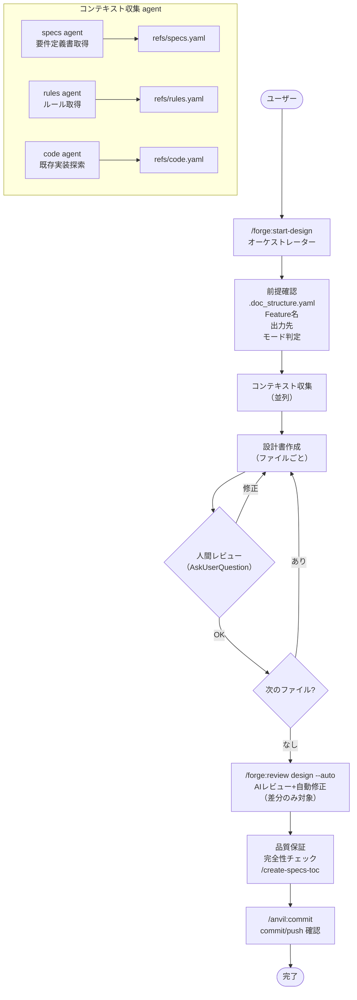

# DES-018 forge 設計書作成ワークフロー 設計書

## メタデータ

| 項目   | 値         |
| ------ | ---------- |
| 設計ID | DES-018    |
| 作成日 | 2026-03-14 |

---

> 対象プラグイン: forge | スキル: `/forge:start-design`

---

## 1. 概要

`/forge:start-design` は要件定義書から設計書を作成するオーケストレータスキル。
要件定義書の分析 → 既存実装資産の確認 → 設計書作成 → 品質保証の流れで動作する。

### 現状の課題

現在は全工程をオーケストレータ自身が単一コンテキストで実行している。
オーケストレータパターン要件（`REQ-001_orchestrator_pattern.md`）に基づき、
以下の工程は汎用 Agent (general-purpose) への委譲が望ましい:

- 要件定義書・ルールの収集（コンテキスト収集 Agent）
- 既存実装資産の探索（コード探索 Agent）
- 設計書のドラフト作成（作成 Agent）

---

## 2. フローチャート



---

## 3. フェーズ詳細

### 前提確認フェーズ [MANDATORY]

| Step | 内容                                        | 実行者       |
| ---- | ------------------------------------------- | ------------ |
| 1    | `.doc_structure.yaml` の確認                | orchestrator |
| 2    | Feature 名の確定（引数 or AskUserQuestion） | orchestrator |
| 3    | 出力先ディレクトリの解決                    | orchestrator |
| 4    | モード判定（新規作成 / 既存修正）           | orchestrator |
| 5    | defaults 読み込み                           | orchestrator |

**読み込む defaults:**

- `spec_format.md` — ID 分類カタログ
- `design_format.md` — 設計書テンプレート
- `design_principles_spec.md` — 設計原則ガイド
- `spec_design_boundary_spec.md` — 要件/設計の境界ガイド

### Phase 1: コンテキスト収集

要件定義書・ルール・既存実装を収集する。

| 収集対象     | 手段                                         | 出力            |
| ------------ | -------------------------------------------- | --------------- |
| 要件定義書   | `/query-specs` or `.doc_structure.yaml` Glob | refs/specs.yaml |
| 実装ルール   | `/query-rules` or `.doc_structure.yaml` Glob | refs/rules.yaml |
| 既存実装資産 | Glob / Grep / MCP コード解析                 | refs/code.yaml  |

**既存実装資産の確認 [MANDATORY]:**

- 類似コンポーネント・モジュールが既存コードに存在するか探索
- 見つかった場合は**再利用を前提**に設計する（新規作成禁止）

### Phase 2: 設計書の作成

| Step | 内容                                                                |
| ---- | ------------------------------------------------------------------- |
| 2.1  | refs/ の情報を統合し、設計書のドラフトを作成                        |
| 2.2  | フォーマット適用（`design_format.md` に準拠）                       |
| 2.3  | 設計ID体系の確認（`spec_format.md` の DES-xxx）                     |
| 2.4  | **各ファイル完成ごとに AskUserQuestion で人間レビュー** [MANDATORY] |

### Phase 3: AIレビュー

| Step | 内容                                                                      | 実行者              |
| ---- | ------------------------------------------------------------------------- | ------------------- |
| 3.1  | `/forge:review design --files {作成ファイル} --auto` 実行（差分のみ対象） | review ワークフロー |

### Phase 4: 品質保証

| Step | 内容                                                   |
| ---- | ------------------------------------------------------ |
| 4.1  | 完全性チェック（要件反映漏れ、ID一意性、既存資産活用） |
| 4.2  | `/create-specs-toc` 実行（利用可能な場合）             |
| 4.3  | `/anvil:commit` による commit/push 確認                |

---

## 4. 設計原則

### 要件定義書の全件反映

設計書は要件定義書の全要件をカバーする。未反映の要件がないことを Phase 4 で検証する。

### 既存実装資産の再利用 [MANDATORY]

既存コードに類似コンポーネントが存在する場合、新規作成ではなく再利用を前提に設計する。
Phase 1 の探索で見つかった資産は設計書内で明示的に参照する。

### What/How の境界

`spec_design_boundary_spec.md` に従い、設計書は「How（どう構成するか）」に集中する。
「What（何を実現するか）」は要件定義書の責務であり、設計書に重複して書かない。

---

## 5. 次ステップの案内

```
/forge:start-plan {feature}           # 計画書作成へ進む
```

---

## 6. 関連ファイル

| ファイル                                          | 説明                  |
| ------------------------------------------------- | --------------------- |
| `plugins/forge/skills/start-design/SKILL.md`      | スキル仕様            |
| `plugins/forge/docs/design_format.md`             | 設計書テンプレート    |
| `plugins/forge/docs/design_principles_spec.md`    | 設計原則ガイド        |
| `plugins/forge/docs/spec_format.md`               | ID分類カタログ        |
| `plugins/forge/docs/spec_design_boundary_spec.md` | 要件/設計の境界ガイド |
