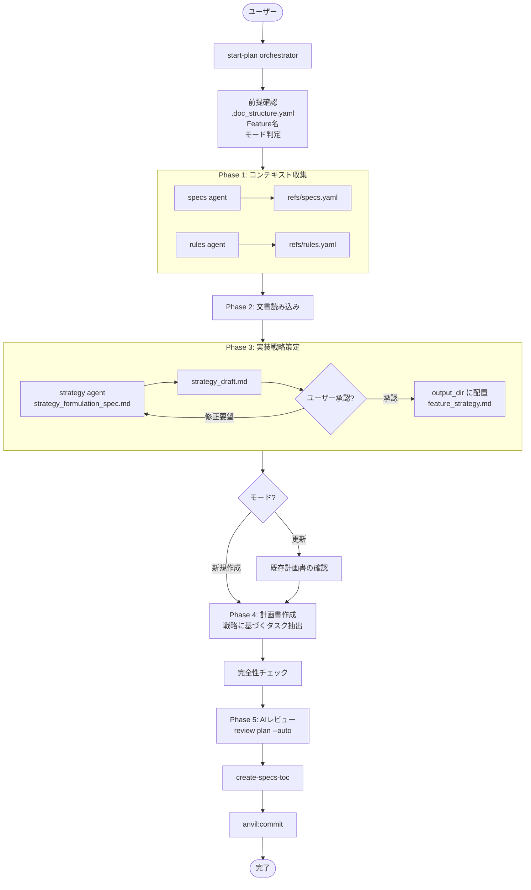

# DES-019 forge 計画書作成ワークフロー 設計書

## メタデータ

| 項目   | 値         |
| ------ | ---------- |
| 設計ID | DES-019    |
| 作成日 | 2026-03-14 |

---

> 対象プラグイン: forge | スキル: `/forge:start-plan`

---

## 1. 概要

`/forge:start-plan` は設計書から実装戦略を策定し、タスクを抽出して計画書を作成するオーケストレータスキル。
文書取得 → 実装戦略策定 → タスク抽出・分割 → 計画書作成 → AIレビュー → 人間承認の流れで動作する。

### 汎用 Agent への委譲

オーケストレータパターン要件（`REQ-001_orchestrator_pattern.md`）に基づき、
以下の工程を汎用 Agent (general-purpose) に委譲している:

- 要件定義書・設計書・ルールの収集（コンテキスト収集 Agent）
- 実装戦略の策定（実装戦略 Agent — `strategy_formulation_spec.md`）
- AIレビュー（`/forge:review plan`）

---

## 2. フローチャート



---

## 3. フェーズ詳細

### 前提確認フェーズ [MANDATORY]

| Step | 内容                                        | 実行者       |
| ---- | ------------------------------------------- | ------------ |
| 1    | `.doc_structure.yaml` の確認                | orchestrator |
| 2    | Feature 名の確定（引数 or AskUserQuestion） | orchestrator |
| 3    | モード判定（新規作成 / 更新）               | orchestrator |
| 4    | defaults 読み込み                           | orchestrator |

**読み込む defaults:**

- `spec_format.md` — ID 分類カタログ
- `plan_format.md` — 計画書テンプレート
- `plan_principles_spec.md` — 計画書作成原則ガイド

### Phase 1: コンテキスト収集 [MANDATORY]

| 収集対象   | 手段                                         | 出力                            |
| ---------- | -------------------------------------------- | ------------------------------- |
| 要件定義書 | `/query-specs` or `.doc_structure.yaml` Glob | refs/specs.yaml                 |
| 設計書     | `/query-specs` or `.doc_structure.yaml` Glob | refs/specs.yaml（同一ファイル） |
| 実装ルール | `/query-rules` or `.doc_structure.yaml` Glob | refs/rules.yaml                 |

**設計書は必須入力。** 見つからない場合は AskUserQuestion でユーザーに手動指定またはスキップ確認（リスク理解のもと）。

### Phase 2: 文書の読み込み

| Step | 内容                                            | 実行者       |
| ---- | ----------------------------------------------- | ------------ |
| 2.1  | refs/specs.yaml → 要件定義書・設計書を Read     | orchestrator |
| 2.2  | refs/rules.yaml → プロジェクト固有ルールを Read | orchestrator |

### Phase 3: 実装戦略の策定 [MANDATORY]

| Step | 内容                                                         | 実行者       |
| ---- | ------------------------------------------------------------ | ------------ |
| 3.1  | strategy Agent 起動（`strategy_formulation_spec.md` を渡す） | 汎用 Agent   |
| 3.2  | `strategy_draft.md` を Read してユーザーに提示・承認を取得   | orchestrator |
| 3.3  | 承認済み戦略書を `output_dir/{feature}_strategy.md` に配置   | orchestrator |

**入力**: refs/specs.yaml から抽出した設計書パス + refs/rules.yaml のルール文書パス
**出力**: `{session_dir}/strategy_draft.md` → `{output_dir}/{feature}_strategy.md`

### Phase 4: 計画書の作成・更新

| Step | 内容                                                                   |
| ---- | ---------------------------------------------------------------------- |
| 4.1  | 更新モード時: 既存計画書の確認（要件・設計反映状況、未着手タスク把握） |
| 4.2  | 実装戦略のフェーズ分割に基づきタスク抽出・分割                         |
| 4.3  | フォーマット適用（`plan_format.md` に準拠）                            |
| 4.4  | 完全性チェック [MANDATORY]                                             |

**タスク粒度 [MANDATORY]:**

- 1 Agent が単独で実行・完結できる単位
- 5〜10 項目程度
- ビルド成功（コンパイル通過）が完了条件

**完全性チェック項目:**

- 実装戦略のフェーズ分割がタスク優先度に反映されているか
- タスクID の一意性
- 要件 → 設計 → タスクのトレーサビリティマトリクス
- 優先度と依存関係の整合性

### Phase 5: AIレビュー

| Step | 内容                                                                    | 実行者              |
| ---- | ----------------------------------------------------------------------- | ------------------- |
| 5.1  | `/forge:review plan --files {作成ファイル} --auto` 実行（差分のみ対象） | review ワークフロー |

### 完了処理

| Step | 内容                                       |
| ---- | ------------------------------------------ |
| 6.1  | `/create-specs-toc` 実行（利用可能な場合） |
| 6.2  | `/anvil:commit` による commit/push 確認    |

---

## 4. 設計原則

### タスクは Agent 実行単位で分割 [MANDATORY]

1つのタスクは 1 Agent が単独で実行・完結できる粒度とする。
タスク完了条件は「ビルド成功（コンパイル通過）」を最低基準とする。

### トレーサビリティの確保

計画書内にトレーサビリティマトリクスを含める:

- 要件ID → 設計ID → タスクID の対応表
- 未対応の要件・設計がないことを検証

### 更新モードの既存資産確認

更新時は既存計画書を Read し、以下を把握してから更新する:

- 要件定義書・設計書への反映状況
- 未着手タスクの有無
- 完了済みタスクとの整合性

---

## 5. 次ステップの案内

```
/forge:start-implement {feature}    # タスクの実行を開始
```

---

## 6. 関連ファイル

| ファイル                                                     | 説明                      |
| ------------------------------------------------------------ | ------------------------- |
| `plugins/forge/skills/start-plan/SKILL.md`                   | スキル仕様                |
| `plugins/forge/docs/strategy_formulation_spec.md`            | 実装戦略 Agent 作業指示書 |
| `plugins/forge/docs/plan_format.md`                          | 計画書テンプレート        |
| `plugins/forge/docs/plan_principles_spec.md`                 | 計画書作成原則ガイド      |
| `plugins/forge/docs/spec_format.md`                          | ID分類カタログ            |
| `docs/specs/forge/design/DES-027_plan_strategy_phase_adr.md` | ADR: 実装戦略フェーズ導入 |

---

## 改定履歴

| 日付       | 内容                                                             |
| ---------- | ---------------------------------------------------------------- |
| 2026-03-14 | 初版作成                                                         |
| 2026-05-09 | Phase 3（実装戦略策定 Agent）追加、Phase 番号繰り下げ（DES-027） |
