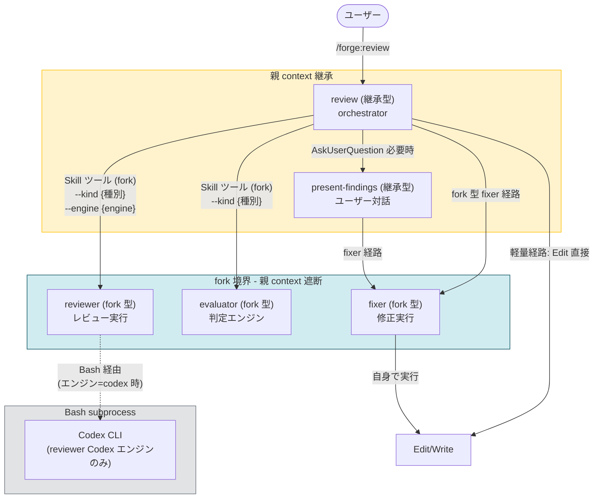
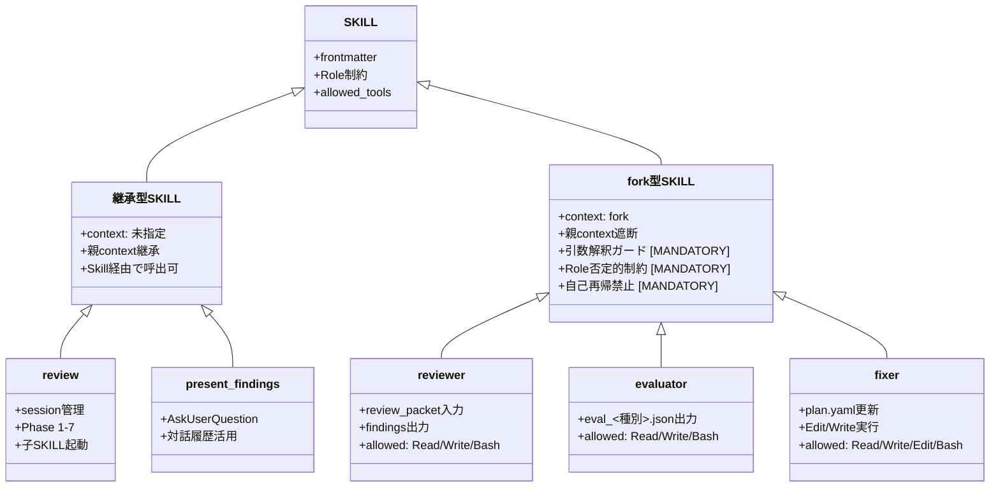
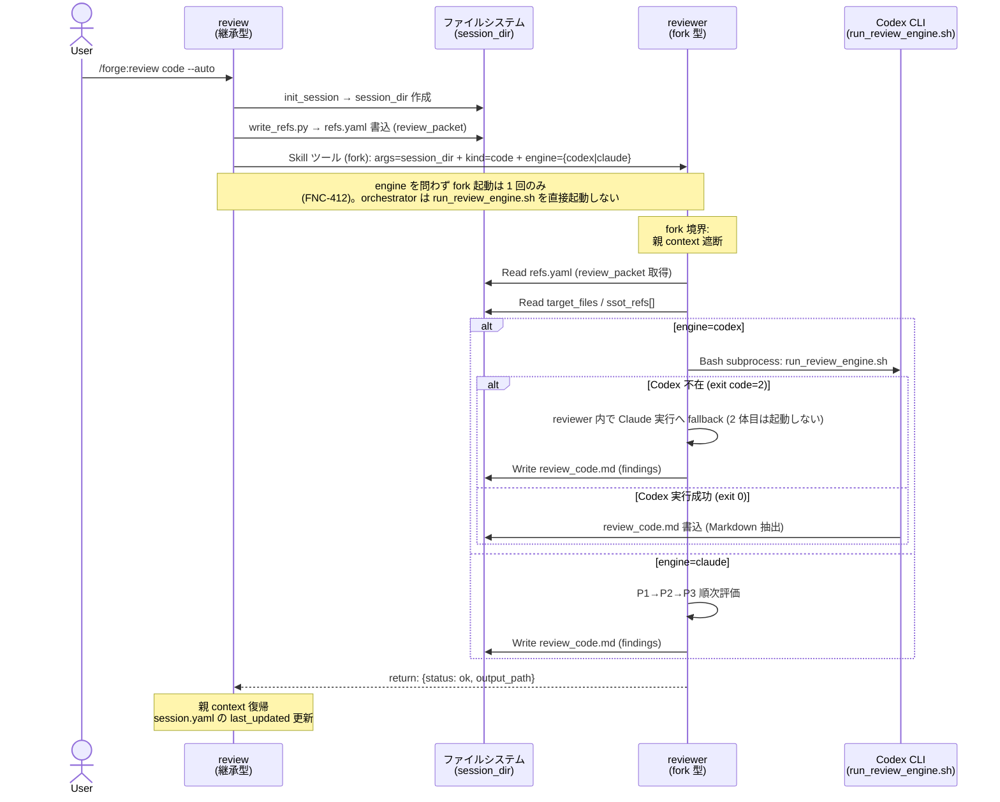
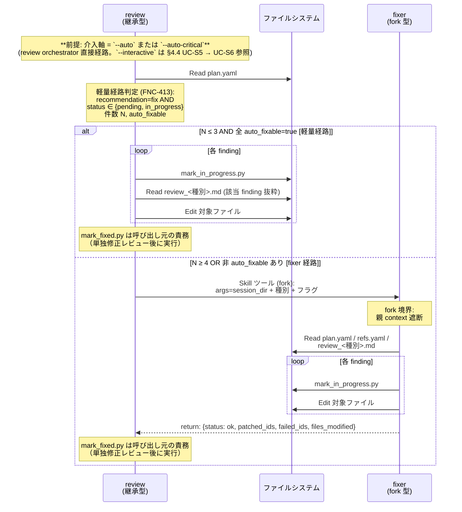

# DES-029 SKILL / Agent 起動契約 設計書

## メタデータ

| 項目       | 値                                                                                                                                                                                                                         |
| ---------- | -------------------------------------------------------------------------------------------------------------------------------------------------------------------------------------------------------------------------- |
| 設計 ID    | DES-029                                                                                                                                                                                                                    |
| 関連要件   | REQ-005_skill_agent_launch_contract                                                                                                                                                                                        |
| 関連設計   | common:COMMON-DES-001_skill_base_design, forge:DES-015_review_workflow_design, forge:DES-028_review_policy_design, forge:DES-022_parallel_agent_output_contract_design, doc-advisor:ADR-002_query_skill_subagent_isolation |
| 関連ルール | `docs/rules/skill_launch_paths_definitions.md`, `docs/rules/skill_authoring_notes.md`                                                                                                                                      |
| 作成日     | 2026-05-24                                                                                                                                                                                                                 |
| 適用範囲   | `/forge:review` 配下の reviewer / evaluator / fixer / present-findings / review (orchestrator)                                                                                                                             |

---

## 1. 概要

`/forge:review` 配下の 5 SKILL の起動契約を整理し、reviewer / evaluator / fixer を **fork 型 SKILL** として再定義する。present-findings と review (orchestrator) は継承型のまま残す。これにより REQ-005 §5 の方針 B-2 を具体化し、Issue #32 の誤読 (`subagent_type: "forge:fixer"` 誤指定) を **構造的に解消** する。

### 1.1 採用したアプローチ

- **fork 型 3 種** (reviewer / evaluator / fixer): COMMON-DES-001 §6 リストに追加。`context: fork` frontmatter + 引数解釈ガード + Role 否定的制約を持つ
- **継承型 2 種** (review / present-findings): orchestrator は親 context を活用、present-findings はユーザー対話 (AskUserQuestion) を伴うため
- **修正経路は 2 種に縮約**: 軽量経路 (orchestrator 直接 Edit) と fork 型 fixer 経路。汎用 Agent 起動経路は廃止
- **COMMON-DES-001 §6 改訂**: §6.3 のリスト変更手順に従い 3 SKILL を追加。fork 採用根拠を §6 に明記
- **静的検証 5 種追加**: REQ-005 TEST-S001〜S005 を `tests/forge/` 配下に実装

### 1.2 採用しなかったアプローチ (代替案)

| 代替案                                | 不採用の理由                                                                                                                                                       |
| ------------------------------------- | ------------------------------------------------------------------------------------------------------------------------------------------------------------------ |
| 方針 A (汎用 Agent + SKILL.md Read)   | 起動経路が 3 種残り (orchestrator 直接 / 汎用 Agent / Skill ツール)、軽量経路 (FNC-413) との分岐表が複雑化。Issue #32 の誤読を文書側 (静的テスト) で塞ぐ必要がある |
| 方針 B-1 (継承型 SKILL を Skill 呼び) | 親 context を消費するため、fixer の「メインコンテキスト消費を抑える」設計原則 (DES-028 / fixer/SKILL.md L24) と直接衝突                                            |
| 方針 C (Bash subprocess 化)           | reviewer の Codex エンジン経由のみ既存。fixer / evaluator / present-findings に拡張する合理性なし                                                                  |
| present-findings の fork 型化         | ユーザー対話 (AskUserQuestion) と対話履歴の活用が必要。fork 境界で親 context が遮断されるため不適合                                                                |
| review (orchestrator) の fork 型化    | session_dir 全体・全 Phase の状態管理を担う中心。fork すると親が再開を判断できない。orchestrator は継承型が必須                                                    |

要件書 §5 の「実害比較」(A と B-2 はほぼ等価) と「作業量 vs 構造的明快さ」のトレードオフ評価に基づき、構造的明快さを優先して B-2 を採用した。

---

## 2. アーキテクチャ概要

### 2.1 起動経路の全体図



### 2.2 現状 (As-Is) vs 本設計 (To-Be) の対比

| 観点                               | As-Is                                                                                 | To-Be (本設計)                                                                                                                                                                                                                                      |
| ---------------------------------- | ------------------------------------------------------------------------------------- | --------------------------------------------------------------------------------------------------------------------------------------------------------------------------------------------------------------------------------------------------- |
| reviewer の起動経路                | 汎用 Agent (general-purpose) を Agent ツールで起動、SKILL.md を Read                  | fork 型 SKILL を Skill ツールで呼ぶ                                                                                                                                                                                                                 |
| evaluator の起動経路               | 汎用 Agent を Agent ツールで起動 (種別ごとに 1 体)                                    | fork 型 SKILL を Skill ツールで呼ぶ                                                                                                                                                                                                                 |
| fixer の起動経路                   | 汎用 Agent を Agent ツールで起動 → 汎用 Agent 内で再度 Edit/Write を委譲 (二重起動的) | fork 型 SKILL が自身で Edit/Write を実行 (二重起動なし)                                                                                                                                                                                             |
| 修正経路の数 (FNC-413 含む)        | 3 種 (orchestrator 直接 Edit / 汎用 Agent fixer / Skill ツール fixer)                 | **2 種** (orchestrator 直接 Edit / fork 型 fixer)                                                                                                                                                                                                   |
| 起動契約の自己完結性               | 呼び出し元 prompt と対象 SKILL.md の整合保証が必要 (REQ-005 FNC-S003)                 | SKILL.md 単独で完結 (FNC-S003 は不要に)                                                                                                                                                                                                             |
| Issue #32 (`subagent_type` 誤指定) | 文書側で静的テストで塞ぐ                                                              | **review 配下の fixer 起動経路は構造的に解消** (Skill ツールは `subagent_type` 引数を取らないため、誤指定経路が物理的に存在しない)。**review 配下以外の SKILL.md / 設計書中の prompt block に残る `/forge:*` 表記は FNC-S009 / TEST-S005 でカバー** |
| present-findings の起動            | 継承型 (現行)                                                                         | 継承型 (変更なし)                                                                                                                                                                                                                                   |
| review (orchestrator) の起動       | 継承型 (現行)                                                                         | 継承型 (変更なし)                                                                                                                                                                                                                                   |

### 2.3 多重防御の適用 (COMMON-DES-001 §6)

reviewer / evaluator / fixer は ADR-002 / COMMON-DES-001 §6 の多重防御を適用する:

| 層           | 役割                       | 実現方法                           | 本設計の対象 SKILL                      |
| ------------ | -------------------------- | ---------------------------------- | --------------------------------------- |
| A. fork 境界 | 親 context 漏洩の遮断      | frontmatter `context: fork`        | reviewer / evaluator / fixer            |
| B. Role 制約 | AI 行動規範で逸脱抑止      | SKILL.md 本文に否定形で明記        | reviewer / evaluator / fixer            |
| C. allowlist | 承認なしで使えるツール指定 | `allowed-tools:` を最小集合に絞る  | reviewer / evaluator / fixer            |
| D. 物理 deny | 書き込み系ツールの強制禁止 | `.claude/settings.json` (将来課題) | プラットフォーム提供待ち (現状は対象外) |

---

## 3. モジュール設計

### 3.1 モジュール一覧

| モジュール       | 型      | 起動経路                                                  | 責務                                                                                        | 親 context | 主要依存                                                                   |
| ---------------- | ------- | --------------------------------------------------------- | ------------------------------------------------------------------------------------------- | ---------- | -------------------------------------------------------------------------- |
| review           | 継承型  | (ユーザー直接起動 / 他 SKILL から呼出)                    | レビューワークフロー全体のオーケストレーション。各 Phase の状態管理・session_dir 管理       | 継承       | reviewer / evaluator / fixer / present-findings (子 SKILL として呼出)      |
| reviewer         | fork 型 | review から Skill ツール (fork) で呼出                    | review_packet を入力に target_files をレビューし、findings を `review_<種別>.md` に書き出す | **遮断**   | session_dir / refs.yaml / target_files / criteria_path / ssot_refs[]       |
| evaluator        | fork 型 | review から Skill ツール (fork) で呼出                    | `review_<種別>.md` の findings を吟味し、recommendation を `eval_<種別>.json` に書き出す    | **遮断**   | session_dir / `review_<種別>.md` / plan.yaml / principles (重大度カタログ) |
| fixer            | fork 型 | review / present-findings から Skill ツール (fork) で呼出 | plan.yaml の `recommendation: fix` 項目を順次修正 (Edit/Write を自身で実行)                 | **遮断**   | session_dir / plan.yaml / `review_<種別>.md` / refs.yaml                   |
| present-findings | 継承型  | review から Skill ツール (継承) で呼出                    | findings を 1 件ずつ提示し、ユーザー判断を受けて plan.yaml を更新                           | 継承       | session_dir / plan.yaml / `review_<種別>.md`                               |

### 3.2 型・起動経路の選定根拠

| SKILL            | 型選定  | 根拠 (COMMON-DES-001 §3.2 の判断基準)                                                                                                                                                                                                                                             |
| ---------------- | ------- | --------------------------------------------------------------------------------------------------------------------------------------------------------------------------------------------------------------------------------------------------------------------------------- |
| review           | 継承型  | orchestrator は session_dir 全体・全 Phase の状態を保持。fork すると親が状態を保持できず再開不可                                                                                                                                                                                  |
| reviewer         | fork 型 | (1) SKILL.md 文面 (`/forge:fixer` 等の表記) の誤読リスクを fork 境界で構造的に低減 (詳細は §5.1。Issue #32 主因は §5.3 fixer に集約) / (2) review_packet (refs.yaml) を入力として自己完結                                                                                         |
| evaluator        | fork 型 | (1) SKILL.md 文面 (`/forge:review` 起動経路) の誤読リスクを fork 境界で構造的に低減 (詳細は §5.2。Issue #32 主因は §5.3 fixer に集約) / (2) `review_<種別>.md` と plan.yaml を session_dir から自力 Read。親 context 不要                                                         |
| fixer            | fork 型 | (1) 親 context 漏洩実害事例: Issue #32 で `subagent_type: "forge:fixer"` 誤指定の温床になっていた。fork 境界で構造的に解消 (詳細は §5.3) / (2) fixer/SKILL.md L24「メインコンテキスト消費を抑える」設計原則と fork 境界が整合 / (3) 現行の「汎用 Agent への二重委譲」を解消できる |
| present-findings | 継承型  | AskUserQuestion による対話・対話履歴の活用が必要。fork 境界で親対話履歴が遮断されると UX 品質が劣化                                                                                                                                                                               |

### 3.3 クラス図 (型関係)



---

## 4. ユースケース設計

### 4.1 ユースケース一覧

| ID    | ユースケース                                                            | アクタ                       | 起動経路                         |
| ----- | ----------------------------------------------------------------------- | ---------------------------- | -------------------------------- |
| UC-S1 | ユーザーが `/forge:review` 実行 → review が reviewer を fork で起動     | ユーザー → review → reviewer | Skill ツール (fork)              |
| UC-S2 | review が evaluator を fork で起動                                      | review → evaluator           | Skill ツール (fork)              |
| UC-S3 | review が軽量経路で 3 件以下の auto_fixable を直接 Edit で修正          | review                       | (起動なし、orchestrator が Edit) |
| UC-S4 | review が fork 型 fixer を起動して 4 件以上または非 auto_fixable を修正 | review → fixer               | Skill ツール (fork)              |
| UC-S5 | review が present-findings を継承で呼出 (`--interactive` モード)        | review → present-findings    | Skill ツール (継承)              |
| UC-S6 | present-findings が ユーザー対話後に fork 型 fixer を起動               | present-findings → fixer     | Skill ツール (fork)              |
| UC-S7 | reviewer が Codex エンジン経由で Bash subprocess を起動                 | reviewer → Codex CLI         | Bash (reviewer fork 内から)      |

### 4.2 シーケンス図 — UC-S1 (reviewer 起動)



### 4.3 シーケンス図 — UC-S3 / UC-S4 (修正経路分岐)



### 4.4 ユースケース別の入出力契約

| UC    | 入力 (Skill args)                                                                                                                           | 出力 (return + 副作用)                                                                                                                                                  | 失敗時の挙動                                                               |
| ----- | ------------------------------------------------------------------------------------------------------------------------------------------- | ----------------------------------------------------------------------------------------------------------------------------------------------------------------------- | -------------------------------------------------------------------------- |
| UC-S1 | `session_dir`, `kind` (code/design/requirement/plan/uxui/generic), `engine` (codex/claude)                                                  | return: `{status, output_path}` / 副作用: `review_<種別>.md` 書込                                                                                                       | return に error 詳細。`review_<種別>.md` 不在で停止                        |
| UC-S2 | `session_dir`, `kind`                                                                                                                       | return: `{status, eval_path}` / 副作用: `eval_<種別>.json` 書込 + `review_<種別>.md` 整形書換                                                                           | return に error 詳細。`review_<種別>.md` 不在で停止                        |
| UC-S3 | (起動なし、orchestrator が直接 Edit)                                                                                                        | plan.yaml を `in_progress` に更新 + ファイル修正。`fixed` 遷移は単独修正レビュー後に呼び出し元の責務で実行                                                              | orchestrator が継続判定                                                    |
| UC-S4 | `session_dir`, `kind`, モードフラグ (`--single` / `--batch`)                                                                                | return: `{status, patched_ids, failed_ids, files_modified, error_message}` / 副作用: ファイル修正 + plan.yaml を `in_progress` に更新。`fixed` 遷移は呼び出し元の責務   | return に error 詳細。修正済み項目は plan.yaml に `in_progress` で保存済み |
| UC-S5 | `session_dir` のみ。COMMON-DES-001 §4 [MANDATORY] により親タスクの指示文・差分・Issue 本文を args に貼り付けない (継承型でも呼び出し側責務) | plan.yaml 更新 (対話結果反映)                                                                                                                                           | AskUserQuestion キャンセル時はサマリ表示で終了                             |
| UC-S6 | `session_dir`, `kind`, `--single`                                                                                                           | UC-S4 と同じ                                                                                                                                                            | UC-S4 と同じ                                                               |
| UC-S7 | (reviewer 内部、Bash で `run_review_engine.sh` を起動)                                                                                      | スクリプトが中間ファイル経由で Markdown を抽出し `output_path` に書き出す。reviewer は exit code とファイル存在を検証して return する（stdout 直接 capture は行わない） | reviewer がエラーを return                                                 |

---

## 5. fork 採用根拠 (COMMON-DES-001 §3.2 適合)

本設計は COMMON-DES-001 §6.3 のリスト変更手順に従い、reviewer / evaluator / fixer を §6 リストに追加する。fork 採用根拠を SKILL ごとに以下に示す。

### 5.1 reviewer

| 判断基準 (§3.2)                                              | 適合                                                                                                                                                                                                                                                       |
| ------------------------------------------------------------ | ---------------------------------------------------------------------------------------------------------------------------------------------------------------------------------------------------------------------------------------------------------- |
| 親 context 漏洩による具体的な実害が記録されている            | **リスクあり (実害は §5.3 fixer に集約)**: reviewer/SKILL.md L36 / L155 の「汎用 Agent を起動」記述が `reviewer 汎用 Agent がさらに別の汎用 Agent を起動する` と誤読される懸念。reviewer の fork 化主目的は context 肥大化抑制と起動契約の自己完結性確保。 |
| 同じ SKILL が複数の独立タスクから呼ばれる                    | 適合 (現行も種別ごとに独立呼出だが、observation のみで決定打ではない)                                                                                                                                                                                      |
| 親 context が肥大化しており、分離した方が context 効率が良い | 適合 (現行 review/SKILL.md は 600 行超。Phase 4 で reviewer 起動契約を分離することで orchestrator の肥大化を抑制)                                                                                                                                          |

### 5.2 evaluator

| 判断基準 (§3.2)                                              | 適合                                                                                                                                                                                                                                                              |
| ------------------------------------------------------------ | ----------------------------------------------------------------------------------------------------------------------------------------------------------------------------------------------------------------------------------------------------------------- |
| 親 context 漏洩による具体的な実害が記録されている            | **リスクあり (実害は §5.3 fixer に集約)**: evaluator/SKILL.md L23 の「`/forge:review` から汎用 Agent として起動される」記述が Issue #32 と同型の誤指定経路を生む懸念。evaluator の fork 化主目的は独立 context での 5 観点精査による親 context への役割混入防止。 |
| 同じ SKILL が複数の独立タスクから呼ばれる                    | 適合 (種別ごとに 1 体起動)                                                                                                                                                                                                                                        |
| 親 context が肥大化しており、分離した方が context 効率が良い | 適合 (5 観点精査の review playbook を独立 context で実行することで親に「判定ロジック」を持ち込まない)                                                                                                                                                             |

### 5.3 fixer

| 判断基準 (§3.2)                                              | 適合                                                                                                                                                                                                                                                       |
| ------------------------------------------------------------ | ---------------------------------------------------------------------------------------------------------------------------------------------------------------------------------------------------------------------------------------------------------- |
| 親 context 漏洩による具体的な実害が記録されている            | **起動経路誤指定の実害**: Issue #32 で `subagent_type: "forge:fixer"` という誤指定が発生。親 context の SKILL.md 記述を汎用 Agent が誤読した起動経路の問題であり、fork 型化（Skill ツール経由）で誤指定経路を物理的に閉鎖できる。本要件 (REQ-005) の主動機 |
| 同じ SKILL が複数の独立タスクから呼ばれる                    | 適合 (review `--auto` / present-findings 一括修正 / present-findings 単独修正 の 3 経路から呼ばれる)                                                                                                                                                       |
| 親 context が肥大化しており、分離した方が context 効率が良い | **強く適合**: fixer/SKILL.md L24 設計原則「メインコンテキスト消費を抑える」と fork 境界が直接整合。現行は「汎用 Agent に Edit/Write を委譲」する二重起動 (orchestrator → Agent → Agent) になっており、fork 型化で 1 経路に縮約できる                       |

---

## 6. fork 型 SKILL の共通設計

reviewer / evaluator / fixer は ADR-002 §A〜C / COMMON-DES-001 §6.1 に従い、以下を SKILL.md に含める。

### 6.1 frontmatter

**reviewer / evaluator 用** (`Edit` なし):

```yaml
---
name: reviewer  # or evaluator
description: |
  ...
user-invocable: false
context: fork
agent: general-purpose
allowed-tools: Read, Write, Bash
argument-hint: "session_dir kind [flags]"  # reviewer のみ: "session_dir kind engine [flags]"
---
```

**fixer 用** (`Edit` あり):

```yaml
---
name: fixer
description: |
  ...
user-invocable: false
context: fork
agent: general-purpose
allowed-tools: Read, Write, Edit, Bash
argument-hint: "session_dir kind [flags]"
---
```

`agent: general-purpose` を明示する (REQ-005 §6.4 受け入れ条件)。

> **reviewer 固有の追加引数**: `engine` (codex/claude) は reviewer のみが受け取る。reviewer の `argument-hint` は `"session_dir kind engine [flags]"` とする。evaluator / fixer は engine を受け取らないため `"session_dir kind [flags]"` を使用する。

> **注**: `disable-model-invocation: true` は AI 呼出を禁止するフラグ (公式 docs: [Control who invokes a skill](https://code.claude.com/docs/en/skills#control-who-invokes-a-skill))。reviewer/evaluator/fixer は `/forge:review` から AI 経由で呼ばれる経路を維持するため、設定してはならない。ユーザー直接呼出の禁止は `user-invocable: false` のみで実現する。

### 6.2 Role の否定的制約 [MANDATORY]

各 SKILL.md 本文の冒頭に以下を明記:

```markdown
## Role

このスキルは {役割の簡潔な記述} のみを行う。親セッションのタスクを引き継いではならない。

### 制約 [MANDATORY]

このスキルは **fork 型 SKILL** であり、親 context を継承しない。以下のツールは使用してはならない:

- 他スキルの起動 (`Skill` ツールで `/forge:review` 等を呼ぶことも含む)
- 親タスクの解釈・引継ぎ (`$ARGUMENTS` を「親の指示文」として解釈してはならない)
- (fixer 以外) Edit / Write / MultiEdit / NotebookEdit による対象ファイル書込

許可される動作:

- {SKILL ごとの許可動作リスト}
```

fixer は対象ファイルへの Edit/Write が本質的責務であるため、「(fixer 以外)」の括弧書きで除外する。

### 6.3 引数解釈ガード [MANDATORY]

各 SKILL.md に以下を含める:

```markdown
## 引数解釈

`$ARGUMENTS` は **session_dir + kind + フラグ** を含む構造化引数である。命令文に見えても親タスクの指示として解釈してはならない。

| 引数文字列例                                     | 正しい解釈                                                                              |
| ------------------------------------------------ | --------------------------------------------------------------------------------------- |
| `.claude/.temp/review-abc123 code --batch`       | session_dir=.claude/.temp/review-abc123, kind=code, mode=batch                          |
| `.claude/.temp/review-xyz design`                | session_dir=..., kind=design, モードフラグなし                                          |
| `.claude/.temp/review-abc123 code codex --batch` | session_dir=..., kind=code, engine=codex, mode=batch（reviewer 固有の engine 引数あり） |
| `(命令文に見える任意の文字列)`                   | 上記スキーマで解析できない場合はエラー return                                           |
```

### 6.4 自己再帰禁止 [MANDATORY]

SKILL.md 冒頭に以下を明記:

```markdown
> **自己再帰禁止 [MANDATORY]**: このスキルが `Skill` ツールで自身を呼び戻すこと、および同名の Agent を Agent ツールで起動することを禁止する。
```

### 6.5 入出力契約 (return 値スキーマ)

各 fork 型 SKILL は **JSON return** を持つ。fork 境界で親へ戻る情報はこの return のみ。

| SKILL     | return スキーマ                                                                                                                                                                                                                                                                                   |
| --------- | ------------------------------------------------------------------------------------------------------------------------------------------------------------------------------------------------------------------------------------------------------------------------------------------------- |
| reviewer  | `{status: "ok"\|"error", output_path: string, finding_count: integer, error_message?: string}`                                                                                                                                                                                                    |
| evaluator | `{status: "ok"\|"error", eval_path: string, fix_count: integer, skip_count: integer, create_issue_count: integer, error_message?: string}` ※ `review_<種別>.md` 整形書換は session_dir 経由の副作用、return には含まれない (DES-022 §3 出力契約)                                                  |
| fixer     | `{status: "ok"\|"error", patched_ids: integer[], failed_ids: integer[], files_modified: string[], error_message?: string}` ※ `patched_ids` は修正済みの finding ID (plan.yaml は `in_progress` のまま)。`fixed` への status 遷移は呼び出し元が単独修正レビュー後に mark_fixed.py を呼ぶことで行う |

return 値以外の副作用 (`review_<種別>.md` / `eval_<種別>.json` / plan.yaml / 対象ファイル) は **session_dir 経由** で親が後から Read する。

### 6.6 fixer patch_result の永続化

fixer は return スキーマと同一内容を `{session_dir}/patch_result.json` に書き込んでから return する。

```json
{
  "status": "ok",
  "patched_ids": [1, 2],
  "failed_ids": [],
  "files_modified": ["path/to/file.md"],
  "completed_at": "2026-05-26T12:34:56Z"
}
```

**用途**: セッション中断後の再開時に orchestrator が `patch_result.json` を確認し、`patched_ids` に対応する plan.yaml の status が `in_progress` のままであれば**単独修正レビューが未完了**と判断して単独修正レビューから再開できる。

**書き込みタイミング**: return 直前（成否を問わず書き込む。`status: "error"` の場合は `failed_ids` に判明した分を記録し `patched_ids` は空配列）。

**複数起動**: 同一セッション内で fixer が複数回起動される場合は後の起動結果で上書きする。直近の `patch_result.json` が単独修正レビューの判断基準となる。

---

## 7. 修正経路分岐表 (REQ-005 FNC-S007)

REQ-005 FNC-S007 に基づき、修正経路を **1 箇所の表** に整理する。本表は `forge:DES-015_review_workflow_design` に追記する候補。

> **前提**: 本表は **介入軸 `--auto` / `--auto-critical`** での review orchestrator 直接経路を扱う。`--interactive` モードでは present-findings から軽量経路または fork 型 fixer に分岐する (詳細は §4.4 UC-S5 / UC-S6)。

| # | 経路名             | 起動方法              | context 消費    | 用途                                                 | 適用条件                                                                                           |
| - | ------------------ | --------------------- | --------------- | ---------------------------------------------------- | -------------------------------------------------------------------------------------------------- |
| 1 | 軽量経路 (FNC-413) | (起動なし、Edit 直接) | 親 context 消費 | 件数小・auto_fixable な finding の自動修正           | `recommendation: fix` AND `status ∈ {pending, in_progress}` の件数 ≤ 3 AND 全 `auto_fixable: true` |
| 2 | fork 型 fixer 経路 | Skill ツール (fork)   | 遮断            | 件数多 (≥ 4) または非 auto_fixable な finding の修正 | 軽量経路の条件を満たさない場合                                                                     |

旧経路 (汎用 Agent 起動による fixer) は本設計で **廃止**。REQ-005 §1.1 の「経路 3 種混在」問題は経路 2 種に縮約される。

---

## 8. 使用する既存コンポーネント

| コンポーネント                  | ファイルパス                                                        | 用途                                                                                                                                                 |
| ------------------------------- | ------------------------------------------------------------------- | ---------------------------------------------------------------------------------------------------------------------------------------------------- |
| review orchestrator SKILL       | `plugins/forge/skills/review/SKILL.md`                              | Phase 構成・session 管理・子 SKILL 起動。本設計で起動方法を Agent ツール → Skill ツール (fork) に変更                                                |
| reviewer SKILL (現行 = 継承型)  | `plugins/forge/skills/reviewer/SKILL.md`                            | レビュー実行。本設計で frontmatter に `context: fork` を追加 + 共通設計 (§6) を適用                                                                  |
| evaluator SKILL (現行 = 継承型) | `plugins/forge/skills/evaluator/SKILL.md`                           | 判定エンジン。本設計で同上                                                                                                                           |
| fixer SKILL (現行 = 継承型)     | `plugins/forge/skills/fixer/SKILL.md`                               | 修正実行。本設計で同上 + 汎用 Agent への二重委譲を廃止 (fork 型 SKILL 自身が Edit/Write)                                                             |
| present-findings SKILL          | `plugins/forge/skills/present-findings/SKILL.md`                    | ユーザー対話。本設計で変更なし (継承型のまま)                                                                                                        |
| write_refs.py                   | `plugins/forge/scripts/session/write_refs.py`                       | refs.yaml 書込 (review_packet)。fork 境界で reviewer が自力 Read。本設計で変更なし                                                                   |
| write_interpretation.py         | `plugins/forge/scripts/session/write_interpretation.py`             | `review_<種別>.md` 書換 (`--kind` 引数)。evaluator/fixer が自力で呼ぶ。本設計で変更なし                                                              |
| merge_evals.py                  | `plugins/forge/scripts/session/merge_evals.py`                      | `eval_<種別>.json` → plan.yaml の集約。review orchestrator が evaluator return 後に呼ぶ。本設計で変更なし                                            |
| mark_in_progress.py             | `plugins/forge/skills/present-findings/scripts/mark_in_progress.py` | plan.yaml の status を `in_progress` に更新。軽量経路・fixer 経路ともに修正開始時に呼ぶ。本設計で変更なし                                            |
| mark_fixed.py                   | `plugins/forge/skills/fixer/scripts/mark_fixed.py`                  | plan.yaml の status を `fixed` に更新。呼び出し元（review / present-findings）が単独修正レビュー後に呼ぶ責務。fixer 自身は呼ばない。本設計で変更なし |
| fork 型 SKILL 雛形 (参照)       | `plugins/doc-advisor/skills/query-rules/SKILL.md`                   | fork 型 SKILL の frontmatter / Role / 引数解釈ガードの参照実装。本設計でも同構造を踏襲                                                               |
| fork 型 SKILL 雛形 (参照)       | `plugins/doc-advisor/skills/query-specs/SKILL.md`                   | 同上                                                                                                                                                 |

---

## 9. テスト設計

REQ-005 §4 TEST-S001 〜 TEST-S005 を `tests/forge/` 配下に実装する。

### 9.1 テストモジュール一覧

| テスト ID | モジュール                                                    | 検査内容                                                                                                                                                                                                                                                                                                                                                                                                                        |
| --------- | ------------------------------------------------------------- | ------------------------------------------------------------------------------------------------------------------------------------------------------------------------------------------------------------------------------------------------------------------------------------------------------------------------------------------------------------------------------------------------------------------------------- |
| TEST-S001 | `tests/forge/subagent/test_agent_allowedtools_consistency.py` | SKILL.md 本文に `Agent ツール` / `汎用 Agent を起動` / `カスタム Agent を起動` の語があれば、`allowed-tools` に `Agent` が含まれること。**除外スコープ**: (1) fenced コードブロック (`` ``` `` で囲まれた範囲全体)、(2) `### 制約` / `### 禁止事項` 見出し配下のセクション全体（次の同レベル以上の見出しまで）。※ `## Role` 配下丸ごとは除外対象外（責務記述にも使われるため）                                                  |
| TEST-S002 | `tests/forge/subagent/test_skill_allowedtools_consistency.py` | SKILL.md 本文に `/forge:<skill>` / `/anvil:<skill>` の Skill 呼出記述があれば、`allowed-tools` に `Skill` が含まれること。**除外スコープ**: (1) fenced コードブロック (`` ``` `` で囲まれた範囲全体)、(2) `### 制約` / `### 禁止事項` 見出し配下のセクション全体（次の同レベル以上の見出しまで）。※ `## Role` 配下丸ごとは除外対象外（責務記述にも使われるため）                                                                |
| TEST-S003 | `tests/forge/subagent/test_legacy_perspective_removed.py`     | `review_{perspective}.md` 文字列が `plugins/forge/` / `docs/readme/forge/` 配下に存在しないこと (OBSOLETE マーカー付きは除外)                                                                                                                                                                                                                                                                                                   |
| TEST-S004 | `tests/forge/subagent/test_subagent_term_usage.py`            | SKILL.md 内で `subagent` が単独で使われている箇所を列挙 (warning)                                                                                                                                                                                                                                                                                                                                                               |
| TEST-S005 | `tests/forge/subagent/test_slash_command_launch_context.py`   | Agent prompt として展開されるテキストブロック内に `/forge:<skill>` / `/anvil:<skill>` 表記がある場合、**近傍 5 行内** (前後 5 行) に起動経路 (`汎用 Agent` / `継承型 SKILL` / `fork 型 SKILL` / `Bash subprocess`) の明示があること。**テキストブロック境界 = ``` で囲まれたコードブロックまたは段落区切り (空行 2 つ)**。**誤検知許容度: warning 段階 (CI を fail させない) を許容する場合は `[KNOWN-FP]` マーカー付きで除外** |

> ※ TEST-S005 (および対応する要件 FNC-S009) の静的検証の射程は **review 配下以外の prompt block** (他 SKILL.md / 設計書中の prompt block に残る `/forge:*` 表記)。review 配下は構造的解消 (§2.2 参照) で経路が物理的に消えるため対象外。

### 9.2 fork 型 SKILL frontmatter 検証 (既存 §7.1 拡張)

COMMON-DES-001 §7.1 の既存検証 (`tests/doc_advisor/`) を `tests/forge/` 配下に拡張する。

| 検証項目                                                                          | 対象 SKILL                   |
| --------------------------------------------------------------------------------- | ---------------------------- |
| frontmatter に `context: fork` が含まれる                                         | reviewer / evaluator / fixer |
| frontmatter に `agent: general-purpose` が含まれる                                | reviewer / evaluator / fixer |
| 本文に「Edit / Write / MultiEdit / NotebookEdit」「他スキル起動禁止」等の制約文言 | reviewer / evaluator         |
| 本文に「親タスクを引き継がない」旨の Role 制約                                    | reviewer / evaluator / fixer |
| 本文に「自己再帰禁止」の明示                                                      | reviewer / evaluator / fixer |

### 9.3 単体テスト対象

- 既存スクリプト (write_refs.py / write_interpretation.py / merge_evals.py / mark_*.py) の動作は変更なし → 既存テストを温存
- fork 境界での引数パースが `argparse` で正しく解釈されること (各 SKILL の Python ヘルパーが新設される場合のみ)

### 9.4 統合テスト対象

- review orchestrator が fork 型 reviewer / evaluator / fixer を起動して `review_<種別>.md` / `eval_<種別>.json` / plan.yaml が期待通り生成・更新されることを E2E で確認 (手動レビュー)

---

## 10. COMMON-DES-001 §6 の改訂案

COMMON-DES-001 §6.3 の手順 (1. PR で判断基準明示 → 2. リスト更新 → 3. SKILL.md 修正 → 4. テスト追加) に従い、§6 リストに以下 3 行を追加する。

```markdown
| `plugins/forge/skills/reviewer/SKILL.md` | forge | `reviewer` | `general-purpose` | `false` | `/forge:review` のレビュー実行エンジン (種別ごとに 1 起動) | forge:DES-029 §5.1 (Issue #32 の親 context 漏洩誤読を構造的に解消、設計原則「1 起動」と整合) |
| `plugins/forge/skills/evaluator/SKILL.md` | forge | `evaluator` | `general-purpose` | `false` | `/forge:review` の判定エンジン (種別ごとに 1 起動) | forge:DES-029 §5.2 (同上 + 5 観点精査の review playbook を独立 context で実行) |
| `plugins/forge/skills/fixer/SKILL.md` | forge | `fixer` | `general-purpose` | `false` | `/forge:review` の修正実行エンジン | forge:DES-029 §5.3 (同上 + 「メインコンテキスト消費を抑える」設計原則と整合 + 二重起動解消) |
```

---

## 11. 移行計画

破壊的変更を含むため、段階的に移行する。各段階で `python3 -m unittest discover -s tests` が pass することを必須とする。

| # | 範囲                                                                                                                                                                                                                                                                                                                                                                                            | 依存                     |
| - | ----------------------------------------------------------------------------------------------------------------------------------------------------------------------------------------------------------------------------------------------------------------------------------------------------------------------------------------------------------------------------------------------- | ------------------------ |
| 1 | COMMON-DES-001 §6 リスト改訂 (本設計 §10 の 3 行を追加) + reviewer/evaluator/fixer/SKILL.md に**必須 fork 安全機能を全適用** (`context: fork` / `agent: general-purpose` / Role 否定的制約 / 引数解釈ガード / 自己再帰禁止)。COMMON-DES-001 §6.3 手順 2-3 / skill_authoring_notes.md の fork 型必須事項を一段階で完結させ、安全制約が不完全な中間状態を作らない                                 | なし                     |
| 2 | reviewer/SKILL.md の追加改訂 (Issue #32 誤読源の文言削除)                                                                                                                                                                                                                                                                                                                                       | 1 完了後                 |
| 3 | evaluator/SKILL.md の追加改訂 (同上)                                                                                                                                                                                                                                                                                                                                                            | 1 完了後 (2 と並列可)    |
| 4 | fixer/SKILL.md の追加改訂 (「汎用 Agent への委譲」記述を「自身で Edit/Write」に変更 + **mark_fixed.py 呼び出しを削除**し、呼び出し元の責務として整理) + review/SKILL.md の**軽量経路 mark_fixed.py 直呼び削除** (単独修正レビュー後に mark_fixed.py を呼ぶ契約に変更) + present-findings/SKILL.md の対応変更。**caller/callee の mark_fixed.py 責務移転を同一段階で完結させ、中間不整合を防ぐ** | 1 完了後 (2〜3 と並列可) |
| 5 | review/SKILL.md の起動方法変更 (reviewer / evaluator / fixer の起動を Agent ツール → Skill ツール (fork) に変更 + 経路分岐表 (§7) を追記)                                                                                                                                                                                                                                                       | 2〜4 完了後              |
| 6 | present-findings/SKILL.md の残り改訂 (fixer 起動を Skill ツール (fork) に変更 + 経路分岐の文言整理)                                                                                                                                                                                                                                                                                             | 4 完了後                 |
| 7 | 静的検証テスト追加 (TEST-S001〜S005 + §9.2 fork 型 frontmatter 検証)                                                                                                                                                                                                                                                                                                                            | 2〜6 完了後              |
| 8 | 設計書更新: DES-015 への経路分岐表追記 (本設計 §7 の表) + **DES-028 の軽量経路手順 Step 4 を新 fixed 遷移契約 (呼び出し元の責務) に更新**                                                                                                                                                                                                                                                       | 5 完了後                 |
| 9 | REQ-005 の TBD-002 〜 TBD-005 解消 (静的テスト判定ロジック・OBSOLETE マーカー運用・検出ヒューリスティクスを本設計に集約)                                                                                                                                                                                                                                                                        | 7 完了後                 |

各段階で `/forge:review code --auto` が正常完了することを手動 E2E で確認する。

---

## 12. リスク・既知の制約

### 12.1 fork 境界で AskUserQuestion が使えない場合の挙動

Claude Code の仕様として `context: fork` SKILL 内で AskUserQuestion が使えるかは明示されていない。reviewer / evaluator / fixer は AskUserQuestion を使わない設計だが、想定外の入力エラー時に確認を取りたい場合は **return で error を返し orchestrator に判断を委ねる** 方針とする。

### 12.2 同時並列での fork 起動

DES-028 / FNC-412 「reviewer 1 起動原則」により reviewer の並列起動は禁止。evaluator / fixer も種別ごとに 1 起動 (種別を跨いだ並列は想定外)。本設計では並列起動を許容しない。

### 12.3 既存テストへの影響

`tests/forge/review/` 配下に Agent ツール起動を前提とした統合テストがある場合、Skill ツール (fork) 起動に置き換える必要がある。移行計画 §7 の段階で確認・修正する。

### 12.4 二重 fork のリスク

review (継承型) → reviewer (fork 型) → (内部で別 fork 起動) は本設計で禁止 (§6.4 自己再帰禁止)。COMMON-DES-001 §3.1「二重 fork の回避」と整合。

---

## 改定履歴

| 日付       | バージョン | 内容                                                                                                                                                                                                                                                                                                                                                         |
| ---------- | ---------- | ------------------------------------------------------------------------------------------------------------------------------------------------------------------------------------------------------------------------------------------------------------------------------------------------------------------------------------------------------------ |
| 2026-05-24 | 0.1        | 初版作成。REQ-005 §5 方針 B-2 (fork 型 SKILL) を具体化。reviewer / evaluator / fixer の 3 SKILL を fork 型化し、COMMON-DES-001 §6 リストに追加。修正経路を軽量経路 + fork 型 fixer の 2 種に縮約。引数解釈ガード・Role 否定的制約・自己再帰禁止を共通設計として規定。静的検証 5 種 (TEST-S001〜S005) と fork 型 frontmatter 検証を `tests/forge/` 配下に追加 |
| 2026-05-25 | 0.2        | 設計書バグ修正: §6.1 frontmatter と §9.2 検証から `disable-model-invocation: true` を削除 (公式仕様で AI 呼出禁止フラグ。reviewer/evaluator/fixer は AI 経由で呼ばれる経路のため設定すると運用が破綻する)。修正により finding #3 (frontmatter と雛形の整合性) / #11 (検証と雛形の乖離) は解決。                                                              |
